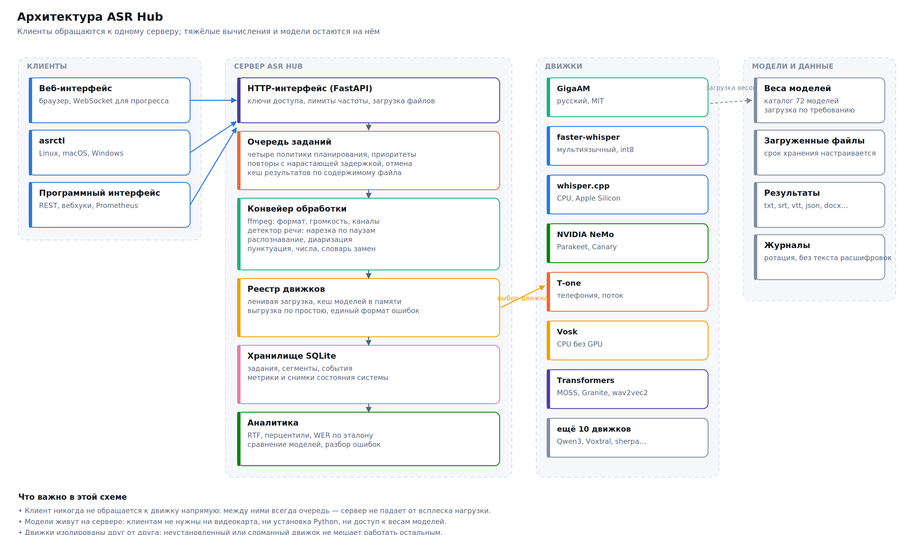

# ASR Hub — документация

Система распознавания речи для работы с удалённым сервером: 17 движков, 72 модели, веб-интерфейс, очередь, аналитика, скрипты установки для Linux, macOS и Windows.



## С чего начать

| Вы хотите | Раздел |
|---|---|
| Запустить и проверить за 10 минут | [01. Быстрый старт](01-quickstart.md) |
| Развернуть на сервере всерьёз | [02. Установка](02-installation.md) |
| Понять, какую модель выбрать | [03. Сравнение моделей](03-models.md) |
| Разобраться в конкретной настройке | [04. Справочник параметров](04-parameters.md) |
| Научиться пользоваться интерфейсом | [05. Веб-интерфейс](05-web-interface.md) |
| Обрабатывать тысячи файлов | [06. Очередь](06-queue.md) |
| Посмотреть, что происходит с системой | [07. Аналитика](07-analytics.md) |
| Встроить распознавание в свою программу | [08. Программный интерфейс](08-api.md) |
| Работать с сервером с ноутбука | [09. Клиенты и удалённая работа](09-clients.md) |
| Обслуживать систему в проде | [10. Эксплуатация](10-operations.md) |
| Починить то, что сломалось | [11. Устранение неполадок](11-troubleshooting.md) |
| Выжать качество или скорость | [12. Сценарии настройки](12-tuning.md) |
| Взять готовый набор настроек | [13. Пресеты](13-presets.md) |
| Понять, как это устроено внутри | [14. Архитектура](14-architecture.md) |
| Проверить лицензионную чистоту | [15. Лицензии](15-licenses.md) |
| Подключить систему мониторинга | [16. Мониторинг](16-monitoring.md) |
| Обратиться к мониторингу из своей программы | [17. Программный интерфейс мониторинга](17-monitoring-api.md) |
| Узнать, что ещё стоит доделать | [18. Ревизия кода](18-review.md) |
| Сравнить с проектами phone_asr | [Приложение](appendix-phone-asr.md) |

## Что это такое

ASR Hub — сервер распознавания речи, который ставится один раз на машину с видеокартой (или без неё) и дальше принимает файлы по сети: из браузера, из командной строки, из вашей программы. Он не привязан к одной модели: в каталоге собраны все свободные системы распознавания, доступные на дату сборки, — от GigaAM и Whisper до Parakeet, T-one и Vosk, — и переключение между ними сводится к выбору в списке.

Три вещи, ради которых он написан:

**Одинаковое поведение на всех моделях.** У каждого движка свой набор параметров, свои имена для одного и того же и своя манера падать. ASR Hub приводит их к общему виду: 110 параметров с русскими описаниями, единая карточка задания, единый формат ошибки с подсказкой, что делать. Смена модели не переписывает ваш код.

**Очередь, которая переживает ночь.** Задания хранятся в базе, а не в памяти процесса. Сервер можно перезапустить — незавершённые задания вернутся в очередь. Нехватка памяти на видеокарте не роняет пакет из тысячи файлов: задание повторяется с вдвое меньшим размером пакета.

**Измеримость.** Каждое задание записывает время по стадиям, RTF, уверенность модели, число слов и сегментов. По эталонному тексту считается WER и CER с разбором ошибок по типам. Выбор модели перестаёт быть вопросом веры.

## Состав поставки

```
asr-hub/
├── server/asrhub/        сервер: API, очередь, движки, конвейер обработки
│   ├── catalog/          каталог моделей, параметров и пресетов
│   ├── engines/          17 адаптеров к системам распознавания
│   ├── pipeline/         аудио, VAD, диаризация, постобработка, выгрузка, метрики
│   ├── api/              маршруты HTTP и WebSocket
│   ├── monitoring/       метрики, тревоги, пробы, отправка телеметрии
│   └── web/              веб-интерфейс (без сборки, без внешних зависимостей)
├── scripts/              *.sh для Linux и macOS, *.ps1 для Windows
│   ├── lib/              общие функции: обработка ошибок, откат, определение железа
│   └── client/           asrctl — консольный клиент для Linux, macOS, Windows
├── docker/               Dockerfile, compose, nginx
├── docs/                 эта документация, схемы и снимки экрана
└── tests/                418 тестов
```

## Требования

| | Минимум | Рекомендуется |
|---|---|---|
| Python | 3.9 | 3.11 или 3.12 |
| Память | 4 ГБ | 16 ГБ |
| Диск | 5 ГБ | 100 ГБ (полный набор моделей — свыше 60 ГБ) |
| Видеокарта | не обязательна | NVIDIA от 8 ГБ, CUDA 12.x |
| Прочее | — | ffmpeg (без него принимаются только WAV) |

Работает на Linux (x86-64, arm64), macOS (Apple Silicon и Intel), Windows 10/11. На Apple Silicon доступно ускорение MPS и Core ML, на видеокартах AMD — ROCm.

## Условные обозначения

> **Рекомендация.** Так помечены практические советы: что выбрать по умолчанию и почему.

⚠️ Так помечено то, что легко сломать или неверно понять.

`Моноширинным` набраны ключи параметров, команды и имена моделей — их можно копировать как есть.
