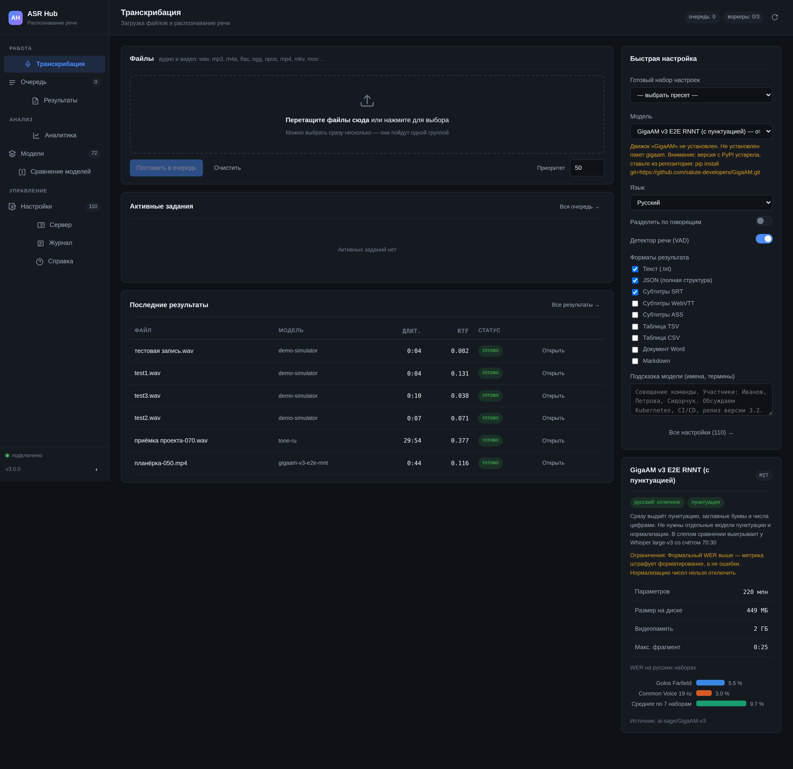

# Быстрый старт

Цель раздела — за десять минут получить работающий сервер и первую расшифровку. Подробности установки, вариантов и параметров — в следующих разделах.

## Способ 1. Проверка без моделей (2 минуты)

Самый быстрый способ убедиться, что всё собирается и запускается: встроенный симулятор `demo-simulator`. Он не загружает веса и не требует ни одной библиотеки машинного обучения — зато проходит весь путь задания целиком, включая очередь, аналитику и выгрузку.

```bash
cd asr-hub/server
python3 -m pip install fastapi uvicorn python-multipart
python3 -m asrhub --host 127.0.0.1 --port 8080
```

Откройте `http://127.0.0.1:8080`, на вкладке «Транскрибация» выберите модель `demo-simulator`, перетащите любой аудиофайл и нажмите «Отправить». Через несколько секунд задание окажется в разделе «Результаты».

Так проверяют сеть, права на каталоги и работоспособность интерфейса — до того как тратить время на загрузку многогигабайтных весов.

## Способ 2. Установка одной командой

### Linux и macOS

```bash
git clone <репозиторий> asr-hub && cd asr-hub
bash scripts/install.sh --profile standard
```

Скрипт сам определит операционную систему, архитектуру, наличие видеокарты и выберет подходящие версии PyTorch и CTranslate2. Он создаст виртуальное окружение, поставит движки, загрузит модели профиля, зарегистрирует службу автозапуска и проверит, что сервер отвечает.

Посмотреть план, ничего не меняя:

```bash
bash scripts/install.sh --profile standard --dry-run
```

### Windows

В PowerShell **от имени администратора**:

```powershell
cd asr-hub
powershell -ExecutionPolicy Bypass -File scripts\install.ps1 -Profile standard
```

### Docker

```bash
cd asr-hub/docker
docker compose --profile gpu up -d      # с видеокартой NVIDIA
docker compose --profile cpu up -d      # без видеокарты
```

## Первая расшифровка

### Через браузер

1. Откройте `http://адрес-сервера:8080`.
2. Вкладка **«Транскрибация»** → перетащите файл в область загрузки.
3. Выберите пресет **«Русский: максимальная точность»** — он подставит проверенный набор из двух десятков параметров.
4. **«Отправить в очередь»**.



Прогресс виден сразу: сервер шлёт события по WebSocket, полоса заполняется по стадиям — подготовка звука, детектор речи, распознавание, постобработка. Готовый текст открывается в «Результатах», выгрузка доступна в девяти форматах.

### Через командную строку

```bash
# один раз: запомнить адрес сервера и ключ
scripts/client/asrctl config add рабочий http://192.168.1.50:8080 ah_ваш_ключ

# отправить файл и дождаться результата
scripts/client/asrctl --profile рабочий send совещание.mp3 \
    --model gigaam-v3-e2e-rnnt --formats txt,srt --wait
```

### Через HTTP

```bash
curl -X POST http://сервер:8080/api/jobs \
  -H "X-API-Key: ah_ваш_ключ" \
  -F "file=@совещание.mp3" \
  -F 'settings={"model":"gigaam-v3-e2e-rnnt","language":"ru","diarization_enabled":true}'
```

В ответе — идентификатор задания. Готовый текст:

```bash
curl -H "X-API-Key: ah_ваш_ключ" \
  "http://сервер:8080/api/jobs/job_ab12cd34/download?fmt=srt" -o совещание.srt
```

## Что выбрать в первый раз

| Ваш случай | Модель | Пресет |
|---|---|---|
| Русская речь, нужен готовый текст с пунктуацией | `gigaam-v3-e2e-rnnt` | `ru-accuracy` |
| Русская речь, большой архив, время дорого | `gigaam-v3-ctc` | `ru-speed` |
| Совещание, несколько участников | `gigaam-v3-e2e-rnnt` + диаризация | `meeting` |
| Записи колл-центра | `tone-ru` | `callcenter` |
| Разные языки в одной записи | `parakeet-tdt-0.6b-v3` | `multilingual` |
| Сервер без видеокарты | `faster-whisper-small`, `compute_type=int8` | `cpu-only` |
| MacBook на Apple Silicon | `whispercpp-large-v3-turbo-q5_0` | `apple-silicon` |

## Если что-то не так

```bash
bash scripts/doctor.sh          # 40+ проверок: железо, драйверы, движки, сеть, права
bash scripts/doctor.sh --fix    # попытаться устранить найденное
```

Диагностика проверяет версию Python, наличие ffmpeg, драйверы видеокарты, совместимость CUDA и cuDNN с установленным CTranslate2, свободное место, занятость порта, доступность репозиториев и права на каталоги данных. Каждая непройденная проверка сопровождается конкретной командой для исправления.

Разбор частых ошибок — в разделе [11. Устранение неполадок](11-troubleshooting.md).

## Следующие шаги

- [02. Установка](02-installation.md) — профили, каталоги, служба, обновление, удаление.
- [03. Сравнение моделей](03-models.md) — что выбрать и почему, с измеренными цифрами.
- [12. Сценарии настройки](12-tuning.md) — как выжать качество или скорость под конкретную задачу.
