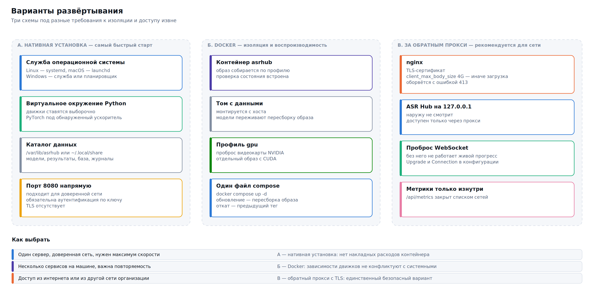

# Установка



## Выбор способа

| | Нативная установка | Docker |
|---|---|---|
| Скорость на GPU | максимальная | та же (`--gpus all`) |
| Обновление | `update.sh` со снимком и откатом | пересборка образа |
| Изоляция | виртуальное окружение Python | полная |
| Ставится за | 10–40 минут | 5 минут + сборка образа |
| Apple Silicon (MPS, Core ML) | да | **нет** — Docker на macOS не даёт доступа к Metal |
| Подходит для | выделенного сервера, рабочей станции, MacBook | кластера, CI, нескольких экземпляров |

> **Рекомендация.** На отдельной машине с видеокартой и на macOS ставьте нативно: разница в производительности на Apple Silicon разительная, а откат обновления встроен в скрипт. Docker берите там, где важна воспроизводимость или экземпляров больше одного.

## Профили установки

Профиль определяет, какие движки ставятся и какие веса загружаются сразу. Если профиль не указан, он подбирается по обнаруженному железу.

| Профиль | Что ставится | Диск | Кому |
|---|---|---|---|
| `light` | сервер + faster-whisper small | ~1 ГБ | проверка, слабая машина, контейнер в CI |
| `cpu` | faster-whisper (int8) + GigaAM ONNX | ~4 ГБ | сервер без видеокарты |
| `standard` | GigaAM v3 + faster-whisper | ~8 ГБ | **умолчание для машины с GPU** |
| `full` | все движки и основные модели | 60+ ГБ | исследование, сравнение моделей |
| `apple` | whisper.cpp с Metal и Core ML | ~3 ГБ | MacBook на Apple Silicon |
| `russian` | GigaAM v3, T-one, Vosk | ~3 ГБ | только русский язык |

Профиль не запирает вас: любую модель можно доустановить позже командой `scripts/models.sh download <модель>`.

## Linux

### Установка

```bash
git clone <репозиторий> asr-hub && cd asr-hub
sudo bash scripts/install.sh
```

Без ключей запускается **мастер**: он определяет железо и задаёт шесть вопросов, у каждого из которых уже подставлен разумный ответ. Нажимать Enter шесть раз — рабочая стратегия.

```
Установка ASR Hub
Enter принимает предложенное значение — оно подобрано по вашему железу
────────────────────────────────────────────────────────────────────
  Обнаружено: linux/x86_64, видеокарта NVIDIA, 64 ГБ памяти, 412 ГБ свободно

Что установить?
   1) Минимум — проверить, что всё работает
      ~1 ГБ. faster-whisper small. Годится, чтобы посмотреть интерфейс
   2) Сервер без видеокарты
      ~4 ГБ. int8-квантизация. Час записи обрабатывается за час-полтора
 ▸ 3) Стандартный набор
      ~8 ГБ. GigaAM v3 + faster-whisper. Лучший выбор для машины с GPU
   4) Только русский язык
   5) MacBook на Apple Silicon
   6) Всё сразу
Выбор [3]:
```

Мастер спрашивает: что установить, куда, на каком порту, кто сможет подключаться, нужен ли автозапуск, выравнивание, отправка метрик и распознавание на лету. Перед началом работы он показывает сводку и просит подтверждения — до этого момента на диске ничего не меняется.

⚠️ Ключи командной строки мастер не отменяет: `--profile`, `--host`, `--engines`, `--no-service` он подставляет в свои умолчания, а не затирает. Если вы задали `--host 127.0.0.1`, сервер не окажется выставленным в сеть после того, как вы шесть раз нажали Enter.

Он же предупреждает о том, что иначе всплыло бы на седьмом шаге: не хватает места под выбранный профиль, видеокарта не обнаружена, а профиль рассчитан на неё, порт занят. Каждое предупреждение сопровождается предложением исправить выбор.

**Без вопросов** — если установка идёт из скрипта или Ansible:

```bash
# посмотреть план, ничего не меняя — на диске не появится ни одного каталога
bash scripts/install.sh --profile standard --dry-run

# установка без единого вопроса
sudo bash scripts/install.sh --profile standard --port 8080 --yes
```

Мастер не запускается, когда задан `--yes`, `--no-interactive` или когда ввод идёт не с терминала, — поэтому существующие скрипты автоматизации продолжают работать без изменений.

Без `sudo` установка пройдёт в домашний каталог пользователя — это рабочий вариант, если сервер нужен только вам.

### Что делает скрипт

Каждый шаг с проверкой и понятным сообщением об ошибке. Число шагов зависит от состава установки — счётчик в углу показывает фактическое:

1. **Проверка окружения** — версия Python (нужна 3.9+), свободное место, свободный порт, доступность репозиториев, права на каталоги. Определяются дистрибутив, пакетный менеджер, архитектура и ускоритель.
2. **Системные зависимости** — ffmpeg, git, python3-venv, при необходимости cmake и libsndfile. Скрипт знает имена пакетов для apt, dnf, yum, pacman, zypper, apk, brew, choco и winget и предлагает поставить недостающие.
3. **Видеокарта** — карта ищется на шине PCI, и если драйвера нет, он ставится. Подробности ниже.
4. **Каталоги** — `PREFIX` для кода, `DATA_DIR` с подкаталогами `uploads`, `results`, `models`, `logs`, `tmp` и правами 0750.
5. **Копирование файлов** приложения в `PREFIX`.
6. **Виртуальное окружение и пакеты** — PyTorch ставится с индекса, соответствующего найденному ускорителю (CUDA 12.4/12.1, ROCm, CPU), CTranslate2 закрепляется на версии, совместимой с найденной cuDNN.
7. **Конфигурация** — генерируется `config.yaml` с комментарием к каждому параметру (около 1700 строк) и значениями, подобранными под ваше железо.
8. **Загрузка моделей** профиля и всего, что перечислено в `--models`.
9. **Служба автозапуска** — systemd (системная или пользовательская).
10. **Проверка** — сервер поднимается, опрашивается `/api/health`, выводится итог.

⚠️ Каждый шаг регистрирует действие отмены. Если что-то падает на восьмом шаге, предыдущие откатываются: созданные каталоги удаляются, старая конфигурация возвращается. Обработчик `ERR` печатает команду, код возврата, номер строки и расшифровку кода (127 — команда не найдена, 137 — процесс убит по нехватке памяти, и так далее).

### Каталоги по умолчанию

| | От root | От пользователя |
|---|---|---|
| Код | `/opt/asrhub` | `~/.local/share/asrhub-app` |
| Данные | `/var/lib/asrhub` | `~/.local/share/asrhub` |
| Конфигурация | `/etc/asrhub/config.yaml` | `~/.config/asrhub/config.yaml` |
| Журналы | `<данные>/logs/` | то же |

### Видеокарта: обнаружение и драйвер

Установщик не спрашивает `nvidia-smi`, есть ли видеокарта. Этот вопрос бесполезен ровно там, где он важнее всего: на свежей системе драйвера ещё нет, `nvidia-smi` не существует, и ответ «видеокарты нет» получала машина с картой внутри. Дальше всё собиралось под процессор — и потом выяснялось на первой же часовой записи.

Поэтому карта ищется на шине PCI, в `/sys/bus/pci/devices`: там она видна всегда, независимо от драйверов. Читаются класс устройства (`0x0300xx` — видеоадаптер, `0x0302xx` — 3D-контроллер без видеовыхода, как у Tesla), идентификатор производителя и размер окна памяти.

**Дискретная или встроенная.** Различать обязательно: встроенная графика для расчётов не годится, а набор драйверов для неё занял бы несколько гигабайт впустую. Признак — окно памяти: у дискретной карты оно от гигабайта, у встроенной 256 МБ и меньше. Дополнительно учитывается положение на шине.

**Что ставится.**

| Найдено | Что делает установщик |
|---|---|
| NVIDIA, дискретная | Драйвер: `ubuntu-drivers install`, а где его нет — репозиторий NVIDIA и `nvidia-open` (открытые модули ядра). На Fedora — RPM Fusion и `akmod-nvidia`, на RHEL — `nvidia-driver:latest-dkms`, на Arch — `nvidia-dkms`, на openSUSE — `nvidia-video-G06` |
| AMD, дискретная | `amdgpu-install` с repo.radeon.com, затем `amdgpu-dkms` и `rocm`. Пользователь службы добавляется в группы `render` и `video` — без них процесс получит отказ на `/dev/kfd` и молча уедет на процессор |
| Intel Arc | **Ничего**, если не задан `--gpu-driver intel`. Карта хорошая, но ни один движок ASR Hub пока не считает на XPU: сервер знает устройства `cuda`, `rocm`, `mps` и `cpu`. Ставить набор Intel ради неиспользуемой возможности незачем |
| Только встроенная | Ничего. Драйвер для неё уже в ядре |
| Драйвер уже работает | Ничего не ставит, только настраивает |

**Настройка после установки.** Включается постоянный режим видеокарты (`nvidia-smi -pm 1`) — без него драйвер выгружается между заданиями, и первое распознавание после паузы теряет секунды на инициализацию. В `config.yaml` записываются `device` и `compute_type` под объём памяти карты: `float16` при 8 ГБ и больше, `int8_float16` при меньшем. Для потребительских Radeon, которые ROCm считает неподдерживаемыми, в `env.sh` добавляется `HSA_OVERRIDE_GFX_VERSION` — стандартный способ заставить их работать.

**Перезагрузка.** Модуль ядра собирается под текущее ядро и загружается только после перезагрузки. Установщик доводит установку до конца — сервер работает и на процессоре — и говорит об этом последней строкой, чтобы это не потерялось в выводе.

**Secure Boot.** Собранный на месте модуль не подписан и после перезагрузки не загрузится, а узнали бы вы об этом по неработающей карте. Поэтому при включённом Secure Boot установщик драйвер не ставит, а показывает, что сделать: отключить Secure Boot либо зарегистрировать ключ MOK. Ключ `--force-gpu-driver` снимает эту защиту, если вы знаете, что делаете.

**Ключи.**

```bash
bash scripts/install.sh                          # найти и поставить (по умолчанию)
bash scripts/install.sh --no-gpu-driver          # не трогать драйвер
bash scripts/install.sh --gpu-driver intel       # поставить набор Intel
bash scripts/install.sh --dry-run                # показать, что было бы сделано
```

Посмотреть, что видит установщик, не запуская его:

```bash
bash scripts/doctor.sh --only hardware
```

Он различает три разных случая, которые раньше сливались в одно «видеокарта не обнаружена»: карты нет вовсе; карта есть, но драйвера нет; драйвер есть, но модуль не загружен.

### Видеокарта NVIDIA: тонкости

```bash
nvidia-smi                       # драйвер и версия CUDA
bash scripts/doctor.sh --only hardware
```

Для CUDA 12.x подходящие версии подбираются автоматически. Самая частая проблема — несовместимость cuDNN с CTranslate2; таблица соответствий встроена в подсказку к ошибке и в раздел [11. Устранение неполадок](11-troubleshooting.md).

Отдельный случай — установка драйвера в том же запуске, что и всего остального. Колёса PyTorch выбираются под найденную на шине карту, а не под ту, что отвечает прямо сейчас: иначе до перезагрузки поставился бы процессорный `torch`, и после перезагрузки сервер всё равно считал бы процессором.

### Видеокарта AMD (ROCm)

```bash
rocm-smi
bash scripts/install.sh --profile standard
```

PyTorch ставится с индекса ROCm. GigaAM и faster-whisper работают; NeMo на ROCm официально не поддерживается.

Версия ROCm задана переменными `ASRHUB_ROCM_VERSION` и `ASRHUB_ROCM_PKG` в `scripts/lib/gpu.sh` — при выходе новой правятся эти две строки:

```bash
ASRHUB_ROCM_VERSION=7.3.0 ASRHUB_ROCM_PKG=7.3.0.70300-1 bash scripts/install.sh
```

## macOS

```bash
# Homebrew, если его ещё нет
/bin/bash -c "$(curl -fsSL https://raw.githubusercontent.com/Homebrew/install/HEAD/install.sh)"
brew install ffmpeg python@3.12

cd asr-hub
bash scripts/install.sh --profile apple
```

На Apple Silicon доступны два ускорителя:

- **MPS** — Metal Performance Shaders для PyTorch. Работает с GigaAM и faster-whisper. Включается автоматически при `device: auto`.
- **Core ML** — через whisper.cpp, задействует Neural Engine. Даёт лучшее соотношение скорости и энергопотребления, особенно на ноутбуке от батареи.

Служба регистрируется в launchd как пользовательский агент:

```bash
bash scripts/service.sh install
bash scripts/service.sh status
launchctl list | grep asrhub
```

⚠️ На macOS файлы, загруженные из интернета, помечаются карантином Gatekeeper. Если бинарник whisper.cpp не запускается — снимите метку: `xattr -d com.apple.quarantine <путь>`.

## Windows

PowerShell **от имени администратора**:

```powershell
cd asr-hub
powershell -ExecutionPolicy Bypass -File scripts\install.ps1
```

Как и на Linux, без ключей запускается мастер с теми же вопросами. Без вопросов:

```powershell
powershell -ExecutionPolicy Bypass -File scripts\install.ps1 -Profile standard -Port 8080 -Yes
```

Скрипты рассчитаны на Windows PowerShell 5.1 — тот, что идёт в комплекте с Windows 10 и 11. Ставить PowerShell 7 не нужно.

Служба регистрируется через NSSM, если он найден, иначе создаётся задача планировщика с запуском при входе в систему:

```powershell
.\scripts\service.ps1 install
.\scripts\service.ps1 status
.\scripts\service.ps1 logs -Follow
```

Что стоит знать:

- **Видеокарта.** Установщик находит её через саму Windows (`Win32_VideoController`) — этот источник отвечает и тогда, когда драйвера производителя нет и система показывает стандартный видеоадаптер Microsoft. Именно этот случай и означает «драйвера нет»; тогда драйвер ставится через `winget`. Кандидатов на пакет несколько, и перед установкой каждый проверяется в каталоге: пакеты winget переименовываются и исчезают, а у AMD собственного пакета с драйвером может не быть вовсе. Если не нашёлся ни один, скрипт даёт прямую ссылку на сайт производителя и напоминает, что драйверы видеокарт приходят и через Windows Update. Отключается ключом `-NoGpuDriver`.
- **ffmpeg** ставится через `winget install Gyan.FFmpeg` или `choco install ffmpeg`. Без него принимаются только файлы WAV.
- **Длинные пути.** Кеш моделей Hugging Face легко переваливает за 260 символов. Включите поддержку длинных путей: `New-ItemProperty -Path 'HKLM:\SYSTEM\CurrentControlSet\Control\FileSystem' -Name LongPathsEnabled -Value 1 -PropertyType DWORD -Force`.
- **Антивирус.** Проверка каждого файла в каталоге моделей заметно замедляет загрузку — добавьте каталог данных в исключения.
- **WSL2** — рабочая альтернатива: внутри работает установка для Linux, видеокарта NVIDIA пробрасывается.

## Docker

### Быстрый запуск

```bash
cd asr-hub/docker
docker compose --profile gpu up -d      # NVIDIA
docker compose --profile cpu up -d      # без видеокарты
docker compose --profile proxy up -d    # плюс nginx перед сервером
```

### Сборка образа

```bash
docker build -t asrhub:cuda \
  --build-arg PROFILE=standard \
  --build-arg ACCEL=cuda \
  -f docker/Dockerfile .
```

Аргументы сборки: `PROFILE` (тот же набор, что у нативной установки), `ACCEL` (`cuda`, `rocm`, `cpu`). Образ многослойный: тяжёлые зависимости ставятся в отдельном слое, поэтому пересборка после правки кода занимает секунды.

### Тома и переменные

```yaml
volumes:
  - ./data/models:/data/models     # веса — самый ценный том, переживает пересборку
  - ./data/uploads:/data/uploads
  - ./data/results:/data/results
  - ./data/db:/data/db
environment:
  ASRHUB_PORT: 8080
  ASRHUB_MAX_CONCURRENT_JOBS: 2
  ASRHUB_DEVICE: cuda
  ASRHUB_AUTH_ENABLED: "true"
```

Точка входа проверяет перед стартом: смонтированы ли тома и доступны ли они на запись, виден ли заявленный ускоритель, свободен ли порт. Если видеокарта заявлена, но не видна, контейнер сообщает об этом внятно, а не падает через десять минут внутри PyTorch.

⚠️ Загрузка образа **не проверена сборкой** в среде, где готовилась эта документация: демон Docker там недоступен. Конфигурация написана и вычитана, но первый запуск у вас может потребовать правок — начните с `docker compose --profile cpu up` без `-d`, чтобы видеть вывод.

## Управление службой

```bash
bash scripts/service.sh install     # зарегистрировать
bash scripts/service.sh start
bash scripts/service.sh stop
bash scripts/service.sh restart
bash scripts/service.sh status
bash scripts/service.sh logs -n 200 -f
bash scripts/service.sh uninstall
```

Одинаковые команды на всех системах: под ними systemd на Linux, launchd на macOS, NSSM или планировщик задач на Windows.

## Обновление

```bash
bash scripts/update.sh --check          # что изменится
bash scripts/update.sh                  # обновить
bash scripts/update.sh --engines-only   # только пакеты движков
bash scripts/update.sh --rollback       # вернуть предыдущую версию
```

Перед обновлением делается снимок: код, конфигурация и база заданий. Схема базы мигрирует по версиям — переход с версии 1 на 3 добавит недостающие таблицы и колонки, не потеряв заданий. Если после обновления сервер не отвечает, `--rollback` возвращает предыдущее состояние целиком.

Веса моделей при обновлении не трогаются.

## Удаление

```bash
bash scripts/uninstall.sh                      # код и служба, данные остаются
bash scripts/uninstall.sh --purge              # всё, включая модели и базу
bash scripts/uninstall.sh --purge --keep-models  # всё, кроме весов
bash scripts/uninstall.sh --dry-run            # что именно будет удалено
```

Перед удалением конфигурация и база заданий копируются в резервную копию, путь к которой печатается в конце. Каталог моделей по умолчанию сохраняется: скачивать десятки гигабайт заново из-за случайного `--purge` не придётся.

## Распознавание на лету

Мастер предлагает включить его последним пунктом, а без вопросов оно включено по умолчанию (выключить — `--no-stream`). В `config.yaml` это два параметра в разделе `server`:

```yaml
server:
  stream_enabled: true     # раздел «Диктовка» и WebSocket /api/stream
  stream_window_s: 4       # шаг гипотез для движков без потока
```

**Нужен ffmpeg.** Браузер записывает WebM/Opus, и разбирать его больше нечем. Без ffmpeg «Диктовка» отвечает отказом, а из своей программы поток работает только сырым PCM (моно, 16 кГц, 16 бит). `doctor.sh` говорит об этом прямо, а не просто «ffmpeg не найден».

**Микрофон требует https или localhost.** Это ограничение браузера, а не сервера: по обычному http с другой машины микрофон не отдаётся, и раздел «Диктовка» показывает неактивную кнопку с объяснением. Установщик предупреждает об этом сразу, если сервер слушает `0.0.0.0`.

Рабочие варианты:

| Что нужно | Как |
|---|---|
| Диктовать на самом сервере | Открыть `http://localhost:8080` — этого достаточно |
| Диктовать с других машин | Поставить впереди обратный прокси с сертификатом. Готовая конфигурация — `docker/nginx.conf` |
| Поток из своей программы | Работает и по http: заголовки задаёт клиент, ограничение браузера его не касается. Пример — `examples/stream_microphone.py` |

## Несколько серверов над одной базой

Сервер умеет работать в нескольких экземплярах над общим каталогом данных: задание захватывается неделимо, поэтому одно и то же не считается дважды. Устройство и требования разобраны в главе [10. Эксплуатация](10-operations.md); здесь — то, что касается установки.

```bash
# на каждой машине, с общим каталогом данных на сетевом хранилище
sudo bash scripts/install.sh --profile standard --yes \
     --data /mnt/общие/asrhub --name asrhub-2
```

- `--name` задаёт имя службы. Без него вторая установка на той же машине перезаписала бы юнит первой.
- Установщик не отбирает общий каталог: если он принадлежит другому пользователю, вы получите вопрос, а не молчаливый `chown -R`, после которого соседи теряют доступ к собственной базе. Для общего каталога проще завести одну группу: `chgrp -R asrhub /mnt/общие/asrhub && chmod -R g+rwX /mnt/общие/asrhub`.
- `uninstall.sh` останавливает процессы только своей установки — по каталогу программы, а не по слову «asrhub» в командной строке.
- `uninstall.sh --purge` и `update.sh` сначала спрашивают базу, работает ли над ней кто-то ещё, и предупреждают до того, как что-то сделать.

## Проверка после установки

```bash
bash scripts/doctor.sh
curl http://127.0.0.1:8080/api/health
bash scripts/models.sh engines     # какие движки доступны и почему нет остальных
bash scripts/models.sh disk        # сколько занято весами
```

Раздел «Возможности» в выводе `doctor.sh` отвечает на вопросы, которые иначе выясняются опытным путём: включён ли поток и есть ли для него ffmpeg, отдаст ли браузер микрофон по текущему адресу, сколько заведено ключей и какие у них подразделения и квоты, сколько экземпляров сервера работает над базой и все ли они отвечают.

```
Возможности
───────────
  ✓ Распознавание на лету                  включено, ffmpeg на месте
  ! Микрофон в браузере                    нужен https или localhost
      По http с другой машины браузер микрофон не отдаст. Поставьте перед
      сервером обратный прокси с сертификатом — пример есть в docker/nginx.conf.
  ✓ Ключи доступа                          4 шт., подразделения: бухгалтерия,продажи, квот задано: 3
  ✓ Экземпляры сервера                     2 над общей базой, все отвечают
```

Дальше — [05. Веб-интерфейс](05-web-interface.md) или сразу [12. Сценарии настройки](12-tuning.md).
