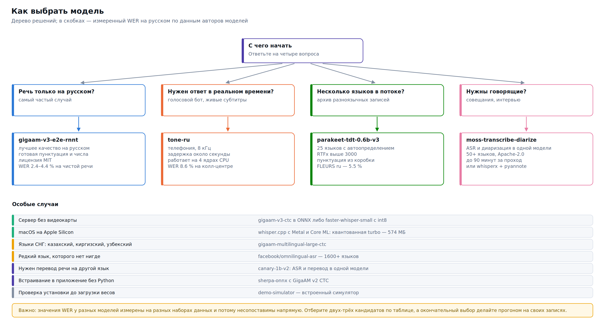

# Сравнение моделей распознавания речи

В каталоге **72 моделей** из 19 семейств; 50 поддерживают русский язык, 11 работают в потоковом режиме, 3 умеют разделять говорящих. Данные собраны по первоисточникам на 2026-08-31.

> **Как читать цифры.** Значения WER взяты из карточек моделей, статей авторов и независимых бенчмарков — они измерены на **разных наборах данных**. GigaAM измеряли на Golos, Common Voice и внутренних наборах Сбера; Parakeet — на FLEURS и CoVoST2; Whisper — на Common Voice и Open ASR Leaderboard. Один и тот же набор даёт разброс в 2–3 раза между доменами (студийная запись против телефонии). Поэтому таблицы ниже годятся, чтобы **отобрать двух-трёх кандидатов**, но не для того, чтобы объявить победителя. Окончательный выбор делайте прогоном на своих записях — в разделе «Аналитика» для этого есть расчёт фактического WER по эталонному тексту.

## Краткий ответ

| Задача | Модель | Почему |
|---|---|---|
| Русский, максимум точности | `gigaam-v3-rnnt` | Лучший WER на русском среди свободных моделей, лицензия MIT |
| Русский, сразу готовый текст | `gigaam-v3-e2e-rnnt` | Пунктуация, заглавные буквы и числа цифрами из коробки |
| Русский, большой архив | `gigaam-v3-ctc` | В 1.5–2 раза быстрее RNNT при потере менее 1 п.п. |
| Телефония, реальное время | `tone-ru` | Лучшее качество на колл-центре, задержка около секунды, 71.6 млн параметров |
| Мультиязычный поток | `parakeet-tdt-0.6b-v3` | 25 языков с автоопределением, RTFx выше 3000 |
| Совещания с говорящими | `moss-transcribe-diarize` | ASR и диаризация в одной модели, 50+ языков |
| Перевод речи | `canary-1b-v2` | ASR и перевод между английским и 24 языками |
| Сервер без видеокарты | `faster-whisper-small` + int8 | Единственный практичный режим на процессоре |
| macOS на Apple Silicon | `whispercpp-large-v3-turbo-q5_0` | Metal и Core ML, 574 МБ на диске |
| Редкие языки | `omnilingual-ctc-1b` | 1600+ языков, Apache-2.0 на код и веса |
| Проверка установки | `demo-simulator` | Встроенный симулятор без загрузки весов |

## Русский язык: измеренное качество

Отсортировано по среднему WER на русских наборах. Прочерк означает, что публичных измерений на русском нет — это не то же самое, что плохое качество.

| Модель | Средний WER | Лучший WER | Лицензия | Парам., млн | Диск, МБ | Поток | Пунктуация |
|---|---|---|---|---|---|---|---|
| `parakeet-tdt-0.6b-v3` | 4.25 % | 3 % | CC-BY-4.0 | 600 | 2400 | — | да |
| `gigaam-multilingual-large-ctc` | 5.1 % | 5.1 % | MIT | 600 | 1200 | — | — |
| `gigaam-v3-rnnt` | 6.7 % | 0.9 % | MIT | 220 | 446 | — | — |
| `tone-ru` | 6.78 % | 5.32 % | Apache-2.0 | 71.6 | 290 | да | — |
| `gigaam-multilingual-ctc` | 7.1 % | 7.1 % | MIT | 220 | 445 | — | — |
| `gigaam-v3-ctc` | 7.4 % | 1.3 % | MIT | 220 | 442 | — | — |
| `gigaam-v2-ctc` | 8.42 % | 8.42 % | MIT | 240 | 476 | — | — |
| `w2v2-xlsr1b-ru` | 8.45 % | 7.08 % | Apache-2.0 | 1000 | 3900 | — | — |
| `gigaam-v2-rnnt` | 8.64 % | 1.9 % | MIT | 240 | 480 | — | — |
| `nemotron-asr-streaming-0.6b` | 9.17 % | 9.17 % | OpenMDW-1.1 | 600 | 2400 | да | да |
| `gigaam-v3-e2e-rnnt` | 9.7 % | 3 % | MIT | 220 | 449 | — | да |
| `faster-whisper-large-v3` | 9.84 % | 9.84 % | MIT | 1550 | 3100 | — | — |
| `whisperx-large-v3` | 9.84 % | 9.84 % | BSD-2-Clause | 1550 | 3100 | — | — |
| `gigaam-v3-e2e-ctc` | 10.2 % | 10.2 % | MIT | 220 | 445 | — | да |
| `vosk-ru-0.54` | 11.02 % | 1.2 % | Apache-2.0 | — | 1010 | да | — |
| `borealis-ru` | 11.16 % | 6.33 % | Apache-2.0 | 5000 | — | — | да |
| `w2v2-xlsr53-ru` | 11.44 % | 9.57 % | Apache-2.0 | 317 | 1260 | — | — |
| `vosk-ru-0.42` | 15.1 % | 4.4 % | Apache-2.0 | — | 1800 | да | — |
| `whisper-large-v3` | 16.21 % | 9.84 % | MIT | 1550 | 2900 | — | — |
| `w2v2-golos-ru` | 16.35 % | 10.14 % | Apache-2.0 | 317 | 1260 | — | — |
| `whisper-large-v3-turbo` | 16.84 % | 16.84 % | MIT | 809 | 1620 | — | — |
| `vosk-small-ru-0.22` | 22.16 % | 11.79 % | Apache-2.0 | — | 45 | да | — |
| `whisper-tiny` | — | — | MIT | 39 | 75 | — | — |
| `whisper-base` | — | — | MIT | 74 | 142 | — | — |
| `whisper-small` | — | — | MIT | 244 | 466 | — | — |
| `whisper-medium` | — | — | MIT | 769 | 1500 | — | — |
| `whisper-large-v1` | — | — | MIT | 1550 | 2900 | — | — |
| `whisper-large-v2` | — | — | MIT | 1550 | 2900 | — | — |
| `faster-whisper-tiny` | — | — | MIT | 39 | 75 | — | — |
| `faster-whisper-base` | — | — | MIT | 74 | 142 | — | — |
| `faster-whisper-small` | — | — | MIT | 244 | 466 | — | — |
| `faster-whisper-medium` | — | — | MIT | 769 | 1500 | — | — |
| `faster-whisper-large-v2` | — | — | MIT | 1550 | 3100 | — | — |
| `faster-whisper-large-v3-turbo` | — | — | MIT | 809 | 1620 | — | — |
| `whispercpp-tiny` | — | — | MIT | — | 75 | — | — |
| `whispercpp-base` | — | — | MIT | — | 142 | — | — |
| `whispercpp-small` | — | — | MIT | — | 466 | — | — |
| `whispercpp-medium` | — | — | MIT | — | 1500 | — | — |
| `whispercpp-large-v3` | — | — | MIT | — | 2900 | — | — |
| `whispercpp-large-v3-q5_0` | — | — | MIT | — | 1080 | — | — |
| `whispercpp-large-v3-turbo` | — | — | MIT | — | 1620 | — | — |
| `whispercpp-large-v3-turbo-q5_0` | — | — | MIT | — | 574 | — | — |
| `whispercpp-large-v3-turbo-q8_0` | — | — | MIT | — | 874 | — | — |
| `canary-1b-v2` | — | — | CC-BY-4.0 | 978 | 3900 | — | да |
| `qwen3-asr-1.7b` | — | — | Apache-2.0 | 2000 | 4000 | да | да |
| `qwen3-asr-0.6b` | — | — | Apache-2.0 | 900 | 1800 | да | да |
| `moss-transcribe-diarize` | — | — | Apache-2.0 | 900 | 3600 | — | да |
| `voxtral-mini-4b-realtime` | — | — | Apache-2.0 | 4000 | 8000 | да | да |
| `omnilingual-ctc-1b` | — | — | Apache-2.0 | 1000 | 4000 | — | — |
| `owsm-ctc-v4-1b` | — | — | CC-BY-4.0 | 1010 | 4000 | — | — |

## Полный каталог

| Модель | Семейство | Движок | Русский | Языки | Лицензия | Коммерч. | Парам., млн | Диск, МБ | VRAM, ГБ | RTFx | Поток | Пункт. | Диар. | Перевод | Таймкоды |
|---|---|---|---|---|---|---|---|---|---|---|---|---|---|---|---|
| `cohere-transcribe-2026-03` | Cohere | `transformers` | нет русского | en, fr, de (+11) | Apache-2.0 | да | 2000 | 8000 | 8 | 524.88 | — | да | — | — | нет |
| `demo-simulator` | Demo | `demo` | нет русского | ru, en | MIT | да | 0 | 0 | 0 | — | — | да | — | — | пословные |
| `owsm-ctc-v4-1b` | ESPnet | `transformers` | среднее | multi-150 | CC-BY-4.0 | да | 1010 | 4000 | 4 | 453.97 | — | — | — | — | по сегментам |
| `sensevoice-small` | FunASR | `funasr` | нет русского | zh, yue, en (+2) | Alibaba model-license | да | — | 250 | — | — | — | да | — | — | по сегментам |
| `gigaam-emo` | GigaAM | `gigaam` | нет русского | ru | MIT | да | 240 | 480 | 2 | — | — | — | — | — | нет |
| `gigaam-multilingual-ctc` | GigaAM | `gigaam` | хорошее | ru, kk, ky (+2) | MIT | да | 220 | 445 | 2 | — | — | — | — | — | пословные |
| `gigaam-multilingual-large-ctc` | GigaAM | `gigaam` | хорошее | ru, kk, ky (+2) | MIT | да | 600 | 1200 | 4 | — | — | — | — | — | пословные |
| `gigaam-v2-ctc` | GigaAM | `gigaam` | отличное | ru | MIT | да | 240 | 476 | 2 | — | — | — | — | — | пословные |
| `gigaam-v2-rnnt` | GigaAM | `gigaam` | отличное | ru | MIT | да | 240 | 480 | 2 | — | — | — | — | — | пословные |
| `gigaam-v3-ctc` | GigaAM | `gigaam` | отличное | ru | MIT | да | 220 | 442 | 2 | — | — | — | — | — | пословные |
| `gigaam-v3-e2e-ctc` | GigaAM | `gigaam` | отличное | ru | MIT | да | 220 | 445 | 2 | — | — | да | — | — | пословные |
| `gigaam-v3-e2e-rnnt` | GigaAM | `gigaam` | отличное | ru | MIT | да | 220 | 449 | 2 | — | — | да | — | — | пословные |
| `gigaam-v3-rnnt` | GigaAM | `gigaam` | отличное | ru | MIT | да | 220 | 446 | 2 | — | — | — | — | — | пословные |
| `granite-speech-4.1-2b` | Granite | `transformers` | нет русского | en, fr, de (+3) | Apache-2.0 | да | 2000 | 8000 | 8 | 231.29 | — | да | — | да | по сегментам |
| `kyutai-stt-1b-en-fr` | Kyutai | `kyutai` | нет русского | en, fr | CC-BY-4.0 | да | 1000 | 4000 | 4 | — | да | — | — | — | по сегментам |
| `moss-transcribe-diarize` | MOSS | `transformers` | хорошее | multi-50, ru, en (+1) | Apache-2.0 | да | 900 | 3600 | 8 | 294.02 | — | да | да | — | по сегментам |
| `moonshine-base` | Moonshine | `moonshine` | нет русского | en | MIT | да | 61 | 240 | — | — | — | — | — | — | по сегментам |
| `moonshine-tiny` | Moonshine | `moonshine` | нет русского | en | MIT | да | 27 | 110 | — | — | — | — | — | — | по сегментам |
| `canary-180m-flash` | NeMo | `nemo` | нет русского | en, de, fr (+1) | CC-BY-4.0 | да | 182 | 730 | 1.5 | 1233 | — | да | — | да | пословные |
| `canary-1b-flash` | NeMo | `nemo` | нет русского | en, de, fr (+1) | CC-BY-4.0 | да | 883 | 3500 | 5 | 1045.75 | — | да | — | да | пословные |
| `canary-1b-v2` | NeMo | `nemo` | хорошее | bg, hr, cs (+22) | CC-BY-4.0 | да | 978 | 3900 | 6 | 749 | — | да | — | да | пословные |
| `canary-qwen-2.5b` | NeMo | `nemo` | нет русского | en | CC-BY-4.0 | да | 2500 | 10000 | 12 | 418 | — | да | — | — | по сегментам |
| `nemotron-asr-streaming-0.6b` | NeMo | `nemo` | хорошее | en, es, fr (+25) | OpenMDW-1.1 | да | 600 | 2400 | 3 | — | да | да | — | — | пословные |
| `parakeet-tdt-0.6b-v2` | NeMo | `nemo` | нет русского | en | CC-BY-4.0 | да | 600 | 2400 | 2 | 3386.02 | — | да | — | — | пословные |
| `parakeet-tdt-0.6b-v3` | NeMo | `nemo` | хорошее | bg, hr, cs (+22) | CC-BY-4.0 | да | 600 | 2400 | 2 | 3332.74 | — | да | — | — | пословные |
| `sortformer-diar-4spk-v2` | NeMo | `nemo` | нет русского | en | CC-BY-4.0 | да | 117 | 470 | 2 | — | да | — | да | — | по сегментам |
| `omnilingual-ctc-1b` | Omnilingual | `omnilingual` | среднее | multi-1600, ru | Apache-2.0 | да | 1000 | 4000 | 4 | — | — | — | — | — | по сегментам |
| `phi4-multimodal` | Phi | `transformers` | нет русского | en, zh, de (+5) | MIT | да | 5600 | 11000 | 16 | — | — | да | — | — | нет |
| `qwen3-asr-0.6b` | Qwen | `qwen3_asr` | хорошее | zh, en, ru (+9) | Apache-2.0 | да | 900 | 1800 | 4 | — | да | да | — | — | по сегментам |
| `qwen3-asr-1.7b` | Qwen | `qwen3_asr` | хорошее | zh, en, yue (+27) | Apache-2.0 | да | 2000 | 4000 | 8 | 148 | да | да | — | — | по сегментам |
| `tone-ru` | T-one | `tone` | хорошее | ru | Apache-2.0 | да | 71.6 | 290 | 1 | — | да | — | — | — | по сегментам |
| `borealis-ru` | Vikhr | `transformers` | среднее | ru | Apache-2.0 | да | 5000 | — | 12 | — | — | да | — | — | нет |
| `vosk-en-us-0.22` | Vosk | `vosk` | нет русского | en | Apache-2.0 | да | — | 1800 | — | — | да | — | — | — | пословные |
| `vosk-ru-0.42` | Vosk | `vosk` | среднее | ru | Apache-2.0 | да | — | 1800 | — | — | да | — | — | — | пословные |
| `vosk-ru-0.54` | Vosk | `vosk` | хорошее | ru | Apache-2.0 | да | — | 1010 | — | — | да | — | — | — | пословные |
| `vosk-small-ru-0.22` | Vosk | `vosk` | слабое | ru | Apache-2.0 | да | — | 45 | — | — | да | — | — | — | пословные |
| `voxtral-mini-3b` | Voxtral | `voxtral` | нет русского | en, es, fr (+5) | Apache-2.0 | да | 3000 | 9500 | 9.5 | — | — | да | — | — | по сегментам |
| `voxtral-mini-4b-realtime` | Voxtral | `voxtral` | среднее | ar, de, en (+10) | Apache-2.0 | да | 4000 | 8000 | 16 | 93.32 | да | да | — | — | по сегментам |
| `distil-large-v3.5` | Whisper | `faster_whisper` | нет русского | en | MIT | да | 756 | 1510 | 3 | — | — | — | — | — | пословные |
| `faster-whisper-base` | Whisper | `faster_whisper` | слабое | multi-99 | MIT | да | 74 | 142 | 1 | — | — | — | — | да | пословные |
| `faster-whisper-distil-large-v3` | Whisper | `faster_whisper` | нет русского | en | MIT | да | 756 | 1510 | 3 | — | — | — | — | — | пословные |
| `faster-whisper-large-v2` | Whisper | `faster_whisper` | слабое | multi-99 | MIT | да | 1550 | 3100 | 5 | — | — | — | — | да | пословные |
| `faster-whisper-large-v3` | Whisper | `faster_whisper` | среднее | multi-99 | MIT | да | 1550 | 3100 | 5 | — | — | — | — | да | пословные |
| `faster-whisper-large-v3-turbo` | Whisper | `faster_whisper` | среднее | multi-99 | MIT | да | 809 | 1620 | 3.5 | — | — | — | — | да | пословные |
| `faster-whisper-medium` | Whisper | `faster_whisper` | слабое | multi-99 | MIT | да | 769 | 1500 | 3 | — | — | — | — | да | пословные |
| `faster-whisper-small` | Whisper | `faster_whisper` | слабое | multi-99 | MIT | да | 244 | 466 | 1.5 | — | — | — | — | да | пословные |
| `faster-whisper-tiny` | Whisper | `faster_whisper` | слабое | multi-99 | MIT | да | 39 | 75 | 1 | — | — | — | — | да | пословные |
| `whisper-base` | Whisper | `whisper` | слабое | multi-99 | MIT | да | 74 | 142 | 1 | — | — | — | — | да | пословные |
| `whisper-base.en` | Whisper | `whisper` | нет русского | en | MIT | да | 74 | 142 | 1 | — | — | — | — | — | пословные |
| `whisper-large-v1` | Whisper | `whisper` | слабое | multi-99 | MIT | да | 1550 | 2900 | 10 | — | — | — | — | да | пословные |
| `whisper-large-v2` | Whisper | `whisper` | слабое | multi-99 | MIT | да | 1550 | 2900 | 10 | — | — | — | — | да | пословные |
| `whisper-large-v3` | Whisper | `whisper` | среднее | multi-99 | MIT | да | 1550 | 2900 | 10 | — | — | — | — | да | пословные |
| `whisper-large-v3-turbo` | Whisper | `whisper` | среднее | multi-99 | MIT | да | 809 | 1620 | 6 | — | — | — | — | — | пословные |
| `whisper-medium` | Whisper | `whisper` | слабое | multi-99 | MIT | да | 769 | 1500 | 5 | — | — | — | — | да | пословные |
| `whisper-medium.en` | Whisper | `whisper` | нет русского | en | MIT | да | 769 | 1500 | 5 | — | — | — | — | — | пословные |
| `whisper-small` | Whisper | `whisper` | слабое | multi-99 | MIT | да | 244 | 466 | 2 | — | — | — | — | да | пословные |
| `whisper-small.en` | Whisper | `whisper` | нет русского | en | MIT | да | 244 | 466 | 2 | — | — | — | — | — | пословные |
| `whisper-tiny` | Whisper | `whisper` | слабое | multi-99 | MIT | да | 39 | 75 | 1 | — | — | — | — | да | пословные |
| `whisper-tiny.en` | Whisper | `whisper` | нет русского | en | MIT | да | 39 | 75 | 1 | — | — | — | — | — | пословные |
| `whispercpp-base` | Whisper | `whisper_cpp` | слабое | multi-99 | MIT | да | — | 142 | — | — | — | — | — | да | пословные |
| `whispercpp-large-v3` | Whisper | `whisper_cpp` | среднее | multi-99 | MIT | да | — | 2900 | — | — | — | — | — | да | пословные |
| `whispercpp-large-v3-q5_0` | Whisper | `whisper_cpp` | среднее | multi-99 | MIT | да | — | 1080 | — | — | — | — | — | да | пословные |
| `whispercpp-large-v3-turbo` | Whisper | `whisper_cpp` | среднее | multi-99 | MIT | да | — | 1620 | — | — | — | — | — | да | пословные |
| `whispercpp-large-v3-turbo-q5_0` | Whisper | `whisper_cpp` | среднее | multi-99 | MIT | да | — | 574 | — | — | — | — | — | да | пословные |
| `whispercpp-large-v3-turbo-q8_0` | Whisper | `whisper_cpp` | среднее | multi-99 | MIT | да | — | 874 | — | — | — | — | — | да | пословные |
| `whispercpp-medium` | Whisper | `whisper_cpp` | слабое | multi-99 | MIT | да | — | 1500 | — | — | — | — | — | да | пословные |
| `whispercpp-small` | Whisper | `whisper_cpp` | слабое | multi-99 | MIT | да | — | 466 | — | — | — | — | — | да | пословные |
| `whispercpp-tiny` | Whisper | `whisper_cpp` | слабое | multi-99 | MIT | да | — | 75 | — | — | — | — | — | да | пословные |
| `whisperx-large-v3` | Whisper | `whisperx` | среднее | multi-99 | BSD-2-Clause | да | 1550 | 3100 | 8 | — | — | — | да | — | пословные |
| `w2v2-golos-ru` | wav2vec2 | `transformers` | среднее | ru | Apache-2.0 | да | 317 | 1260 | 3 | — | — | — | — | — | пословные |
| `w2v2-xlsr1b-ru` | wav2vec2 | `transformers` | хорошее | ru | Apache-2.0 | да | 1000 | 3900 | 6 | — | — | — | — | — | пословные |
| `w2v2-xlsr53-ru` | wav2vec2 | `transformers` | среднее | ru | Apache-2.0 | да | 317 | 1260 | 3 | — | — | — | — | — | пословные |

## Карточки моделей

### Cohere

#### Cohere Labs Transcribe

| Характеристика | Значение |
|---|---|
| Идентификатор | `cohere-transcribe-2026-03` |
| Движок | `transformers` |
| Источник | `CohereLabs/cohere-transcribe-03-2026` |
| Лицензия | Apache-2.0 — коммерческое использование разрешено |
| Языки | en, fr, de, it, es, pt, el, nl, pl, zh, ja, ko, vi, ar |
| Качество на русском | нет русского |
| Параметров | 2000 млн |
| Размер на диске | 8000 МБ |
| Видеопамять | 8 ГБ |
| Оперативная память | — |
| Максимальный фрагмент | не ограничен |
| RTFx | 524.88 (Open ASR Leaderboard) |
| Потоковый режим | — |
| Пунктуация | да |
| Диаризация | — |
| Перевод | — |
| Таймкоды | нет |
| Требует токен Hugging Face | — |
| Зрелость | новая |
| Релиз | 2026-03-26 |

**Измерения качества**

| Набор данных | Метрика | Значение | Язык | Источник |
|---|---|---|---|---|
| Open ASR Leaderboard (en) | WER | 5.42 | en | huggingface.co/CohereLabs/cohere-transcribe-03-2026 |
| Мультиязычный трек | WER | 3.83 | multi | Open ASR Leaderboard, arXiv:2510.06961v4 (снимок 27.03.2026) |

**Сильные стороны**

- Отличное сочетание точности и скорости

**Ограничения**

- Нет русского, нет таймкодов, нет автоопределения языка
- Склонна «расшифровывать» неречевые звуки

**Рекомендуется для:** Европейские и азиатские языки, кроме русского

**Не подходит для:** Русский язык — не поддерживается

### Demo

#### Демонстрационный симулятор

| Характеристика | Значение |
|---|---|
| Идентификатор | `demo-simulator` |
| Движок | `demo` |
| Источник | `builtin` |
| Лицензия | MIT — коммерческое использование разрешено |
| Языки | ru, en |
| Качество на русском | нет русского |
| Параметров | 0 млн |
| Размер на диске | 0 МБ |
| Видеопамять | 0 ГБ |
| Оперативная память | — |
| Максимальный фрагмент | не ограничен |
| RTFx | — |
| Потоковый режим | — |
| Пунктуация | да |
| Диаризация | — |
| Перевод | — |
| Таймкоды | пословные |
| Требует токен Hugging Face | — |
| Зрелость | стабильная |
| Релиз | 2026 |

**Сильные стороны**

- Не требует ни одной внешней зависимости
- Позволяет проверить весь конвейер, очередь и аналитику

**Ограничения**

- Не выполняет настоящее распознавание

**Рекомендуется для:** Проверка установки, Нагрузочное тестирование очереди, Демонстрация интерфейса без моделей

**Не подходит для:** Реальное распознавание

> Возвращает синтетический транскрипт; используется для тестов и первичной проверки.

### ESPnet

#### ESPnet OWSM CTC v4 1B

| Характеристика | Значение |
|---|---|
| Идентификатор | `owsm-ctc-v4-1b` |
| Движок | `transformers` |
| Источник | `espnet/owsm_ctc_v4_1B` |
| Лицензия | CC-BY-4.0 — коммерческое использование разрешено |
| Языки | multi-150 |
| Качество на русском | среднее |
| Параметров | 1010 млн |
| Размер на диске | 4000 МБ |
| Видеопамять | 4 ГБ |
| Оперативная память | — |
| Максимальный фрагмент | не ограничен |
| RTFx | 453.97 (Open ASR Leaderboard) |
| Потоковый режим | — |
| Пунктуация | — |
| Диаризация | — |
| Перевод | — |
| Таймкоды | по сегментам |
| Требует токен Hugging Face | — |
| Зрелость | стабильная |
| Релиз | 2025 |

**Измерения качества**

| Набор данных | Метрика | Значение | Язык | Источник |
|---|---|---|---|---|
| Open ASR Leaderboard (en) | WER | 7.42 | en | huggingface.co/espnet/owsm_ctc_v4_1B |

**Сильные стороны**

- Полностью открытые данные, код и рецепты — можно повторить обучение

**Ограничения**

- Поддержка русского в карточке модели явно не подтверждена

**Рекомендуется для:** Исследования с полностью открытыми данными и рецептами обучения

### FunASR

#### FunASR SenseVoice Small

| Характеристика | Значение |
|---|---|
| Идентификатор | `sensevoice-small` |
| Движок | `funasr` |
| Источник | `FunAudioLLM/SenseVoiceSmall` |
| Лицензия | Alibaba model-license — коммерческое использование разрешено |
| Языки | zh, yue, en, ja, ko |
| Качество на русском | нет русского |
| Параметров | — |
| Размер на диске | 250 МБ |
| Видеопамять | — |
| Оперативная память | 2 ГБ |
| Максимальный фрагмент | не ограничен |
| RTFx | — |
| Потоковый режим | — |
| Пунктуация | да |
| Диаризация | — |
| Перевод | — |
| Таймкоды | по сегментам |
| Требует токен Hugging Face | — |
| Зрелость | стабильная |
| Релиз | 2024 |

**Измерения качества**

| Набор данных | Метрика | Значение | Язык | Источник |
|---|---|---|---|---|
| Средний CER | CER | 7.81 | multi | huggingface.co/FunAudioLLM/SenseVoiceSmall + funasr.com |

**Сильные стороны**

- 70 мс на 10 секунд аудио — в 15 раз быстрее Whisper Large
- Одновременно выдаёт язык, эмоцию и аудиособытия

**Ограничения**

- Нестандартная лицензия Alibaba — нужна юридическая проверка
- Русский не заявлен

**Рекомендуется для:** Китайский, японский, корейский, CPU-инференс, Аналитика эмоций и аудиособытий

**Не подходит для:** Русский язык — не заявлен

> Лицензия не одобрена OSI: формально разрешает коммерческое использование, но требует проверки.

### GigaAM

#### GigaAM v3 RNNT

| Характеристика | Значение |
|---|---|
| Идентификатор | `gigaam-v3-rnnt` |
| Движок | `gigaam` |
| Источник | `ai-sage/GigaAM-v3` (ветка `rnnt`) |
| Лицензия | MIT — коммерческое использование разрешено |
| Языки | ru |
| Качество на русском | отличное |
| Параметров | 220 млн |
| Размер на диске | 446 МБ |
| Видеопамять | 2 ГБ |
| Оперативная память | 4 ГБ |
| Максимальный фрагмент | 25 с |
| RTFx | — |
| Потоковый режим | — |
| Пунктуация | — |
| Диаризация | — |
| Перевод | — |
| Таймкоды | пословные |
| Требует токен Hugging Face | — |
| Зрелость | стабильная |
| Релиз | 2025-12 |

**Измерения качества**

| Набор данных | Метрика | Значение | Язык | Источник |
|---|---|---|---|---|
| Golos Farfield | WER | 3.9 | ru | developers.sber.ru/kak-v-sbere/culture/gigaAM-v3 + habr.com/ru/companies/sberdevices/articles/973160/ |
| Golos Crowd | WER | 2.4 | ru | developers.sber.ru/kak-v-sbere/culture/gigaAM-v3 + habr.com/ru/companies/sberdevices/articles/973160/ |
| Russian LibriSpeech | WER | 4.4 | ru | developers.sber.ru/kak-v-sbere/culture/gigaAM-v3 + habr.com/ru/companies/sberdevices/articles/973160/ |
| Common Voice 19 ru | WER | 0.9 | ru | developers.sber.ru/kak-v-sbere/culture/gigaAM-v3 + habr.com/ru/companies/sberdevices/articles/973160/ |
| Natural Speech | WER | 6.9 | ru | developers.sber.ru/kak-v-sbere/culture/gigaAM-v3 + habr.com/ru/companies/sberdevices/articles/973160/ |
| Callcenter | WER | 9.5 | ru | developers.sber.ru/kak-v-sbere/culture/gigaAM-v3 + habr.com/ru/companies/sberdevices/articles/973160/ |
| Среднее по 7 наборам | WER | 6.7 | ru | developers.sber.ru/kak-v-sbere/culture/gigaAM-v3 + habr.com/ru/companies/sberdevices/articles/973160/ |

**Сильные стороны**

- Лучшее качество на русском среди свободных моделей
- Лицензия MIT без ограничений
- Пословные таймкоды, экспорт в ONNX и TensorRT
- Не требует NVIDIA NeMo начиная с версии v3

**Ограничения**

- Нет потокового режима
- Один проход ограничен 25 секундами — длинное аудио через VAD-нарезку
- Режим transcribe_longform требует pyannote и токен Hugging Face

**Рекомендуется для:** Протоколы совещаний, Медиаархивы, Субтитры, Максимальная точность на русском

**Не подходит для:** Реальное время, Мультиязычные потоки

> RNNT-декодер даёт лучшее качество, но работает медленнее CTC примерно в 1.5–2 раза.

#### GigaAM v3 CTC

| Характеристика | Значение |
|---|---|
| Идентификатор | `gigaam-v3-ctc` |
| Движок | `gigaam` |
| Источник | `ai-sage/GigaAM-v3` (ветка `ctc`) |
| Лицензия | MIT — коммерческое использование разрешено |
| Языки | ru |
| Качество на русском | отличное |
| Параметров | 220 млн |
| Размер на диске | 442 МБ |
| Видеопамять | 2 ГБ |
| Оперативная память | 4 ГБ |
| Максимальный фрагмент | 25 с |
| RTFx | — |
| Потоковый режим | — |
| Пунктуация | — |
| Диаризация | — |
| Перевод | — |
| Таймкоды | пословные |
| Требует токен Hugging Face | — |
| Зрелость | стабильная |
| Релиз | 2025-12 |

**Измерения качества**

| Набор данных | Метрика | Значение | Язык | Источник |
|---|---|---|---|---|
| Golos Farfield | WER | 4.5 | ru | developers.sber.ru/kak-v-sbere/culture/gigaAM-v3 + habr.com/ru/companies/sberdevices/articles/973160/ |
| Golos Crowd | WER | 2.8 | ru | developers.sber.ru/kak-v-sbere/culture/gigaAM-v3 + habr.com/ru/companies/sberdevices/articles/973160/ |
| Russian LibriSpeech | WER | 4.7 | ru | developers.sber.ru/kak-v-sbere/culture/gigaAM-v3 + habr.com/ru/companies/sberdevices/articles/973160/ |
| Common Voice 19 ru | WER | 1.3 | ru | developers.sber.ru/kak-v-sbere/culture/gigaAM-v3 + habr.com/ru/companies/sberdevices/articles/973160/ |
| Callcenter | WER | 10.3 | ru | developers.sber.ru/kak-v-sbere/culture/gigaAM-v3 + habr.com/ru/companies/sberdevices/articles/973160/ |
| Среднее по 7 наборам | WER | 7.4 | ru | developers.sber.ru/kak-v-sbere/culture/gigaAM-v3 + habr.com/ru/companies/sberdevices/articles/973160/ |

**Сильные стороны**

- В 1.5–2 раза быстрее RNNT при потере точности менее 1 п.п.
- Хорошо квантуется в ONNX int8

**Ограничения**

- Немного выше WER, чем у RNNT

**Рекомендуется для:** Пакетная обработка больших архивов, Ограниченные вычислительные ресурсы

> В независимом бенчмарке Alphacephei (апрель 2025) вариант CTC с внешней языковой моделью обошёл RNNT — на длинных доменных записях стоит проверить оба.

#### GigaAM v3 E2E RNNT (с пунктуацией)

| Характеристика | Значение |
|---|---|
| Идентификатор | `gigaam-v3-e2e-rnnt` |
| Движок | `gigaam` |
| Источник | `ai-sage/GigaAM-v3` (ветка `e2e_rnnt`) |
| Лицензия | MIT — коммерческое использование разрешено |
| Языки | ru |
| Качество на русском | отличное |
| Параметров | 220 млн |
| Размер на диске | 449 МБ |
| Видеопамять | 2 ГБ |
| Оперативная память | — |
| Максимальный фрагмент | 25 с |
| RTFx | — |
| Потоковый режим | — |
| Пунктуация | да |
| Диаризация | — |
| Перевод | — |
| Таймкоды | пословные |
| Требует токен Hugging Face | — |
| Зрелость | стабильная |
| Релиз | 2025-12 |

**Измерения качества**

| Набор данных | Метрика | Значение | Язык | Источник |
|---|---|---|---|---|
| Golos Farfield | WER | 5.5 | ru | developers.sber.ru/kak-v-sbere/culture/gigaAM-v3 + habr.com/ru/companies/sberdevices/articles/973160/ (после расформатирования текста) |
| Common Voice 19 ru | WER | 3 | ru | developers.sber.ru/kak-v-sbere/culture/gigaAM-v3 + habr.com/ru/companies/sberdevices/articles/973160/ (после расформатирования текста) |
| Среднее по 7 наборам | WER | 9.7 | ru | developers.sber.ru/kak-v-sbere/culture/gigaAM-v3 + habr.com/ru/companies/sberdevices/articles/973160/ (метрика занижена из-за форматирования) |

**Сильные стороны**

- Сразу выдаёт пунктуацию, заглавные буквы и числа цифрами
- Не нужны отдельные модели пунктуации и нормализации
- В слепом сравнении выигрывает у Whisper large-v3 со счётом 70:30

**Ограничения**

- Формальный WER выше — метрика штрафует форматирование, а не ошибки
- Нормализацию чисел нельзя отключить

**Рекомендуется для:** Готовые к публикации протоколы, Субтитры без постобработки, Документооборот

> Более высокий WER у E2E-вариантов — артефакт измерения: для расчёта метрики форматированный текст приходится приводить обратно к «сырому» виду.

#### GigaAM v3 E2E CTC (с пунктуацией)

| Характеристика | Значение |
|---|---|
| Идентификатор | `gigaam-v3-e2e-ctc` |
| Движок | `gigaam` |
| Источник | `ai-sage/GigaAM-v3` (ветка `e2e_ctc`) |
| Лицензия | MIT — коммерческое использование разрешено |
| Языки | ru |
| Качество на русском | отличное |
| Параметров | 220 млн |
| Размер на диске | 445 МБ |
| Видеопамять | 2 ГБ |
| Оперативная память | — |
| Максимальный фрагмент | 25 с |
| RTFx | — |
| Потоковый режим | — |
| Пунктуация | да |
| Диаризация | — |
| Перевод | — |
| Таймкоды | пословные |
| Требует токен Hugging Face | — |
| Зрелость | стабильная |
| Релиз | 2025-12 |

**Измерения качества**

| Набор данных | Метрика | Значение | Язык | Источник |
|---|---|---|---|---|
| Среднее по 7 наборам | WER | 10.2 | ru | developers.sber.ru/kak-v-sbere/culture/gigaAM-v3 + habr.com/ru/companies/sberdevices/articles/973160/ (метрика занижена из-за форматирования) |

**Сильные стороны**

- Пунктуация плюс скорость CTC

**Ограничения**

- Точность чуть ниже E2E RNNT

**Рекомендуется для:** Массовая обработка с готовым форматированием

#### GigaAM v2 RNNT

| Характеристика | Значение |
|---|---|
| Идентификатор | `gigaam-v2-rnnt` |
| Движок | `gigaam` |
| Источник | `ai-sage/GigaAM-v2` (ветка `rnnt`) |
| Лицензия | MIT — коммерческое использование разрешено |
| Языки | ru |
| Качество на русском | отличное |
| Параметров | 240 млн |
| Размер на диске | 480 МБ |
| Видеопамять | 2 ГБ |
| Оперативная память | — |
| Максимальный фрагмент | 25 с |
| RTFx | — |
| Потоковый режим | — |
| Пунктуация | — |
| Диаризация | — |
| Перевод | — |
| Таймкоды | пословные |
| Требует токен Hugging Face | — |
| Зрелость | устаревшая |
| Релиз | 2024-12 |

**Измерения качества**

| Набор данных | Метрика | Значение | Язык | Источник |
|---|---|---|---|---|
| Среднее по 11 наборам | WER | 8.64 | ru | alphacephei.com/nsh/2025/04/18/russian-models.html (независимый бенчмарк, апрель 2025) (независимый бенчмарк, 2-е место) |
| Golos Farfield | WER | 4.4 | ru | alphacephei.com/nsh/2025/04/18/russian-models.html (независимый бенчмарк, апрель 2025) |
| Команды Яндекса | WER | 1.9 | ru | alphacephei.com/nsh/2025/04/18/russian-models.html (независимый бенчмарк, апрель 2025) |

**Сильные стороны**

- Единственная версия GigaAM с готовыми сборками в sherpa-onnx

**Ограничения**

- Уступает v3 примерно на 30 % по WER на новых доменах

**Рекомендуется для:** Совместимость с существующими конвейерами, Работа через sherpa-onnx

> Оставлена для совместимости; для новых установок берите v3.

#### GigaAM v2 CTC

| Характеристика | Значение |
|---|---|
| Идентификатор | `gigaam-v2-ctc` |
| Движок | `gigaam` |
| Источник | `ai-sage/GigaAM-v2` (ветка `ctc`) |
| Лицензия | MIT — коммерческое использование разрешено |
| Языки | ru |
| Качество на русском | отличное |
| Параметров | 240 млн |
| Размер на диске | 476 МБ |
| Видеопамять | 2 ГБ |
| Оперативная память | — |
| Максимальный фрагмент | 25 с |
| RTFx | — |
| Потоковый режим | — |
| Пунктуация | — |
| Диаризация | — |
| Перевод | — |
| Таймкоды | пословные |
| Требует токен Hugging Face | — |
| Зрелость | устаревшая |
| Релиз | 2024-12 |

**Измерения качества**

| Набор данных | Метрика | Значение | Язык | Источник |
|---|---|---|---|---|
| Среднее по 11 наборам | WER | 8.42 | ru | alphacephei.com/nsh/2025/04/18/russian-models.html (независимый бенчмарк, апрель 2025) (с языковой моделью; 1-е место в независимом бенчмарке) |

**Сильные стороны**

- Лучший результат в независимом бенчмарке Alphacephei с внешней LM

**Ограничения**

- Уступает v3 на новых доменах

**Рекомендуется для:** Встраивание через sherpa-onnx без Python

#### GigaAM Multilingual Large CTC

| Характеристика | Значение |
|---|---|
| Идентификатор | `gigaam-multilingual-large-ctc` |
| Движок | `gigaam` |
| Источник | `ai-sage/GigaAM-Multilingual` (ветка `large_ctc`) |
| Лицензия | MIT — коммерческое использование разрешено |
| Языки | ru, kk, ky, uz, en |
| Качество на русском | хорошее |
| Параметров | 600 млн |
| Размер на диске | 1200 МБ |
| Видеопамять | 4 ГБ |
| Оперативная память | — |
| Максимальный фрагмент | 25 с |
| RTFx | — |
| Потоковый режим | — |
| Пунктуация | — |
| Диаризация | — |
| Перевод | — |
| Таймкоды | пословные |
| Требует токен Hugging Face | — |
| Зрелость | новая |
| Релиз | 2026-07 |

**Измерения качества**

| Набор данных | Метрика | Значение | Язык | Источник |
|---|---|---|---|---|
| Common Voice ru | WER | 5.1 | ru | arXiv:2607.10371 (GigaAM Multilingual) |
| Common Voice kk | WER | 13.8 | kk | arXiv:2607.10371 (GigaAM Multilingual) |
| Common Voice ky | WER | 10.2 | ky | arXiv:2607.10371 (GigaAM Multilingual) |
| Common Voice uz | WER | 9.2 | uz | arXiv:2607.10371 (GigaAM Multilingual) |
| Common Voice en | WER | 21.5 | en | arXiv:2607.10371 (GigaAM Multilingual) |

**Сильные стороны**

- Предобучение на 2 млн часов
- Лучший свободный охват языков СНГ

**Ограничения**

- На чистом русском заметно уступает GigaAM v3

**Рекомендуется для:** Казахский, киргизский, узбекский, Смешанная речь в странах СНГ

**Не подходит для:** Чисто русские записи — v3 точнее в разы

#### GigaAM Multilingual CTC

| Характеристика | Значение |
|---|---|
| Идентификатор | `gigaam-multilingual-ctc` |
| Движок | `gigaam` |
| Источник | `ai-sage/GigaAM-Multilingual` (ветка `ctc`) |
| Лицензия | MIT — коммерческое использование разрешено |
| Языки | ru, kk, ky, uz, en |
| Качество на русском | хорошее |
| Параметров | 220 млн |
| Размер на диске | 445 МБ |
| Видеопамять | 2 ГБ |
| Оперативная память | — |
| Максимальный фрагмент | 25 с |
| RTFx | — |
| Потоковый режим | — |
| Пунктуация | — |
| Диаризация | — |
| Перевод | — |
| Таймкоды | пословные |
| Требует токен Hugging Face | — |
| Зрелость | новая |
| Релиз | 2026-07 |

**Измерения качества**

| Набор данных | Метрика | Значение | Язык | Источник |
|---|---|---|---|---|
| Common Voice ru | WER | 7.1 | ru | arXiv:2607.10371 (GigaAM Multilingual) |
| Common Voice kk | WER | 17.2 | kk | arXiv:2607.10371 (GigaAM Multilingual) |

**Сильные стороны**

- Втрое легче Large при умеренной потере качества

**Ограничения**

- Заметно уступает Large на всех языках

**Рекомендуется для:** Языки СНГ на слабом железе

#### GigaAM Emotion

| Характеристика | Значение |
|---|---|
| Идентификатор | `gigaam-emo` |
| Движок | `gigaam` |
| Источник | `ai-sage/GigaAM` (ветка `emo`) |
| Лицензия | MIT — коммерческое использование разрешено |
| Языки | ru |
| Качество на русском | нет русского |
| Параметров | 240 млн |
| Размер на диске | 480 МБ |
| Видеопамять | 2 ГБ |
| Оперативная память | — |
| Максимальный фрагмент | 25 с |
| RTFx | — |
| Потоковый режим | — |
| Пунктуация | — |
| Диаризация | — |
| Перевод | — |
| Таймкоды | нет |
| Требует токен Hugging Face | — |
| Зрелость | стабильная |
| Релиз | 2024-12 |

**Сильные стороны**

- Классификация эмоций поверх того же энкодера

**Ограничения**

- Не выполняет распознавание речи — только классификацию

**Рекомендуется для:** Аналитика колл-центра, Оценка тональности разговора

> Вспомогательная модель: подключается как дополнительный этап конвейера, не как основной движок.

### Granite

#### IBM Granite Speech 4.1 2B

| Характеристика | Значение |
|---|---|
| Идентификатор | `granite-speech-4.1-2b` |
| Движок | `transformers` |
| Источник | `ibm-granite/granite-speech-4.1-2b` |
| Лицензия | Apache-2.0 — коммерческое использование разрешено |
| Языки | en, fr, de, es, pt, ja |
| Качество на русском | нет русского |
| Параметров | 2000 млн |
| Размер на диске | 8000 МБ |
| Видеопамять | 8 ГБ |
| Оперативная память | — |
| Максимальный фрагмент | не ограничен |
| RTFx | 231.29 (Open ASR Leaderboard) |
| Потоковый режим | — |
| Пунктуация | да |
| Диаризация | — |
| Перевод | да |
| Таймкоды | по сегментам |
| Требует токен Hugging Face | — |
| Зрелость | новая |
| Релиз | 2026-04-29 |

**Измерения качества**

| Набор данных | Метрика | Значение | Язык | Источник |
|---|---|---|---|---|
| Open ASR Leaderboard (en) | WER | 5.33 | en | huggingface.co/ibm-granite/granite-speech-4.1-2b |

**Сильные стороны**

- Смещение распознавания по списку ключевых слов
- Перевод в обе стороны

**Ограничения**

- Нет русского

**Рекомендуется для:** Английский с подсказками по терминологии

**Не подходит для:** Русский язык — не поддерживается

### Kyutai

#### Kyutai STT 1B (en/fr)

| Характеристика | Значение |
|---|---|
| Идентификатор | `kyutai-stt-1b-en-fr` |
| Движок | `kyutai` |
| Источник | `kyutai/stt-1b-en_fr` |
| Лицензия | CC-BY-4.0 — коммерческое использование разрешено |
| Языки | en, fr |
| Качество на русском | нет русского |
| Параметров | 1000 млн |
| Размер на диске | 4000 МБ |
| Видеопамять | 4 ГБ |
| Оперативная память | — |
| Максимальный фрагмент | не ограничен |
| RTFx | — |
| Потоковый режим | да |
| Пунктуация | — |
| Диаризация | — |
| Перевод | — |
| Таймкоды | по сегментам |
| Требует токен Hugging Face | — |
| Зрелость | стабильная |
| Релиз | 2025 |

**Измерения качества**

| Набор данных | Метрика | Значение | Язык | Источник |
|---|---|---|---|---|
| Open ASR Leaderboard | WER | 6.4 | en | huggingface.co/kyutai/stt-1b-en_fr (вторичный источник) |

**Сильные стороны**

- Задержка 0.5 с
- Встроенный семантический VAD

**Ограничения**

- Всего два языка

**Рекомендуется для:** Английский и французский в реальном времени

**Не подходит для:** Русский язык — не поддерживается

### MOSS

#### MOSS Transcribe + Diarize

| Характеристика | Значение |
|---|---|
| Идентификатор | `moss-transcribe-diarize` |
| Движок | `transformers` |
| Источник | `OpenMOSS-Team/MOSS-Transcribe-Diarize` |
| Лицензия | Apache-2.0 — коммерческое использование разрешено |
| Языки | multi-50, ru, en, zh |
| Качество на русском | хорошее |
| Параметров | 900 млн |
| Размер на диске | 3600 МБ |
| Видеопамять | 8 ГБ |
| Оперативная память | — |
| Максимальный фрагмент | 5400 с |
| RTFx | 294.02 (Open ASR Leaderboard) |
| Потоковый режим | — |
| Пунктуация | да |
| Диаризация | да |
| Перевод | — |
| Таймкоды | по сегментам |
| Требует токен Hugging Face | — |
| Зрелость | новая |
| Релиз | 2026-07-09 |

**Измерения качества**

| Набор данных | Метрика | Значение | Язык | Источник |
|---|---|---|---|---|
| Open ASR Leaderboard (en) | WER | 5.17 | en | huggingface.co/OpenMOSS-Team/MOSS-Transcribe-Diarize |

**Сильные стороны**

- ASR и диаризация в одной модели — метки [S01], [S02] прямо в транскрипте
- Контекст до 90 минут аудио за один проход
- 50+ языков, включая русский, лицензия Apache-2.0

**Ограничения**

- Выпущена в июле 2026, мало полевого опыта
- Отдельных метрик по русскому нет

**Рекомендуется для:** Совещания с несколькими говорящими, Подкасты и интервью, Когда нужна диаризация без отдельного pyannote

### Moonshine

#### Moonshine base

| Характеристика | Значение |
|---|---|
| Идентификатор | `moonshine-base` |
| Движок | `moonshine` |
| Источник | `UsefulSensors/moonshine-base` |
| Лицензия | MIT — коммерческое использование разрешено |
| Языки | en |
| Качество на русском | нет русского |
| Параметров | 61 млн |
| Размер на диске | 240 МБ |
| Видеопамять | — |
| Оперативная память | 1 ГБ |
| Максимальный фрагмент | не ограничен |
| RTFx | — |
| Потоковый режим | — |
| Пунктуация | — |
| Диаризация | — |
| Перевод | — |
| Таймкоды | по сегментам |
| Требует токен Hugging Face | — |
| Зрелость | стабильная |
| Релиз | 2024-10 |

**Сильные стороны**

- Обрабатывает аудио пропорционально длине без дополнения до 30 секунд
- 61 млн параметров, официальный экспорт в ONNX

**Ограничения**

- Склонность к повторам на коротких сегментах
- Только английский

**Рекомендуется для:** Микроконтроллеры и браузер, Короткие голосовые команды

**Не подходит для:** Длинные записи, Любые неанглийские записи

#### Moonshine tiny

| Характеристика | Значение |
|---|---|
| Идентификатор | `moonshine-tiny` |
| Движок | `moonshine` |
| Источник | `UsefulSensors/moonshine-tiny` |
| Лицензия | MIT — коммерческое использование разрешено |
| Языки | en |
| Качество на русском | нет русского |
| Параметров | 27 млн |
| Размер на диске | 110 МБ |
| Видеопамять | — |
| Оперативная память | 0.5 ГБ |
| Максимальный фрагмент | не ограничен |
| RTFx | — |
| Потоковый режим | — |
| Пунктуация | — |
| Диаризация | — |
| Перевод | — |
| Таймкоды | по сегментам |
| Требует токен Hugging Face | — |
| Зрелость | стабильная |
| Релиз | 2024-10 |

**Сильные стороны**

- 27 млн параметров

**Ограничения**

- Только английский, качество ограничено

**Рекомендуется для:** Активация по ключевому слову, Сверхлёгкие устройства

### NeMo

#### NVIDIA Parakeet TDT 0.6B v3

| Характеристика | Значение |
|---|---|
| Идентификатор | `parakeet-tdt-0.6b-v3` |
| Движок | `nemo` |
| Источник | `nvidia/parakeet-tdt-0.6b-v3` |
| Лицензия | CC-BY-4.0 — коммерческое использование разрешено |
| Языки | bg, hr, cs, da, nl, en, et, fi, fr, de, el, hu, it, lv, lt, mt, pl, pt, ro, sk, sl, es, sv, ru, uk |
| Качество на русском | хорошее |
| Параметров | 600 млн |
| Размер на диске | 2400 МБ |
| Видеопамять | 2 ГБ |
| Оперативная память | — |
| Максимальный фрагмент | 1440 с |
| RTFx | 3332.74 (A100, batch 128) |
| Потоковый режим | — |
| Пунктуация | да |
| Диаризация | — |
| Перевод | — |
| Таймкоды | пословные |
| Требует токен Hugging Face | — |
| Зрелость | стабильная |
| Релиз | 2025-08-14 |

**Измерения качества**

| Набор данных | Метрика | Значение | Язык | Источник |
|---|---|---|---|---|
| FLEURS ru | WER | 5.51 | ru | huggingface.co/nvidia/parakeet-tdt-0.6b-v3 |
| CoVoST2 ru | WER | 3 | ru | huggingface.co/nvidia/parakeet-tdt-0.6b-v3 |
| FLEURS среднее по 25 языкам | WER | 11.97 | multi | huggingface.co/nvidia/parakeet-tdt-0.6b-v3 |
| Open ASR Leaderboard (en) | WER | 6.34 | en | huggingface.co/nvidia/parakeet-tdt-0.6b-v3 |
| Long-form трек | WER | 10.7 | en | Open ASR Leaderboard, arXiv:2510.06961v4 (снимок 27.03.2026) |

**Сильные стороны**

- RTFx 3332 — быстрее Whisper large-v3 более чем в 20 раз
- Автоопределение языка без подсказки
- Пунктуация, капитализация и пословные таймкоды из коробки
- До 24 минут аудио за один проход, до 3 часов с локальным вниманием

**Ограничения**

- Только 25 европейских языков
- Тянет тяжёлый стек NeMo с конфликтными зависимостями
- Требуется атрибуция по условиям CC-BY-4.0

**Рекомендуется для:** Массовая пакетная транскрибация, Мультиязычные архивы с русским и украинским, Максимальная пропускная способность на GPU

> Для продакшена без NeMo используйте ONNX-экспорт или sherpa-onnx.

#### NVIDIA Parakeet TDT 0.6B v2 (английский)

| Характеристика | Значение |
|---|---|
| Идентификатор | `parakeet-tdt-0.6b-v2` |
| Движок | `nemo` |
| Источник | `nvidia/parakeet-tdt-0.6b-v2` |
| Лицензия | CC-BY-4.0 — коммерческое использование разрешено |
| Языки | en |
| Качество на русском | нет русского |
| Параметров | 600 млн |
| Размер на диске | 2400 МБ |
| Видеопамять | 2 ГБ |
| Оперативная память | — |
| Максимальный фрагмент | 1440 с |
| RTFx | 3386.02 (A100, batch 128) |
| Потоковый режим | — |
| Пунктуация | да |
| Диаризация | — |
| Перевод | — |
| Таймкоды | пословные |
| Требует токен Hugging Face | — |
| Зрелость | стабильная |
| Релиз | 2025-05-01 |

**Измерения качества**

| Набор данных | Метрика | Значение | Язык | Источник |
|---|---|---|---|---|
| Open ASR Leaderboard | WER | 6.05 | en | huggingface.co/nvidia/parakeet-tdt-0.6b-v2 |

**Сильные стороны**

- Рекордная пропускная способность

**Ограничения**

- Только английский — для остальных языков берите v3

**Рекомендуется для:** Английские конвейеры с высокой нагрузкой

#### NVIDIA Canary 1B v2 (ASR + перевод)

| Характеристика | Значение |
|---|---|
| Идентификатор | `canary-1b-v2` |
| Движок | `nemo` |
| Источник | `nvidia/canary-1b-v2` |
| Лицензия | CC-BY-4.0 — коммерческое использование разрешено |
| Языки | bg, hr, cs, da, nl, en, et, fi, fr, de, el, hu, it, lv, lt, mt, pl, pt, ro, sk, sl, es, sv, ru, uk |
| Качество на русском | хорошее |
| Параметров | 978 млн |
| Размер на диске | 3900 МБ |
| Видеопамять | 6 ГБ |
| Оперативная память | — |
| Максимальный фрагмент | 40 с |
| RTFx | 749 (A100) |
| Потоковый режим | — |
| Пунктуация | да |
| Диаризация | — |
| Перевод | да |
| Таймкоды | пословные |
| Требует токен Hugging Face | — |
| Зрелость | стабильная |
| Релиз | 2025-08-14 |

**Измерения качества**

| Набор данных | Метрика | Значение | Язык | Источник |
|---|---|---|---|---|
| Open ASR Leaderboard | WER | 7.15 | en | huggingface.co/nvidia/canary-1b-v2 |

**Сильные стороны**

- Перевод в обе стороны между английским и 24 языками
- Автоматическая нарезка длинного аудио с параллельной обработкой

**Ограничения**

- Один проход ограничен 40 секундами
- Требует минимум 6 ГБ видеопамяти

**Рекомендуется для:** Перевод речи в текст другого языка, Мультиязычные совещания

**Не подходит для:** Чистая транскрибация — parakeet v3 быстрее и точнее

#### NVIDIA Canary 1B Flash

| Характеристика | Значение |
|---|---|
| Идентификатор | `canary-1b-flash` |
| Движок | `nemo` |
| Источник | `nvidia/canary-1b-flash` |
| Лицензия | CC-BY-4.0 — коммерческое использование разрешено |
| Языки | en, de, fr, es |
| Качество на русском | нет русского |
| Параметров | 883 млн |
| Размер на диске | 3500 МБ |
| Видеопамять | 5 ГБ |
| Оперативная память | — |
| Максимальный фрагмент | 40 с |
| RTFx | 1045.75 (A100) |
| Потоковый режим | — |
| Пунктуация | да |
| Диаризация | — |
| Перевод | да |
| Таймкоды | пословные |
| Требует токен Hugging Face | — |
| Зрелость | стабильная |
| Релиз | 2025 |

**Измерения качества**

| Набор данных | Метрика | Значение | Язык | Источник |
|---|---|---|---|---|
| Open ASR Leaderboard | WER | 6.35 | en | huggingface.co/nvidia/canary-1b-flash |
| LibriSpeech clean | WER | 1.48 | en | huggingface.co/nvidia/canary-1b-flash |

**Сильные стороны**

- RTFx 1669 на H100
- Работает на Jetson

**Ограничения**

- Нет русского языка

**Рекомендуется для:** Английский, немецкий, французский, испанский

#### NVIDIA Canary 180M Flash

| Характеристика | Значение |
|---|---|
| Идентификатор | `canary-180m-flash` |
| Движок | `nemo` |
| Источник | `nvidia/canary-180m-flash` |
| Лицензия | CC-BY-4.0 — коммерческое использование разрешено |
| Языки | en, de, fr, es |
| Качество на русском | нет русского |
| Параметров | 182 млн |
| Размер на диске | 730 МБ |
| Видеопамять | 1.5 ГБ |
| Оперативная память | — |
| Максимальный фрагмент | 40 с |
| RTFx | 1233 (A100) |
| Потоковый режим | — |
| Пунктуация | да |
| Диаризация | — |
| Перевод | да |
| Таймкоды | пословные |
| Требует токен Hugging Face | — |
| Зрелость | стабильная |
| Релиз | 2025 |

**Измерения качества**

| Набор данных | Метрика | Значение | Язык | Источник |
|---|---|---|---|---|
| LibriSpeech clean | WER | 1.87 | en | huggingface.co/nvidia/canary-180m-flash |
| Common Voice en | WER | 9.53 | en | huggingface.co/nvidia/canary-180m-flash |
| Точность таймкодов (F1) | WER | 93.48 | en | huggingface.co/nvidia/canary-180m-flash (F1 таймкодов на LibriSpeech test-clean, не WER) |

**Сильные стороны**

- 182 млн параметров при качестве, близком к Whisper medium

**Ограничения**

- Нет русского языка

**Рекомендуется для:** Jetson и другие edge-устройства, Форсированное выравнивание

#### NVIDIA Canary-Qwen 2.5B

| Характеристика | Значение |
|---|---|
| Идентификатор | `canary-qwen-2.5b` |
| Движок | `nemo` |
| Источник | `nvidia/canary-qwen-2.5b` |
| Лицензия | CC-BY-4.0 — коммерческое использование разрешено |
| Языки | en |
| Качество на русском | нет русского |
| Параметров | 2500 млн |
| Размер на диске | 10000 МБ |
| Видеопамять | 12 ГБ |
| Оперативная память | — |
| Максимальный фрагмент | 40 с |
| RTFx | 418 (A100) |
| Потоковый режим | — |
| Пунктуация | да |
| Диаризация | — |
| Перевод | — |
| Таймкоды | по сегментам |
| Требует токен Hugging Face | — |
| Зрелость | стабильная |
| Релиз | 2025 |

**Измерения качества**

| Набор данных | Метрика | Значение | Язык | Источник |
|---|---|---|---|---|
| Open ASR Leaderboard | WER | 5.63 | en | huggingface.co/nvidia/canary-qwen-2.5b |

**Сильные стороны**

- Два режима: чистое ASR и работа как LLM над транскриптом

**Ограничения**

- Только английский, окно 40 секунд, 12 ГБ видеопамяти

**Рекомендуется для:** Транскрипт и краткое содержание одной моделью

#### NVIDIA Nemotron 3.5 ASR Streaming 0.6B

| Характеристика | Значение |
|---|---|
| Идентификатор | `nemotron-asr-streaming-0.6b` |
| Движок | `nemo` |
| Источник | `nvidia/nemotron-3.5-asr-streaming-0.6b` |
| Лицензия | OpenMDW-1.1 — коммерческое использование разрешено |
| Языки | en, es, fr, it, pt, nl, de, tr, ru, ar, hi, ja, ko, vi, uk, pl, sv, cs, nb, da, bg, fi, hr, sk, zh, hu, ro, et |
| Качество на русском | хорошее |
| Параметров | 600 млн |
| Размер на диске | 2400 МБ |
| Видеопамять | 3 ГБ |
| Оперативная память | — |
| Максимальный фрагмент | не ограничен |
| RTFx | — |
| Потоковый режим | да |
| Пунктуация | да |
| Диаризация | — |
| Перевод | — |
| Таймкоды | пословные |
| Требует токен Hugging Face | — |
| Зрелость | новая |
| Релиз | 2026-06-04 |

**Измерения качества**

| Набор данных | Метрика | Значение | Язык | Источник |
|---|---|---|---|---|
| FLEURS ru | WER | 9.17 | ru | huggingface.co/nvidia/nemotron-3.5-asr-streaming-0.6b (задержка 1.12 с) |
| FLEURS en | WER | 7.91 | en | huggingface.co/nvidia/nemotron-3.5-asr-streaming-0.6b |
| FLEURS es | WER | 4.11 | es | huggingface.co/nvidia/nemotron-3.5-asr-streaming-0.6b |

**Сильные стороны**

- Настраиваемая задержка: 80 / 160 / 320 / 560 / 1120 мс
- На одной H100 держит примерно в 17 раз больше потоков, чем Parakeet RNNT 1.1B
- 40 локалей, русский в верхнем уровне поддержки

**Ограничения**

- Лицензия OpenMDW-1.1 пока без валидного идентификатора SPDX
- Инференс на CPU не заявлен

**Рекомендуется для:** Голосовые агенты, Живые субтитры, Реальное время с русским

> Пермиссивная лицензия Linux Foundation: коммерческое использование разрешено.

#### NVIDIA Streaming Sortformer 4 спикера

| Характеристика | Значение |
|---|---|
| Идентификатор | `sortformer-diar-4spk-v2` |
| Движок | `nemo` |
| Источник | `nvidia/diar_streaming_sortformer_4spk-v2` |
| Лицензия | CC-BY-4.0 — коммерческое использование разрешено |
| Языки | en |
| Качество на русском | нет русского |
| Параметров | 117 млн |
| Размер на диске | 470 МБ |
| Видеопамять | 2 ГБ |
| Оперативная память | — |
| Максимальный фрагмент | не ограничен |
| RTFx | — |
| Потоковый режим | да |
| Пунктуация | — |
| Диаризация | да |
| Перевод | — |
| Таймкоды | по сегментам |
| Требует токен Hugging Face | — |
| Зрелость | стабильная |
| Релиз | 2025-07 |

**Измерения качества**

| Набор данных | Метрика | Значение | Язык | Источник |
|---|---|---|---|---|
| DIHARD III Eval (1–4 спикера) | DER | 13.24 | en | huggingface.co/nvidia/diar_streaming_sortformer_4spk-v2 |
| CALLHOME (2 спикера) | DER | 6.57 | en | huggingface.co/nvidia/diar_streaming_sortformer_4spk-v2 |

**Сильные стороны**

- Задержка от 0.32 секунды

**Ограничения**

- При 5 и более говорящих DER вырастает до 42 %
- Оптимизирована под английский

**Рекомендуется для:** Потоковая диаризация до 4 говорящих

**Не подходит для:** Записи с пятью и более говорящими

> Вспомогательная модель диаризации, подключается как этап конвейера.

### Omnilingual

#### Meta Omnilingual ASR CTC 1B

| Характеристика | Значение |
|---|---|
| Идентификатор | `omnilingual-ctc-1b` |
| Движок | `omnilingual` |
| Источник | `facebook/omnilingual-asr-ctc-1b` |
| Лицензия | Apache-2.0 — коммерческое использование разрешено |
| Языки | multi-1600, ru |
| Качество на русском | среднее |
| Параметров | 1000 млн |
| Размер на диске | 4000 МБ |
| Видеопамять | 4 ГБ |
| Оперативная память | — |
| Максимальный фрагмент | не ограничен |
| RTFx | — |
| Потоковый режим | — |
| Пунктуация | — |
| Диаризация | — |
| Перевод | — |
| Таймкоды | по сегментам |
| Требует токен Hugging Face | — |
| Зрелость | новая |
| Релиз | 2025-11 |

**Измерения качества**

| Набор данных | Метрика | Значение | Язык | Источник |
|---|---|---|---|---|
| Мультиязычный трек (7B v2) | WER | 5.84 | multi | Open ASR Leaderboard, arXiv:2510.06961v4 (снимок 27.03.2026) (метрика для варианта 7B) |

**Сильные стороны**

- 1600+ языков нативно и 5400+ в режиме zero-shot
- Apache-2.0 и на код, и на веса — свободная замена Meta MMS

**Ограничения**

- Отдельных метрик по русскому нет

**Рекомендуется для:** Редкие языки, Лингвистические и архивные проекты

**Не подходит для:** Мейнстримные языки — parakeet и GigaAM точнее

> Код русского языка в этой модели — rus_Cyrl.

### Phi

#### Microsoft Phi-4 multimodal

| Характеристика | Значение |
|---|---|
| Идентификатор | `phi4-multimodal` |
| Движок | `transformers` |
| Источник | `microsoft/Phi-4-multimodal-instruct` |
| Лицензия | MIT — коммерческое использование разрешено |
| Языки | en, zh, de, fr, it, ja, es, pt |
| Качество на русском | нет русского |
| Параметров | 5600 млн |
| Размер на диске | 11000 МБ |
| Видеопамять | 16 ГБ |
| Оперативная память | — |
| Максимальный фрагмент | 40 с |
| RTFx | — |
| Потоковый режим | — |
| Пунктуация | да |
| Диаризация | — |
| Перевод | — |
| Таймкоды | нет |
| Требует токен Hugging Face | — |
| Зрелость | стабильная |
| Релиз | 2025-03 |

**Измерения качества**

| Набор данных | Метрика | Значение | Язык | Источник |
|---|---|---|---|---|
| Open ASR Leaderboard | WER | 6.02 | en | huggingface.co/microsoft/Phi-4-multimodal-instruct |

**Сильные стороны**

- Универсальная мультимодальная модель

**Ограничения**

- Нет русского, требует A100 или новее

**Рекомендуется для:** Когда нужны и распознавание, и анализ содержимого

**Не подходит для:** Чистая транскрибация — избыточна по ресурсам

### Qwen

#### Qwen3-ASR 1.7B

| Характеристика | Значение |
|---|---|
| Идентификатор | `qwen3-asr-1.7b` |
| Движок | `qwen3_asr` |
| Источник | `Qwen/Qwen3-ASR-1.7B` |
| Лицензия | Apache-2.0 — коммерческое использование разрешено |
| Языки | zh, en, yue, ar, de, fr, es, pt, id, it, ko, ru, th, vi, ja, tr, hi, ms, nl, sv, da, fi, pl, cs, fil, fa, el, hu, mk, ro |
| Качество на русском | хорошее |
| Параметров | 2000 млн |
| Размер на диске | 4000 МБ |
| Видеопамять | 8 ГБ |
| Оперативная память | — |
| Максимальный фрагмент | не ограничен |
| RTFx | 148 (Open ASR Leaderboard) |
| Потоковый режим | да |
| Пунктуация | да |
| Диаризация | — |
| Перевод | — |
| Таймкоды | по сегментам |
| Требует токен Hugging Face | — |
| Зрелость | новая |
| Релиз | 2026-01-29 |

**Измерения качества**

| Набор данных | Метрика | Значение | Язык | Источник |
|---|---|---|---|---|
| Open ASR Leaderboard (en) | WER | 5.76 | en | huggingface.co/Qwen/Qwen3-ASR-1.7B + arXiv:2601.21337 |
| LibriSpeech clean | WER | 1.63 | en | huggingface.co/Qwen/Qwen3-ASR-1.7B + arXiv:2601.21337 |
| FLEURS zh | WER | 2.41 | zh | huggingface.co/Qwen/Qwen3-ASR-1.7B + arXiv:2601.21337 |

**Сильные стороны**

- Apache-2.0 — самая чистая лицензия среди топовых моделей
- 30 языков и 22 китайских диалекта, русский поддерживается
- Распознаёт пение и речь на фоне музыки
- Поддержка vLLM с первого дня

**Ограничения**

- Отдельных опубликованных метрик по русскому нет
- Таймкоды выдаёт отдельная модель Qwen3-ForcedAligner

**Рекомендуется для:** Мультиязычные записи с чистой лицензией Apache-2.0, Развёртывание через vLLM, Записи с музыкой и пением

#### Qwen3-ASR 0.6B

| Характеристика | Значение |
|---|---|
| Идентификатор | `qwen3-asr-0.6b` |
| Движок | `qwen3_asr` |
| Источник | `Qwen/Qwen3-ASR-0.6B` |
| Лицензия | Apache-2.0 — коммерческое использование разрешено |
| Языки | zh, en, ru, de, fr, es, pt, it, ja, ko, ar, hi |
| Качество на русском | хорошее |
| Параметров | 900 млн |
| Размер на диске | 1800 МБ |
| Видеопамять | 4 ГБ |
| Оперативная память | — |
| Максимальный фрагмент | не ограничен |
| RTFx | — |
| Потоковый режим | да |
| Пунктуация | да |
| Диаризация | — |
| Перевод | — |
| Таймкоды | по сегментам |
| Требует токен Hugging Face | — |
| Зрелость | новая |
| Релиз | 2026-01-29 |

**Измерения качества**

| Набор данных | Метрика | Значение | Язык | Источник |
|---|---|---|---|---|
| LibriSpeech clean | WER | 2.11 | en | huggingface.co/Qwen/Qwen3-ASR-1.7B + arXiv:2601.21337 |
| FLEURS среднее | WER | 3.48 | multi | huggingface.co/Qwen/Qwen3-ASR-1.7B + arXiv:2601.21337 |

**Сильные стороны**

- Хорошее соотношение качества и размера

**Ограничения**

- Уступает версии 1.7B

**Рекомендуется для:** Мультиязычность на скромном GPU

### T-one

#### T-one (Т-Банк)

| Характеристика | Значение |
|---|---|
| Идентификатор | `tone-ru` |
| Движок | `tone` |
| Источник | `t-tech/T-one` |
| Лицензия | Apache-2.0 — коммерческое использование разрешено |
| Языки | ru |
| Качество на русском | хорошее |
| Параметров | 71.6 млн |
| Размер на диске | 290 МБ |
| Видеопамять | 1 ГБ |
| Оперативная память | 8 ГБ |
| Максимальный фрагмент | не ограничен |
| RTFx | — (работает в реальном времени; пропускная способность на TensorRT — 5952 RPS на T4, 26112 на A100, 57344 на H100) |
| Потоковый режим | да |
| Пунктуация | — |
| Диаризация | — |
| Перевод | — |
| Таймкоды | по сегментам |
| Требует токен Hugging Face | — |
| Зрелость | стабильная |
| Релиз | 2025-07-22 |

**Измерения качества**

| Набор данных | Метрика | Значение | Язык | Источник |
|---|---|---|---|---|
| Колл-центр | WER | 8.63 | ru | habr.com/ru/companies/tbank/articles/929850/ (с языковой моделью) |
| Прочая телефония | WER | 6.2 | ru | habr.com/ru/companies/tbank/articles/929850/ |
| Именованные сущности | WER | 5.83 | ru | habr.com/ru/companies/tbank/articles/929850/ |
| Common Voice 19 ru | WER | 5.32 | ru | habr.com/ru/companies/tbank/articles/929850/ |
| OpenSTT | WER | 7.94 | ru | habr.com/ru/companies/tbank/articles/929850/ |

**Сильные стороны**

- Лучшее качество на телефонии среди свободных моделей
- Настоящий потоковый режим: чанки по 300 мс, задержка 1.0–1.2 с
- Всего 71.6 млн параметров — работает на 4 ядрах CPU
- Пропускная способность на TensorRT: T4 — 5952 RPS, H100 — 57344 RPS

**Ограничения**

- На чистой студийной речи уступает GigaAM примерно вдвое
- KenLM не собирается нативно под Windows — нужен WSL или Docker

**Рекомендуется для:** Колл-центры, Голосовые боты, Живые субтитры, Телефонные записи 8 кГц

**Не подходит для:** Студийные записи — GigaAM точнее вдвое

> Требует Python 3.9+, Poetry 2.1+, минимум 4 ядра CPU и 8 ГБ RAM.

### Vikhr

#### Vikhr Borealis

| Характеристика | Значение |
|---|---|
| Идентификатор | `borealis-ru` |
| Движок | `transformers` |
| Источник | `Vikhrmodels/Borealis` |
| Лицензия | Apache-2.0 — коммерческое использование разрешено |
| Языки | ru |
| Качество на русском | среднее |
| Параметров | 5000 млн |
| Размер на диске | — |
| Видеопамять | 12 ГБ |
| Оперативная память | — |
| Максимальный фрагмент | не ограничен |
| RTFx | — |
| Потоковый режим | — |
| Пунктуация | да |
| Диаризация | — |
| Перевод | — |
| Таймкоды | нет |
| Требует токен Hugging Face | — |
| Зрелость | экспериментальная |
| Релиз | 2025 |

**Измерения качества**

| Набор данных | Метрика | Значение | Язык | Источник |
|---|---|---|---|---|
| Среднее (заявлено авторами) | WER | 6.33 | ru | huggingface.co/Vikhrmodels/Borealis (самозаявленная метрика) |
| Среднее по 11 наборам | WER | 15.99 | ru | alphacephei.com/nsh/2025/04/18/russian-models.html (независимый бенчмарк, апрель 2025) (независимая проверка, результат вдвое хуже заявленного) |

**Сильные стороны**

- Пунктуация из коробки
- Архитектура в духе Voxtral

**Ограничения**

- Самозаявленные метрики вдвое расходятся с независимой проверкой
- Требует много видеопамяти

**Рекомендуется для:** Эксперименты с аудио-LLM, Транскрипт с последующим анализом

**Не подходит для:** Продуктивная транскрибация — расхождение метрик не разрешено

> При выборе учитывайте расхождение: 6.33 по карточке модели против 15.99 у Alphacephei.

### Vosk

#### Vosk ru 0.54 (Zipformer2)

| Характеристика | Значение |
|---|---|
| Идентификатор | `vosk-ru-0.54` |
| Движок | `vosk` |
| Источник | `alphacep/vosk-model-ru` |
| Лицензия | Apache-2.0 — коммерческое использование разрешено |
| Языки | ru |
| Качество на русском | хорошее |
| Параметров | — |
| Размер на диске | 1010 МБ |
| Видеопамять | — |
| Оперативная память | 4 ГБ |
| Максимальный фрагмент | не ограничен |
| RTFx | — |
| Потоковый режим | да |
| Пунктуация | — |
| Диаризация | — |
| Перевод | — |
| Таймкоды | пословные |
| Требует токен Hugging Face | — |
| Зрелость | новая |
| Релиз | 2025 |

**Измерения качества**

| Набор данных | Метрика | Значение | Язык | Источник |
|---|---|---|---|---|
| Common Voice ru | WER | 6.1 | ru | huggingface.co/alphacep/vosk-model-ru |
| Среднее по 11 наборам | WER | 11.02 | ru | alphacephei.com/nsh/2025/04/18/russian-models.html (независимый бенчмарк, апрель 2025) |
| Аудиокниги | WER | 1.2 | ru | alphacephei.com/nsh/2025/04/18/russian-models.html (независимый бенчмарк, апрель 2025) |
| Звонки поддержки | WER | 12.9 | ru | alphacephei.com/nsh/2025/04/18/russian-models.html (независимый бенчмарк, апрель 2025) |

**Сильные стороны**

- Архитектура Zipformer2, заметно лучше прежних моделей Vosk
- Настоящий стриминг, работа без GPU

**Ограничения**

- Не входит в официальный список моделей на сайте Vosk
- Уступает GigaAM на большинстве наборов

**Рекомендуется для:** Потоковое распознавание на CPU, Серверы без GPU

> Опубликована на Hugging Face, но отсутствует в официальном перечне alphacephei.com/vosk/models.

#### Vosk ru 0.42

| Характеристика | Значение |
|---|---|
| Идентификатор | `vosk-ru-0.42` |
| Движок | `vosk` |
| Источник | `https://alphacephei.com/vosk/models/vosk-model-ru-0.42.zip` |
| Лицензия | Apache-2.0 — коммерческое использование разрешено |
| Языки | ru |
| Качество на русском | среднее |
| Параметров | — |
| Размер на диске | 1800 МБ |
| Видеопамять | — |
| Оперативная память | 6 ГБ |
| Максимальный фрагмент | не ограничен |
| RTFx | — |
| Потоковый режим | да |
| Пунктуация | — |
| Диаризация | — |
| Перевод | — |
| Таймкоды | пословные |
| Требует токен Hugging Face | — |
| Зрелость | стабильная |
| Релиз | 2022 |

**Измерения качества**

| Набор данных | Метрика | Значение | Язык | Источник |
|---|---|---|---|---|
| Аудиокниги | WER | 4.5 | ru | alphacephei.com/vosk/models |
| Golos Crowd | WER | 4.4 | ru | alphacephei.com/vosk/models |
| OpenSTT audiobooks | WER | 11.1 | ru | alphacephei.com/vosk/models |
| YouTube | WER | 19.5 | ru | alphacephei.com/vosk/models |
| Телефонные звонки | WER | 36 | ru | alphacephei.com/vosk/models |

**Сильные стороны**

- Стриминг из коробки, биндинги для 8 языков программирования

**Ограничения**

- Очень слабый результат на телефонии (WER 36 %)

**Рекомендуется для:** Офлайн-распознавание без GPU, Стабильный проверенный вариант

#### Vosk small ru 0.22

| Характеристика | Значение |
|---|---|
| Идентификатор | `vosk-small-ru-0.22` |
| Движок | `vosk` |
| Источник | `https://alphacephei.com/vosk/models/vosk-model-small-ru-0.22.zip` |
| Лицензия | Apache-2.0 — коммерческое использование разрешено |
| Языки | ru |
| Качество на русском | слабое |
| Параметров | — |
| Размер на диске | 45 МБ |
| Видеопамять | — |
| Оперативная память | 0.3 ГБ |
| Максимальный фрагмент | не ограничен |
| RTFx | — |
| Потоковый режим | да |
| Пунктуация | — |
| Диаризация | — |
| Перевод | — |
| Таймкоды | пословные |
| Требует токен Hugging Face | — |
| Зрелость | стабильная |
| Релиз | 2022 |

**Измерения качества**

| Набор данных | Метрика | Значение | Язык | Источник |
|---|---|---|---|---|
| Golos Crowd | WER | 11.79 | ru | alphacephei.com/vosk/models |
| OpenSTT audiobooks | WER | 22.71 | ru | alphacephei.com/vosk/models |
| YouTube | WER | 31.97 | ru | alphacephei.com/vosk/models |

**Сильные стороны**

- 45 МБ на диске и 300 МБ оперативной памяти
- Динамическая перенастройка словаря под ограниченный набор команд

**Ограничения**

- Качество непригодно для транскрибации связной речи

**Рекомендуется для:** Голосовые команды, Raspberry Pi и мобильные устройства, Резервный движок

**Не подходит для:** Транскрибация свободной речи

#### Vosk en-us 0.22

| Характеристика | Значение |
|---|---|
| Идентификатор | `vosk-en-us-0.22` |
| Движок | `vosk` |
| Источник | `https://alphacephei.com/vosk/models/vosk-model-en-us-0.22.zip` |
| Лицензия | Apache-2.0 — коммерческое использование разрешено |
| Языки | en |
| Качество на русском | нет русского |
| Параметров | — |
| Размер на диске | 1800 МБ |
| Видеопамять | — |
| Оперативная память | 6 ГБ |
| Максимальный фрагмент | не ограничен |
| RTFx | — |
| Потоковый режим | да |
| Пунктуация | — |
| Диаризация | — |
| Перевод | — |
| Таймкоды | пословные |
| Требует токен Hugging Face | — |
| Зрелость | стабильная |
| Релиз | — |

**Сильные стороны**

- Стриминг без GPU

**Ограничения**

- Заметно уступает современным нейросетевым моделям

**Рекомендуется для:** Английский офлайн на CPU

### Voxtral

#### Mistral Voxtral Mini 4B Realtime

| Характеристика | Значение |
|---|---|
| Идентификатор | `voxtral-mini-4b-realtime` |
| Движок | `voxtral` |
| Источник | `mistralai/Voxtral-Mini-4B-Realtime-2602` |
| Лицензия | Apache-2.0 — коммерческое использование разрешено |
| Языки | ar, de, en, es, fr, hi, it, nl, pt, zh, ja, ko, ru |
| Качество на русском | среднее |
| Параметров | 4000 млн |
| Размер на диске | 8000 МБ |
| Видеопамять | 16 ГБ |
| Оперативная память | — |
| Максимальный фрагмент | не ограничен |
| RTFx | 93.32 (Open ASR Leaderboard) |
| Потоковый режим | да |
| Пунктуация | да |
| Диаризация | — |
| Перевод | — |
| Таймкоды | по сегментам |
| Требует токен Hugging Face | — |
| Зрелость | новая |
| Релиз | 2026-02 |

**Измерения качества**

| Набор данных | Метрика | Значение | Язык | Источник |
|---|---|---|---|---|
| Среднее по мультиязычным наборам | WER | 8.72 | multi | huggingface.co/mistralai/Voxtral-Mini-4B-Realtime-2602 + arXiv:2602.11298 (при задержке 480 мс) |

**Сильные стороны**

- Задержка настраивается от 80 мс до 2.4 с шагом 80 мс
- Нативно потоковая архитектура с каузальным аудиоэнкодером

**Ограничения**

- Требует минимум 16 ГБ видеопамяти

**Рекомендуется для:** Потоковое распознавание с настраиваемой задержкой, Голосовые агенты

#### Mistral Voxtral Mini 3B

| Характеристика | Значение |
|---|---|
| Идентификатор | `voxtral-mini-3b` |
| Движок | `voxtral` |
| Источник | `mistralai/Voxtral-Mini-3B-2507` |
| Лицензия | Apache-2.0 — коммерческое использование разрешено |
| Языки | en, es, fr, pt, hi, de, nl, it |
| Качество на русском | нет русского |
| Параметров | 3000 млн |
| Размер на диске | 9500 МБ |
| Видеопамять | 9.5 ГБ |
| Оперативная память | — |
| Максимальный фрагмент | 1800 с |
| RTFx | — |
| Потоковый режим | — |
| Пунктуация | да |
| Диаризация | — |
| Перевод | — |
| Таймкоды | по сегментам |
| Требует токен Hugging Face | — |
| Зрелость | стабильная |
| Релиз | 2025-07 |

**Измерения качества**

| Набор данных | Метрика | Значение | Язык | Источник |
|---|---|---|---|---|
| Среднее (FLEURS + CV + MLS) | WER | 7.05 | multi | huggingface.co/mistralai/Voxtral-Mini-3B-2507 |

**Сильные стороны**

- Контекст 32k токенов: до 30 минут транскрипции
- Встроенные QA и суммаризация

**Ограничения**

- Нет русского

**Рекомендуется для:** Транскрипт с ответами на вопросы по аудио

**Не подходит для:** Русский язык — не поддерживается

### Whisper

#### Whisper tiny

| Характеристика | Значение |
|---|---|
| Идентификатор | `whisper-tiny` |
| Движок | `whisper` |
| Источник | `tiny` |
| Лицензия | MIT — коммерческое использование разрешено |
| Языки | multi-99 |
| Качество на русском | слабое |
| Параметров | 39 млн |
| Размер на диске | 75 МБ |
| Видеопамять | 1 ГБ |
| Оперативная память | 2 ГБ |
| Максимальный фрагмент | не ограничен |
| RTFx | — |
| Потоковый режим | — |
| Пунктуация | — |
| Диаризация | — |
| Перевод | да |
| Таймкоды | пословные |
| Требует токен Hugging Face | — |
| Зрелость | устаревшая |
| Релиз | 2023-11 |

**Сильные стороны**

- 99 языков и автоопределение языка
- Огромная экосистема реализаций и инструментов
- Лицензия MIT

**Ограничения**

- Склонность к галлюцинациям на тишине и шуме
- Окно 30 секунд, длинное аудио обрабатывается скользящим окном
- На русском заметно уступает GigaAM и parakeet

**Рекомендуется для:** Мультиязычные записи, Языки без специализированных моделей

**Не подходит для:** Русский язык — GigaAM точнее в 2–6 раз

> Официальный пакет openai-whisper — эталонная, но самая медленная реализация. Для продуктивной работы используйте faster-whisper или whisper.cpp.

#### Whisper tiny.en

| Характеристика | Значение |
|---|---|
| Идентификатор | `whisper-tiny.en` |
| Движок | `whisper` |
| Источник | `tiny.en` |
| Лицензия | MIT — коммерческое использование разрешено |
| Языки | en |
| Качество на русском | нет русского |
| Параметров | 39 млн |
| Размер на диске | 75 МБ |
| Видеопамять | 1 ГБ |
| Оперативная память | 2 ГБ |
| Максимальный фрагмент | не ограничен |
| RTFx | — |
| Потоковый режим | — |
| Пунктуация | — |
| Диаризация | — |
| Перевод | — |
| Таймкоды | пословные |
| Требует токен Hugging Face | — |
| Зрелость | устаревшая |
| Релиз | 2023-11 |

**Сильные стороны**

- 99 языков и автоопределение языка
- Огромная экосистема реализаций и инструментов
- Лицензия MIT

**Ограничения**

- Склонность к галлюцинациям на тишине и шуме
- Окно 30 секунд, длинное аудио обрабатывается скользящим окном

**Рекомендуется для:** Английская речь

> Официальный пакет openai-whisper — эталонная, но самая медленная реализация. Для продуктивной работы используйте faster-whisper или whisper.cpp.

#### Whisper base

| Характеристика | Значение |
|---|---|
| Идентификатор | `whisper-base` |
| Движок | `whisper` |
| Источник | `base` |
| Лицензия | MIT — коммерческое использование разрешено |
| Языки | multi-99 |
| Качество на русском | слабое |
| Параметров | 74 млн |
| Размер на диске | 142 МБ |
| Видеопамять | 1 ГБ |
| Оперативная память | 2 ГБ |
| Максимальный фрагмент | не ограничен |
| RTFx | — |
| Потоковый режим | — |
| Пунктуация | — |
| Диаризация | — |
| Перевод | да |
| Таймкоды | пословные |
| Требует токен Hugging Face | — |
| Зрелость | устаревшая |
| Релиз | 2023-11 |

**Сильные стороны**

- 99 языков и автоопределение языка
- Огромная экосистема реализаций и инструментов
- Лицензия MIT

**Ограничения**

- Склонность к галлюцинациям на тишине и шуме
- Окно 30 секунд, длинное аудио обрабатывается скользящим окном
- На русском заметно уступает GigaAM и parakeet

**Рекомендуется для:** Мультиязычные записи, Языки без специализированных моделей

**Не подходит для:** Русский язык — GigaAM точнее в 2–6 раз

> Официальный пакет openai-whisper — эталонная, но самая медленная реализация. Для продуктивной работы используйте faster-whisper или whisper.cpp.

#### Whisper base.en

| Характеристика | Значение |
|---|---|
| Идентификатор | `whisper-base.en` |
| Движок | `whisper` |
| Источник | `base.en` |
| Лицензия | MIT — коммерческое использование разрешено |
| Языки | en |
| Качество на русском | нет русского |
| Параметров | 74 млн |
| Размер на диске | 142 МБ |
| Видеопамять | 1 ГБ |
| Оперативная память | 2 ГБ |
| Максимальный фрагмент | не ограничен |
| RTFx | — |
| Потоковый режим | — |
| Пунктуация | — |
| Диаризация | — |
| Перевод | — |
| Таймкоды | пословные |
| Требует токен Hugging Face | — |
| Зрелость | устаревшая |
| Релиз | 2023-11 |

**Сильные стороны**

- 99 языков и автоопределение языка
- Огромная экосистема реализаций и инструментов
- Лицензия MIT

**Ограничения**

- Склонность к галлюцинациям на тишине и шуме
- Окно 30 секунд, длинное аудио обрабатывается скользящим окном

**Рекомендуется для:** Английская речь

> Официальный пакет openai-whisper — эталонная, но самая медленная реализация. Для продуктивной работы используйте faster-whisper или whisper.cpp.

#### Whisper small

| Характеристика | Значение |
|---|---|
| Идентификатор | `whisper-small` |
| Движок | `whisper` |
| Источник | `small` |
| Лицензия | MIT — коммерческое использование разрешено |
| Языки | multi-99 |
| Качество на русском | слабое |
| Параметров | 244 млн |
| Размер на диске | 466 МБ |
| Видеопамять | 2 ГБ |
| Оперативная память | 2 ГБ |
| Максимальный фрагмент | не ограничен |
| RTFx | — |
| Потоковый режим | — |
| Пунктуация | — |
| Диаризация | — |
| Перевод | да |
| Таймкоды | пословные |
| Требует токен Hugging Face | — |
| Зрелость | устаревшая |
| Релиз | 2023-11 |

**Сильные стороны**

- 99 языков и автоопределение языка
- Огромная экосистема реализаций и инструментов
- Лицензия MIT

**Ограничения**

- Склонность к галлюцинациям на тишине и шуме
- Окно 30 секунд, длинное аудио обрабатывается скользящим окном
- На русском заметно уступает GigaAM и parakeet

**Рекомендуется для:** Мультиязычные записи, Языки без специализированных моделей

**Не подходит для:** Русский язык — GigaAM точнее в 2–6 раз

> Официальный пакет openai-whisper — эталонная, но самая медленная реализация. Для продуктивной работы используйте faster-whisper или whisper.cpp.

#### Whisper small.en

| Характеристика | Значение |
|---|---|
| Идентификатор | `whisper-small.en` |
| Движок | `whisper` |
| Источник | `small.en` |
| Лицензия | MIT — коммерческое использование разрешено |
| Языки | en |
| Качество на русском | нет русского |
| Параметров | 244 млн |
| Размер на диске | 466 МБ |
| Видеопамять | 2 ГБ |
| Оперативная память | 2 ГБ |
| Максимальный фрагмент | не ограничен |
| RTFx | — |
| Потоковый режим | — |
| Пунктуация | — |
| Диаризация | — |
| Перевод | — |
| Таймкоды | пословные |
| Требует токен Hugging Face | — |
| Зрелость | устаревшая |
| Релиз | 2023-11 |

**Сильные стороны**

- 99 языков и автоопределение языка
- Огромная экосистема реализаций и инструментов
- Лицензия MIT

**Ограничения**

- Склонность к галлюцинациям на тишине и шуме
- Окно 30 секунд, длинное аудио обрабатывается скользящим окном

**Рекомендуется для:** Английская речь

> Официальный пакет openai-whisper — эталонная, но самая медленная реализация. Для продуктивной работы используйте faster-whisper или whisper.cpp.

#### Whisper medium

| Характеристика | Значение |
|---|---|
| Идентификатор | `whisper-medium` |
| Движок | `whisper` |
| Источник | `medium` |
| Лицензия | MIT — коммерческое использование разрешено |
| Языки | multi-99 |
| Качество на русском | слабое |
| Параметров | 769 млн |
| Размер на диске | 1500 МБ |
| Видеопамять | 5 ГБ |
| Оперативная память | 5 ГБ |
| Максимальный фрагмент | не ограничен |
| RTFx | — |
| Потоковый режим | — |
| Пунктуация | — |
| Диаризация | — |
| Перевод | да |
| Таймкоды | пословные |
| Требует токен Hugging Face | — |
| Зрелость | устаревшая |
| Релиз | 2023-11 |

**Сильные стороны**

- 99 языков и автоопределение языка
- Огромная экосистема реализаций и инструментов
- Лицензия MIT

**Ограничения**

- Склонность к галлюцинациям на тишине и шуме
- Окно 30 секунд, длинное аудио обрабатывается скользящим окном
- На русском заметно уступает GigaAM и parakeet

**Рекомендуется для:** Мультиязычные записи, Языки без специализированных моделей

**Не подходит для:** Русский язык — GigaAM точнее в 2–6 раз

> Официальный пакет openai-whisper — эталонная, но самая медленная реализация. Для продуктивной работы используйте faster-whisper или whisper.cpp.

#### Whisper medium.en

| Характеристика | Значение |
|---|---|
| Идентификатор | `whisper-medium.en` |
| Движок | `whisper` |
| Источник | `medium.en` |
| Лицензия | MIT — коммерческое использование разрешено |
| Языки | en |
| Качество на русском | нет русского |
| Параметров | 769 млн |
| Размер на диске | 1500 МБ |
| Видеопамять | 5 ГБ |
| Оперативная память | 5 ГБ |
| Максимальный фрагмент | не ограничен |
| RTFx | — |
| Потоковый режим | — |
| Пунктуация | — |
| Диаризация | — |
| Перевод | — |
| Таймкоды | пословные |
| Требует токен Hugging Face | — |
| Зрелость | устаревшая |
| Релиз | 2023-11 |

**Сильные стороны**

- 99 языков и автоопределение языка
- Огромная экосистема реализаций и инструментов
- Лицензия MIT

**Ограничения**

- Склонность к галлюцинациям на тишине и шуме
- Окно 30 секунд, длинное аудио обрабатывается скользящим окном

**Рекомендуется для:** Английская речь

> Официальный пакет openai-whisper — эталонная, но самая медленная реализация. Для продуктивной работы используйте faster-whisper или whisper.cpp.

#### Whisper large-v1

| Характеристика | Значение |
|---|---|
| Идентификатор | `whisper-large-v1` |
| Движок | `whisper` |
| Источник | `large-v1` |
| Лицензия | MIT — коммерческое использование разрешено |
| Языки | multi-99 |
| Качество на русском | слабое |
| Параметров | 1550 млн |
| Размер на диске | 2900 МБ |
| Видеопамять | 10 ГБ |
| Оперативная память | 10 ГБ |
| Максимальный фрагмент | не ограничен |
| RTFx | — |
| Потоковый режим | — |
| Пунктуация | — |
| Диаризация | — |
| Перевод | да |
| Таймкоды | пословные |
| Требует токен Hugging Face | — |
| Зрелость | устаревшая |
| Релиз | 2023-11 |

**Сильные стороны**

- 99 языков и автоопределение языка
- Огромная экосистема реализаций и инструментов
- Лицензия MIT

**Ограничения**

- Склонность к галлюцинациям на тишине и шуме
- Окно 30 секунд, длинное аудио обрабатывается скользящим окном
- На русском заметно уступает GigaAM и parakeet

**Рекомендуется для:** Мультиязычные записи, Языки без специализированных моделей

**Не подходит для:** Русский язык — GigaAM точнее в 2–6 раз

> Официальный пакет openai-whisper — эталонная, но самая медленная реализация. Для продуктивной работы используйте faster-whisper или whisper.cpp.

#### Whisper large-v2

| Характеристика | Значение |
|---|---|
| Идентификатор | `whisper-large-v2` |
| Движок | `whisper` |
| Источник | `large-v2` |
| Лицензия | MIT — коммерческое использование разрешено |
| Языки | multi-99 |
| Качество на русском | слабое |
| Параметров | 1550 млн |
| Размер на диске | 2900 МБ |
| Видеопамять | 10 ГБ |
| Оперативная память | 10 ГБ |
| Максимальный фрагмент | не ограничен |
| RTFx | — |
| Потоковый режим | — |
| Пунктуация | — |
| Диаризация | — |
| Перевод | да |
| Таймкоды | пословные |
| Требует токен Hugging Face | — |
| Зрелость | устаревшая |
| Релиз | 2023-11 |

**Сильные стороны**

- 99 языков и автоопределение языка
- Огромная экосистема реализаций и инструментов
- Лицензия MIT

**Ограничения**

- Склонность к галлюцинациям на тишине и шуме
- Окно 30 секунд, длинное аудио обрабатывается скользящим окном
- На русском заметно уступает GigaAM и parakeet

**Рекомендуется для:** Мультиязычные записи, Языки без специализированных моделей

**Не подходит для:** Русский язык — GigaAM точнее в 2–6 раз

> Официальный пакет openai-whisper — эталонная, но самая медленная реализация. Для продуктивной работы используйте faster-whisper или whisper.cpp.

#### Whisper large-v3

| Характеристика | Значение |
|---|---|
| Идентификатор | `whisper-large-v3` |
| Движок | `whisper` |
| Источник | `large-v3` |
| Лицензия | MIT — коммерческое использование разрешено |
| Языки | multi-99 |
| Качество на русском | среднее |
| Параметров | 1550 млн |
| Размер на диске | 2900 МБ |
| Видеопамять | 10 ГБ |
| Оперативная память | 10 ГБ |
| Максимальный фрагмент | не ограничен |
| RTFx | — |
| Потоковый режим | — |
| Пунктуация | — |
| Диаризация | — |
| Перевод | да |
| Таймкоды | пословные |
| Требует токен Hugging Face | — |
| Зрелость | стабильная |
| Релиз | 2023-11 |

**Измерения качества**

| Набор данных | Метрика | Значение | Язык | Источник |
|---|---|---|---|---|
| Common Voice 17.0 ru | WER | 9.84 | ru | huggingface.co/antony66/whisper-large-v3-russian (Common Voice 17.0 ru) |
| Среднее по 11 наборам (ru) | WER | 16.21 | ru | alphacephei.com/nsh/2025/04/18/russian-models.html (независимый бенчмарк, апрель 2025) |
| Open ASR Leaderboard (en) | WER | 7.44 | en | Open ASR Leaderboard, arXiv:2510.06961v4 (снимок 27.03.2026) |
| Golos Farfield | WER | 17.6 | ru | alphacephei.com/nsh/2025/04/18/russian-models.html (независимый бенчмарк, апрель 2025) |

**Сильные стороны**

- 99 языков и автоопределение языка
- Огромная экосистема реализаций и инструментов
- Лицензия MIT

**Ограничения**

- Склонность к галлюцинациям на тишине и шуме
- Окно 30 секунд, длинное аудио обрабатывается скользящим окном
- На русском заметно уступает GigaAM и parakeet

**Рекомендуется для:** Мультиязычные записи, Языки без специализированных моделей

**Не подходит для:** Русский язык — GigaAM точнее в 2–6 раз

> Официальный пакет openai-whisper — эталонная, но самая медленная реализация. Для продуктивной работы используйте faster-whisper или whisper.cpp.

#### Whisper large-v3-turbo

| Характеристика | Значение |
|---|---|
| Идентификатор | `whisper-large-v3-turbo` |
| Движок | `whisper` |
| Источник | `large-v3-turbo` |
| Лицензия | MIT — коммерческое использование разрешено |
| Языки | multi-99 |
| Качество на русском | среднее |
| Параметров | 809 млн |
| Размер на диске | 1620 МБ |
| Видеопамять | 6 ГБ |
| Оперативная память | 6 ГБ |
| Максимальный фрагмент | не ограничен |
| RTFx | — |
| Потоковый режим | — |
| Пунктуация | — |
| Диаризация | — |
| Перевод | — |
| Таймкоды | пословные |
| Требует токен Hugging Face | — |
| Зрелость | стабильная |
| Релиз | 2024-09 |

**Измерения качества**

| Набор данных | Метрика | Значение | Язык | Источник |
|---|---|---|---|---|
| Среднее по 11 наборам (ru) | WER | 16.84 | ru | alphacephei.com/nsh/2025/04/18/russian-models.html (независимый бенчмарк, апрель 2025) |
| Open ASR Leaderboard (en) | WER | 7.83 | en | Open ASR Leaderboard, arXiv:2510.06961v4 (снимок 27.03.2026) |

**Сильные стороны**

- 99 языков и автоопределение языка
- Огромная экосистема реализаций и инструментов
- Лицензия MIT

**Ограничения**

- Склонность к галлюцинациям на тишине и шуме
- Окно 30 секунд, длинное аудио обрабатывается скользящим окном
- На русском заметно уступает GigaAM и parakeet

**Рекомендуется для:** Мультиязычные записи, Языки без специализированных моделей

**Не подходит для:** Русский язык — GigaAM точнее в 2–6 раз

> Официальный пакет openai-whisper — эталонная, но самая медленная реализация. Для продуктивной работы используйте faster-whisper или whisper.cpp.

#### faster-whisper tiny

| Характеристика | Значение |
|---|---|
| Идентификатор | `faster-whisper-tiny` |
| Движок | `faster_whisper` |
| Источник | `tiny` |
| Лицензия | MIT — коммерческое использование разрешено |
| Языки | multi-99 |
| Качество на русском | слабое |
| Параметров | 39 млн |
| Размер на диске | 75 МБ |
| Видеопамять | 1 ГБ |
| Оперативная память | 2 ГБ |
| Максимальный фрагмент | не ограничен |
| RTFx | — |
| Потоковый режим | — |
| Пунктуация | — |
| Диаризация | — |
| Перевод | да |
| Таймкоды | пословные |
| Требует токен Hugging Face | — |
| Зрелость | стабильная |
| Релиз | 2024 |

**Сильные стороны**

- В 2–4 раза быстрее оригинального Whisper при том же качестве
- Квантизация int8/float16/bfloat16 без переобучения
- Встроенный фильтр Silero VAD и пакетный конвейер
- На CPU (small, int8, batch 8): 51 с против 6 мин 58 с у openai-whisper

**Ограничения**

- Требует согласованных версий CUDA и cuDNN — частый источник ошибок
- transcribe() возвращает ленивый генератор: ошибки возникают при итерации

**Рекомендуется для:** Продуктивная транскрибация, Пакетная обработка с батчингом, CPU-инференс с квантизацией int8

> Основной рекомендуемый движок для семейства Whisper. Для CUDA 12 + cuDNN 8 требуется ctranslate2==4.4.0, для cuDNN 9 — ctranslate2>=4.5.

#### faster-whisper base

| Характеристика | Значение |
|---|---|
| Идентификатор | `faster-whisper-base` |
| Движок | `faster_whisper` |
| Источник | `base` |
| Лицензия | MIT — коммерческое использование разрешено |
| Языки | multi-99 |
| Качество на русском | слабое |
| Параметров | 74 млн |
| Размер на диске | 142 МБ |
| Видеопамять | 1 ГБ |
| Оперативная память | 2 ГБ |
| Максимальный фрагмент | не ограничен |
| RTFx | — |
| Потоковый режим | — |
| Пунктуация | — |
| Диаризация | — |
| Перевод | да |
| Таймкоды | пословные |
| Требует токен Hugging Face | — |
| Зрелость | стабильная |
| Релиз | 2024 |

**Сильные стороны**

- В 2–4 раза быстрее оригинального Whisper при том же качестве
- Квантизация int8/float16/bfloat16 без переобучения
- Встроенный фильтр Silero VAD и пакетный конвейер
- На CPU (small, int8, batch 8): 51 с против 6 мин 58 с у openai-whisper

**Ограничения**

- Требует согласованных версий CUDA и cuDNN — частый источник ошибок
- transcribe() возвращает ленивый генератор: ошибки возникают при итерации

**Рекомендуется для:** Продуктивная транскрибация, Пакетная обработка с батчингом, CPU-инференс с квантизацией int8

> Основной рекомендуемый движок для семейства Whisper. Для CUDA 12 + cuDNN 8 требуется ctranslate2==4.4.0, для cuDNN 9 — ctranslate2>=4.5.

#### faster-whisper small

| Характеристика | Значение |
|---|---|
| Идентификатор | `faster-whisper-small` |
| Движок | `faster_whisper` |
| Источник | `small` |
| Лицензия | MIT — коммерческое использование разрешено |
| Языки | multi-99 |
| Качество на русском | слабое |
| Параметров | 244 млн |
| Размер на диске | 466 МБ |
| Видеопамять | 1.5 ГБ |
| Оперативная память | 2 ГБ |
| Максимальный фрагмент | не ограничен |
| RTFx | — |
| Потоковый режим | — |
| Пунктуация | — |
| Диаризация | — |
| Перевод | да |
| Таймкоды | пословные |
| Требует токен Hugging Face | — |
| Зрелость | стабильная |
| Релиз | 2024 |

**Сильные стороны**

- В 2–4 раза быстрее оригинального Whisper при том же качестве
- Квантизация int8/float16/bfloat16 без переобучения
- Встроенный фильтр Silero VAD и пакетный конвейер
- На CPU (small, int8, batch 8): 51 с против 6 мин 58 с у openai-whisper

**Ограничения**

- Требует согласованных версий CUDA и cuDNN — частый источник ошибок
- transcribe() возвращает ленивый генератор: ошибки возникают при итерации

**Рекомендуется для:** Продуктивная транскрибация, Пакетная обработка с батчингом, CPU-инференс с квантизацией int8

> Основной рекомендуемый движок для семейства Whisper. Для CUDA 12 + cuDNN 8 требуется ctranslate2==4.4.0, для cuDNN 9 — ctranslate2>=4.5.

#### faster-whisper medium

| Характеристика | Значение |
|---|---|
| Идентификатор | `faster-whisper-medium` |
| Движок | `faster_whisper` |
| Источник | `medium` |
| Лицензия | MIT — коммерческое использование разрешено |
| Языки | multi-99 |
| Качество на русском | слабое |
| Параметров | 769 млн |
| Размер на диске | 1500 МБ |
| Видеопамять | 3 ГБ |
| Оперативная память | 3 ГБ |
| Максимальный фрагмент | не ограничен |
| RTFx | — |
| Потоковый режим | — |
| Пунктуация | — |
| Диаризация | — |
| Перевод | да |
| Таймкоды | пословные |
| Требует токен Hugging Face | — |
| Зрелость | стабильная |
| Релиз | 2024 |

**Сильные стороны**

- В 2–4 раза быстрее оригинального Whisper при том же качестве
- Квантизация int8/float16/bfloat16 без переобучения
- Встроенный фильтр Silero VAD и пакетный конвейер
- На CPU (small, int8, batch 8): 51 с против 6 мин 58 с у openai-whisper

**Ограничения**

- Требует согласованных версий CUDA и cuDNN — частый источник ошибок
- transcribe() возвращает ленивый генератор: ошибки возникают при итерации

**Рекомендуется для:** Продуктивная транскрибация, Пакетная обработка с батчингом, CPU-инференс с квантизацией int8

> Основной рекомендуемый движок для семейства Whisper. Для CUDA 12 + cuDNN 8 требуется ctranslate2==4.4.0, для cuDNN 9 — ctranslate2>=4.5.

#### faster-whisper large-v2

| Характеристика | Значение |
|---|---|
| Идентификатор | `faster-whisper-large-v2` |
| Движок | `faster_whisper` |
| Источник | `large-v2` |
| Лицензия | MIT — коммерческое использование разрешено |
| Языки | multi-99 |
| Качество на русском | слабое |
| Параметров | 1550 млн |
| Размер на диске | 3100 МБ |
| Видеопамять | 5 ГБ |
| Оперативная память | 5 ГБ |
| Максимальный фрагмент | не ограничен |
| RTFx | — |
| Потоковый режим | — |
| Пунктуация | — |
| Диаризация | — |
| Перевод | да |
| Таймкоды | пословные |
| Требует токен Hugging Face | — |
| Зрелость | стабильная |
| Релиз | 2024 |

**Сильные стороны**

- В 2–4 раза быстрее оригинального Whisper при том же качестве
- Квантизация int8/float16/bfloat16 без переобучения
- Встроенный фильтр Silero VAD и пакетный конвейер
- На CPU (small, int8, batch 8): 51 с против 6 мин 58 с у openai-whisper

**Ограничения**

- Требует согласованных версий CUDA и cuDNN — частый источник ошибок
- transcribe() возвращает ленивый генератор: ошибки возникают при итерации

**Рекомендуется для:** Продуктивная транскрибация, Пакетная обработка с батчингом, CPU-инференс с квантизацией int8

> Основной рекомендуемый движок для семейства Whisper. Для CUDA 12 + cuDNN 8 требуется ctranslate2==4.4.0, для cuDNN 9 — ctranslate2>=4.5.

#### faster-whisper large-v3

| Характеристика | Значение |
|---|---|
| Идентификатор | `faster-whisper-large-v3` |
| Движок | `faster_whisper` |
| Источник | `large-v3` |
| Лицензия | MIT — коммерческое использование разрешено |
| Языки | multi-99 |
| Качество на русском | среднее |
| Параметров | 1550 млн |
| Размер на диске | 3100 МБ |
| Видеопамять | 5 ГБ |
| Оперативная память | 5 ГБ |
| Максимальный фрагмент | не ограничен |
| RTFx | — |
| Потоковый режим | — |
| Пунктуация | — |
| Диаризация | — |
| Перевод | да |
| Таймкоды | пословные |
| Требует токен Hugging Face | — |
| Зрелость | стабильная |
| Релиз | 2024 |

**Измерения качества**

| Набор данных | Метрика | Значение | Язык | Источник |
|---|---|---|---|---|
| Common Voice 17.0 ru | WER | 9.84 | ru | huggingface.co/antony66/whisper-large-v3-russian (Common Voice 17.0 ru) (качество совпадает с оригиналом Whisper) |

**Сильные стороны**

- В 2–4 раза быстрее оригинального Whisper при том же качестве
- Квантизация int8/float16/bfloat16 без переобучения
- Встроенный фильтр Silero VAD и пакетный конвейер
- На CPU (small, int8, batch 8): 51 с против 6 мин 58 с у openai-whisper

**Ограничения**

- Требует согласованных версий CUDA и cuDNN — частый источник ошибок
- transcribe() возвращает ленивый генератор: ошибки возникают при итерации

**Рекомендуется для:** Продуктивная транскрибация, Пакетная обработка с батчингом, CPU-инференс с квантизацией int8

> Основной рекомендуемый движок для семейства Whisper. Для CUDA 12 + cuDNN 8 требуется ctranslate2==4.4.0, для cuDNN 9 — ctranslate2>=4.5.

#### faster-whisper large-v3-turbo

| Характеристика | Значение |
|---|---|
| Идентификатор | `faster-whisper-large-v3-turbo` |
| Движок | `faster_whisper` |
| Источник | `large-v3-turbo` |
| Лицензия | MIT — коммерческое использование разрешено |
| Языки | multi-99 |
| Качество на русском | среднее |
| Параметров | 809 млн |
| Размер на диске | 1620 МБ |
| Видеопамять | 3.5 ГБ |
| Оперативная память | 3.5 ГБ |
| Максимальный фрагмент | не ограничен |
| RTFx | — |
| Потоковый режим | — |
| Пунктуация | — |
| Диаризация | — |
| Перевод | да |
| Таймкоды | пословные |
| Требует токен Hugging Face | — |
| Зрелость | стабильная |
| Релиз | 2024 |

**Сильные стороны**

- В 2–4 раза быстрее оригинального Whisper при том же качестве
- Квантизация int8/float16/bfloat16 без переобучения
- Встроенный фильтр Silero VAD и пакетный конвейер
- На CPU (small, int8, batch 8): 51 с против 6 мин 58 с у openai-whisper

**Ограничения**

- Требует согласованных версий CUDA и cuDNN — частый источник ошибок
- transcribe() возвращает ленивый генератор: ошибки возникают при итерации

**Рекомендуется для:** Продуктивная транскрибация, Пакетная обработка с батчингом, CPU-инференс с квантизацией int8

> Основной рекомендуемый движок для семейства Whisper. Для CUDA 12 + cuDNN 8 требуется ctranslate2==4.4.0, для cuDNN 9 — ctranslate2>=4.5.

#### faster-whisper distil-large-v3

| Характеристика | Значение |
|---|---|
| Идентификатор | `faster-whisper-distil-large-v3` |
| Движок | `faster_whisper` |
| Источник | `distil-large-v3` |
| Лицензия | MIT — коммерческое использование разрешено |
| Языки | en |
| Качество на русском | нет русского |
| Параметров | 756 млн |
| Размер на диске | 1510 МБ |
| Видеопамять | 3 ГБ |
| Оперативная память | 3 ГБ |
| Максимальный фрагмент | не ограничен |
| RTFx | — |
| Потоковый режим | — |
| Пунктуация | — |
| Диаризация | — |
| Перевод | — |
| Таймкоды | пословные |
| Требует токен Hugging Face | — |
| Зрелость | стабильная |
| Релиз | 2024 |

**Измерения качества**

| Набор данных | Метрика | Значение | Язык | Источник |
|---|---|---|---|---|
| Short-form OOD (en) | WER | 7.53 | en | huggingface.co/distil-whisper/distil-large-v3.5 |

**Сильные стороны**

- В 2–4 раза быстрее оригинального Whisper при том же качестве
- Квантизация int8/float16/bfloat16 без переобучения
- Встроенный фильтр Silero VAD и пакетный конвейер
- На CPU (small, int8, batch 8): 51 с против 6 мин 58 с у openai-whisper

**Ограничения**

- Требует согласованных версий CUDA и cuDNN — частый источник ошибок
- transcribe() возвращает ленивый генератор: ошибки возникают при итерации

**Рекомендуется для:** Продуктивная транскрибация, Пакетная обработка с батчингом, CPU-инференс с квантизацией int8

> Основной рекомендуемый движок для семейства Whisper. Для CUDA 12 + cuDNN 8 требуется ctranslate2==4.4.0, для cuDNN 9 — ctranslate2>=4.5.

#### Distil-Whisper large-v3.5

| Характеристика | Значение |
|---|---|
| Идентификатор | `distil-large-v3.5` |
| Движок | `faster_whisper` |
| Источник | `distil-whisper/distil-large-v3.5-ct2` |
| Лицензия | MIT — коммерческое использование разрешено |
| Языки | en |
| Качество на русском | нет русского |
| Параметров | 756 млн |
| Размер на диске | 1510 МБ |
| Видеопамять | 3 ГБ |
| Оперативная память | — |
| Максимальный фрагмент | не ограничен |
| RTFx | — |
| Потоковый режим | — |
| Пунктуация | — |
| Диаризация | — |
| Перевод | — |
| Таймкоды | пословные |
| Требует токен Hugging Face | — |
| Зрелость | стабильная |
| Релиз | 2025-04 |

**Измерения качества**

| Набор данных | Метрика | Значение | Язык | Источник |
|---|---|---|---|---|
| Short-form OOD | WER | 7.08 | en | huggingface.co/distil-whisper/distil-large-v3.5 |
| Long-form OOD | WER | 11.39 | en | huggingface.co/distil-whisper/distil-large-v3.5 |

**Сильные стороны**

- В 1.5 раза быстрее large-v3-turbo на длинном аудио
- Обучена на 98 000 часов, лучше прежних дистилляций

**Ограничения**

- Только английский язык

**Рекомендуется для:** Английские записи большого объёма, Черновой прогон перед large-v3

**Не подходит для:** Любые неанглийские записи

> Авторы рекомендуют обязательно ставить condition_on_previous_text=False.

#### whisper.cpp tiny

| Характеристика | Значение |
|---|---|
| Идентификатор | `whispercpp-tiny` |
| Движок | `whisper_cpp` |
| Источник | `tiny` |
| Лицензия | MIT — коммерческое использование разрешено |
| Языки | multi-99 |
| Качество на русском | слабое |
| Параметров | — |
| Размер на диске | 75 МБ |
| Видеопамять | — |
| Оперативная память | 1 ГБ |
| Максимальный фрагмент | не ограничен |
| RTFx | — |
| Потоковый режим | — |
| Пунктуация | — |
| Диаризация | — |
| Перевод | да |
| Таймкоды | пословные |
| Требует токен Hugging Face | — |
| Зрелость | стабильная |
| Релиз | 2024 |

**Сильные стороны**

- Работа на Metal, CoreML, CUDA, Vulkan, ROCm, OpenVINO
- Core ML переносит энкодер на Neural Engine — ускорение более чем втрое
- Один бинарник без зависимостей Python

**Ограничения**

- Требуется компиляция под конкретную платформу
- Параметры VAD по умолчанию отличаются от faster-whisper

**Рекомендуется для:** Apple Silicon, Серверы без GPU, Встраивание без Python

> Модели скачиваются скриптом models/download-ggml-model.sh из репозитория whisper.cpp.

#### whisper.cpp base

| Характеристика | Значение |
|---|---|
| Идентификатор | `whispercpp-base` |
| Движок | `whisper_cpp` |
| Источник | `base` |
| Лицензия | MIT — коммерческое использование разрешено |
| Языки | multi-99 |
| Качество на русском | слабое |
| Параметров | — |
| Размер на диске | 142 МБ |
| Видеопамять | — |
| Оперативная память | 1 ГБ |
| Максимальный фрагмент | не ограничен |
| RTFx | — |
| Потоковый режим | — |
| Пунктуация | — |
| Диаризация | — |
| Перевод | да |
| Таймкоды | пословные |
| Требует токен Hugging Face | — |
| Зрелость | стабильная |
| Релиз | 2024 |

**Сильные стороны**

- Работа на Metal, CoreML, CUDA, Vulkan, ROCm, OpenVINO
- Core ML переносит энкодер на Neural Engine — ускорение более чем втрое
- Один бинарник без зависимостей Python

**Ограничения**

- Требуется компиляция под конкретную платформу
- Параметры VAD по умолчанию отличаются от faster-whisper

**Рекомендуется для:** Apple Silicon, Серверы без GPU, Встраивание без Python

> Модели скачиваются скриптом models/download-ggml-model.sh из репозитория whisper.cpp.

#### whisper.cpp small

| Характеристика | Значение |
|---|---|
| Идентификатор | `whispercpp-small` |
| Движок | `whisper_cpp` |
| Источник | `small` |
| Лицензия | MIT — коммерческое использование разрешено |
| Языки | multi-99 |
| Качество на русском | слабое |
| Параметров | — |
| Размер на диске | 466 МБ |
| Видеопамять | — |
| Оперативная память | 1 ГБ |
| Максимальный фрагмент | не ограничен |
| RTFx | — |
| Потоковый режим | — |
| Пунктуация | — |
| Диаризация | — |
| Перевод | да |
| Таймкоды | пословные |
| Требует токен Hugging Face | — |
| Зрелость | стабильная |
| Релиз | 2024 |

**Сильные стороны**

- Работа на Metal, CoreML, CUDA, Vulkan, ROCm, OpenVINO
- Core ML переносит энкодер на Neural Engine — ускорение более чем втрое
- Один бинарник без зависимостей Python

**Ограничения**

- Требуется компиляция под конкретную платформу
- Параметры VAD по умолчанию отличаются от faster-whisper

**Рекомендуется для:** Apple Silicon, Серверы без GPU, Встраивание без Python

> Модели скачиваются скриптом models/download-ggml-model.sh из репозитория whisper.cpp.

#### whisper.cpp medium

| Характеристика | Значение |
|---|---|
| Идентификатор | `whispercpp-medium` |
| Движок | `whisper_cpp` |
| Источник | `medium` |
| Лицензия | MIT — коммерческое использование разрешено |
| Языки | multi-99 |
| Качество на русском | слабое |
| Параметров | — |
| Размер на диске | 1500 МБ |
| Видеопамять | — |
| Оперативная память | 1.875 ГБ |
| Максимальный фрагмент | не ограничен |
| RTFx | — |
| Потоковый режим | — |
| Пунктуация | — |
| Диаризация | — |
| Перевод | да |
| Таймкоды | пословные |
| Требует токен Hugging Face | — |
| Зрелость | стабильная |
| Релиз | 2024 |

**Сильные стороны**

- Работа на Metal, CoreML, CUDA, Vulkan, ROCm, OpenVINO
- Core ML переносит энкодер на Neural Engine — ускорение более чем втрое
- Один бинарник без зависимостей Python

**Ограничения**

- Требуется компиляция под конкретную платформу
- Параметры VAD по умолчанию отличаются от faster-whisper

**Рекомендуется для:** Apple Silicon, Серверы без GPU, Встраивание без Python

> Модели скачиваются скриптом models/download-ggml-model.sh из репозитория whisper.cpp.

#### whisper.cpp large-v3

| Характеристика | Значение |
|---|---|
| Идентификатор | `whispercpp-large-v3` |
| Движок | `whisper_cpp` |
| Источник | `large-v3` |
| Лицензия | MIT — коммерческое использование разрешено |
| Языки | multi-99 |
| Качество на русском | среднее |
| Параметров | — |
| Размер на диске | 2900 МБ |
| Видеопамять | — |
| Оперативная память | 3.625 ГБ |
| Максимальный фрагмент | не ограничен |
| RTFx | — |
| Потоковый режим | — |
| Пунктуация | — |
| Диаризация | — |
| Перевод | да |
| Таймкоды | пословные |
| Требует токен Hugging Face | — |
| Зрелость | стабильная |
| Релиз | 2024 |

**Сильные стороны**

- Работа на Metal, CoreML, CUDA, Vulkan, ROCm, OpenVINO
- Core ML переносит энкодер на Neural Engine — ускорение более чем втрое
- Один бинарник без зависимостей Python

**Ограничения**

- Требуется компиляция под конкретную платформу
- Параметры VAD по умолчанию отличаются от faster-whisper

**Рекомендуется для:** Apple Silicon, Серверы без GPU, Встраивание без Python

> Модели скачиваются скриптом models/download-ggml-model.sh из репозитория whisper.cpp.

#### whisper.cpp large-v3 q5_0

| Характеристика | Значение |
|---|---|
| Идентификатор | `whispercpp-large-v3-q5_0` |
| Движок | `whisper_cpp` |
| Источник | `large-v3-q5_0` |
| Лицензия | MIT — коммерческое использование разрешено |
| Языки | multi-99 |
| Качество на русском | среднее |
| Параметров | — |
| Размер на диске | 1080 МБ |
| Видеопамять | — |
| Оперативная память | 1.35 ГБ |
| Максимальный фрагмент | не ограничен |
| RTFx | — |
| Потоковый режим | — |
| Пунктуация | — |
| Диаризация | — |
| Перевод | да |
| Таймкоды | пословные |
| Требует токен Hugging Face | — |
| Зрелость | стабильная |
| Релиз | 2024 |

**Сильные стороны**

- Работа на Metal, CoreML, CUDA, Vulkan, ROCm, OpenVINO
- Core ML переносит энкодер на Neural Engine — ускорение более чем втрое
- Один бинарник без зависимостей Python
- Квантизация уменьшает файл в 2–5 раз при небольшой потере качества

**Ограничения**

- Требуется компиляция под конкретную платформу
- Параметры VAD по умолчанию отличаются от faster-whisper

**Рекомендуется для:** Apple Silicon, Серверы без GPU, Встраивание без Python

> Модели скачиваются скриптом models/download-ggml-model.sh из репозитория whisper.cpp.

#### whisper.cpp large-v3-turbo

| Характеристика | Значение |
|---|---|
| Идентификатор | `whispercpp-large-v3-turbo` |
| Движок | `whisper_cpp` |
| Источник | `large-v3-turbo` |
| Лицензия | MIT — коммерческое использование разрешено |
| Языки | multi-99 |
| Качество на русском | среднее |
| Параметров | — |
| Размер на диске | 1620 МБ |
| Видеопамять | — |
| Оперативная память | 2.025 ГБ |
| Максимальный фрагмент | не ограничен |
| RTFx | — |
| Потоковый режим | — |
| Пунктуация | — |
| Диаризация | — |
| Перевод | да |
| Таймкоды | пословные |
| Требует токен Hugging Face | — |
| Зрелость | стабильная |
| Релиз | 2024 |

**Сильные стороны**

- Работа на Metal, CoreML, CUDA, Vulkan, ROCm, OpenVINO
- Core ML переносит энкодер на Neural Engine — ускорение более чем втрое
- Один бинарник без зависимостей Python

**Ограничения**

- Требуется компиляция под конкретную платформу
- Параметры VAD по умолчанию отличаются от faster-whisper

**Рекомендуется для:** Apple Silicon, Серверы без GPU, Встраивание без Python

> Модели скачиваются скриптом models/download-ggml-model.sh из репозитория whisper.cpp.

#### whisper.cpp large-v3-turbo q5_0

| Характеристика | Значение |
|---|---|
| Идентификатор | `whispercpp-large-v3-turbo-q5_0` |
| Движок | `whisper_cpp` |
| Источник | `large-v3-turbo-q5_0` |
| Лицензия | MIT — коммерческое использование разрешено |
| Языки | multi-99 |
| Качество на русском | среднее |
| Параметров | — |
| Размер на диске | 574 МБ |
| Видеопамять | — |
| Оперативная память | 1 ГБ |
| Максимальный фрагмент | не ограничен |
| RTFx | — |
| Потоковый режим | — |
| Пунктуация | — |
| Диаризация | — |
| Перевод | да |
| Таймкоды | пословные |
| Требует токен Hugging Face | — |
| Зрелость | стабильная |
| Релиз | 2024 |

**Сильные стороны**

- Работа на Metal, CoreML, CUDA, Vulkan, ROCm, OpenVINO
- Core ML переносит энкодер на Neural Engine — ускорение более чем втрое
- Один бинарник без зависимостей Python
- Квантизация уменьшает файл в 2–5 раз при небольшой потере качества

**Ограничения**

- Требуется компиляция под конкретную платформу
- Параметры VAD по умолчанию отличаются от faster-whisper

**Рекомендуется для:** Apple Silicon, Серверы без GPU, Встраивание без Python

> Модели скачиваются скриптом models/download-ggml-model.sh из репозитория whisper.cpp.

#### whisper.cpp large-v3-turbo q8_0

| Характеристика | Значение |
|---|---|
| Идентификатор | `whispercpp-large-v3-turbo-q8_0` |
| Движок | `whisper_cpp` |
| Источник | `large-v3-turbo-q8_0` |
| Лицензия | MIT — коммерческое использование разрешено |
| Языки | multi-99 |
| Качество на русском | среднее |
| Параметров | — |
| Размер на диске | 874 МБ |
| Видеопамять | — |
| Оперативная память | 1.0925 ГБ |
| Максимальный фрагмент | не ограничен |
| RTFx | — |
| Потоковый режим | — |
| Пунктуация | — |
| Диаризация | — |
| Перевод | да |
| Таймкоды | пословные |
| Требует токен Hugging Face | — |
| Зрелость | стабильная |
| Релиз | 2024 |

**Сильные стороны**

- Работа на Metal, CoreML, CUDA, Vulkan, ROCm, OpenVINO
- Core ML переносит энкодер на Neural Engine — ускорение более чем втрое
- Один бинарник без зависимостей Python
- Квантизация уменьшает файл в 2–5 раз при небольшой потере качества

**Ограничения**

- Требуется компиляция под конкретную платформу
- Параметры VAD по умолчанию отличаются от faster-whisper

**Рекомендуется для:** Apple Silicon, Серверы без GPU, Встраивание без Python

> Модели скачиваются скриптом models/download-ggml-model.sh из репозитория whisper.cpp.

#### WhisperX large-v3 (выравнивание + диаризация)

| Характеристика | Значение |
|---|---|
| Идентификатор | `whisperx-large-v3` |
| Движок | `whisperx` |
| Источник | `large-v3` |
| Лицензия | BSD-2-Clause — коммерческое использование разрешено |
| Языки | multi-99 |
| Качество на русском | среднее |
| Параметров | 1550 млн |
| Размер на диске | 3100 МБ |
| Видеопамять | 8 ГБ |
| Оперативная память | — |
| Максимальный фрагмент | не ограничен |
| RTFx | — |
| Потоковый режим | — |
| Пунктуация | — |
| Диаризация | да |
| Перевод | — |
| Таймкоды | пословные |
| Требует токен Hugging Face | да |
| Зрелость | стабильная |
| Релиз | 2026-05 |

**Измерения качества**

| Набор данных | Метрика | Значение | Язык | Источник |
|---|---|---|---|---|
| Common Voice 17.0 ru | WER | 9.84 | ru | huggingface.co/antony66/whisper-large-v3-russian (Common Voice 17.0 ru) (качество ASR совпадает с large-v3) |

**Сильные стороны**

- Форсированное выравнивание точнее встроенных таймкодов Whisper
- Диаризация через pyannote, до 70-кратной скорости реального времени
- VAD-препроцессинг снижает галлюцинации без потери качества

**Ограничения**

- Для диаризации нужен токен Hugging Face и принятие лицензии pyannote
- Жёсткий пин torch~=2.8 — требуется изолированное окружение
- Для русского нужно явно указывать модель выравнивания

**Рекомендуется для:** Записи с несколькими говорящими, Точные пословные таймкоды, Субтитры

> Модели pyannote распространяются по лицензии CC-BY-4.0, отличной от BSD-2 самого WhisperX. Русская модель выравнивания по умолчанию — jonatasgrosman/wav2vec2-large-xlsr-53-russian.

### wav2vec2

#### wav2vec2 XLSR-53 Russian

| Характеристика | Значение |
|---|---|
| Идентификатор | `w2v2-xlsr53-ru` |
| Движок | `transformers` |
| Источник | `jonatasgrosman/wav2vec2-large-xlsr-53-russian` |
| Лицензия | Apache-2.0 — коммерческое использование разрешено |
| Языки | ru |
| Качество на русском | среднее |
| Параметров | 317 млн |
| Размер на диске | 1260 МБ |
| Видеопамять | 3 ГБ |
| Оперативная память | — |
| Максимальный фрагмент | не ограничен |
| RTFx | — |
| Потоковый режим | — |
| Пунктуация | — |
| Диаризация | — |
| Перевод | — |
| Таймкоды | пословные |
| Требует токен Hugging Face | — |
| Зрелость | устаревшая |
| Релиз | — |

**Измерения качества**

| Набор данных | Метрика | Значение | Язык | Источник |
|---|---|---|---|---|
| Common Voice ru | WER | 13.3 | ru | huggingface.co/jonatasgrosman/wav2vec2-large-xlsr-53-russian (без языковой модели) |
| Common Voice ru | WER | 9.57 | ru | huggingface.co/jonatasgrosman/wav2vec2-large-xlsr-53-russian (с языковой моделью) |
| Common Voice ru | CER | 2.88 | ru | huggingface.co/jonatasgrosman/wav2vec2-large-xlsr-53-russian |

**Сильные стороны**

- Чистая CTC-модель без trust_remote_code
- Годится как алайнер для WhisperX

**Ограничения**

- Уровень 2021 года, уступает GigaAM в 3–4 раза

**Рекомендуется для:** Форсированное выравнивание пословных таймкодов, Дообучение под свой домен

**Не подходит для:** Продуктивная транскрибация

#### wav2vec2 XLS-R 1B Russian

| Характеристика | Значение |
|---|---|
| Идентификатор | `w2v2-xlsr1b-ru` |
| Движок | `transformers` |
| Источник | `jonatasgrosman/wav2vec2-xls-r-1b-russian` |
| Лицензия | Apache-2.0 — коммерческое использование разрешено |
| Языки | ru |
| Качество на русском | хорошее |
| Параметров | 1000 млн |
| Размер на диске | 3900 МБ |
| Видеопамять | 6 ГБ |
| Оперативная память | — |
| Максимальный фрагмент | не ограничен |
| RTFx | — |
| Потоковый режим | — |
| Пунктуация | — |
| Диаризация | — |
| Перевод | — |
| Таймкоды | пословные |
| Требует токен Hugging Face | — |
| Зрелость | устаревшая |
| Релиз | — |

**Измерения качества**

| Набор данных | Метрика | Значение | Язык | Источник |
|---|---|---|---|---|
| Common Voice 8 ru | WER | 9.82 | ru | huggingface.co/jonatasgrosman/wav2vec2-xls-r-1b-russian (без языковой модели) |
| Common Voice 8 ru | WER | 7.08 | ru | huggingface.co/jonatasgrosman/wav2vec2-xls-r-1b-russian (с языковой моделью) |

**Сильные стороны**

- Лучший результат среди открытых wav2vec2 для русского

**Ограничения**

- Требует 6 ГБ видеопамяти при качестве ниже GigaAM

**Рекомендуется для:** Исследования, Дообучение

#### wav2vec2 Golos Russian (bond005)

| Характеристика | Значение |
|---|---|
| Идентификатор | `w2v2-golos-ru` |
| Движок | `transformers` |
| Источник | `bond005/wav2vec2-large-ru-golos` |
| Лицензия | Apache-2.0 — коммерческое использование разрешено |
| Языки | ru |
| Качество на русском | среднее |
| Параметров | 317 млн |
| Размер на диске | 1260 МБ |
| Видеопамять | 3 ГБ |
| Оперативная память | — |
| Максимальный фрагмент | не ограничен |
| RTFx | — |
| Потоковый режим | — |
| Пунктуация | — |
| Диаризация | — |
| Перевод | — |
| Таймкоды | пословные |
| Требует токен Hugging Face | — |
| Зрелость | устаревшая |
| Релиз | — |

**Измерения качества**

| Набор данных | Метрика | Значение | Язык | Источник |
|---|---|---|---|---|
| Golos Crowd | WER | 10.14 | ru | huggingface.co/bond005/wav2vec2-large-ru-golos |
| Golos Farfield | WER | 20.35 | ru | huggingface.co/bond005/wav2vec2-large-ru-golos |
| Common Voice ru | WER | 18.55 | ru | huggingface.co/bond005/wav2vec2-large-ru-golos |

**Сильные стороны**

- Обучена с аугментациями на Golos

**Ограничения**

- Слабый перенос на другие домены

**Рекомендуется для:** Дообучение на данных Golos

## Модели, сознательно не включённые в каталог

Эти модели встречаются в обзорах и подборках, но в ASR Hub их нет. Причины ниже — чтобы не пришлось выяснять их самостоятельно.

| Модель | Лицензия | Почему не включена |
|---|---|---|
| Meta MMS (facebook/mms-1b-all) | CC-BY-NC-4.0 | Некоммерческая лицензия. Полностью заменяется Omnilingual ASR (Apache-2.0), которая и точнее, и свободнее. |
| Meta SeamlessM4T v2 | CC-BY-NC-4.0 | Некоммерческая лицензия. Для перевода речи используйте Canary 1B v2 (CC-BY-4.0). |
| Silero STT (русский) | CC-NC-BY / AGPL-3.0 | Русские веса STT удалены из открытого репозитория, оставшиеся модели распространяются по некоммерческой лицензии. Silero VAD (MIT) при этом остаётся. |
| NVIDIA Riva | NVIDIA AI Enterprise (платная) | Не открытое ПО: продуктивное развёртывание требует платной лицензии. |
| nvidia/parakeet-unified-en-0.6b | NVIDIA Open Model License | Лицензия отличается от CC-BY-4.0 и требует отдельной юридической проверки. |
| Coqui STT | MPL-2.0 | Проект прекращён вместе с закрытием компании; развития нет. |
| Kaldi (классический) | Apache-2.0 | Устарел, активная разработка перешла в k2 / icefall / sherpa. |
| Qwen2-Audio-7B-Instruct | Apache-2.0 | Вытеснена специализированной Qwen3-ASR: точнее и легче. |
| whisper-timestamped | GPL-3.0 | Вирусная лицензия несовместима с проприетарным использованием; функциональность покрыта встроенными пословными таймкодами и WhisperX. |
| insanely-fast-whisper / whisper-jax | MIT / Apache-2.0 | Проекты заброшены; их возможности покрывает transformers и faster-whisper. |
| AssemblyAI, Deepgram, ElevenLabs Scribe, Zoom Scribe | проприетарные API | Закрытые облачные сервисы. Приведены в документации только как ориентир качества. |

## Источники данных

Каждое числовое значение в каталоге сопровождается ссылкой на первоисточник. Полный список источников:

| Ключ | Источник |
|---|---|
| `alphacephei-2025` | alphacephei.com/nsh/2025/04/18/russian-models.html (независимый бенчмарк, апрель 2025) |
| `borealis` | huggingface.co/Vikhrmodels/Borealis |
| `canary-180m` | huggingface.co/nvidia/canary-180m-flash |
| `canary-flash` | huggingface.co/nvidia/canary-1b-flash |
| `canary-qwen` | huggingface.co/nvidia/canary-qwen-2.5b |
| `canary-v2` | huggingface.co/nvidia/canary-1b-v2 |
| `cohere` | huggingface.co/CohereLabs/cohere-transcribe-03-2026 |
| `distil` | huggingface.co/distil-whisper/distil-large-v3.5 |
| `fw-readme` | github.com/SYSTRAN/faster-whisper (README, RTX 3070 Ti, CUDA 12.4) |
| `gigaam-hf` | huggingface.co/ai-sage/GigaAM-v3 |
| `gigaam-is2025` | Kutsakov et al., Interspeech 2025, arXiv:2506.01192 |
| `gigaam-ml` | arXiv:2607.10371 (GigaAM Multilingual) |
| `granite` | huggingface.co/ibm-granite/granite-speech-4.1-2b |
| `kyutai` | huggingface.co/kyutai/stt-1b-en_fr |
| `moonshine` | huggingface.co/UsefulSensors/moonshine |
| `moss` | huggingface.co/OpenMOSS-Team/MOSS-Transcribe-Diarize |
| `nemotron-stream` | huggingface.co/nvidia/nemotron-3.5-asr-streaming-0.6b |
| `omnilingual` | github.com/facebookresearch/omnilingual-asr |
| `openasr-arxiv` | Open ASR Leaderboard, arXiv:2510.06961v4 (снимок 27.03.2026) |
| `openasr-live` | huggingface.co/datasets/hf-audio/open-asr-leaderboard (снимок 08.2026) |
| `owsm` | huggingface.co/espnet/owsm_ctc_v4_1B |
| `parakeet-v2` | huggingface.co/nvidia/parakeet-tdt-0.6b-v2 |
| `parakeet-v3` | huggingface.co/nvidia/parakeet-tdt-0.6b-v3 |
| `phi4` | huggingface.co/microsoft/Phi-4-multimodal-instruct |
| `pyannote` | huggingface.co/pyannote/speaker-diarization-community-1 |
| `qwen3asr` | huggingface.co/Qwen/Qwen3-ASR-1.7B + arXiv:2601.21337 |
| `sber-v3` | developers.sber.ru/kak-v-sbere/culture/gigaAM-v3 + habr.com/ru/companies/sberdevices/articles/973160/ |
| `sensevoice` | huggingface.co/FunAudioLLM/SenseVoiceSmall + funasr.com |
| `silero-vad` | github.com/snakers4/silero-vad |
| `sortformer` | huggingface.co/nvidia/diar_streaming_sortformer_4spk-v2 |
| `tone-habr` | habr.com/ru/companies/tbank/articles/929850/ |
| `vosk-hf-054` | huggingface.co/alphacep/vosk-model-ru |
| `vosk-models` | alphacephei.com/vosk/models |
| `voxtral` | huggingface.co/mistralai/Voxtral-Mini-3B-2507 |
| `voxtral-rt` | huggingface.co/mistralai/Voxtral-Mini-4B-Realtime-2602 + arXiv:2602.11298 |
| `w2v-bond005` | huggingface.co/bond005/wav2vec2-large-ru-golos |
| `w2v-grosman` | huggingface.co/jonatasgrosman/wav2vec2-large-xlsr-53-russian |
| `w2v-grosman-1b` | huggingface.co/jonatasgrosman/wav2vec2-xls-r-1b-russian |
| `whisper-readme` | github.com/openai/whisper (README) |
| `whisper-ru` | huggingface.co/antony66/whisper-large-v3-russian (Common Voice 17.0 ru) |
| `whispercpp` | github.com/ggml-org/whisper.cpp (README) |

Каталог собран по состоянию на **2026-08-31**. Модели выходят постоянно: перед принятием решения сверяйтесь с первоисточниками.

