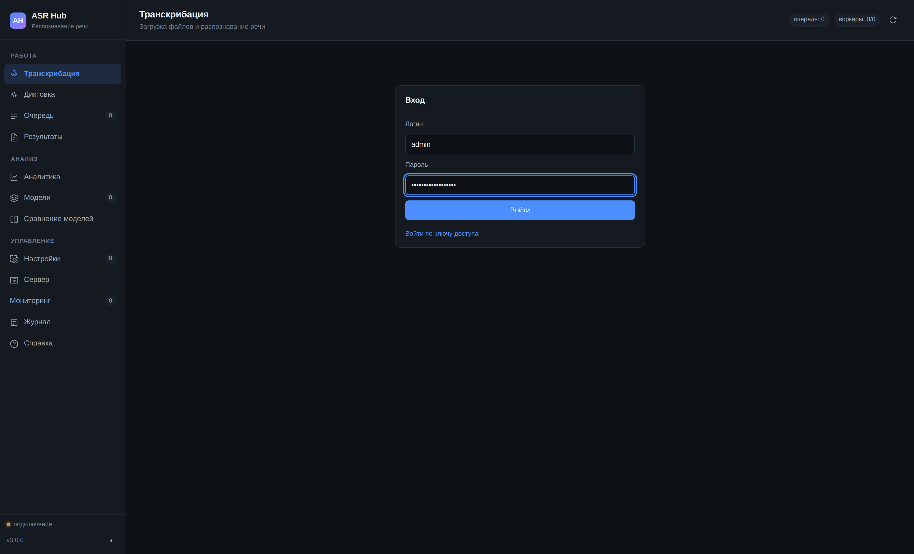
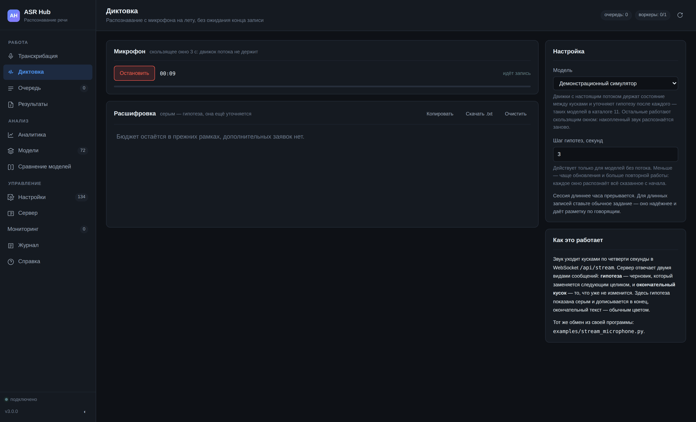
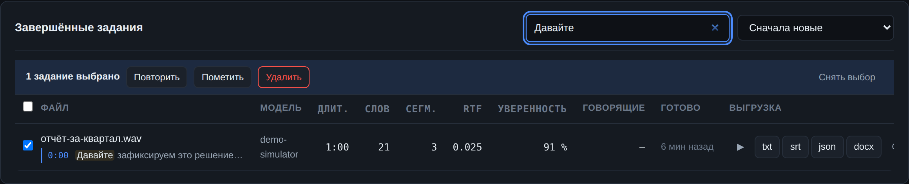
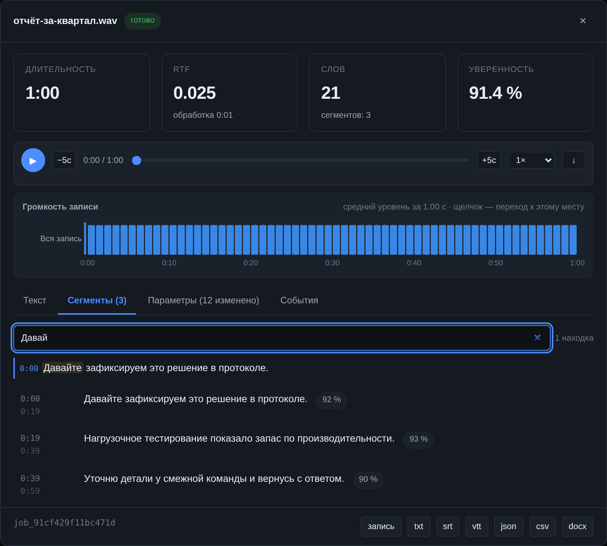
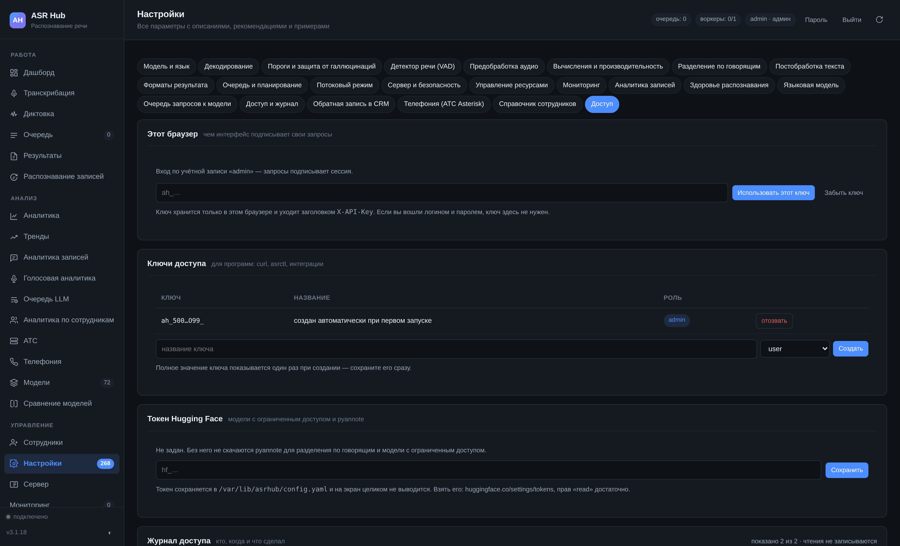

# Веб-интерфейс

Интерфейс открывается по адресу сервера (`http://адрес:8080`) и не требует установки: это статические файлы, отдаваемые самим сервером. Сборки нет, внешних библиотек нет, интернет для работы интерфейса не нужен — включая графики, которые рисуются собственным кодом на SVG. Это принципиально: сервер распознавания часто стоит в закрытом контуре.

Десять разделов сгруппированы по назначению: **Работа** (транскрибация, очередь, результаты), **Анализ** (аналитика, модели, сравнение), **Управление** (настройки, сервер, журнал, справка).

Внизу боковой панели — индикатор соединения. Интерфейс держит WebSocket и получает события мгновенно; если соединение обрывается, он переходит на опрос раз в три секунды и восстанавливает WebSocket с нарастающей паузой. Работа не прерывается, но индикатор об этом честно сообщает.

## Вход



При первом открытии интерфейс спрашивает логин и пароль. Учётная запись по умолчанию — `admin` / `admin123`, и сервер требует сменить пароль сразу: до смены разделы не открываются. Это не придирка — пароль по умолчанию одинаков у всех, у кого есть эта программа.

Кто вошёл, видно в шапке; там же кнопки «Пароль» и «Выйти». Вход держится неделю (`session_ttl_hours`) и продлевается при работе; смена пароля закрывает все остальные сессии.

Программам вход по паролю не нужен — они ходят с ключом доступа, и он продолжает работать как раньше. Если вы уже пользуетесь ключом, ссылка «Войти по ключу доступа» под формой никуда не делась.

Учётные записи заводит администратор в разделе «Сервер». Новому пользователю задаётся временный пароль, который тот меняет при первом входе. Роли те же, что у ключей: `readonly`, `user`, `admin`.

**Забыт пароль.** Единственный администратор, потерявший пароль, восстанавливает доступ из консоли сервера:

```bash
python3 -m asrhub --list-users
python3 -m asrhub --set-password admin
```

Пароль спрашивается с клавиатуры, а не берётся ключом командной строки: аргументы видны в списке процессов и остаются в истории оболочки.

## Транскрибация


Главный экран. Файлы добавляются перетаскиванием, выбором в диалоге или вставкой из буфера. Принимаются аудио и видео: mp3, wav, m4a, flac, ogg, opus, wma, aac, mp4, mkv, mov, avi, webm — всё, что умеет читать ffmpeg. Ограничение размера задаётся параметром `max_upload_mb` (по умолчанию 2 ГБ).

Для каждого файла до отправки видны длительность, частота дискретизации, число каналов и оценка времени обработки на текущей модели.

Отправить можно поодиночке или **группой**: у пакета появляется общий идентификатор, по которому его удобно отслеживать и выгружать целиком.

### Пресеты


Выпадающий список над параметрами подставляет проверенный набор из полутора-двух десятков значений. Одиннадцать пресетов покрывают типовые задачи: русская точность, массовая обработка, колл-центр, совещание, субтитры, мультиязычность, устойчивость Whisper, только CPU, Apple Silicon, реальное время, диагностика. Пресет — отправная точка, а не приговор: после применения любой параметр правится вручную, а изменённые подсвечиваются.

Полное описание — [13. Пресеты](13-presets.md).

### Быстрые параметры

Прямо на экране загрузки: модель, язык, задача (транскрибация или перевод), диаризация, форматы выгрузки, приоритет. Остальные 100+ параметров — в «Настройках», и они применяются к заданию в момент отправки.

## Диктовка



Распознавание с микрофона по ходу речи. Раздел «Транскрибация» принимает готовый файл и отвечает, когда посчитает его целиком; здесь звук уходит на сервер кусками по четверти секунды, а текст возвращается, не дожидаясь конца записи.

**Как читать экран.** Серым показана гипотеза — черновик, который следующее сообщение заменит целиком. Обычным цветом — окончательный текст: он уже не изменится и только дописывается. Тонкая полоса под кнопкой показывает уровень звука: если она не шевелится, микрофон выбран не тот или выключен — и это видно раньше, чем по пустой расшифровке.

**Строка рядом с заголовком «Микрофон»** сообщает, как работает сессия:

| Что написано | Что это значит |
|---|---|
| настоящий поток | движок держит состояние между кусками и уточняет гипотезу после каждого. Задержка — доли секунды, звук распознаётся один раз |
| скользящее окно N с | движок состояния не держит, поэтому накопленный звук распознаётся заново каждые N секунд. Текст появляется по ходу, но за это платят повторной работой |

Шаг гипотез (`stream_window_s`) действует только во втором случае. Меньше — чаще обновления и заметно больше работы: каждое окно распознаёт всё сказанное с начала.

**Готовый текст** копируется в буфер или скачивается файлом `.txt`. Задание в очереди при этом не создаётся: диктовка живёт только в этой вкладке, в «Результатах» её нет. Для записи, которую нужно сохранить, разметить по говорящим и выгрузить в субтитры, ставьте обычное задание.

**Ограничения, о которых лучше знать заранее:**

- Микрофон браузер отдаёт только по **https** или на **localhost**. По http с другой машины кнопка будет неактивна, и раздел прямо об этом скажет — это ограничение браузера, а не сервера.
- Ключу с ролью `readonly` диктовка закрыта: это работа, а не чтение.
- Сессия длиннее часа прерывается. Поток без конца — это растущий буфер и занятая модель.
- Раздел можно выключить целиком параметром `stream_enabled`.

Тот же обмен из своей программы — `examples/stream_microphone.py`; протокол описан в главе [8. Программный интерфейс](08-api.md).

## Очередь


Живая картина: что выполняется сейчас, что ждёт, сколько воркеров занято, какая глубина очереди.

Что можно сделать, не выходя с экрана:

- **Перетащить задание** мышью — так меняется порядок; «в начало» и «в конец» есть и кнопками.
- **Изменить приоритет** ползунком от 1 до 100.
- **Приостановить, возобновить, отменить** отдельное задание или всю очередь целиком.
- **Изменить число одновременных заданий** на ходу, не перезапуская сервер.
- **Повторить все упавшие** одной кнопкой.
- **Массовые действия** над выделенными: отмена, повтор, изменение приоритета, удаление.

Подробности — [06. Очередь](06-queue.md).

## Результаты


Таблица завершённых заданий с фильтрами по статусу, модели, владельцу, дате и поиском по тексту расшифровки. Колонки сортируются, набор колонок настраивается.

### Поиск по расшифровкам



Строка поиска ищет по имени файла, номеру задания и по тому, что в разговоре говорили. Найденная фраза показывается прямо в строке результата — с обрамлением и временем, на котором она сказана; **щелчок по фразе открывает карточку и включает запись с этой секунды**.

Ищет полнотекстовый указатель, а не перебор, и из этого следует несколько удобных вещей:

- **Находит по началу слова.** «догов» находит «договор», поэтому поиск работает по ходу набора, а не после последней буквы.
- **«ещё» и «еще» — одно и то же слово.** Угадывать, как набрано в расшифровке, не приходится.
- **Скорость не зависит от размера архива.** На двадцати тысячах разговоров редкое слово находится за сотые доли секунды; перебором тот же запрос читал всю таблицу целиком и занимал около секунды, а на архиве вдвое большем — вдвое дольше.

⚠️ Указатель строится при первом запуске новой версии: у накопленного архива его ещё нет, и сборка занимает время, пропорциональное числу реплик (на сотнях тысяч — минуты). В журнале это видно строкой «Сборка поискового указателя». Если сборка SQLite оказалась без модуля FTS5, сервер поднимется как обычно и напишет об этом в журнал: поиск будет работать перебором, только медленнее.

### Действия над выборкой

Отметки в первой колонке выбирают строки, и над выборкой работают четыре действия: **повторить**, **пометить**, **удалить** и смена приоритета. Раньше все они были поштучными, и после обновления модели пятьсот разговоров переобрабатывались по одному.

Отказ на одном задании не отменяет остальных: в выборку почти всегда попадает что-то, к чему действие неприменимо. В сообщении об итоге сказано, сколько получилось и по какой причине не вышло остальное. За один раз обрабатывается до 500 заданий — не из осторожности: каждое действие это запись в базу, и слишком большой пакет займёт единственную блокировку записи и остановит очередь.

Карточка задания открывается щелчком по строке:


В карточке: полоса громкости, текст с таймкодами и говорящими, посегментная разбивка с уверенностью модели, все параметры, с которыми задание выполнялось, разбивка времени по стадиям, лента событий. Сегменты с низкой уверенностью подсвечиваются — по ним удобно вычитывать.

### Прослушивание записи

Над полосой громкости стоит проигрыватель, и он связан с расшифровкой в обе стороны:

- **щелчок по сегменту** переводит звук на его начало и включает воспроизведение;
- **звучащий сегмент подсвечивается сам** и подводится к середине списка — но только если он ушёл из поля зрения, иначе список дёргался бы на каждой реплике;
- **щелчок по полосе громкости** переводит и звук, и текст.

Ради этой связи всё и затевалось: просто послушать файл можно было и скачав его, а ценно другое — слышать и одновременно видеть, что распознал сервер. Сомнительное слово удобно слушать на скорости 0.75×, знакомый кусок — пролистывать на 1.75×; шаг ±5 секунд рядом с кнопкой пуска.

Прослушать можно и не открывая карточку — кнопкой ▶ в строке списка результатов. Кнопка «запись» в подвале карточки скачивает исходный файл под его настоящим именем.

Запись отдаётся с поддержкой частичных запросов (заголовок `Range`), поэтому перемотка по часовому разговору не требует выкачивать его целиком. Исключение — вход по ключу доступа: `<audio>` не умеет отправлять заголовок `X-API-Key`, и в этом случае файл забирается целиком одним запросом. У тех, кто вошёл логином и паролем, работает обычный потоковый путь.

Если записи на диске уже нет, проигрыватель говорит об этом прямо и называет обе возможные причины: параметр `delete_source_after` и очистку хранилища по сроку.

### Поиск внутри разговора



Над списком сегментов стоит своя строка поиска. Часовой разговор — это сотни реплик, и «найти, где обсуждали сроки» поиском по странице означает пролистать их все. Здесь то же самое делает указатель: находки показываются списком с временем и говорящим, **щелчок по находке переводит запись на её начало** и подсвечивает нужный сегмент.


**Полоса громкости** идёт над вкладками: по дорожке на канал или на говорящего, столбик на каждую секунду записи. По ней сразу видно, кто сколько говорил, где были паузы и не молчал ли один из собеседников половину разговора — слушать для этого не нужно. Наведение показывает время и уровень на каждой дорожке, **щелчок открывает сегменты и подводит к тому, что говорилось в эту секунду**; если щелчок пришёлся на паузу, открывается ближайшая реплика. Дорожки подписаны слева, так что цвет здесь — опознавательный знак, а не единственный признак.

Высота столбиков считается от общего максимума по всем дорожкам, а не от собственного максимума каждой: иначе тихий собеседник выглядел бы таким же громким, как крикливый.

Выгрузка в девяти форматах: `txt`, `md`, `json`, `srt`, `vtt`, `ass`, `tsv`, `csv`, `docx`. Кнопка «Скачать всё» отдаёт архив по группе заданий.

Поле **«Эталонный текст»** принимает правильную расшифровку — сервер считает WER и CER и показывает разбор ошибок по типам: замены, пропуски, вставки. Это и есть способ честно сравнить две модели на своём материале, а не на чужом бенчмарке.

## Аналитика


Двадцать разделов показателей за выбранный период (день, неделя, месяц, квартал, год, всё время): сводка, динамика по времени, разрезы по моделям, языкам, владельцам, движкам и источникам, ошибки, распределение длительностей, самые медленные задания, суточный профиль нагрузки, эффективность — и восемь разрезов, отвечающих на вопросы, которые из перечисленного не выводятся.

**Нагрузка по дням недели** — карта «день × час». Суточный профиль усредняет будни с выходными и потому отвечает не на тот вопрос: планировать окна обслуживания и запас мощности приходится по неделе, где утро понедельника и вечер воскресенья — разные миры. Шкала цвета корневая, а не линейная: один выброс при линейной уложил бы всю остальную неделю в один тон, и карта показывала бы только пик, который и так подписан текстом.

**Ожидание в очереди** — перцентили, а не среднее, и в разрезе по приоритету и источнику. На среднее не жалуются: ждали три секунды девятьсот заданий и сорок минут — десять, и среднее скажет «всё хорошо».

**Уверенность во времени** и **ошибки распознавания во времени** — два графика, а не один: уверенность держится у 95 %, а WER около единицы, и на общей оси младший ряд ложится в ноль. Вторую ось при этом не рисуем — она врёт про соотношение величин. У графика уверенности низ шкалы поджат: разница между 93 % и 96 % — это и есть всё, что там происходит, а от нуля она невидима.

**Надёжность** отделяет задание, прошедшее с первой попытки, от прошедшего с третьей — для доли успеха они одинаковы, а для состояния сервера это разные вещи. Здесь же отмены с указанием, кто отменял, и судьба уведомлений.

**Повторы и экономия** переводят счётчик «из кеша» в часы аудио и машинного времени. Заодно показывают самые частые повторы: один и тот же файл, приходящий десятки раз, обычно означает не бережливость, а ошибку в очереди на стороне клиента.

**Каким бывает звук** — разрез не про сервер, а про материал: форматы, средний размер, битрейт, темп речи в словах за минуту, плотность реплик, число говорящих. Темп речи объясняет, почему одна и та же модель на одном потоке работает вдвое медленнее, чем на другом.

**Расход ресурсов** — пик памяти по моделям и разрез по устройствам с фактическим RTF каждого. Это ответ на вопрос, который задают перед покупкой второй карты. Пик пишется начиная с версии 3.0: на видеокарте это память ускорителя, на процессоре — резидентная память процесса.

**По меткам** — единственный разрез, который задаёт сам пользователь. Всё остальное сервер знает про себя; метка отвечает на вопрос «сколько ушло на этот проект», и для отчётности она важнее прочих.

Графики интерактивные: перекрестье с подсказкой на линиях, подсказка на каждом столбце и ячейке. Палитра проверена на различимость при основных типах цветовой слепоты — программно, а не на глаз, и отдельно для светлой и тёмной темы.


Тема переключается кнопкой в правом верхнем углу и запоминается.

Подробности — [07. Аналитика](07-analytics.md).

## Модели


Каталог из 72 моделей с фильтрами по языку, движку, лицензии, наличию потокового режима и диаризации. Для каждой видно: загружены ли веса, сколько занимают, какая лицензия, измеренный WER.

Карточка модели:


Внутри: описание, лицензия со ссылкой на первоисточник, требования к памяти и диску, поддерживаемые языки, таблица бенчмарков с указанием набора данных и источника цифры, сильные и слабые стороны, рекомендуемые параметры.

Веса загружаются и удаляются прямо отсюда, с полосой прогресса. Модели с ограниченным доступом (например, требующие принятия условий на Hugging Face) помечены — интерфейс подскажет, что именно нужно сделать.

## Сравнение моделей


Выбранные модели ставятся в таблицу рядом: качество на русском, скорость, размер, лицензия, языки, потоковый режим, пунктуация, диаризация. Различающиеся ячейки подсвечиваются, чтобы взгляд цеплялся за существенное.

⚠️ Значения WER взяты с карточек моделей и из статей авторов; они измерены на **разных наборах данных** и не сопоставимы напрямую. Таблица годится, чтобы отобрать двух-трёх кандидатов; выбирать между ними надо прогоном на своих записях с эталонным текстом.

## Настройки


Все 110 параметров, сгруппированные в 13 разделов, с навигацией по группам и поиском по названию, ключу и описанию.

Каждый параметр — карточка:


В карточке:

- **Описание** — что параметр делает, человеческим языком.
- **Рекомендация** — что ставить по умолчанию и в каких случаях менять.
- **Примеры настройки** — таблица «сценарий → значение → пояснение»; щелчок по значению подставляет его.
- **Влияние** — что произойдёт при увеличении: качество ↑, скорость ↓, память ↑.
- **Применимо к** — движки, для которых параметр имеет смысл; для остальных он не показывается.
- **Условия** — от каких других параметров зависит (например, пороги VAD появляются только при включённом VAD).
- **Синонимы** — как этот параметр называется в оригинальных библиотеках, чтобы не искать соответствие вручную.

Изменённые значения подсвечиваются, рядом кнопка возврата к умолчанию. Настройки применяются к новым заданиям сразу; кнопка «Сохранить в файл» записывает их в `config.yaml`, чтобы пережить перезапуск.

Тот же справочник доступен без интерфейса: [04. Справочник параметров](04-parameters.md) и `GET /api/params`.

### Доступ



Отдельный раздел настроек — всё, чем подписываются запросы, в одном месте:

- **Этот браузер.** Чем интерфейс подписывает свои запросы: сессией входа или ключом. Ключ хранится только в браузере и уходит заголовком `X-API-Key`; если вы вошли логином и паролем, он не нужен.
- **Ключи доступа.** Список с ролями, создание и отзыв. Полное значение ключа показывается один раз при создании.
- **Токен Hugging Face.** Нужен для `pyannote` (разделение по говорящим) и моделей с ограниченным доступом. Раньше задавался только при установке или строкой в `config.yaml`; теперь его можно задать и убрать отсюда. На экран он целиком не выводится — видны первые шесть знаков и длина, этого хватает, чтобы понять, тот ли токен стоит.

Задавать токен и управлять ключами может администратор. Панель кнопок «Применить / Сохранить / Сбросить» в этом разделе скрыта: она относится к параметрам каталога, а здесь их нет.

## Сервер


Оборудование (процессор, память, видеокарта, драйверы), состояние движков с причиной недоступности для каждого не установленного, использование диска по каталогам, учётные записи, ключи доступа, обслуживание.

Графики нагрузки процессора, памяти и видеокарты обновляются в реальном времени. Ключи доступа создаются и отзываются здесь же; полное значение ключа показывается один раз при создании.

Рядом — карточка «Учётные записи»: список с ролями, кнопки сброса пароля и удаления, форма для новой записи. Сброшенный администратором пароль помечается как временный — пользователь меняет его при первом входе. Пока где-то стоит пароль по умолчанию, карточка показывает предупреждение. Последнего администратора система не даст ни разжаловать, ни отключить, ни удалить: иначе сервером станет некому управлять.

Кнопки обслуживания: очистка старых заданий и файлов, выгрузка моделей из памяти.

## Журнал


События сервера и заданий с фильтром по уровню, поиском и привязкой к заданию. Уровни: отладка, информация, предупреждение, ошибка. Записи с ошибками разворачиваются и показывают код ошибки, подсказку и трассировку.

## Справка


Встроенное руководство: как пользоваться разделами, описание программного интерфейса, разбор частых ошибок. Работает без интернета, что важно в закрытом контуре.

Полный справочник HTTP-интерфейса доступен по адресу `/api/reference`:


Он собирается из схемы OpenAPI самим сервером и, в отличие от привычного Swagger UI, не тянет ничего с внешних адресов.

## Горячие клавиши


| Клавиша | Действие |
|---|---|
| `1`…`0` | переход к разделу по номеру в порядке меню: `1` — Транскрибация, `2` — Диктовка, `3` — Очередь и так далее. Разделов одиннадцать, а цифр десять, поэтому «Журнал» открывается только мышью; какая цифра какому разделу отвечает, написано в самом списке |
| `/` | поиск в текущем разделе |
| `u` | загрузить файл |
| `r` | обновить данные раздела |
| `t` | переключить тему |
| `Esc` | закрыть карточку или диалог |
| `?` | список горячих клавиш |

Буквенные сокращения молчат, пока курсор стоит в поле ввода, и понимают русскую раскладку: `г`, `к`, `е` работают наравне с `u`, `r`, `t`.
