# Веб-интерфейс

Интерфейс открывается по адресу сервера (`http://адрес:8080`) и не требует установки: это статические файлы, отдаваемые самим сервером. Сборки нет, внешних библиотек нет, интернет для работы интерфейса не нужен — включая графики, которые рисуются собственным кодом на SVG. Это принципиально: сервер распознавания часто стоит в закрытом контуре.

Десять разделов сгруппированы по назначению: **Работа** (транскрибация, очередь, результаты), **Анализ** (аналитика, модели, сравнение), **Управление** (настройки, сервер, журнал, справка).

Внизу боковой панели — индикатор соединения. Интерфейс держит WebSocket и получает события мгновенно; если соединение обрывается, он переходит на опрос раз в три секунды и восстанавливает WebSocket с нарастающей паузой. Работа не прерывается, но индикатор об этом честно сообщает.

## Транскрибация

Главный экран. Файлы добавляются перетаскиванием, выбором в диалоге или вставкой из буфера. Принимаются аудио и видео: mp3, wav, m4a, flac, ogg, opus, wma, aac, mp4, mkv, mov, avi, webm — всё, что умеет читать ffmpeg. Ограничение размера задаётся параметром `max_upload_mb` (по умолчанию 2 ГБ).

Для каждого файла до отправки видны длительность, частота дискретизации, число каналов и оценка времени обработки на текущей модели.

Отправить можно поодиночке или **группой**: у пакета появляется общий идентификатор, по которому его удобно отслеживать и выгружать целиком.

### Пресеты

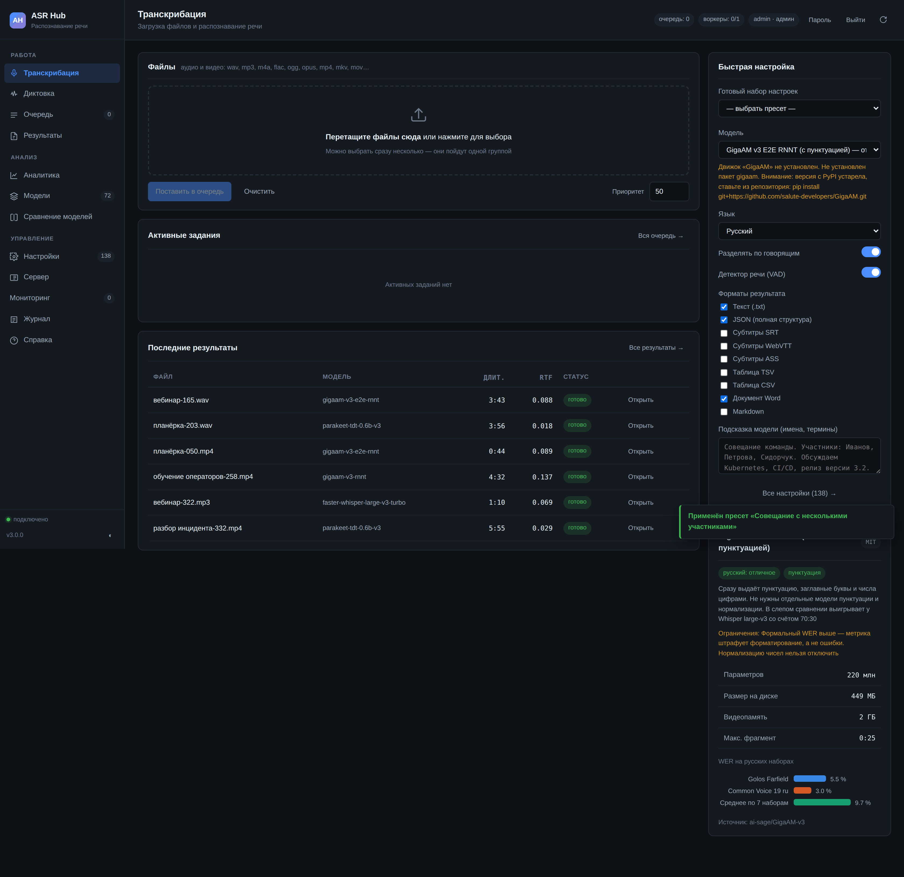

Выпадающий список над параметрами подставляет проверенный набор из полутора-двух десятков значений. Одиннадцать пресетов покрывают типовые задачи: русская точность, массовая обработка, колл-центр, совещание, субтитры, мультиязычность, устойчивость Whisper, только CPU, Apple Silicon, реальное время, диагностика. Пресет — отправная точка, а не приговор: после применения любой параметр правится вручную, а изменённые подсвечиваются.

Полное описание — [13. Пресеты](13-presets.md).

### Быстрые параметры

Прямо на экране загрузки: модель, язык, задача (транскрибация или перевод), диаризация, форматы выгрузки, приоритет. Остальные 100+ параметров — в «Настройках», и они применяются к заданию в момент отправки.

## Очередь

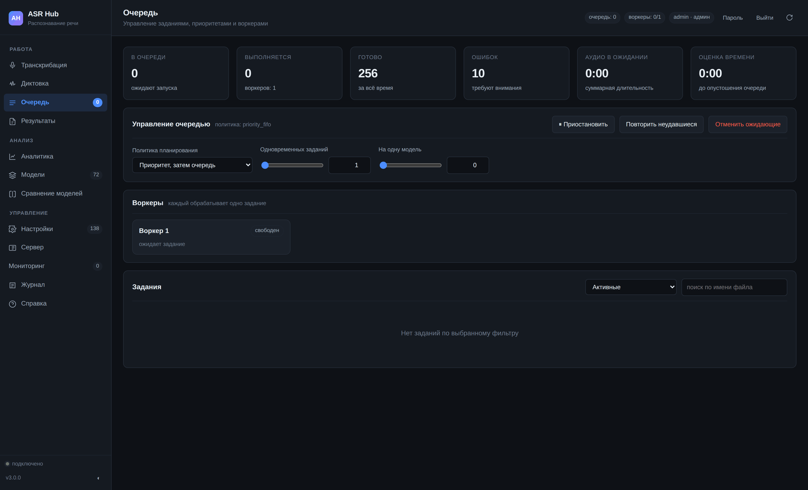

Живая картина: что выполняется сейчас, что ждёт, сколько воркеров занято, какая глубина очереди.

Что можно сделать, не выходя с экрана:

- **Перетащить задание** мышью — так меняется порядок; «в начало» и «в конец» есть и кнопками.
- **Изменить приоритет** ползунком от 1 до 100.
- **Приостановить, возобновить, отменить** отдельное задание или всю очередь целиком.
- **Изменить число одновременных заданий** на ходу, не перезапуская сервер.
- **Повторить все упавшие** одной кнопкой.
- **Массовые действия** над выделенными: отмена, повтор, изменение приоритета, удаление.

Подробности — [06. Очередь](06-queue.md).

## Результаты

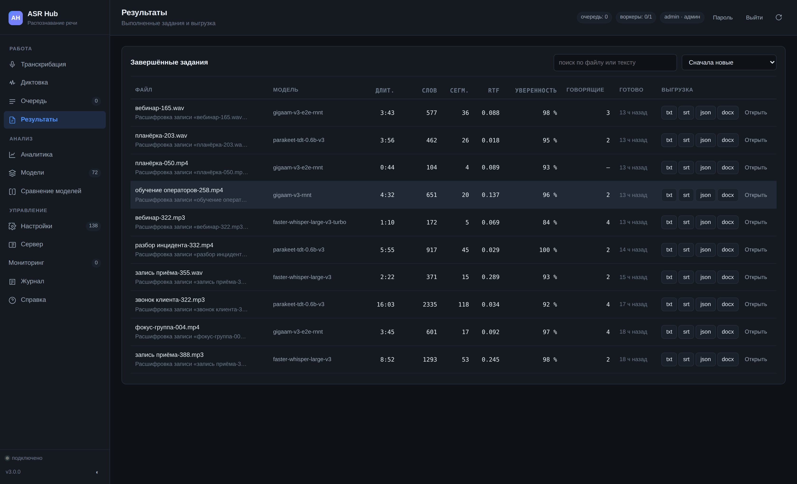

Таблица завершённых заданий с фильтрами по статусу, модели, владельцу, дате и поиском по тексту расшифровки. Колонки сортируются, набор колонок настраивается.

Карточка задания открывается щелчком по строке:

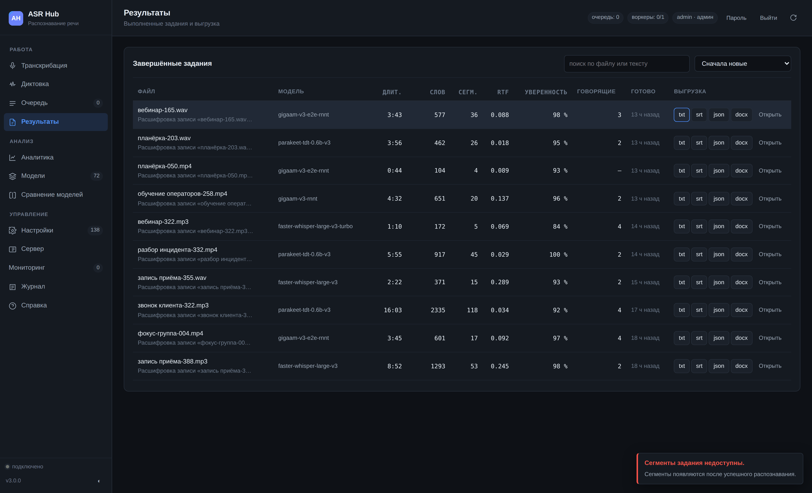

В карточке: полоса громкости, текст с таймкодами и говорящими, посегментная разбивка с уверенностью модели, все параметры, с которыми задание выполнялось, разбивка времени по стадиям, лента событий. Сегменты с низкой уверенностью подсвечиваются — по ним удобно вычитывать.

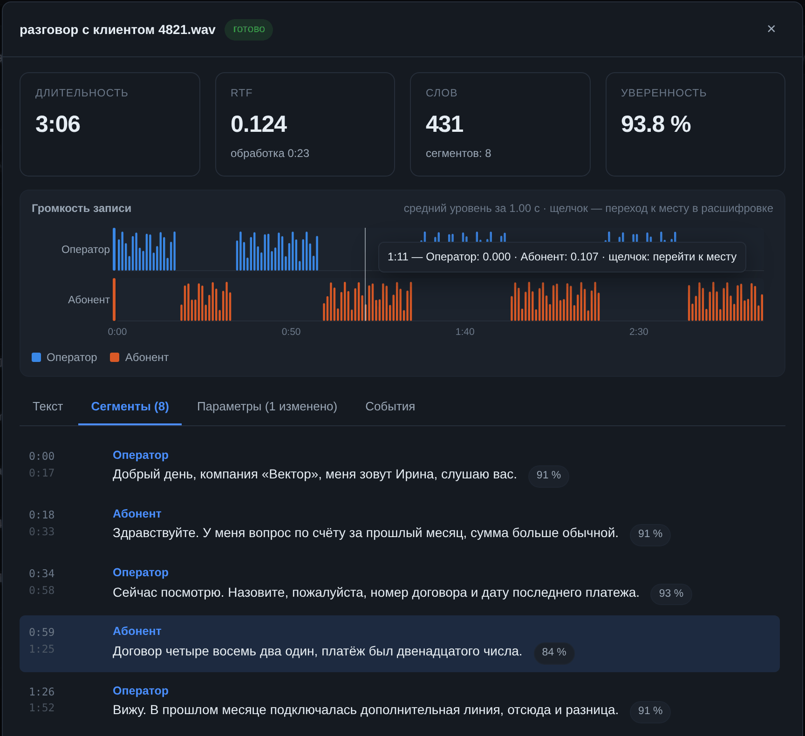

**Полоса громкости** идёт над вкладками: по дорожке на канал или на говорящего, столбик на каждую секунду записи. По ней сразу видно, кто сколько говорил, где были паузы и не молчал ли один из собеседников половину разговора — слушать для этого не нужно. Наведение показывает время и уровень на каждой дорожке, **щелчок открывает сегменты и подводит к тому, что говорилось в эту секунду**; если щелчок пришёлся на паузу, открывается ближайшая реплика. Дорожки подписаны слева, так что цвет здесь — опознавательный знак, а не единственный признак.

Высота столбиков считается от общего максимума по всем дорожкам, а не от собственного максимума каждой: иначе тихий собеседник выглядел бы таким же громким, как крикливый.

Выгрузка в девяти форматах: `txt`, `md`, `json`, `srt`, `vtt`, `ass`, `tsv`, `csv`, `docx`. Кнопка «Скачать всё» отдаёт архив по группе заданий.

Поле **«Эталонный текст»** принимает правильную расшифровку — сервер считает WER и CER и показывает разбор ошибок по типам: замены, пропуски, вставки. Это и есть способ честно сравнить две модели на своём материале, а не на чужом бенчмарке.

## Аналитика

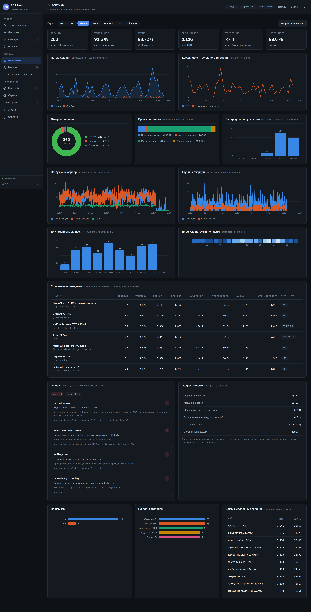

Двенадцать разделов показателей за выбранный период (день, неделя, месяц, всё время): сводка, динамика по времени, разрезы по моделям, языкам, владельцам, движкам и источникам, ошибки, распределение длительностей, самые медленные задания, суточный профиль нагрузки, эффективность.

Графики интерактивные: перекрестье с подсказкой на линиях, подсказка на каждом столбце и ячейке. Палитра проверена на различимость при основных типах цветовой слепоты — программно, а не на глаз, и отдельно для светлой и тёмной темы.

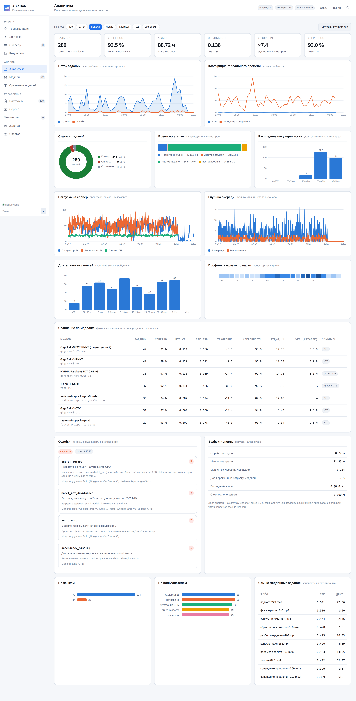

Тема переключается кнопкой в правом верхнем углу и запоминается.

Подробности — [07. Аналитика](07-analytics.md).

## Модели

Каталог из 72 моделей с фильтрами по языку, движку, лицензии, наличию потокового режима и диаризации. Для каждой видно: загружены ли веса, сколько занимают, какая лицензия, измеренный WER.

Карточка модели:

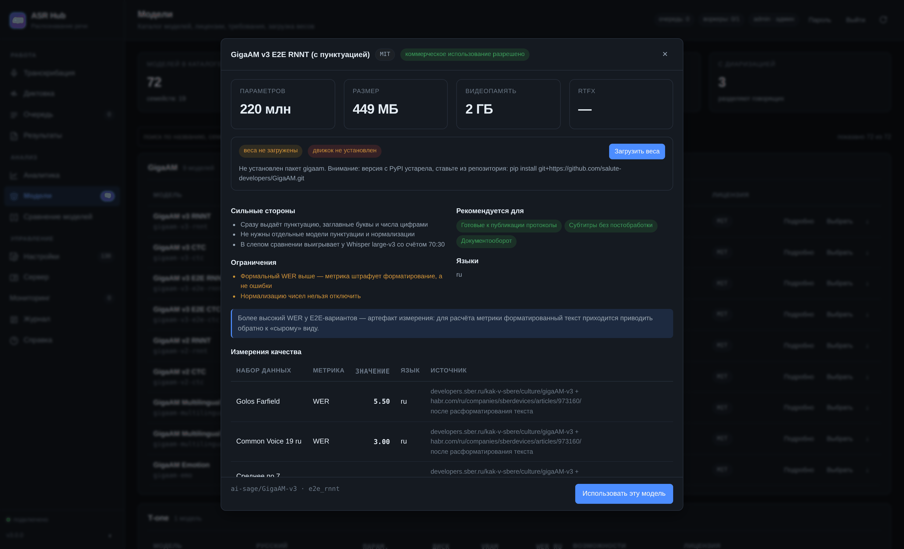

Внутри: описание, лицензия со ссылкой на первоисточник, требования к памяти и диску, поддерживаемые языки, таблица бенчмарков с указанием набора данных и источника цифры, сильные и слабые стороны, рекомендуемые параметры.

Веса загружаются и удаляются прямо отсюда, с полосой прогресса. Модели с ограниченным доступом (например, требующие принятия условий на Hugging Face) помечены — интерфейс подскажет, что именно нужно сделать.

## Сравнение моделей

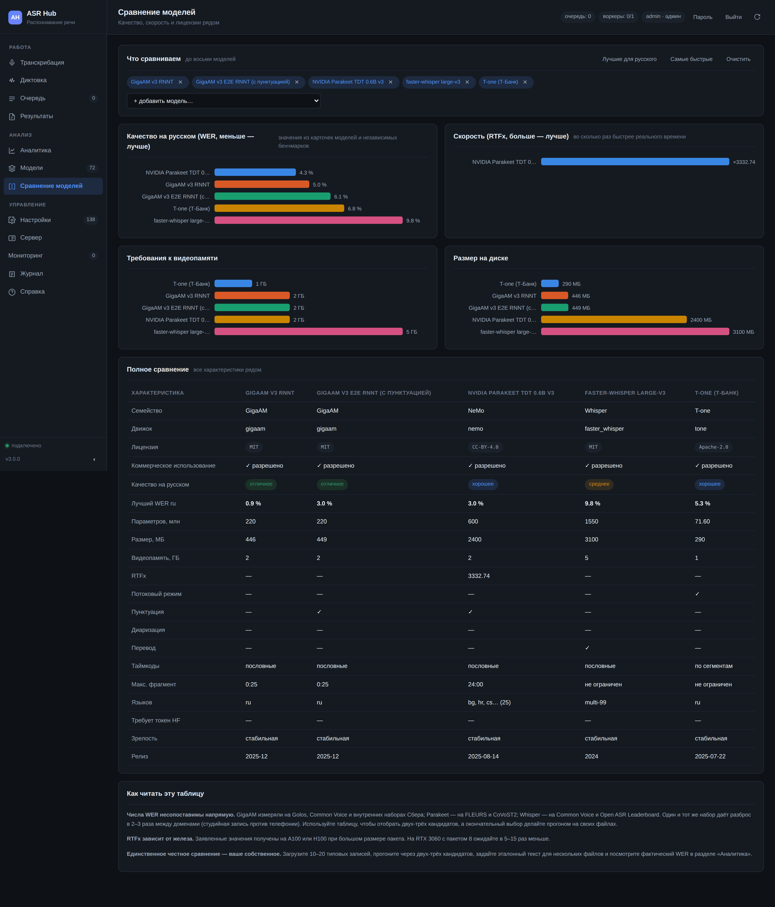

Выбранные модели ставятся в таблицу рядом: качество на русском, скорость, размер, лицензия, языки, потоковый режим, пунктуация, диаризация. Различающиеся ячейки подсвечиваются, чтобы взгляд цеплялся за существенное.

⚠️ Значения WER взяты с карточек моделей и из статей авторов; они измерены на **разных наборах данных** и не сопоставимы напрямую. Таблица годится, чтобы отобрать двух-трёх кандидатов; выбирать между ними надо прогоном на своих записях с эталонным текстом.

## Настройки

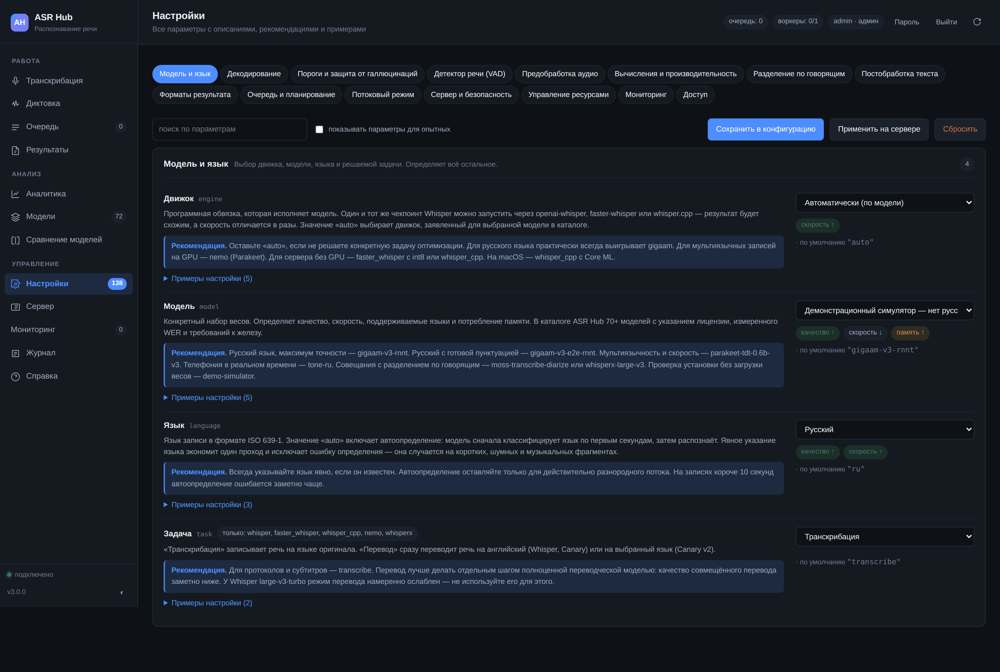

Все 110 параметров, сгруппированные в 13 разделов, с навигацией по группам и поиском по названию, ключу и описанию.

Каждый параметр — карточка:

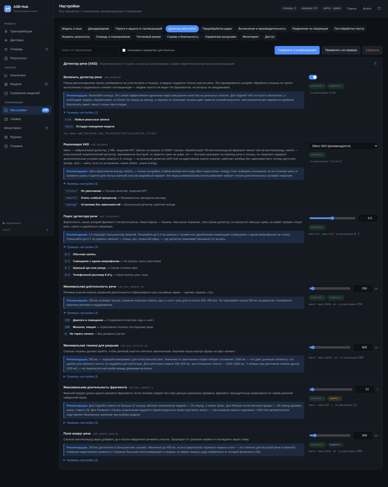

В карточке:

- **Описание** — что параметр делает, человеческим языком.
- **Рекомендация** — что ставить по умолчанию и в каких случаях менять.
- **Примеры настройки** — таблица «сценарий → значение → пояснение»; щелчок по значению подставляет его.
- **Влияние** — что произойдёт при увеличении: качество ↑, скорость ↓, память ↑.
- **Применимо к** — движки, для которых параметр имеет смысл; для остальных он не показывается.
- **Условия** — от каких других параметров зависит (например, пороги VAD появляются только при включённом VAD).
- **Синонимы** — как этот параметр называется в оригинальных библиотеках, чтобы не искать соответствие вручную.

Изменённые значения подсвечиваются, рядом кнопка возврата к умолчанию. Настройки применяются к новым заданиям сразу; кнопка «Сохранить в файл» записывает их в `config.yaml`, чтобы пережить перезапуск.

Тот же справочник доступен без интерфейса: [04. Справочник параметров](04-parameters.md) и `GET /api/params`.

## Сервер

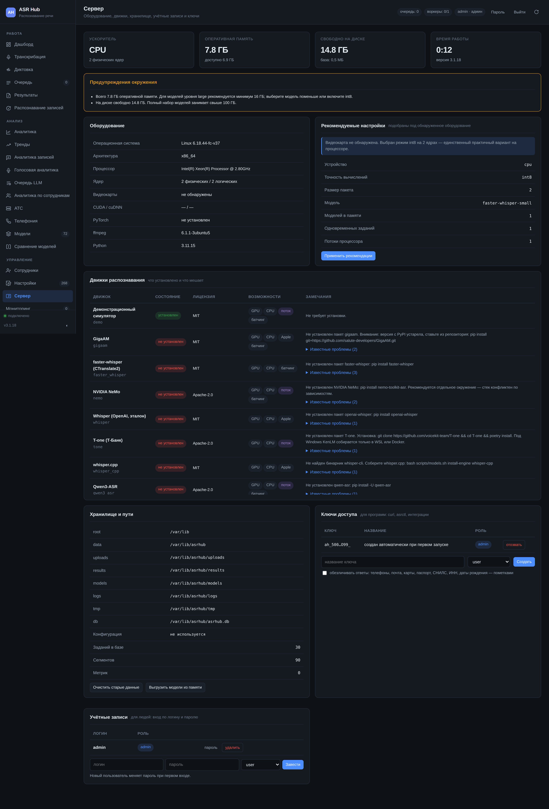

Оборудование (процессор, память, видеокарта, драйверы), состояние движков с причиной недоступности для каждого не установленного, использование диска по каталогам, ключи доступа, обслуживание.

Графики нагрузки процессора, памяти и видеокарты обновляются в реальном времени. Ключи доступа создаются и отзываются здесь же; полное значение ключа показывается один раз при создании.

Кнопки обслуживания: очистка старых заданий и файлов, выгрузка моделей из памяти.

## Журнал

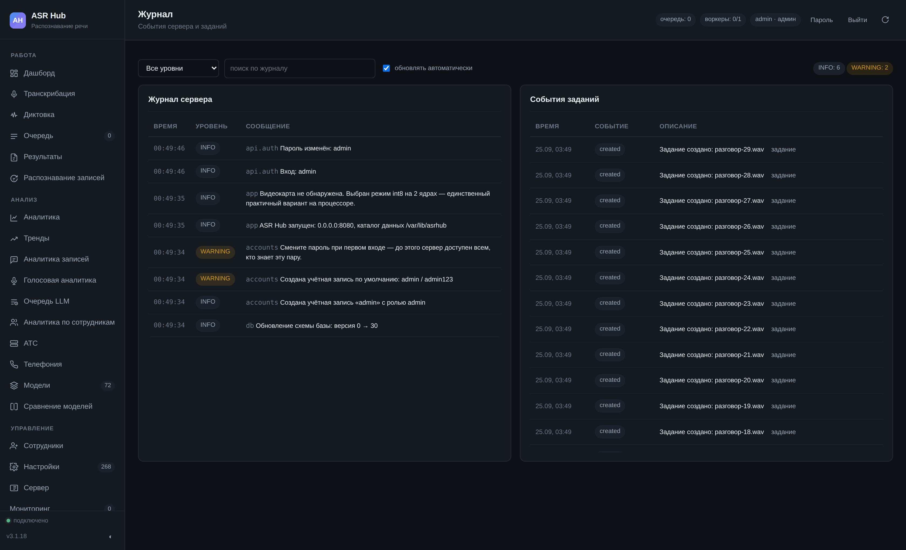

События сервера и заданий с фильтром по уровню, поиском и привязкой к заданию. Уровни: отладка, информация, предупреждение, ошибка. Записи с ошибками разворачиваются и показывают код ошибки, подсказку и трассировку.

## Справка

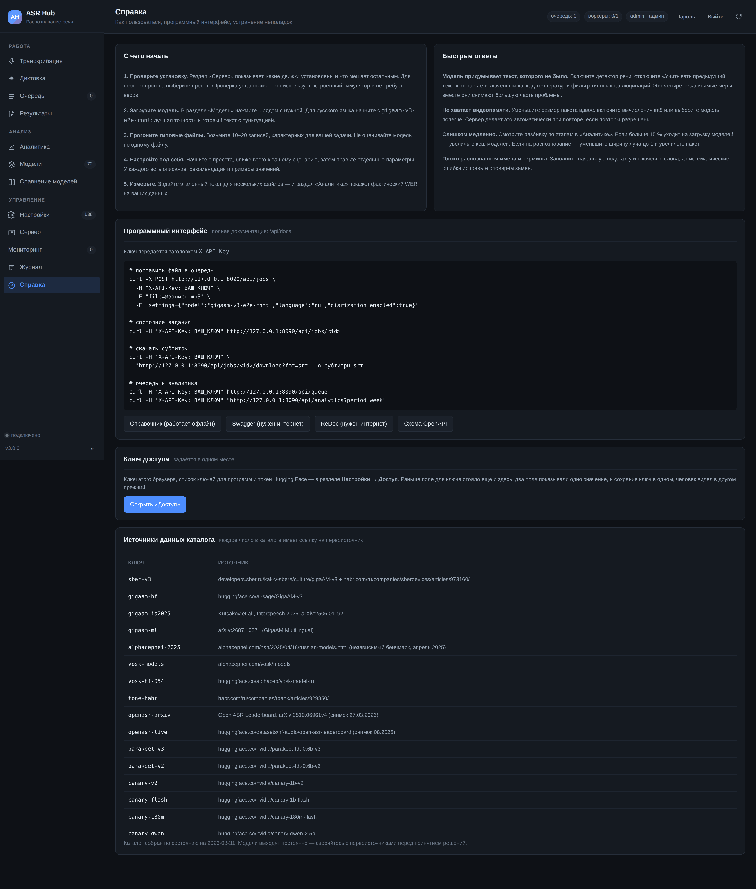

Встроенное руководство: как пользоваться разделами, описание программного интерфейса, разбор частых ошибок. Работает без интернета, что важно в закрытом контуре.

Полный справочник HTTP-интерфейса доступен по адресу `/api/reference`:

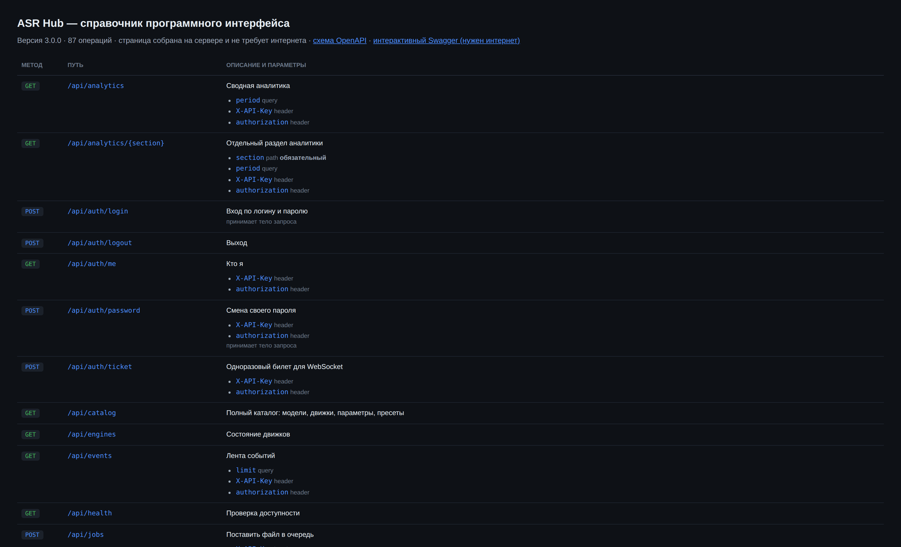

Он собирается из схемы OpenAPI самим сервером и, в отличие от привычного Swagger UI, не тянет ничего с внешних адресов.

## Горячие клавиши

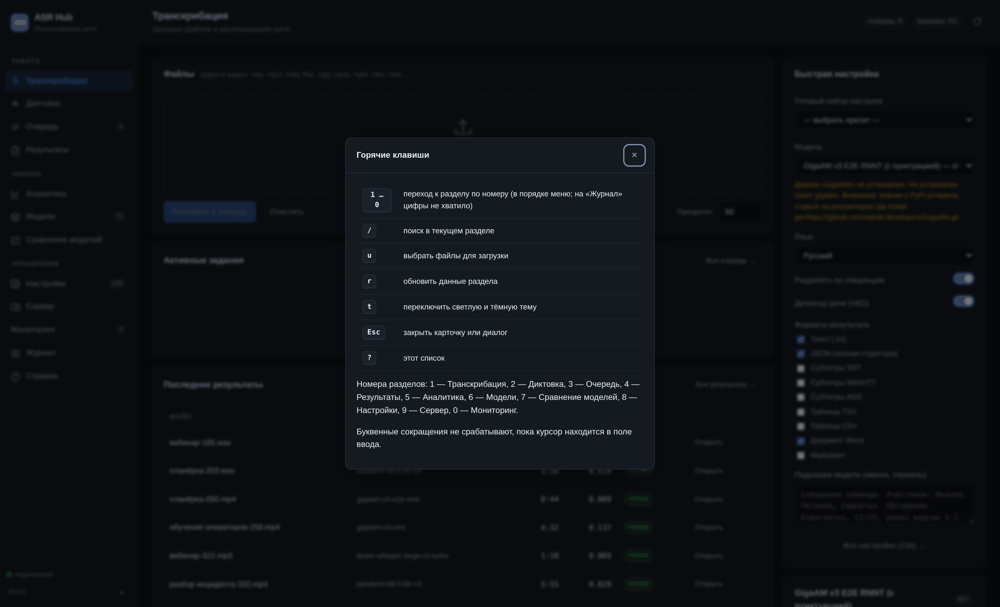

| Клавиша | Действие |
|---|---|
| `1`…`0` | переход к разделу по номеру |
| `/` | поиск в текущем разделе |
| `u` | загрузить файл |
| `r` | обновить данные раздела |
| `t` | переключить тему |
| `Esc` | закрыть карточку или диалог |
| `?` | список горячих клавиш |

Буквенные сокращения молчат, пока курсор стоит в поле ввода, и понимают русскую раскладку: `г`, `к`, `е` работают наравне с `u`, `r`, `t`.
