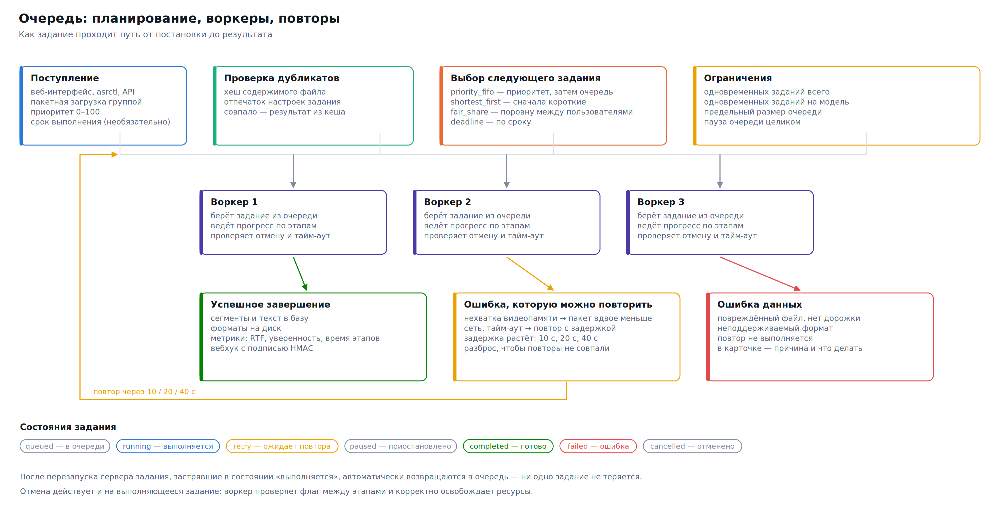

# Очередь



Очередь — то, ради чего сервер вообще нужен, если файлов больше десятка. Она переживает перезапуск, сама справляется с нехваткой памяти и позволяет запустить обработку архива на ночь, не сидя рядом.

## Состояния задания

| Состояние | Что означает |
|---|---|
| `queued` | принято, ждёт свободного воркера |
| `running` | выполняется, прогресс идёт по стадиям |
| `paused` | приостановлено вручную, место в очереди сохранено |
| `retry` | упало с восстановимой ошибкой, повтор запланирован на конкретное время |
| `completed` | готово, результаты доступны |
| `failed` | исчерпаны повторы или ошибка невосстановимая |
| `cancelled` | отменено пользователем |

Переход в `retry` — не то же самое, что `failed`. Ошибки делятся на восстановимые (`retryable=true`: нехватка памяти, таймаут, недоступность модели, переполнение диска) и невосстановимые (неподдерживаемый формат, файл без звуковой дорожки, неизвестная модель). Повторять второе бессмысленно, и сервер этого не делает.

## Приоритеты и порядок

Приоритет — число от 1 до 100, по умолчанию 50; больше значит раньше. При равном приоритете работает порядок поступления.

```bash
curl -X POST http://сервер:8080/api/jobs/job_ab12/priority \
  -H "X-API-Key: ключ" -H "Content-Type: application/json" \
  -d '{"priority": 95}'

curl -X POST http://сервер:8080/api/jobs/job_ab12/top -H "X-API-Key: ключ"
```

В интерфейсе то же самое делается перетаскиванием строки.

## Политики планирования

Параметр `scheduling_policy` определяет, какое из ждущих заданий берётся следующим.

| Политика | Правило | Когда выбирать |
|---|---|---|
| `priority_fifo` | приоритет, при равенстве — кто раньше пришёл | **умолчание**, предсказуемо и понятно |
| `shortest_first` | сначала самая короткая запись | много мелких файлов вперемешку с многочасовыми: средняя задержка падает в разы |
| `deadline` | сначала задания с ближайшим сроком | есть договорные сроки на выдачу результата |
| `fair_share` | круговое обслуживание владельцев | сервер общий, и один пользователь не должен занимать его целиком |

> **Рекомендация.** `shortest_first` — самая недооценённая настройка на общем сервере. Пятиминутная планёрка, поставленная за трёхчасовой конференцией, при `priority_fifo` ждёт три часа; при `shortest_first` — минуту. Обратная сторона: длинные записи могут ждать неограниченно долго, если поток коротких не прекращается.

## Параллельность

`max_concurrent_jobs` — сколько заданий выполняется одновременно. Меняется на ходу:

```bash
curl -X POST http://сервер:8080/api/queue/concurrency \
  -H "X-API-Key: ключ" -H "Content-Type: application/json" -d '{"workers": 3}'
```

Как выбрать значение:

- **На видеокарте** параллельность почти не ускоряет: вычисления и так загружают устройство. Ставьте 1–2. Второй воркер помогает лишь тем, что подготовка звука одного задания идёт, пока другое считается.
- **На процессоре** ориентируйтесь на число физических ядер, поделённое на `cpu_threads` одного задания. Восемь ядер и `cpu_threads=4` → два воркера.
- **Память** — жёсткое ограничение. Каждый воркер держит свою копию модели, если модели разные. Три воркера с large-v3 на видеокарте с 12 ГБ не поместятся.

⚠️ Больше воркеров, чем помещается в память, — это не «немного медленнее», это гарантированные ошибки нехватки памяти под нагрузкой. Начните с 1, поднимайте по одному, наблюдая за графиком памяти в разделе «Сервер».

## Повторы и защита от нехватки памяти

При восстановимой ошибке задание планируется на повтор с экспоненциальной задержкой: `retry_backoff_s × 2^номер_попытки`, умноженной на случайный множитель от 0,75 до 1,25 — чтобы одновременно упавшие задания не бросились повторяться в одну секунду.

Отдельно обрабатывается нехватка памяти на устройстве: перед повтором размер пакета делится на `oom_retry_batch_divisor` (по умолчанию 2). Пакет из 16 становится 8, потом 4, потом 2. Обычно этого достаточно, чтобы задание прошло, — вместо того чтобы уронить весь ночной прогон.

```yaml
max_retries: 3
retry_backoff_s: 10
oom_retry_batch_divisor: 2
```

## Дедупликация

При `deduplicate_jobs: true` (умолчание) сервер считает хеш содержимого файла и хеш набора настроек. Если такое сочетание уже обрабатывалось, результат возвращается из кеша мгновенно, без повторного распознавания.

Это спасает при повторной отправке того же архива и при отладке интеграции. Файл с тем же содержимым, но другими настройками, дедупликацией не считается одинаковым — меняете `beam_size`, получаете честный новый прогон.

## Групповая обработка

Файлы можно отправить одной группой — у пакета появится общий `group_id`:

```bash
curl -X POST http://сервер:8080/api/jobs/batch \
  -H "X-API-Key: ключ" \
  -F "files=@1.mp3" -F "files=@2.mp3" -F "files=@3.mp3" \
  -F 'settings={"model":"gigaam-v3-ctc"}'
```

По `group_id` фильтруются списки и выгружаются результаты целиком. Консольный клиент отправляет каталог одной командой:

```bash
asrctl send-dir ./архив --recursive --pattern '*.mp3' --formats txt,json --priority 30
```

> **Рекомендация.** Ставьте массовым заданиям приоритет ниже стандартного (20–30). Тогда ночной прогон архива не помешает человеку, которому нужна одна расшифровка прямо сейчас.

## Управление очередью целиком

```bash
curl -X POST http://сервер:8080/api/queue/pause        -H "X-API-Key: ключ"
curl -X POST http://сервер:8080/api/queue/resume       -H "X-API-Key: ключ"
curl -X POST http://сервер:8080/api/queue/clear        -H "X-API-Key: ключ"
curl -X POST http://сервер:8080/api/queue/retry-failed -H "X-API-Key: ключ"
```

Пауза не трогает уже выполняющиеся задания — они доработают до конца, новые в работу не берутся. Это правильный способ подготовиться к перезапуску сервера: поставить на паузу, дождаться опустошения списка выполняемых, перезапустить.

## Что происходит при перезапуске

Задания живут в SQLite, а не в памяти процесса. При старте сервер находит задания, оставшиеся в состоянии `running` (значит, процесс был остановлен на середине), и возвращает их в очередь с отметкой в журнале. Ничего не теряется; максимум — одно задание считается заново.

Файлы загрузок и результаты лежат в каталоге данных и переживают перезапуск и обновление.

## Оповещения по webhook

У задания может быть адрес, на который сервер отправит результат по завершении:

```bash
curl -X POST http://сервер:8080/api/jobs \
  -H "X-API-Key: ключ" \
  -F "file=@запись.mp3" \
  -F "webhook_url=https://ваш-сервис/готово"
```

POST с JSON приходит и при успехе, и при ошибке. Если задан секрет (`webhook_secret`), в заголовке `X-ASRHub-Signature` передаётся HMAC-SHA256 от тела запроса — по нему принимающая сторона убеждается, что запрос действительно от вашего сервера. Неудачная доставка повторяется; недоступность вашего приёмника не влияет на само задание.

## События в реальном времени

WebSocket на `/ws` шлёт события всем подключённым клиентам:

```javascript
const ws = new WebSocket('ws://сервер:8080/ws');
ws.onmessage = (e) => {
  const { type, data } = JSON.parse(e.data);
  // job.created, job.started, job.progress, job.completed,
  // job.failed, job.retry, job.cancelled, queue.changed, system.sample
};
```

На этом же канале работает интерфейс. Если WebSocket недоступен (например, прокси его не пропускает), интерфейс переходит на опрос — медленнее, но работает; настройка прокси описана в [10. Эксплуатация](10-operations.md).

## Ограничения и предохранители

| Параметр | Что делает |
|---|---|
| `max_queue_size` | сколько заданий принимается в очередь; сверх — ошибка 429 |
| `job_timeout_s` | задание, идущее дольше, снимается как зависшее |
| `max_upload_mb` | предел размера файла |
| `max_audio_duration_s` | предел длительности записи |
| `rate_limit_per_minute` | запросов в минуту с одного ключа |
| `disk_min_free_gb` | ниже этого порога новые задания не принимаются |

Последний предохранитель важнее, чем кажется: заполненный диск — самая частая причина, по которой сервер распознавания перестаёт работать ночью. Лучше отказать в приёме, чем потерять уже посчитанные результаты.
