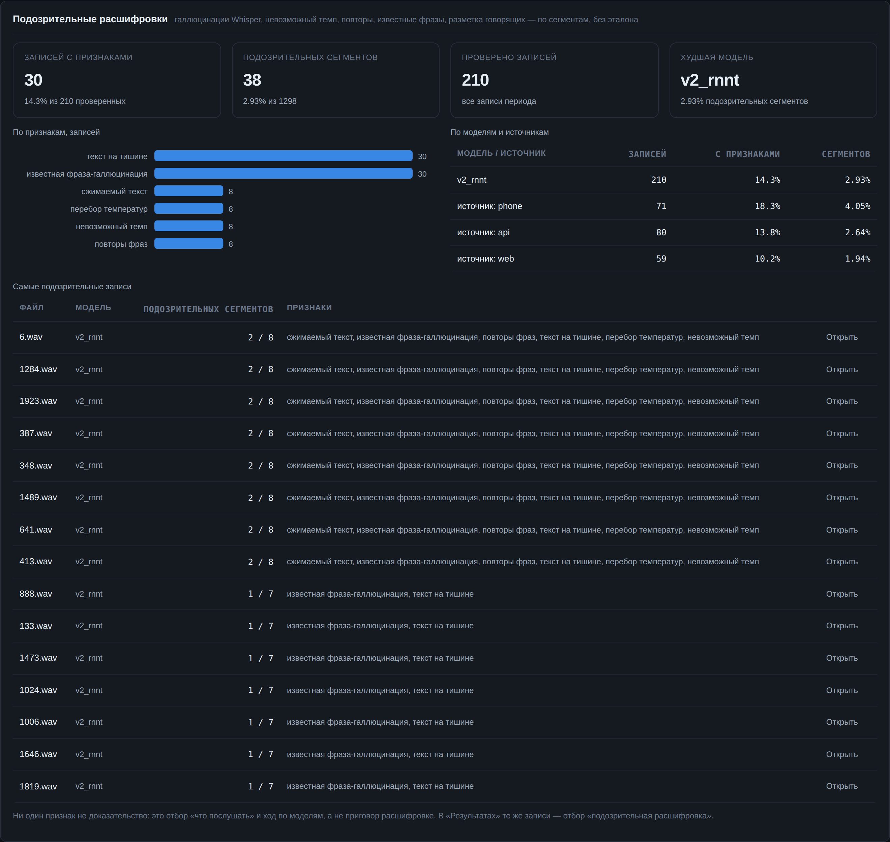
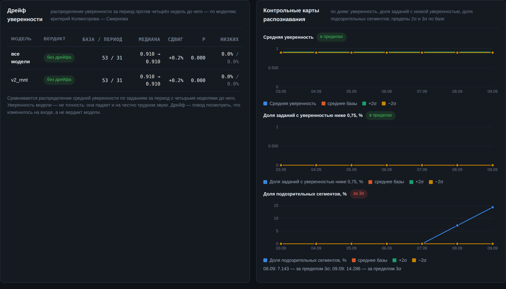
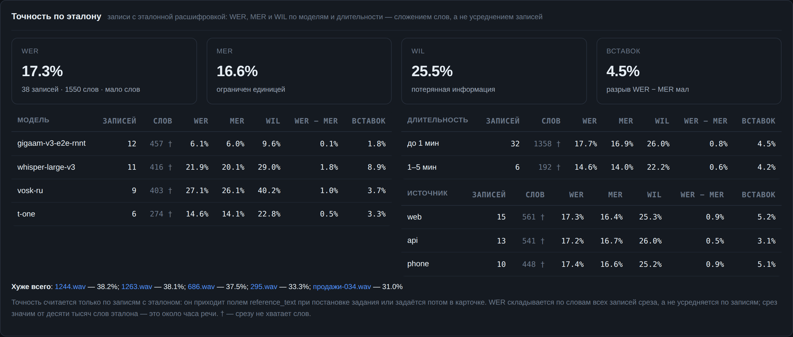
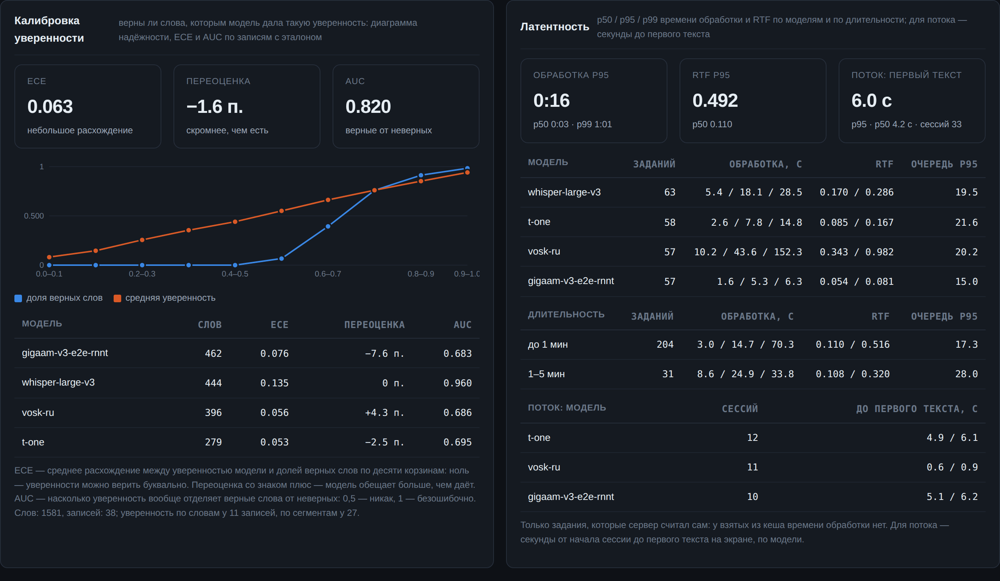
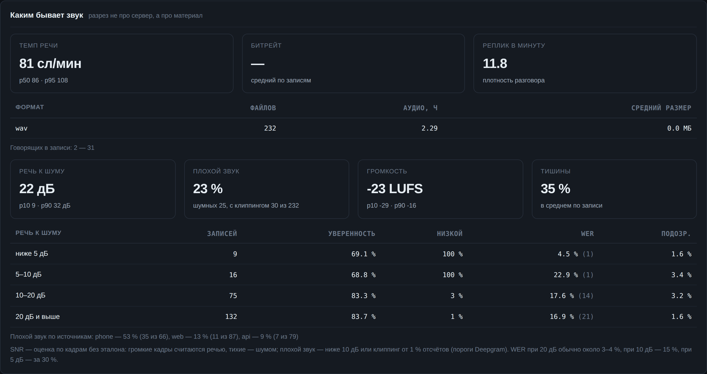

# Аналитика


Раздел отвечает на четыре вопроса: **сколько** система обработала, **как быстро**, **насколько хорошо** и **что ломалось**. Про содержание самих разговоров — тональность, темы, обещания, скрипт — отвечает соседний раздел «Аналитика записей». Все показатели считаются из базы заданий, поэтому доступны за любой период задним числом — включая тот, когда вы ещё не думали, что они понадобятся.

Период выбирается вверху: день, неделя, месяц, всё время. Данные обновляются по WebSocket, без перезагрузки страницы.

## Двенадцать разделов

| Раздел | Ключ в API | Что показывает |
|---|---|---|
| Сводка | `overview` | ключевые показатели за период одним экраном |
| Динамика | `timeseries` | заданий, часов аудио, RTF и ошибок по времени |
| По моделям | `models` | сравнение фактической работы разных моделей |
| По языкам | `languages` | распределение и качество по языкам |
| По владельцам | `owners` | кто сколько занимает сервер |
| По движкам | `engines` | разрез по программной обвязке |
| По источникам | `sources` | браузер, API, консольный клиент, пакетная загрузка |
| Ошибки | `errors` | коды, частота, динамика, самые проблемные модели |
| Длительности | `durations` | гистограмма длины записей |
| Медленные задания | `slowest` | что именно тормозило и на какой стадии |
| Суточный профиль | `profile` | нагрузка по часам и дням недели |
| Эффективность | `efficiency` | во что обходится час аудио |
| Подозрительные расшифровки | `suspicious` | галлюцинации, повторы, разметка говорящих — по сегментам, без эталона |

Каждый доступен отдельно: `GET /api/analytics/<раздел>?period=week`. Разделы, добавленные позже (`weekly`, `cache`, `reliability`, `audio`, `resources`, `quality`, `tags`, `queue`, `drift`, `control`, `accuracy`, `calibration`, `latency`), устроены так же.

## Показатели скорости

**RTF (real-time factor)** — отношение времени обработки к длительности записи. RTF 0,1 значит, что часовая запись обрабатывается за шесть минут. Меньше — лучше.

**RTFx** — обратная величина, «во сколько раз быстрее реального времени». RTFx 10 равен RTF 0,1. Производители моделей предпочитают её: цифра больше и звучит внушительнее.

⚠️ RTFx из карточки модели и ваш измеренный RTF, как правило, не совпадают, и это нормально. Заявленные значения получены при пакетной обработке на топовой видеокарте, без учёта загрузки модели, подготовки звука и постобработки. Сравнивайте модели между собой на **своём** сервере, а не с числом из карточки.

Кроме среднего, считаются перцентили: **p50** (медиана), **p90**, **p95**, **p99**. Разрыв между медианой и p95 говорит больше, чем среднее: если p50 = 0,12, а p95 = 0,9, значит одна запись из двадцати обрабатывается в семь раз медленнее обычного — стоит посмотреть, что это за записи, в разделе «Медленные задания».

**Время ожидания в очереди** отделено от времени обработки. Растущее ожидание при неизменном RTF означает, что мощности не хватает — а не что модель стала медленнее.

## Разбивка по стадиям

Каждое задание записывает время отдельно для подготовки звука, загрузки модели, детектора речи, распознавания, диаризации и постобработки. Это позволяет понять, что именно тормозит:

- **Большая доля загрузки модели** (`model_load_share` в разделе «Эффективность») — модель выгружается из памяти между заданиями. Увеличьте `model_cache_size` или `model_idle_unload_s`; на потоке из мелких файлов это даёт кратное ускорение.
- **Большая доля подготовки звука** — исходники в тяжёлых форматах или включено шумоподавление, которое вам не нужно.
- **Большая доля диаризации** — она дороже, чем кажется; если говорящие не нужны, выключите.

## Показатели качества

**Уверенность модели** (`avg_confidence`) — средняя оценка, которую модель даёт собственному результату. Внутренняя мера, полезная для сортировки: сегменты с низкой уверенностью стоит вычитать в первую очередь. Абсолютное значение между разными моделями не сравнивается — у каждой своя шкала.

**WER и CER** считаются, только если вы дали эталонный текст:

```bash
curl -X POST http://сервер:8080/api/jobs/job_ab12/reference \
  -H "X-API-Key: ключ" -H "Content-Type: application/json" \
  -d '{"text": "правильная расшифровка целиком"}'
```

Сервер посчитает WER (доля неверных слов) и CER (доля неверных символов) и разложит ошибки по типам: **замены**, **пропуски**, **вставки**. Разложение важнее итоговой цифры:

| Что видно | Что это значит | Что делать |
|---|---|---|
| Много вставок | модель выдумывает текст в тишине | включить VAD, поднять `no_speech_threshold` |
| Много пропусков | тихие участки не распознаются | нормализация громкости, снизить `vad_threshold` |
| Много замен | терминология, имена, аббревиатуры | словарь замен, `initial_prompt`, другая модель |

Нормализация перед сравнением настраивается: регистр, знаки препинания, буква «ё», числа. Расшифровка «25 %» против эталонного «двадцать пять процентов» — это вопрос нормализации, а не качества распознавания.

> **Рекомендация.** Соберите десять типичных для вас записей с выверенным вручную эталоном и прогоняйте на них каждую модель-кандидата. Час работы один раз — и все дальнейшие споры о выборе модели решаются цифрой, а не мнением. Чужие бенчмарки на ваших записях не воспроизводятся.

### Подозрительные расшифровки



Распознавание ошибается не только словом. Whisper на тишине, музыке и шуме дописывает то, чего в звуке нет: «Субтитры сделал DimaTorzok», «Продолжение следует», одну и ту же фразу десять раз подряд. По измерениям (Careless Whisper, FAccT 2024) целые выдуманные фразы есть примерно в одной расшифровке из ста — а средняя уверенность по заданию при этом остаётся приличной, и ни одна проверка выше этого не видела.

Признаки считаются по каждому сегменту сразу после распознавания и без эталона:

| Признак | Как считается | Откуда порог |
|---|---|---|
| сжимаемый текст | `compression_ratio` сегмента выше 2,4 | значение Whisper по умолчанию; всё выше он и сам считает сбоем, но последний результат перебора принимает даже с 14 |
| текст на тишине | `no_speech_prob` выше 0,6 при уверенности ниже e⁻¹ ≈ 0,37 | правило Whisper: `no_speech_prob > 0.6` и `avg_logprob < −1.0` |
| перебор температур | сегмент пересчитан при температуре выше нуля | Whisper перебирает температуры, когда первый результат не прошёл пороги |
| невозможный темп | больше 30 символов или 7 слов в секунду | темп — самый сильный одиночный безэталонный детектор из измеренных (AUC 68 %) |
| повторы фраз | одна тройка слов от трёх раз в сегменте, или сегмент дословно повторяет два предыдущих | классический вид галлюцинации |
| известная фраза | словарь из субтитров, на которых учили модель, по-русски и по-английски | «Субтитры сделал DimaTorzok», «Продолжение следует», «Thank you for watching» |
| осколки разметки | треть реплик короче секунды | говорящих разделили не по голосу, а как попало |
| говорящих не столько | число говорящих не совпало с настройкой `quality_expected_speakers` | для звонков ожидается двое; ноль — не проверять |

Ни один признак — не доказательство: это отбор «что послушать» и ход по моделям. Карточка задания с признаками начинается с предупреждения и примеров — каждый с временем, щелчок ведёт к этому месту записи. В «Результатах» те же записи — отборы «подозрительная расшифровка», «похоже на галлюцинацию», «говорящих не столько, сколько ожидалось». Записи, сделанные до появления признаков, доразмечает фоновый разбор архива; пересчёт одной записи пересчитывает и их.

Для мониторинга — `asrhub_suspect_segments_share` и `asrhub_suspect_jobs_share` по моделям, за сутки, с порогами; правила выдаёт сам сервер. Скачок у одной модели после обновления — повод открыть отбор и послушать три-четыре записи; рост у всех сразу — изменился вход: тишина, музыка, шум.

### Дрейф уверенности и контрольные карты



Средняя уверенность за месяц — число, которое ничего не сообщает, а средняя по всем моделям может не сдвинуться, когда одна модель стала хуже, а другую стали реже использовать. Карточка **«Дрейф уверенности»** сравнивает *распределение* средней уверенности по заданиям за период с четырьмя неделями до него — по каждой модели и по всем вместе — двухвыборочным критерием Колмогорова — Смирнова: половина записей стала лучше, половина хуже — среднее то же, а критерий это видит. Пороги — по Deepgram: сдвиг среднего в плохую сторону на 10 % и p < 0,05 вместе — критично, что-то одно — предупреждение; сдвиг вверх вердикта не даёт. Вердикт выносится, когда в обеих выборках от тридцати заданий, — иначе «мало данных», а не ложная тревога. В таблице — медианы, относительный сдвиг, p и доля заданий с уверенностью ниже 0,75 за период и в базе. Граница периода у дрейфа и контрольных карт та же, что у остальных разделов отчёта, а база отсчитывается от неё назад; у периода «всё время» границы нет, а значит, нет и «до» — дрейф показывает «мало данных», а карты берут последние тридцать дней.

**«Контрольные карты распознавания»** — уверенность, доля заданий с низкой уверенностью и доля подозрительных сегментов по дням с пределами μ ± 2σ и μ ± 3σ, посчитанными по двадцати восьми дням до периода. Точки за 3σ — критично, за 2σ — предупреждение, семь дней подряд по одну сторону от среднего — сдвиг, который ни один день по отдельности не выдаёт. Дни без заданий серию прерывают.

⚠️ Уверенность модели — не точность: она падает и на честно трудном звуке. Дрейф — повод посмотреть, что изменилось на входе (новый источник записей, другой кодек, другая гарнитура у операторов), а не вердикт модели. Для мониторинга — `asrhub_confidence_drift_level`, `asrhub_confidence_drift_p` и `asrhub_confidence_drift_shift` по моделям; строка в сводке по расписанию появляется только при предупреждении или критичном вердикте.

### Точность по эталону



Всё, что выше, считается без эталона и потому ничего не доказывает. Доказывает только сравнение с расшифровкой, сделанной человеком: она приходит полем `reference_text` при постановке задания или задаётся потом во вкладке **«Эталон»** карточки записи — текст задания там уже подставлен, и поправить его быстрее, чем набирать. По эталону сервер считает три величины, и у каждой свой вопрос.

| Величина | Формула | На какой вопрос отвечает |
|---|---|---|
| **WER** | (замены + пропуски + вставки) / слов эталона | классическая доля ошибок; не ограничена единицей — расшифровка втрое длиннее эталона даёт 200 % |
| **MER** | ошибки / (ошибки + совпадения) | доля ошибок среди пар выравнивания, всегда в пределах 0–1 (Morris, 2004) |
| **WIL** | 1 − (H/N)·(H/M), где H — совпадения, N — слов эталона, M — слов расшифровки | доля потерянной информации: ловит и пропуски, и вставки разом |

Разрыв **WER − MER** — отдельный столбец: он растёт только от вставок, то есть от текста, которого в звуке не было. У модели, которая ошибается словом, WER и MER почти равны; у той, что дописывает, WER уходит вверх, а MER стоит на месте. Столбец «Вставок» — то же самое в долях слов эталона.

Срезы — по модели, по длительности записи (до минуты, 1–5, 5–20, 20–60 минут, дольше часа), по источнику и по языку. Доли складываются по словам всех записей среза, а не усредняются по записям: десятисекундная реплика с одной ошибкой (WER 50 %) не должна весить столько же, сколько часовая встреча. Среднее по записям хранится рядом как справочное — по нему видно, что было бы, если бы считали «как обычно». Срез значим от десяти тысяч слов эталона — это около часа речи (Speechmatics); меньше — число показывается, но помечается знаком †. Ниже таблиц — пять худших записей: по ссылке открывается карточка с подсветкой расхождений.

Учёт по словам нужен и потому, что нормализация решает всё: WER считается после приведения к нижнему регистру, снятия пунктуации и замены «ё» на «е» — иначе он мерил бы разницу в запятых, а не в словах. Метки говорящих в эталоне не нужны: сравнение идёт по сегментам, без префиксов «Говорящий N:». Записи, взятые из кеша, тоже получают точность, если эталон пришёл вместе с ними.

### Калибровка уверенности



Уверенность модели — не точность, но у записей с эталоном можно измерить, *насколько* не точность. Слова раскладываются по десяти корзинам уверенности, и в каждой доля верных слов сравнивается со средней уверенностью — это **диаграмма надёжности**: линия «доля верных» ниже линии «уверенность» означает, что модель обещает больше, чем даёт. **ECE** (expected calibration error) — взвешенное по числу слов расхождение между ними: ноль — уверенности можно верить буквально, 0,2 — модель врёт на двадцать пунктов. **Переоценка** — та же разница одним числом со знаком: плюс — модель переоценивает себя. **AUC** — насколько уверенность вообще отделяет верные слова от неверных: 0,5 — никак, 1 — безошибочно; считается по корзинам.

Верно ли слово, решает выравнивание с эталоном; уверенность берётся по слову, если движок её отдал (семейство Whisper), иначе — по сегменту, и в подписи сказано, каких записей сколько. Считается один раз, когда эталон задан, и складывается в запись десятью корзинами; свод по периоду складывает корзины, а не пересчитывает выравнивание по всему архиву.

Зачем это знать: отбор «низкая уверенность» и очередь ручной проверки опираются на порог 0,7. У откалиброванной модели порог значит «примерно три ошибки из десяти слов», у переоценивающей себя — ничего не значит, и его надо сдвигать по диаграмме, а не по интуиции. Метрика `asrhub_calibration_ece` по моделям считается за неделю от пятисот слов эталона.

### Латентность

Среднее время обработки скрывает хвост, а жалуются на хвост: p95 — то, что видит каждый двадцатый. Карточка **«Латентность»** показывает p50 / p95 / p99 времени обработки и RTF по моделям и по длительности записи, ожидание в очереди p95 — и отдельно поток: секунды от открытия потоковой сессии до первого текста на экране, по моделям. Это задержка, какой её чувствует человек: у движка с настоящим потоком (Vosk) — доли секунды, у скользящего окна — не меньше `stream_window_s`. Файловые задания сессии потока не оставляют, поэтому её задержка пишется в таблицу метрик прямо из сессии. Считаются только задания, посчитанные сервером самим: у взятых из кеша времени обработки нет. Для мониторинга — `asrhub_processing_p95_seconds`, `asrhub_rtf_p95_by_model` и `asrhub_stream_first_text_seconds`.

### Звук на входе



Звук на входе объясняет ошибки лучше всего остального: по данным Deepgram, WER около 3,5 % при отношении речи к шуму 20 дБ, 15 % при 10 дБ и 35 % при 5 дБ, а реальный трафик контакт-центров живёт в 2–14 дБ. При подготовке каждой записи сервер теперь измеряет пять величин и кладёт их в задание — без эталона и без модели.

| Величина | Как считается | Что значит |
|---|---|---|
| **Речь к шуму (SNR)** | по кадрам 20 мс: громкие кадры — речь, тихие — шум; с разметкой VAD шум берётся из кадров вне речи | ниже 10 дБ — плохой звук, ниже 5 дБ — ожидайте WER за 30 %; оценка, а не измерение, и ограничена 60 дБ |
| **Пик, dBFS** | самый громкий отсчёт | выше −0,5 дБ почти всегда означает срезанные вершины |
| **Доля клиппинга** | отсчёты, упёршиеся в шкалу | от 0,1 % искажения слышны, от 1 % страдает распознавание |
| **Громкость, LUFS** | ITU-R BS.1770-4: K-взвешивание и двойной гейт, коэффициенты пересчитаны под 16 кГц | та же величина, которую выравнивает `audio_target_lufs`; сверено с pyloudnorm с расхождением до 0,15 LU |
| **Доля тишины** | доля времени вне речи по VAD, без VAD — кадры тише −45 dBFS | много тишины — долгая обработка впустую и почва для галлюцинаций |

Карточка **«Каким бывает звук»** дополнена этим профилем: медиана и хвосты SNR и громкости, доля записей с плохим звуком (SNR ниже 10 дБ или клиппинг от 1 % отсчётов — пороги Deepgram) и главная таблица — корзины SNR против средней уверенности, доли записей с низкой уверенностью, WER по записям с эталоном и доли подозрительных сегментов. По ней видно, где именно в зависимости «шум → ошибки» живут свои записи, а строка «плохой звук по источникам» называет виновника: обычно это одна линия телефонии или одна гарнитура. В карточке записи профиль стоит строкой под ключевыми показателями, с пометками «шумно» и «срезано»; в «Результатах» — отборы «плохой звук», «шумная запись», «клиппинг». Сводка по расписанию сообщает о плохом звуке, когда он есть, а мониторинг ведёт `asrhub_bad_audio_share` и `asrhub_audio_snr_db`.

⚠️ Плохой звук лечится не на сервере. Нормализация громкости поднимает и речь, и шум вместе — SNR от неё не меняется; клиппинг нормализацией не чинится вовсе. Смотрите на источник записи.

## Ошибки

Раздел показывает коды ошибок с частотой и динамикой, распределение по моделям и долю успешных повторов.

Полезная связка: если `out_of_memory` устойчиво встречается, но почти все задания успешно проходят со второй попытки, значит автоматическое уменьшение пакета работает — но лучше сразу снизить `batch_size` и не терять время на повторы.

## Эффективность

Отвечает на вопрос «во что обходится час аудио»:

- `compute_per_audio_hour` — секунд вычислений на час записи (тот же RTF, но накопленный за период).
- `model_load_share` — доля времени, потраченная не на распознавание, а на загрузку весов.
- `cache_hit_rate` — доля заданий, отданных из кеша дедупликации.
- `saved_compute_hours` — сколько машинного времени сэкономил кеш.

## Суточный профиль

Тепловая карта «часы × дни недели». По ней видно окно для обслуживания и момент, когда стоит запускать ночные пакеты. Если пик приходится на 10:00–12:00, а массовые задания идут в это же время — перенесите их и снизьте им приоритет.

## Экспорт и внешний мониторинг

Полный отчёт в JSON:

```bash
curl -H "X-API-Key: ключ" \
  "http://сервер:8080/api/analytics?period=month" > отчёт.json
```

Метрики для Prometheus:

```bash
curl http://сервер:8080/api/metrics
```

```
asrhub_jobs_total{status="queued"} 6
asrhub_jobs_total{status="running"} 2
asrhub_jobs_total{status="completed"} 1284
asrhub_jobs_total{status="failed"} 37
asrhub_audio_seconds_total 68606.9
asrhub_words_total 156196
asrhub_rtf_avg 0.1348
asrhub_rtf_p95 0.3848
asrhub_queue_time_p95 89.9
asrhub_confidence_avg 0.9228
asrhub_success_rate 0.9136
asrhub_model_rtf_avg{model="gigaam-v3-rnnt"} 0.1183
asrhub_cpu_percent 41.2
asrhub_gpu_percent 78.0
asrhub_disk_free_gb 412.7
```

Метрики за сутки (`audio_seconds_total`, `words_total`, перцентили) плюс разрез по моделям и последний замер загрузки железа. Точка `/api/metrics` доступна без ключа — её обычно закрывают на уровне прокси, а не приложения.

Пример правил оповещения:

```yaml
groups:
  - name: asrhub
    rules:
      - alert: ОчередьРастёт
        expr: asrhub_jobs_total{status="queued"} > 50
        for: 15m
      - alert: МалоМестаНаДиске
        expr: asrhub_disk_free_gb < 20
        for: 5m
      - alert: МногоОшибок
        expr: rate(asrhub_jobs_total{status="failed"}[30m]) > 0.1
        for: 10m
```

## Выгрузка в таблицу

Кнопки **«Выгрузить в Excel»** и **«CSV»** отдают тот же отчёт, что на экране, за выбранный период. Отчёт можно было только смотреть, и чтобы отдать месячные числа руководителю или в бухгалтерию, их переписывали руками — причём с округлённых значений на экране, а не с тех, что посчитал сервер.

- **Excel (`.xlsx`)** — по листу на разрез: сводка, модели, языки, владельцы, движки, метки, самые медленные, память по моделям и по загрузке, устройства, форматы записей, ожидание в очереди, ошибки, повторы файлов, поток заданий, ход качества. Заголовки подписаны по-русски, шапка закреплена, ширина столбцов подобрана по содержимому.
- **CSV** — архив с файлом на каждый разрез. Разделитель — точка с запятой, кодировка UTF-8 с меткой порядка байтов: так Excel с русскими настройками открывает файл двойным щелчком и раскладывает по столбцам. «Правильный» CSV с запятыми он показывает одной колонкой кракозябр.

Столбец времени в рядах — настоящая дата, а не число секунд, и подписан вместе с часовым поясом сервера («Момент (UTC+03:00)»): Excel про пояса не знает вовсе, а отчёт открывают в другом городе.

Ключу без прав администратора выгрузка считается только по его заданиям — тот же разрез, что и у самого отчёта. Та же выгрузка доступна и программно: `GET /api/analytics/export?period=month&fmt=xlsx`.

Книга собирается пакетом `openpyxl`. Он входит в базовые зависимости; если его почему-то нет, сервер скажет об этом прямо и предложит CSV, который собирается без единого стороннего пакета.

## Графики

Графики нарисованы собственным кодом на SVG: ни одной внешней библиотеки, ни одного обращения в интернет. Это осознанное решение — сервер распознавания часто стоит в закрытом контуре, где страница с внешним CDN просто не отрисуется.

Палитра проверена программно на различимость при основных типах цветовой слепоты (дейтераномалия, протаномалия, тританомалия) отдельно для светлой и тёмной темы. Идентичность серии никогда не передаётся одним цветом: есть легенда, а у четырёх и менее серий — ещё и прямые подписи. Каждый график дублируется таблицей.

Ось всегда одна: двух шкал Y на одном графике в интерфейсе нет нигде. Две величины разного масштаба — это два графика.
