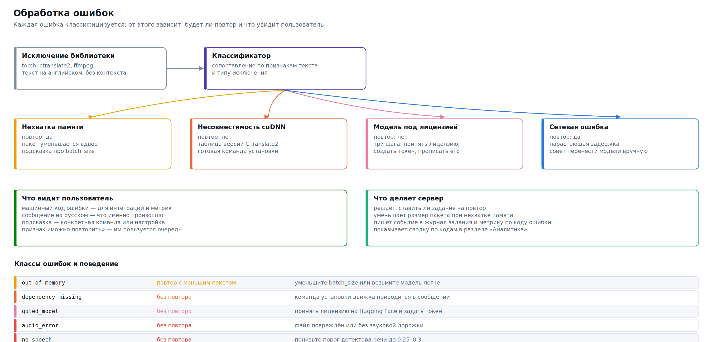

# Устранение неполадок



Первое действие при любой неполадке:

```bash
bash scripts/doctor.sh          # 40+ проверок
bash scripts/doctor.sh --fix    # попытаться исправить найденное
```

Диагностика проверяет версию Python, ffmpeg, драйверы видеокарты, совместимость CUDA и cuDNN с установленным CTranslate2, свободное место, занятость порта, права на каталоги, доступность репозиториев и работоспособность каждого движка. У каждой непройденной проверки — конкретная команда для исправления.

## Установка

### «Python 3.9 или новее не найден»

```bash
python3 --version
# Ubuntu/Debian
sudo apt install python3.12 python3.12-venv
bash scripts/install.sh --python /usr/bin/python3.12
# macOS
brew install python@3.12
```

### «Не удалось создать виртуальное окружение»

На Debian и Ubuntu модуль `venv` вынесен в отдельный пакет:

```bash
sudo apt install python3-venv
```

### Установка PyTorch падает или тянет не ту сборку

Скрипт выбирает индекс по найденному ускорителю. Если определение ошиблось, укажите явно:

```bash
ASRHUB_ACCEL=cpu bash scripts/install.sh --profile cpu
ASRHUB_ACCEL=cuda bash scripts/install.sh --profile standard
```

Проверить, что получилось:

```bash
venv/bin/python -c "import torch; print(torch.__version__, torch.cuda.is_available())"
```

### Карта есть, а сервер считает процессором

Первым делом посмотрите, что видит установщик:

```bash
bash scripts/doctor.sh --only hardware
```

Он различает случаи, которые легко спутать.

**«Видеокарта не обнаружена».** Карты нет и на шине PCI. На физической машине это чаще всего означает, что карта не села в слот или не подключено дополнительное питание; в виртуальной — что она не проброшена.

**«… — драйвер не работает».** Карта на шине есть, драйвера нет. Поставить:

```bash
bash scripts/install.sh --gpu-driver auto --skip-models --no-service
```

**«Модуль драйвера: установлен, но не загружен».** Обычная картина после обновления ядра: DKMS не пересобрал модуль. Проверить и починить:

```bash
sudo dkms status
sudo dkms autoinstall
sudo reboot
```

**«Модуль драйвера: загружен, но не отвечает».** Версии модуля и пользовательских библиотек разошлись — так бывает, когда пакеты обновились, а машину не перезагружали. Помогает перезагрузка.

**«Secure Boot: включён».** Собранный на месте модуль не подписан и не загрузится. Либо отключите Secure Boot в UEFI, либо зарегистрируйте ключ:

```bash
sudo apt-get install -y dkms mokutil
sudo mokutil --import /var/lib/shim-signed/mok/MOK.der
sudo reboot          # при загрузке подтвердите ключ в MOK Manager
```

**Только встроенная графика.** Для расчётов она не годится ни у AMD, ни у Intel: своей памяти нет, а движки на ней работают медленнее процессора. Это не поломка — так и должно быть.

**Драйвер работает, а `torch.cuda.is_available()` даёт False.** Значит, установлен процессорный PyTorch. Так получалось, когда драйвер ставился в том же запуске: до перезагрузки карта не отвечала. Переустановить колёса под карту:

```bash
venv/bin/pip install --force-reinstall \
  --index-url https://download.pytorch.org/whl/cu124 torch torchaudio
```

**Radeon: `rocminfo` видит карту, а PyTorch — нет.** Потребительские Radeon ROCm считает неподдерживаемыми, хотя они работают. Установщик прописывает подсказку в `env.sh`; если запускаете вручную, задайте её сами:

```bash
export HSA_OVERRIDE_GFX_VERSION=11.0.0    # RDNA3; для RDNA2 — 10.3.0
```

**Radeon: отказ в доступе к `/dev/kfd`.** Пользователь службы не в группах `render` и `video`:

```bash
sudo usermod -a -G render,video "$USER"   # нужен повторный вход
```

### Не хватает места на диске

```bash
bash scripts/models.sh disk
df -h
```

Полный профиль занимает свыше 60 ГБ. Если места мало, ставьте `--profile standard` или `--profile russian` и догружайте модели по необходимости. Каталог моделей можно вынести на другой раздел: `ASRHUB_MODELS_DIR=/srv/models`.

## Запуск

### Установщик пишет «Ускоритель cpu», хотя видеокарта есть

Так было до исправления. Отчёт об окружении спрашивал только `nvidia-smi`, а на свежей машине его нет — драйвер ещё не установлен. Про карту на шине PCI отчёт не знал, хотя весь `scripts/lib/gpu.sh` написан ровно для того, чтобы находить её без драйвера. Заодно и профиль подбирался как для машины без видеокарты: с RTX 4090 предлагался `light` — faster-whisper small.

Теперь отчёт выглядит так:

```
  Ускоритель       cpu
  Видеокарта       AD102 [GeForce RTX 4090]
                   найдена на шине, драйвер не установлен
```

Проверить самому, что видит установщик:

```bash
bash scripts/doctor.sh              # раздел «Оборудование»
lspci | grep -Ei 'vga|3d|display'   # что на шине на самом деле
```

Если `lspci` карту показывает, а установщик нет — пришлите вывод `ls /sys/bus/pci/devices/*/class`: значит, дерево устройств выглядит непривычно (так бывает в WSL и в некоторых контейнерах, где шины PCI просто нет).

### `ensurepip is not available` — не создаётся виртуальное окружение

```
The virtual environment was not created successfully because ensurepip is not
available.  On Debian/Ubuntu systems, you need to install the python3-venv package
```

В Debian и Ubuntu стандартная библиотека Python разрезана на пакеты: модуль `venv` есть всегда, а `ensurepip` — только вместе с `pythonX.Y-venv`. Поэтому `python3 -m venv` доходит до самого конца и падает, уже создав каталоги.

Установщик теперь проверяет именно `ensurepip` и ставит пакет **под тот интерпретатор, которым будет собирать сервер**:

```bash
sudo apt install python3.14-venv     # имя с версией, а не метапакет
```

Это важно: метапакет `python3-venv` тянет `ensurepip` для интерпретатора, который считается в системе основным. Если сервер ставится на `python3.14` из стороннего репозитория, метапакет не поможет — установка упадёт второй раз тем же способом.

Если нужной версии в репозитории нет, проще указать другой интерпретатор:

```bash
sudo bash scripts/install.sh --python /usr/bin/python3.12
```

### Порт занят

```bash
# Linux/macOS
ss -tlnp | grep 8080     # или: lsof -i :8080
# Windows
Get-NetTCPConnection -LocalPort 8080
```

Либо освободите порт, либо запустите на другом: `--port 9000`.

### Сервер запускается и сразу останавливается

```bash
bash scripts/service.sh logs -n 100
```

Частые причины: нет прав на каталог данных, порт занят, повреждён `config.yaml`. Проверить конфигурацию:

```bash
venv/bin/python -c "import sys; sys.path.insert(0,'server')
from asrhub.config import Settings; Settings(config_file='config.yaml')
print('конфигурация читается')"
```

### Интерфейс открывается, но пустой

Откройте консоль браузера (F12). Если там ошибки загрузки статики — проверьте, что каталог `server/asrhub/web/` скопировался целиком. Если интерфейс работает, но данные не появляются, посмотрите вкладку «Сеть»: скорее всего, запросы к `/api/` возвращают 401 (не задан ключ доступа).

### Раздел «Диктовка» не даёт нажать кнопку

Так и задумано, если браузер не отдаёт микрофон. Он отдаёт его только по **https** или на **localhost** — на сам раздел под надписью выводится причина.

| Что видно | Что делать |
|---|---|
| «Браузер отдаёт микрофон только по https или на localhost» | Открыть `http://localhost:8080` на самом сервере либо поставить впереди прокси с сертификатом (`docker/nginx.conf`) |
| «Браузер не поддерживает запись через MediaRecorder» | Chrome, Firefox, Edge или Safari 14.1 и новее |
| Кнопка активна, но запись сразу обрывается с кодом 4403 | Ключ доступа только на чтение — диктовка это работа, а не чтение |
| То же с кодом 4404 | `stream_enabled: false`. Включить: `asrctl config set stream_enabled true` |

Проверить со стороны сервера, не открывая браузер:

```bash
bash scripts/doctor.sh --network        # раздел «Возможности»
python3 examples/stream_microphone.py --file запись.wav
```

Второй способ не касается браузера вовсе: если он выводит текст, то поток работает, и дело в микрофоне или в адресе.

### Полоса уровня не шевелится, а текст не появляется

Микрофон выбран не тот или выключен. Полоса под кнопкой показывает настоящий звук — это и есть быстрый ответ на вопрос «сервер молчит или ему нечего слушать». Выбор устройства — в настройках самого браузера, значок замка слева от адреса.

### Гипотезы приходят всё реже по ходу длинной диктовки

Так было до исправления: скользящее окно распознавало всё сказанное с начала, и цена росла как квадрат длины разговора. Теперь хвост закрепляется и освобождается, поэтому цена одного окна от длины разговора не зависит.

Если отставание всё-таки заметно, причин две: слишком маленький `stream_window_s` (каждое окно — полноценный проход модели) или модель тяжелее, чем позволяет машина. Увеличьте окно до 5–8 секунд либо возьмите модель с настоящим потоком — Vosk уточняет гипотезу после каждого куска и не считает звук дважды.

### «Экземпляр перестал отвечать — задание возвращено в очередь»

Запись в журнале задания означает, что сервер, который его считал, замолчал дольше пяти минут: убит по нехватке памяти, остановлен вместе с машиной или потерял сеть до общего хранилища. Задание возвращается в очередь и считается заново другим экземпляром.

Если это повторяется на одном и том же файле, задание снимается с ошибкой `instance_lost` — значит, дело в самом файле, а не в сервере. Смотрите память: чаще всего так выглядит `out_of_memory`, который успевает убить процесс раньше, чем тот запишет ошибку.

```bash
curl -s -H "X-API-Key: $КЛЮЧ" http://сервер:8080/api/queue | python3 -m json.tool | head -20
dmesg | grep -i 'killed process'
```

## Распознавание

### `out_of_memory` — не хватает памяти

Порядок действий, от простого к сложному:

```yaml
batch_size: 4              # было 16
compute_type: int8_float16 # было float16
model: gigaam-v3-ctc       # вместо large-моделей
max_concurrent_jobs: 1
```

Сервер и сам уменьшит пакет вдвое при повторе, но лучше не полагаться на это в потоке.

Посмотреть, что реально занимает память:

```bash
nvidia-smi
curl -H "X-API-Key: ключ" http://127.0.0.1:8080/api/system | jq .gpu
```

⚠️ Память может занимать не ASR Hub. Оставшийся от прошлого запуска процесс Python держит видеопамять до своего завершения; `nvidia-smi` покажет, кто именно.

### `dependency_missing` с упоминанием cuDNN

Самая частая ошибка на CUDA. Причина — рассогласование версий CUDA, cuDNN и CTranslate2. Таблица совместимости:

| CUDA | cuDNN | CTranslate2 |
|---|---|---|
| 12.x | 9.x | `ctranslate2>=4.5` |
| 12.x | 8.x | `ctranslate2==4.4.0` |
| 11.x | 8.x | `ctranslate2==3.24.0` |

Быстрое решение:

```bash
venv/bin/pip install nvidia-cublas-cu12 "nvidia-cudnn-cu12==9.*"
export LD_LIBRARY_PATH="$(venv/bin/python -c 'import nvidia.cudnn, os; print(os.path.dirname(nvidia.cudnn.__file__))')/lib:${LD_LIBRARY_PATH}"
```

Эта же таблица встроена в подсказку к ошибке — её видно и в интерфейсе, и в ответе API.

### `dependency_missing` для движка

```bash
bash scripts/models.sh engines              # что установлено и чего не хватает
bash scripts/models.sh install-engine nemo
```

### `model_not_downloaded`

```bash
bash scripts/models.sh download gigaam-v3-rnnt
# или
curl -X POST -H "X-API-Key: ключ" \
  http://127.0.0.1:8080/api/models/gigaam-v3-rnnt/download
```

### `gated_model` — доступ к весам ограничен

Часть моделей требует принятия условий на странице правообладателя (обычно на Hugging Face). Примите условия, получите токен и укажите его:

```bash
export HF_TOKEN=hf_ваш_токен
```

Диаризация pyannote — самый частый случай: без принятых условий она не загрузится.

### `binary_missing` — не найден ffmpeg

```bash
sudo apt install ffmpeg      # Debian/Ubuntu
brew install ffmpeg          # macOS
winget install Gyan.FFmpeg   # Windows
```

Без ffmpeg сервер принимает только WAV: конвертировать нечем.

### `no_speech` — речь не найдена

Проверьте, что в файле вообще есть звук:

```bash
ffprobe -hide_banner запись.mp4
```

Если звук есть, но тихий, — VAD мог не найти речь. Ослабьте порог и включите нормализацию:

```yaml
vad_threshold: 0.20
audio_normalize: true
```

Либо выключите VAD совсем для конкретного задания и посмотрите, что распознается.

## Качество

### Модель выдумывает текст (галлюцинации)

Характерно для семейства Whisper: на тишине и шуме модель дописывает фразы, которых не было, — часто фрагменты титров вроде «Продолжение следует» или «Субтитры сделал…».

```yaml
vad_enabled: true              # главная мера: тишина не доходит до модели
vad_threshold: 0.5
no_speech_threshold: 0.7       # было 0.6
condition_on_previous_text: false   # разрывает цепочку самоповторов
compression_ratio_threshold: 2.2
hallucination_filter: true     # отсекает известные шаблоны
```

> **Рекомендация.** `condition_on_previous_text: false` — недооценённая настройка. С включённым Whisper подаёт себе на вход собственный предыдущий вывод, и одна ошибка тянет за собой цепочку; выключение обрывает такие зацикливания ценой небольшой потери связности.

Радикальное решение: возьмите GigaAM или Parakeet — архитектурно они галлюцинациям не подвержены.

### Плохое качество на русском

1. Проверьте, что язык задан явно: `language: ru`. Автоопределение на коротких и шумных записях ошибается.
2. Возьмите модель для русского: `gigaam-v3-rnnt` или `gigaam-v3-e2e-rnnt` вместо Whisper.
3. Включите нормализацию громкости и фильтр низких частот: `audio_normalize: true`, `audio_highpass_hz: 80`.
4. Для терминов и имён — словарь замен и `initial_prompt` (для Whisper).
5. Измерьте: дайте эталонный текст и посмотрите разбор ошибок по типам.

### Слова слипаются, нет знаков препинания

Модели CTC и RNNT выдают «сырой» поток слов. Варианты:

```yaml
model: gigaam-v3-e2e-rnnt    # пунктуация встроена
# или
punctuation_enabled: true    # отдельная модель восстановления
itn_enabled: true            # «двадцать пять процентов» → «25 %»
```

### Неправильно определяются говорящие

```yaml
diarization_backend: pyannote
diarization_min_speakers: 2
diarization_max_speakers: 4   # укажите точно, если знаете
```

Если запись стереофоническая и собеседники разведены по каналам (типично для колл-центра), не гадайте — разделяйте по каналам: `diarization_backend: channels`. Это точнее любой нейросетевой диаризации и практически бесплатно.

## Производительность

### Всё работает очень медленно

Первым делом убедитесь, что задействован ускоритель:

```bash
curl -H "X-API-Key: ключ" http://127.0.0.1:8080/api/system | jq '.device, .gpu'
```

Ориентировочные RTF для часовой записи на `gigaam-v3-rnnt`:

| Устройство | RTF | Час аудио за |
|---|---|---|
| RTX 4090 | 0,04 | ~2,5 минуты |
| RTX 3060 | 0,12 | ~7 минут |
| Apple M2 Pro (MPS) | 0,25 | ~15 минут |
| CPU, 8 ядер | 1,2 | ~72 минуты |

Если ваши цифры на порядок хуже — считается на процессоре, хотя не должно.

### Задания долго ждут в очереди

```bash
curl -H "X-API-Key: ключ" http://127.0.0.1:8080/api/analytics/overview?period=day \
  | jq '.performance.queue_time_s'
```

Растущее ожидание при нормальном RTF означает нехватку мощности. Меры: `scheduling_policy: shortest_first`, снизить приоритет массовым заданиям, добавить воркер (если позволяет память), взять модель полегче.

### Загрузка модели занимает больше времени, чем распознавание

```yaml
model_cache_size: 3
model_idle_unload_s: 3600
```

Проверить эффект: `GET /api/analytics/efficiency` → `model_load_share`.

## Сеть и доступ

### 401 при каждом запросе

Ключ не передан или недействителен. Проверьте заголовок:

```bash
curl -v -H "X-API-Key: ah_ваш_ключ" http://сервер:8080/api/queue
```

### 413 при загрузке большого файла

Два разных предела. Приложение: `max_upload_mb`. Прокси: `client_max_body_size` в nginx — умолчание 1 МБ, и о нём забывают чаще всего.

### Прогресс не обновляется, данные приходят с задержкой

WebSocket не проходит через прокси. Добавьте в конфигурацию nginx:

```nginx
proxy_http_version 1.1;
proxy_set_header Upgrade    $http_upgrade;
proxy_set_header Connection "upgrade";
```

Интерфейс при этом работает: он переходит на опрос раз в три секунды. Индикатор внизу боковой панели показывает реальное состояние соединения.

### Обрыв на длинных заданиях

```nginx
proxy_read_timeout 3600s;
proxy_send_timeout 3600s;
```

### Модели не скачиваются

```bash
bash scripts/doctor.sh --network
```

Если сервер без доступа в интернет — загрузите модели на машине с доступом и перенесите каталог:

```bash
# на машине с интернетом
ASRHUB_MODELS_DIR=./модели bash scripts/models.sh download gigaam-v3-rnnt
rsync -av ./модели/ сервер:/var/lib/asrhub/models/
```

## Данные

### `storage_error` — нет места

```bash
df -h
curl -X POST -H "X-API-Key: ключ" http://127.0.0.1:8080/api/maintenance/cleanup
bash scripts/models.sh disk
```

Предохранитель `disk_min_free_gb` останавливает приём новых заданий заранее — это не поломка, а защита от повреждения базы.

### База заблокирована

Признак того, что каталог данных лежит на сетевой файловой системе: SQLite и NFS плохо совместимы. Перенесите базу на локальный диск; результаты можно оставить на сети.

### Результаты пропали

Проверьте `result_retention_days` — по умолчанию 30 дней, после чего задания удаляются очисткой. Значение 0 отключает удаление.

## Как сообщить о проблеме

Соберите сведения:

```bash
bash scripts/doctor.sh > диагностика.txt 2>&1
curl -s -H "X-API-Key: ключ" http://127.0.0.1:8080/api/system > система.json
bash scripts/service.sh logs -n 500 > журнал.txt
curl -s -H "X-API-Key: ключ" \
  "http://127.0.0.1:8080/api/jobs/ПРОБЛЕМНОЕ_ЗАДАНИЕ" > задание.json
```

⚠️ Перед отправкой посмотрите, что в файлах: карточка задания содержит распознанный текст, а журнал — имена файлов.
