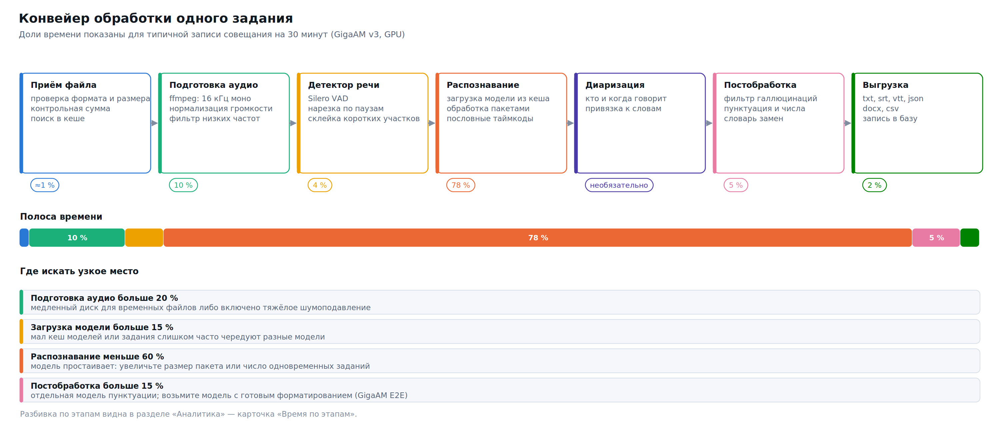

# Архитектура

## Общее устройство

Четыре слоя, каждый со своей задачей:

**Клиенты** — браузер, консольный `asrctl`, любая программа по HTTP. Все ходят через один и тот же интерфейс: веб-приложение не пользуется никакими привилегированными путями, поэтому всё, что можно сделать мышью, можно сделать и из скрипта.

**Слой API** — FastAPI: маршруты, аутентификация по ключам, ограничение частоты, WebSocket для событий. Здесь же превращение исключений в типизированные ошибки с подсказками.

**Ядро** — очередь заданий, реестр движков с кешем моделей, конвейер обработки, аналитика. Работает независимо от HTTP: тот же код можно вызвать из скрипта.

**Хранилище** — SQLite для заданий, метрик и событий; файловая система для загрузок, результатов и весов моделей.

## Конвейер обработки

Задание проходит семь стадий, и время каждой записывается отдельно:

1. **Подготовка звука** — распознавание формата, извлечение дорожки из видео, приведение к 16 кГц моно, нормализация громкости, фильтры. Всё делается ffmpeg; без него принимаются только готовые WAV.
2. **Детектор речи (VAD)** — разметка на речь и тишину, нарезка на фрагменты допустимой длины. Отсюда берётся основное ускорение и главная защита от галлюцинаций.
3. **Распознавание** — движок получает фрагменты и возвращает сегменты с текстом, таймкодами и уверенностью.
4. **Диаризация** — кто говорит в каждый момент. Может выполняться до, после или вместо распознавания в зависимости от выбранного механизма.
5. **Постобработка** — фильтр галлюцинаций, удаление слов-паразитов, пунктуация, нормализация чисел и дат, словарь замен, склейка коротких сегментов, разбиение на абзацы.
6. **Метрики** — RTF, уверенность, число слов и сегментов; при наличии эталона — WER, CER и разбор ошибок.
7. **Выгрузка** — девять форматов из одного внутреннего представления.

Каждая стадия деградирует по отдельности. Нет ffmpeg — работают только WAV, остальное отказывает с внятным сообщением. Нет silero — VAD переключается на встроенный энергетический. Нет python-docx — выгрузка в Word заменяется Markdown. Система не превращается в «всё или ничего»: недостающая часть отключает свою функцию, а не сервер.

## Реестр движков

Семнадцать движков подключены через один интерфейс: `load()`, `transcribe()`, `unload()`, `is_available()`. Различия библиотек — разные имена параметров, разные форматы результата, разные способы падать — спрятаны в адаптерах.

Ключевое свойство: **движки изолированы**. Импорт тяжёлых библиотек происходит внутри метода загрузки, а не на старте сервера. Отсутствие NeMo не мешает работать GigaAM; сломанная установка одного движка не роняет остальные. Раздел «Сервер» показывает по каждому движку, доступен ли он и почему нет.

Модели кешируются с вытеснением по давности использования и выгружаются после простоя. Компромисс здесь прямой: держать модель загруженной — тратить память, выгружать — тратить по 5–40 секунд на каждую повторную загрузку.

## Очередь

Очередь построена на пуле потоков и базе как источнике истины. Задание существует в SQLite; поток лишь исполняет его. Отсюда свойства:

- **Переживает перезапуск.** Задания в состоянии `running` при старте возвращаются в очередь.
- **Наблюдаема.** Состояние очереди — обычный SQL-запрос, а не содержимое памяти процесса.
- **Не теряет историю.** Завершённые задания остаются с метриками и лентой событий.

Четыре политики планирования, автоматические повторы с экспоненциальной задержкой, уменьшение пакета при нехватке памяти, дедупликация по содержимому — подробно в [06. Очередь](06-queue.md).

## Обработка ошибок

Исключение из любой библиотеки проходит через `classify_exception()`, который распознаёт его по типу и тексту и превращает в типизированную ошибку ASR Hub. У каждой есть код, HTTP-статус, признак «имеет ли смысл повторять» и подсказка.

Подсказка — не украшение. «Недостаточно памяти» без продолжения бесполезно; «уменьшите batch_size или выберите модель полегче, задание будет повторено автоматически с меньшим пакетом» говорит, что делать. Для рассогласования CUDA и cuDNN подсказка содержит таблицу совместимости версий — потому что это самая частая и самая непрозрачная ошибка при установке.

Признак `retryable` управляет поведением очереди: восстановимые ошибки повторяются, невосстановимые — нет. Повторять «в файле нет звуковой дорожки» бессмысленно.

## Каталог как единственный источник истины

Модели, параметры и пресеты описаны один раз, в `server/asrhub/catalog/`. Оттуда их берут:

- сервер — для проверки значений и выбора умолчаний;
- веб-интерфейс — через `GET /api/params`, вместе с описаниями и примерами;
- эта документация — разделы [03](03-models.md), [04](04-parameters.md) и [13](13-presets.md) генерируются скриптом `docs/generate.py`.

Поэтому документация не расходится с кодом: добавленный параметр появляется и в интерфейсе, и в справочнике вместе со своим описанием, рекомендацией и примерами. Тест проверяет, что у каждого параметра есть описание и хотя бы один пример.

## Хранилище

SQLite в режиме WAL, соединение на поток. Схема версионируется и мигрирует при обновлении.

| Таблица | Что хранит |
|---|---|
| `jobs` | задания: параметры, статус, времена по стадиям, метрики, текст |
| `segments` | сегменты с таймкодами, говорящими и уверенностью |
| `events` | лента событий по заданиям и серверу |
| `metrics` | точечные измерения для аналитики |
| `model_stats` | накопленная статистика по моделям |
| `system_samples` | замеры загрузки процессора, памяти, видеокарты, диска |
| `api_keys` | ключи доступа с ролями и лимитами |
| `benchmarks` | результаты сравнительных прогонов |
| `kv` | служебные значения |

Почему SQLite, а не PostgreSQL: нагрузка на базу здесь ничтожна по сравнению с распознаванием (десятки записей в минуту против минут вычислений на задание), а отсутствие отдельной службы кратно упрощает установку и резервное копирование. ⚠️ Единственное реальное ограничение — сетевые файловые системы: SQLite и NFS несовместимы, каталог данных должен быть на локальном диске.

## Веб-интерфейс

Ванильный JavaScript без сборки, без зависимостей, без обращений в интернет. Графики нарисованы собственным кодом на SVG.

Это осознанное решение, а не экономия. Сервер распознавания часто стоит в закрытом контуре, где страница с внешним CDN просто не отрисуется, а перед обновлением никто не хочет запускать сборку. Файлы можно править прямо на сервере и увидеть результат по F5.

Обмен данными — тот же API, что доступен снаружи. Событий ждём по WebSocket, при его недоступности переходим на опрос.

## Развёртывание

Три сценария: нативная установка на выделенной машине, контейнер, локальная установка на рабочей станции. Отличаются способом изоляции, но не устройством системы.

## Границы применимости

Честно о том, чего система не делает:

- **Один сервер.** Кластеризации нет. Несколько экземпляров ставятся, но координации между ними нет: общая очередь на несколько машин потребует внешнего балансировщика и общего хранилища.
- **SQLite.** При тысячах заданий в минуту она станет узким местом. При реальной нагрузке распознавания (задания идут минутами) это далеко за горизонтом.
- **Потоковый режим ограничен** моделями, которые его поддерживают, — их 11 из 72.
- **Диаризация несовершенна.** Наложенная речь, короткие реплики и похожие голоса — известная слабость всех современных механизмов, не только использованных здесь.
