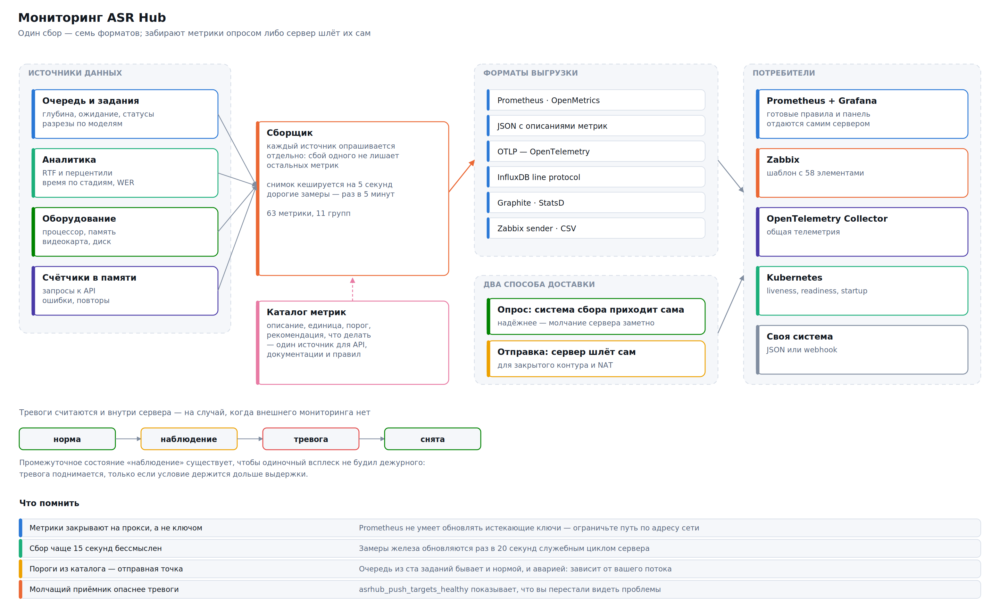
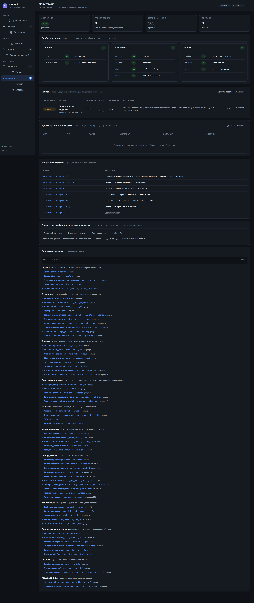
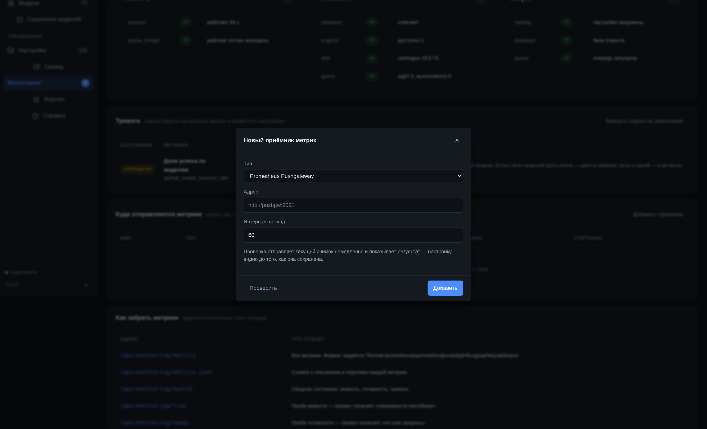

# Мониторинг



Сервис отдаёт наружу **63 метрики** в 11 группах: 45 мгновенных значений, 13 счётчиков и 3 гистограммы. У 27 метрик заданы пороги тревоги, у каждой есть описание и рекомендация.

Раздел собран из каталога метрик сервера, поэтому описание не может разойтись с тем, что сервис отдаёт на самом деле. Тот же каталог доступен программно: `GET /api/monitoring/catalog`.

Подробный справочник по каждому маршруту — с параметрами, схемами ответов и настоящими примерами — вынесен отдельно: «Программный интерфейс мониторинга».

## С чего начать

Три шага, после которых мониторинг работает:

```bash
# 1. Убедиться, что метрики отдаются
curl http://сервер:8080/api/monitoring/metrics | head -20

# 2. Забрать готовый блок для prometheus.yml
curl http://сервер:8080/api/monitoring/config/prometheus-scrape >> prometheus.yml

# 3. Забрать готовые правила оповещения и панель Grafana
curl http://сервер:8080/api/monitoring/config/prometheus -o asrhub-rules.yml
curl http://сервер:8080/api/monitoring/config/grafana -o asrhub-dashboard.json
```

> **Рекомендация.** Начните с пяти метрик и не пытайтесь следить за всеми сразу. `asrhub_up`, `asrhub_queue_depth`, `asrhub_disk_free_gb`, `asrhub_rtf` и доля неудачных заданий закрывают почти все аварии, которые случаются на практике. Остальное пригодится, когда будете разбираться в причинах.

## Точки доступа

| Адрес | Что отдаёт | Ключ |
|---|---|---|
| `GET /api/monitoring/metrics` | Все метрики. Формат — параметр `format` | не нужен* |
| `GET /api/monitoring/metrics.json` | Снимок с описанием, рекомендацией и порогом каждой метрики | не нужен* |
| `GET /api/monitoring/health` | Сводное состояние: живость, готовность, запуск, тревоги | не нужен |
| `GET /api/monitoring/live` | Проба живости для оркестратора | не нужен |
| `GET /api/monitoring/ready` | Проба готовности для балансировщика | не нужен |
| `GET /api/monitoring/startup` | Проба завершения запуска | не нужен |
| `GET /api/monitoring/catalog` | Справочник метрик целиком | нужен |
| `GET /api/monitoring/catalog/{имя}` | Описание одной метрики | нужен |
| `GET /api/monitoring/alerts` | Состояние тревог | нужен |
| `GET /api/monitoring/alerts/history` | История срабатываний | нужен |
| `GET`/`PUT /api/monitoring/alerts/rules` | Правила оповещения | нужен |
| `GET`/`PUT /api/monitoring/targets` | Приёмники метрик | нужен |
| `POST /api/monitoring/targets/test` | Проверить приёмник немедленно | нужен |
| `GET /api/monitoring/config/prometheus` | Готовые правила оповещения | не нужен* |
| `GET /api/monitoring/config/grafana` | Готовая панель | не нужен* |
| `GET /api/monitoring/config/zabbix` | Готовый шаблон | не нужен* |
| `GET /api/monitoring/info` | Состояние самой подсистемы мониторинга | нужен |

\* Пока включена настройка `monitoring_public` (по умолчанию включена). Так сделано намеренно: Prometheus не умеет обновлять истекающие ключи, и правильное место для ограничения доступа — прокси, а не приложение.

## Форматы выгрузки

Один и тот же снимок отдаётся в семи форматах — параметром `format`.

| Значение | Формат | Для чего |
|---|---|---|
| `prometheus` | текстовый формат Prometheus | умолчание; понимают почти все системы |
| `openmetrics` | OpenMetrics 1.0 | строгий стандарт, требуется некоторым сборщикам |
| `json` | JSON с описаниями | своя система; получатель видит и число, и его смысл |
| `otlp` | OTLP/HTTP | OpenTelemetry Collector |
| `influx` | InfluxDB line protocol | InfluxDB, Telegraf, VictoriaMetrics |
| `graphite` | Graphite plaintext | Graphite, StatsD, Carbon |
| `zabbix` | JSON для zabbix_sender | Zabbix |
| `csv` | плоская таблица | разовая выгрузка в таблицу |

```bash
curl 'http://сервер:8080/api/monitoring/metrics?format=influx'
curl 'http://сервер:8080/api/monitoring/metrics?format=zabbix&host=asr-01'
```

## Раздел «Мониторинг» в интерфейсе



Всё, что описано ниже, видно и настраивается из браузера: состояние проб, тревоги
с их порогами, приёмники метрик, ссылки на выгрузку и справочник по каждой метрике.

Верхняя строка отвечает на вопрос «всё ли в порядке» одним взглядом: состояние,
число тревог, сколько метрик в снимке, сколько было опросов.

### Пробы состояния

Три пробы отвечают на три разных вопроса, и путать их дорого.

| Проба | Вопрос | Что делает оркестратор при провале |
|---|---|---|
| `live` | процесс жив? | перезапускает контейнер |
| `ready` | можно ли слать запросы? | снимает нагрузку, контейнер оставляет |
| `startup` | запуск закончился? | ждёт, не считая две другие пробы |

⚠️ Частая и дорогая ошибка — повесить на `live` проверку базы или очереди. Тогда
короткая недоступность диска приводит к бесконечному циклу перезапусков, а при
каждом перезапуске заново загружаются веса моделей. Проверка внешних зависимостей
— это `ready`, и только она.

Проба `ready` намеренно не считает поставленную на паузу очередь отказом: пауза —
осознанное действие оператора, и снимать сервер с нагрузки во время обслуживания
не нужно. Она отмечается предупреждением.

### Справочник метрик прямо в интерфейсе


Каждая метрика разворачивается в карточку: описание, обычное значение,
рекомендация, порог с выдержкой и что делать при срабатывании. Тот же текст
возвращает `GET /api/monitoring/catalog` — если вы строите свою панель, подсказки
не придётся писать заново.

## Настройка Prometheus

Сервер отдаёт готовый блок для `prometheus.yml`:

```bash
curl http://сервер:8080/api/monitoring/config/prometheus-scrape
```

```yaml
scrape_configs:
  - job_name: asrhub
    metrics_path: /api/monitoring/metrics
    scrape_interval: 30s
    scrape_timeout: 10s
    static_configs:
      - targets: ['asr.company.ru:8080']
```

> **Рекомендация.** Интервал сбора чаще 15 секунд смысла не имеет: замеры процессора,
> памяти и видеокарты обновляются раз в 20 секунд служебным циклом сервера, и более
> частый опрос вернёт те же самые числа, потратив ресурсы на запросы к базе. 30 секунд
> — разумное умолчание.

Если `monitoring_public` выключен, добавьте ключ:

```yaml
    authorization:
      type: Bearer
      credentials: ah_ваш_ключ
```

### Правила оповещения

Готовый файл правил собирается из порогов каталога:

```bash
curl http://сервер:8080/api/monitoring/config/prometheus -o /etc/prometheus/asrhub-rules.yml
promtool check rules /etc/prometheus/asrhub-rules.yml
curl -X POST http://prometheus:9090/-/reload
```

Внутри — правила вида:

```yaml
- alert: ASRHubDiskFreeGbCritical
  expr: asrhub_disk_free_gb < 5
  for: 300s
  labels: { severity: critical }
  annotations:
    summary: 'Свободно на диске: ниже 5 ГБ'
    description: 'POST /api/maintenance/cleanup, затем bash scripts/models.sh disk'
```

Часть правил считается не прямым сравнением, а выражением — иначе они были бы
бессмысленны:

```promql
# доля неудачных заданий, а не их число: ночной прогон архива
# иначе поднимет тревогу на ровном месте
sum(rate(asrhub_jobs_total{status="failed"}[30m]))
  / clamp_min(sum(rate(asrhub_jobs_total[30m])), 0.001) > 0.2

# видеопамять в процентах от общего объёма, а не в мегабайтах
asrhub_gpu_memory_mb / clamp_min(asrhub_gpu_memory_total_mb, 1) * 100 > 90

# недоступность ловится через absent(): если сервис лежит,
# метрики нет вообще, и сравнивать её значение не с чем
absent(asrhub_up) == 1
```

⚠️ Пороги в готовом файле — отправная точка, а не истина. Очередь из ста заданий
бывает и нормой, и аварией: это зависит от вашего потока. Прогоните файл неделю,
посмотрите, какие правила срабатывают впустую, и поднимите их пороги. Правило,
которое дежурный привык игнорировать, хуже отсутствующего.

## Панель Grafana

```bash
curl http://сервер:8080/api/monitoring/config/grafana -o asrhub-dashboard.json
```

Импортируется как есть: Dashboards → Import → Upload JSON. Панель собирается по
группам каталога метрик, поэтому не расходится с тем, что сервер отдаёт.

Что стоит вынести на первый экран собственной панели:

| Панель | Запрос |
|---|---|
| Состояние | `asrhub_up` |
| Очередь и её возраст | `asrhub_queue_depth`, `asrhub_queue_oldest_seconds` |
| Скорость | `asrhub_rtf{quantile="p95"}` |
| Доля отказов | `sum(rate(asrhub_jobs_total{status="failed"}[30m])) / clamp_min(sum(rate(asrhub_jobs_total[30m])), 0.001)` |
| Место на диске | `asrhub_disk_free_gb` |
| Видеопамять, % | `asrhub_gpu_memory_mb / asrhub_gpu_memory_total_mb * 100` |
| Часы аудио в час | `rate(asrhub_audio_seconds_total[1h]) * 3.6` |

## Zabbix

```bash
curl http://сервер:8080/api/monitoring/config/zabbix -o asrhub-template.yaml
```

Импорт: Настройка → Шаблоны → Импорт. Элементы создаются типом «Zabbix trapper»,
данные отправляет сам сервер:

```yaml
monitoring_targets:
  - kind: webhook
    url: http://zabbix-proxy:10051/
    interval_s: 60
```

Либо забирайте HTTP-агентом с `/api/monitoring/metrics?format=zabbix&host=asr-01`.

## OpenTelemetry

```yaml
monitoring_targets:
  - kind: otlp
    url: http://otel-collector:4318
    interval_s: 30
```

Метрики уходят в общий сборщик телеметрии в формате OTLP/HTTP и дальше — куда
настроен коллектор. Пакет `opentelemetry` на сервере не нужен: тело запроса
собирается вручную, лишняя зависимость на сервере распознавания ни к чему.

## Kubernetes

```yaml
livenessProbe:
  httpGet: { path: /api/monitoring/live, port: 8080 }
  periodSeconds: 20
  failureThreshold: 3

readinessProbe:
  httpGet: { path: /api/monitoring/ready, port: 8080 }
  periodSeconds: 10
  failureThreshold: 2

# Загрузка весов модели занимает десятки секунд, а на холодном кеше — минуты.
# Без startupProbe контейнер будет убит до того, как успеет запуститься.
startupProbe:
  httpGet: { path: /api/monitoring/startup, port: 8080 }
  periodSeconds: 10
  failureThreshold: 60
```

Для сбора метрик оператором Prometheus:

```yaml
apiVersion: monitoring.coreos.com/v1
kind: ServiceMonitor
metadata:
  name: asrhub
spec:
  selector:
    matchLabels: { app: asrhub }
  endpoints:
    - port: http
      path: /api/monitoring/metrics
      interval: 30s
```

## Отправка метрик наружу

Забирать метрики опросом надёжнее: система сбора сразу видит, что сервер замолчал.
Отправка нужна там, где до сервера не достучаться — закрытый контур, NAT, машина
без постоянного адреса.



```yaml
monitoring_push_enabled: true
monitoring_targets:
  - kind: prometheus_pushgateway
    url: http://pushgw:9091
    interval_s: 60
  - kind: influxdb
    url: http://influx:8086
    database: asrhub
    interval_s: 30
```

Проверить настройку можно до сохранения — кнопкой «Проверить» в интерфейсе или
запросом:

```bash
curl -X POST http://сервер:8080/api/monitoring/targets/test \
  -H "X-API-Key: ключ" -H "Content-Type: application/json" \
  -d '{"kind": "influxdb", "url": "http://influx:8086", "database": "asrhub"}'
```

```json
{"ok": true, "sent_metrics": 118}
```

⚠️ Настроив отправку, заведите оповещение на `asrhub_push_targets_healthy`.
Молчащий приёмник означает не отсутствие проблем, а то, что вы перестали их видеть,
— и это опаснее любой тревоги.

## Справочник метрик

Для каждой метрики указано, что она означает, какое значение считать обычным, при каком пороге поднимать тревогу и что делать, когда она сработала. Пороги — отправная точка: их придётся подогнать под свой поток.

### Сводка по группам

| Группа | Метрик | С порогами | О чём |
|---|---|---|---|
| **Служба** | 5 | 3 | Жив ли сервис, сколько работает, какая версия и настройки. |
| **Очередь** | 10 | 4 | Сколько заданий ждёт, сколько выполняется, как долго ждут. |
| **Задания** | 8 | 1 | Сколько заданий прошло, чем закончились, в каких разрезах. |
| **Производительность** | 5 | 2 | Скорость обработки: RTF, время по стадиям, пропускная способность. |
| **Качество** | 4 | 4 | Уверенность модели, WER и CER, доля записей без речи. |
| **Модели и движки** | 5 | 2 | Что загружено в память, сколько занимает, что доступно. |
| **Оборудование** | 10 | 4 | Процессор, память, видеокарта, диск. |
| **Хранилище** | 5 | 3 | База заданий, загрузки, результаты, веса моделей. |
| **Программный интерфейс** | 6 | 2 | Запросы, задержки, отказы, соединения WebSocket. |
| **Ошибки** | 3 | 0 | Коды ошибок, повторы, доля восстановимых. |
| **Уведомления** | 2 | 2 | Доставка результатов на внешние адреса. |

### Служба

Жив ли сервис, сколько работает, какая версия и настройки.

#### Сервис отвечает

**Метрика:** `asrhub_up` · **Тип:** мгновенное значение

Единица, если сервис отвечает на запрос метрик. Нуля здесь не бывает: если сервис лежит, ответа не будет вовсе — и это как раз нужный признак.

**Обычное значение:** 1

> **Рекомендация.** Основа любого оповещения о недоступности. Правило пишется через absent(): absent(asrhub_up) == 1 за пять минут означает, что сервис не отвечает. Проверять сам факт равенства единице бессмысленно.

**Порог:** предупреждение — ниже 1; критично — ниже 1; выдержка 300 с.

⚠️ Отслеживается через absent(), а не сравнением значения

**Что делать при срабатывании:** scripts/service.sh status, затем scripts/service.sh logs -n 200

#### Версия сборки

**Метрика:** `asrhub_build_info` · **Тип:** справочная · **Метки:** `version`, `schema_version`, `python`, `catalog_date`, `platform`

Постоянная метрика со значением 1 и метками: версия сервиса, версия схемы базы, версия Python, дата каталога моделей. Так принято передавать в Prometheus то, что не является числом.

> **Рекомендация.** Пригодится, чтобы после обновления убедиться, что все экземпляры действительно перешли на новую версию: count by (version) (asrhub_build_info).

#### Время работы с последнего запуска

**Метрика:** `asrhub_uptime_seconds` · **Тип:** мгновенное значение · **Единица:** с

Сколько секунд прошло с момента запуска процесса.

**Обычное значение:** растёт непрерывно

> **Рекомендация.** Само по себе неинтересно; ценность в производной. Регулярное обнуление означает, что служба перезапускается — смотрите changes(asrhub_uptime_seconds[1h]) и журнал на предмет нехватки памяти.

**Порог:** предупреждение — ниже 600.

⚠️ Значение меньше десяти минут после того, как было больше, означает недавний перезапуск

**Что делать при срабатывании:** Частые перезапуски — почти всегда OOM-killer. dmesg | grep -i oom

#### Очередь на паузе

**Метрика:** `asrhub_queue_paused` · **Тип:** мгновенное значение

Единица, если приём заданий в работу приостановлен вручную.

**Обычное значение:** 0

> **Рекомендация.** Оповещение стоит сделать обязательно: очередь, забытая на паузе после обслуживания, выглядит как «сервис работает, но ничего не делает» — и это самая обидная из простых аварий.

**Порог:** предупреждение — выше 1; выдержка 1800 с.

⚠️ Полчаса на паузе — уже подозрительно

**Что делать при срабатывании:** POST /api/queue/resume

#### Изменений настроек

**Метрика:** `asrhub_config_reloads_total` · **Тип:** счётчик

Сколько раз настройки менялись через программный интерфейс.

> **Рекомендация.** Всплеск изменений в момент, когда никто ничего не настраивал, — повод посмотреть, кто ходит в API с ключом администратора.

Счётчик обнуляется при перезапуске сервиса — это нормально: функция `rate()` в Prometheus обрабатывает обнуление правильно.

### Очередь

Сколько заданий ждёт, сколько выполняется, как долго ждут.

#### Заданий ждёт

**Метрика:** `asrhub_queue_depth` · **Тип:** мгновенное значение

Сколько заданий стоит в очереди и ждёт свободного воркера. Считаются состояния «в очереди» и «ожидает повтора».

**Обычное значение:** колеблется около нуля в рабочем режиме

> **Рекомендация.** Главный показатель того, справляется ли сервер. Смотреть надо не на значение, а на тенденцию: очередь из ста заданий, которая тает, — это нормальный ночной прогон; очередь из двадцати, которая растёт третий час, — это нехватка мощности.

**Порог:** предупреждение — выше 50; критично — выше 200; выдержка 900 с.

⚠️ Пороги подбирайте под свой поток: значимо не число, а рост

**Что делать при срабатывании:** Поднять max_concurrent_jobs (если хватает памяти), перевести массовые задания на низкий приоритет, включить scheduling_policy: shortest_first, взять модель полегче

#### Заданий по состояниям

**Метрика:** `asrhub_jobs_by_status` · **Тип:** мгновенное значение · **Метки:** `status`

Число заданий в каждом состоянии: queued, running, paused, retry, completed, failed, cancelled.

> **Рекомендация.** Растущее число в состоянии retry говорит, что задания падают на восстановимых ошибках и повторяются по кругу — чаще всего это нехватка памяти на видеокарте. Разбирайтесь по коду ошибки, а не по числу повторов.

#### Выполняется сейчас

**Метрика:** `asrhub_active_jobs` · **Тип:** мгновенное значение

Сколько заданий обрабатывается прямо сейчас.

> **Рекомендация.** Сравнивайте с asrhub_workers. Устойчивое равенство при непустой очереди означает, что сервер загружен полностью и очередь ограничена мощностью, а не расписанием.

#### Воркеров

**Метрика:** `asrhub_workers` · **Тип:** мгновенное значение

Сколько заданий сервер готов обрабатывать одновременно.

> **Рекомендация.** Меняется на ходу через POST /api/queue/concurrency. Если значение изменилось само — значит, кто-то правил настройки.

#### Возраст самого старого задания

**Метрика:** `asrhub_queue_oldest_seconds` · **Тип:** мгновенное значение · **Единица:** с

Сколько секунд самое давнее ожидающее задание провело в очереди. Ноль, если очередь пуста.

> **Рекомендация.** Честнее глубины очереди: показывает не «сколько», а «как долго ждут». Именно эту величину чувствует человек, отправивший файл. Порог ставьте от обещанного пользователям времени ответа.

**Порог:** предупреждение — выше 1800; критично — выше 7200; выдержка 300 с.

**Что делать при срабатывании:** Проверьте политику планирования: при priority_fifo длинная запись может ждать за многочасовым архивом

#### Ожидание в очереди

**Метрика:** `asrhub_queue_wait_seconds` · **Тип:** мгновенное значение · **Единица:** с · **Метки:** `quantile`

Время ожидания завершённых заданий: средние и перцентили p50, p90, p95, p99 за последние сутки.

> **Рекомендация.** Разрыв между p50 и p95 важнее обоих чисел по отдельности. Если медиана секунды, а p95 — часы, значит, часть заданий систематически проигрывает борьбу за воркер; посмотрите на приоритеты и политику планирования.

**Порог:** предупреждение — выше 900; критично — выше 3600; выдержка 900 с.

⚠️ Порог применяйте к квантили 0.95

#### Аудио в ожидании

**Метрика:** `asrhub_queue_pending_audio_seconds` · **Тип:** мгновенное значение · **Единица:** с

Суммарная длительность записей, стоящих в очереди. Не путать с числом заданий: десять пятиминутных планёрок и одна восьмичасовая конференция дают одинаковую глубину очереди и совершенно разную нагрузку.

> **Рекомендация.** Планировать мощность надо по этой величине, а не по глубине очереди. Она же честно отвечает на вопрос «когда всё разгребётся».

#### Оценка времени разбора очереди

**Метрика:** `asrhub_queue_eta_seconds` · **Тип:** мгновенное значение · **Единица:** с

Сколько примерно осталось до опустошения очереди. Считается из ожидающего аудио, среднего RTF по моделям и числа воркеров.

> **Рекомендация.** Оценка грубая: она не знает, какой моделью пойдут задания и не упрётся ли сервер в память. Годится как ориентир для дежурного, а не как обещание пользователю.

**Порог:** предупреждение — выше 7200; критично — выше 28800; выдержка 1800 с.

#### Предел длины очереди

**Метрика:** `asrhub_queue_capacity` · **Тип:** мгновенное значение

Значение max_queue_size: сверх него задания не принимаются.

> **Рекомендация.** Оповещение по отношению asrhub_queue_depth / asrhub_queue_capacity > 0.8 предупредит до того, как клиенты начнут получать отказы.

#### Политика планирования

**Метрика:** `asrhub_scheduling_policy_info` · **Тип:** справочная · **Метки:** `policy`

Действующая политика выбора следующего задания.

> **Рекомендация.** Полезно видеть на панели рядом с очередью: неожиданное изменение политики объясняет странное распределение ожиданий.

### Задания

Сколько заданий прошло, чем закончились, в каких разрезах.

#### Заданий обработано

**Метрика:** `asrhub_jobs_total` · **Тип:** счётчик · **Метки:** `status`

Накопительный счётчик заданий по итоговому состоянию с момента запуска сервиса. В отличие от asrhub_jobs_by_status, значение только растёт — по нему считают частоту через rate().

> **Рекомендация.** Доля отказов: rate(asrhub_jobs_total{status="failed"}[30m]) / rate(asrhub_jobs_total[30m]). Оповещение по доле, а не по числу — иначе ночной прогон архива поднимет тревогу на ровном месте.

**Порог:** предупреждение — выше 0.05; критично — выше 0.2; выдержка 1800 с.

⚠️ Порог для доли отказов, не для самого счётчика

Счётчик обнуляется при перезапуске сервиса — это нормально: функция `rate()` в Prometheus обрабатывает обнуление правильно.

#### Заданий по моделям

**Метрика:** `asrhub_jobs_by_model` · **Тип:** мгновенное значение · **Метки:** `model`, `engine`

Сколько заданий обработано каждой моделью за последние сутки.

> **Рекомендация.** Показывает, какие модели действительно используются. Модель без заданий неделю — кандидат на удаление весов: место освободится сразу.

#### Заданий по источникам

**Метрика:** `asrhub_jobs_by_source` · **Тип:** мгновенное значение · **Метки:** `source`

Разрез по способу отправки: web, api, cli, web-batch.

> **Рекомендация.** Резкий рост доли api при неизменной работе людей — обычно признак того, что интеграция зациклилась на повторах.

#### Обработано аудио

**Метрика:** `asrhub_audio_seconds_total` · **Тип:** счётчик · **Единица:** с

Суммарная длительность успешно распознанных записей.

> **Рекомендация.** Основная единица нагрузки: заданий может быть мало, а часов аудио много. Планируйте мощность по rate(asrhub_audio_seconds_total[1h]), а не по числу заданий.

Счётчик обнуляется при перезапуске сервиса — это нормально: функция `rate()` в Prometheus обрабатывает обнуление правильно.

#### Распознано слов

**Метрика:** `asrhub_words_total` · **Тип:** счётчик

Сколько слов выдал распознаватель суммарно.

> **Рекомендация.** Резкое падение слов на час аудио при неизменном потоке — признак того, что модель перестала справляться со звуком.

Счётчик обнуляется при перезапуске сервиса — это нормально: функция `rate()` в Prometheus обрабатывает обнуление правильно.

#### Отдано из кеша

**Метрика:** `asrhub_cached_jobs_total` · **Тип:** счётчик

Сколько заданий вернулись из кеша дедупликации, без повторного распознавания.

> **Рекомендация.** Высокая доля — это хорошо: столько вычислений сэкономлено. Но доля выше половины при работе людей означает, что клиент шлёт одно и то же и не забирает результат.

Счётчик обнуляется при перезапуске сервиса — это нормально: функция `rate()` в Prometheus обрабатывает обнуление правильно.

#### Длительность обработки

**Метрика:** `asrhub_job_duration_seconds` · **Тип:** гистограмма · **Единица:** с

Гистограмма времени обработки одного задания.

> **Рекомендация.** По гистограмме считается любая квантиль на стороне Prometheus, и она переживает перезапуск сервиса, в отличие от посчитанных перцентилей.

#### Длительность записей

**Метрика:** `asrhub_media_duration_seconds` · **Тип:** гистограмма · **Единица:** с

Гистограмма длительности входных файлов.

> **Рекомендация.** Полезна при подборе scheduling_policy: если распределение двугорбое — много коротких и немного очень длинных, — shortest_first резко снизит среднее ожидание.

### Производительность

Скорость обработки: RTF, время по стадиям, пропускная способность.

#### Коэффициент реального времени

**Метрика:** `asrhub_rtf` · **Тип:** мгновенное значение · **Метки:** `quantile`

Отношение времени обработки к длительности записи. RTF 0,1 значит, что часовая запись обрабатывается за шесть минут. Меньше — лучше. Отдаются среднее и перцентили p50, p90, p95, p99.

**Обычное значение:** 0,03–0,15 на видеокарте, 0,8–1,5 на процессоре

> **Рекомендация.** Ключевая метрика скорости. Запомните своё обычное значение сразу после установки: рост RTF при неизменной модели и нагрузке означает, что что-то изменилось в железе — троттлинг видеокарты, вытеснение памяти, сосед по машине.

**Порог:** предупреждение — выше 0.5; критично — выше 1.0; выдержка 1800 с.

⚠️ Порог по квантили 0.95; для процессорной установки поднимите вдвое

**Что делать при срабатывании:** Проверьте, что задействован ускоритель: GET /api/system → device. Задание, случайно посчитанное на процессоре, идёт в 10–30 раз дольше

#### RTF по моделям

**Метрика:** `asrhub_rtf_by_model` · **Тип:** мгновенное значение · **Метки:** `model`

Средний RTF каждой модели за сутки.

> **Рекомендация.** Единственный честный способ сравнить скорость моделей — на своём железе и своих записях. Цифры RTFx из карточек моделей измерены в других условиях и с вашими не совпадут.

#### Время по стадиям

**Метрика:** `asrhub_stage_seconds` · **Тип:** мгновенное значение · **Единица:** с · **Метки:** `stage`

Среднее время каждой стадии конвейера: audio_prep, model_load, vad, inference, diarization, postprocess.

> **Рекомендация.** Разбивка отвечает на вопрос «что именно тормозит». Большая доля model_load означает, что модель выгружается между заданиями — увеличьте model_cache_size. Большая доля diarization — выключите её, если говорящие не нужны.

**Что делать при срабатывании:** GET /api/analytics/efficiency покажет долю загрузки моделей за период

#### Доля времени на загрузку моделей

**Метрика:** `asrhub_model_load_share` · **Тип:** мгновенное значение

Какая часть машинного времени уходит не на распознавание, а на загрузку весов в память.

**Обычное значение:** менее 0,1

> **Рекомендация.** Выше 0,2 — модель выгружается слишком рано. Поднимите model_cache_size и model_idle_unload_s: на потоке коротких файлов это даёт кратное ускорение.

**Порог:** предупреждение — выше 0.2; критично — выше 0.4; выдержка 3600 с.

#### Пропускная способность

**Метрика:** `asrhub_throughput_audio_hours` · **Тип:** мгновенное значение · **Единица:** ч/ч

Сколько часов аудио сервер обрабатывает за час календарного времени.

> **Рекомендация.** Прямо отвечает на вопрос «хватит ли мощности». Если суточный поток — 200 часов записей, а пропускная способность 6 ч/ч, то за сутки сервер осилит 144 часа и очередь будет расти каждый день.

### Качество

Уверенность модели, WER и CER, доля записей без речи.

#### Уверенность модели

**Метрика:** `asrhub_confidence` · **Тип:** мгновенное значение · **Метки:** `quantile`

Оценка, которую модель даёт собственному результату: среднее и перцентили за сутки.

**Обычное значение:** 0,85–0,95 на разборчивой речи

> **Рекомендация.** Абсолютное значение между разными моделями несравнимо — у каждой своя шкала. Следите за изменением у одной модели: падение при неизменных настройках означает, что изменилось качество входного звука.

**Порог:** предупреждение — ниже 0.75; критично — ниже 0.6; выдержка 3600 с.

**Что делать при срабатывании:** Включите audio_normalize и audio_highpass_hz; проверьте, не сменился ли источник записей

#### Доля неуверенных сегментов

**Метрика:** `asrhub_low_confidence_share` · **Тип:** мгновенное значение

Какая часть сегментов имеет уверенность ниже 0,7.

> **Рекомендация.** Практичнее среднего: показывает, сколько текста придётся вычитывать вручную. Рост доли — первый признак, что во входном потоке появились плохие записи.

**Порог:** предупреждение — выше 0.2; критично — выше 0.4; выдержка 3600 с.

#### WER

**Метрика:** `asrhub_wer` · **Тип:** мгновенное значение · **Метки:** `model`

Доля неверно распознанных слов. Считается только для заданий, которым задан эталонный текст.

**Обычное значение:** 0,03–0,08 на чистой русской речи

> **Рекомендация.** Единственная объективная мера качества. Заведите десяток эталонных записей и прогоняйте их по расписанию — так деградация после смены модели или обновления библиотек видна сразу, а не через месяц по жалобам.

**Порог:** предупреждение — выше 0.15; критично — выше 0.3; выдержка 3600 с.

#### Записей без речи

**Метрика:** `asrhub_no_speech_total` · **Тип:** счётчик

Сколько заданий завершилось с признаком «речь не найдена».

> **Рекомендация.** Единичные срабатывания нормальны. Всплеск означает, что источник начал присылать тишину: сломался микрофон, отвалилась дорожка при перекодировании или в файлах видео без звука.

**Порог:** предупреждение — выше 5; критично — выше 20; выдержка 1800 с.

⚠️ Порог для прироста за полчаса

Счётчик обнуляется при перезапуске сервиса — это нормально: функция `rate()` в Prometheus обрабатывает обнуление правильно.

### Модели и движки

Что загружено в память, сколько занимает, что доступно.

#### Моделей в памяти

**Метрика:** `asrhub_models_loaded` · **Тип:** мгновенное значение

Сколько моделей сейчас держится загруженными в реестре движков.

> **Рекомендация.** Сравнивайте с model_cache_size. Постоянное упирание в предел при разнородном потоке означает, что модели вытесняют друг друга, и время уходит на перезагрузку.

#### Загрузок моделей

**Метрика:** `asrhub_model_loads_total` · **Тип:** счётчик · **Метки:** `model`

Сколько раз веса модели загружались в память.

> **Рекомендация.** Число загрузок, близкое к числу заданий, — прямое доказательство, что кеш не работает. Каждая загрузка стоит от 5 до 40 секунд.

Счётчик обнуляется при перезапуске сервиса — это нормально: функция `rate()` в Prometheus обрабатывает обнуление правильно.

#### Доля успеха по моделям

**Метрика:** `asrhub_model_success_rate` · **Тип:** мгновенное значение · **Метки:** `model`

Какая часть заданий этой модели завершилась успешно за сутки.

> **Рекомендация.** Позволяет отличить общую поломку от проблемы одной модели. Если у всех моделей доля упала — дело в сервере; если у одной — в её весах или зависимостях.

**Порог:** предупреждение — ниже 0.9; критично — ниже 0.7; выдержка 3600 с.

#### Движков доступно

**Метрика:** `asrhub_engines_available` · **Тип:** мгновенное значение

Сколько движков распознавания установлено и готово к работе.

> **Рекомендация.** Падение после обновления означает, что обновление сломало зависимости. GET /api/engines покажет по каждому движку причину недоступности.

**Порог:** предупреждение — ниже 1; критично — ниже 1; выдержка 60 с.

⚠️ Ноль доступных движков — сервис не может работать

**Что делать при срабатывании:** bash scripts/models.sh engines

#### Доступность движка

**Метрика:** `asrhub_engine_available` · **Тип:** мгновенное значение · **Метки:** `engine`

Единица, если движок готов к работе; ноль, если нет.

> **Рекомендация.** Заведите оповещение на те движки, которые вам действительно нужны: недоступность остальных ни на что не влияет.

### Оборудование

Процессор, память, видеокарта, диск.

#### Загрузка процессора

**Метрика:** `asrhub_cpu_percent` · **Тип:** мгновенное значение · **Единица:** %

Средняя загрузка процессора машины на момент последнего замера.

> **Рекомендация.** На установке с видеокартой высокая загрузка процессора при низкой загрузке GPU — признак того, что узкое место в подготовке звука, а не в распознавании. Проверьте, не включено ли шумоподавление без надобности.

**Порог:** предупреждение — выше 85; критично — выше 95; выдержка 1800 с.

#### Занято оперативной памяти

**Метрика:** `asrhub_ram_used_mb` · **Тип:** мгновенное значение · **Единица:** МБ

Сколько оперативной памяти занято на машине.

> **Рекомендация.** Следите за отношением к asrhub_ram_total_mb. Приближение к пределу на машине с моделями заканчивается тем, что процесс убивает OOM-killer, и выглядит это как необъяснимый перезапуск службы.

**Порог:** предупреждение — выше 85; критично — выше 95; выдержка 600 с.

⚠️ Порог для процента от общего объёма

**Что делать при срабатывании:** Уменьшите max_concurrent_jobs и model_cache_size

#### Всего оперативной памяти

**Метрика:** `asrhub_ram_total_mb` · **Тип:** мгновенное значение · **Единица:** МБ

Полный объём оперативной памяти машины.

#### Загрузка видеокарты

**Метрика:** `asrhub_gpu_percent` · **Тип:** мгновенное значение · **Единица:** % · **Метки:** `gpu`

Загрузка вычислительных блоков видеокарты.

**Обычное значение:** 80–100 % под нагрузкой

> **Рекомендация.** Устойчивые 95–100 % при непустой очереди — это норма и признак, что железо используется полностью. Тревожно обратное: очередь есть, а загрузка низкая — значит, время уходит не на вычисления.

#### Занято видеопамяти

**Метрика:** `asrhub_gpu_memory_mb` · **Тип:** мгновенное значение · **Единица:** МБ · **Метки:** `gpu`

Сколько видеопамяти занято на устройстве.

> **Рекомендация.** Приближение к asrhub_gpu_memory_total_mb — прямой путь к ошибкам out_of_memory. Порог 90 % даёт время среагировать: снизить batch_size или число воркеров до того, как задания начнут падать.

**Порог:** предупреждение — выше 90; критично — выше 97; выдержка 600 с.

⚠️ Порог для процента от общего объёма видеопамяти

**Что делать при срабатывании:** Уменьшите batch_size, смените compute_type на int8_float16, снизьте max_concurrent_jobs до 1

#### Всего видеопамяти

**Метрика:** `asrhub_gpu_memory_total_mb` · **Тип:** мгновенное значение · **Единица:** МБ · **Метки:** `gpu`

Полный объём памяти видеокарты.

#### Температура видеокарты

**Метрика:** `asrhub_gpu_temperature_celsius` · **Тип:** мгновенное значение · **Единица:** °C · **Метки:** `gpu`

Температура графического процессора.

**Обычное значение:** 60–80 °C под нагрузкой

> **Рекомендация.** Выше 83 °C большинство карт снижает частоты, и RTF растёт без всякой причины со стороны программы. Если видите одновременный рост температуры и RTF — дело в охлаждении, а не в настройках.

**Порог:** предупреждение — выше 83; критично — выше 90; выдержка 600 с.

#### Потребление видеокарты

**Метрика:** `asrhub_gpu_power_watts` · **Тип:** мгновенное значение · **Единица:** Вт · **Метки:** `gpu`

Текущее энергопотребление видеокарты.

> **Рекомендация.** Косвенный признак реальной работы: карта, потребляющая холостой минимум при непустой очереди, ничего не считает.

#### Потоков процесса

**Метрика:** `asrhub_process_threads` · **Тип:** мгновенное значение

Сколько потоков в процессе сервера.

> **Рекомендация.** Непрерывный рост означает утечку потоков; нормальное значение стабильно и близко к числу воркеров плюс десяток служебных.

#### Память процесса

**Метрика:** `asrhub_process_memory_mb` · **Тип:** мгновенное значение · **Единица:** МБ

Сколько оперативной памяти занимает сам процесс сервера.

> **Рекомендация.** В отличие от общей памяти машины показывает именно ASR Hub. Пилообразный рост с падениями при выгрузке моделей — норма; монотонный рост без падений — утечка.

### Хранилище

База заданий, загрузки, результаты, веса моделей.

#### Свободно на диске

**Метрика:** `asrhub_disk_free_gb` · **Тип:** мгновенное значение · **Единица:** ГБ

Свободное место на разделе с каталогом данных.

> **Рекомендация.** Самая недооценённая метрика. Заполненный диск ночью оставляет наполовину записанные результаты и повреждает базу. Порог ставьте выше disk_min_free_gb, чтобы успеть среагировать до того, как сервер начнёт отказывать в приёме.

**Порог:** предупреждение — ниже 20; критично — ниже 5; выдержка 300 с.

**Что делать при срабатывании:** POST /api/maintenance/cleanup, затем bash scripts/models.sh disk

#### Занято на диске

**Метрика:** `asrhub_disk_used_percent` · **Тип:** мгновенное значение · **Единица:** %

Доля занятого места на разделе с каталогом данных.

**Порог:** предупреждение — выше 85; критично — выше 95; выдержка 300 с.

#### Размер каталогов

**Метрика:** `asrhub_storage_bytes` · **Тип:** мгновенное значение · **Единица:** Б · **Метки:** `kind`

Сколько занимают загрузки, результаты, веса моделей и журналы. Замер по каталогам делается не чаще раза в пять минут: обход каталога моделей на десятки гигабайт стоит дорого.

> **Рекомендация.** Растущие uploads означают, что delete_source_after выключен, а исходники накапливаются. Для большинства установок их правильно удалять сразу после обработки.

#### Размер базы

**Метрика:** `asrhub_database_size_mb` · **Тип:** мгновенное значение · **Единица:** МБ

Размер файла базы заданий.

> **Рекомендация.** Растёт линейно с числом заданий. Несколько сотен мегабайт — норма; гигабайты означают, что result_retention_days слишком велик или равен нулю.

**Порог:** предупреждение — выше 2048; критично — выше 8192; выдержка 3600 с.

#### Строк в таблицах

**Метрика:** `asrhub_database_rows` · **Тип:** мгновенное значение · **Метки:** `table`

Число записей в таблицах базы: jobs, segments, events, metrics.

> **Рекомендация.** Таблица segments растёт быстрее прочих: у часовой записи несколько сотен сегментов. Она же первой выигрывает от очистки.

### Программный интерфейс

Запросы, задержки, отказы, соединения WebSocket.

#### Запросов

**Метрика:** `asrhub_http_requests_total` · **Тип:** счётчик · **Метки:** `method`, `route`, `status`

Счётчик запросов с разбивкой по методу, маршруту и коду ответа.

> **Рекомендация.** Маршрут берётся из шаблона (/api/jobs/{job_id}), а не из конкретного адреса — иначе метки размножились бы по числу заданий и уронили Prometheus. Доля пятисотых: rate(...{status=~"5.."}[5m]) / rate(...[5m]).

**Порог:** предупреждение — выше 0.01; критично — выше 0.05; выдержка 600 с.

⚠️ Порог для доли ответов 5xx

Счётчик обнуляется при перезапуске сервиса — это нормально: функция `rate()` в Prometheus обрабатывает обнуление правильно.

#### Время ответа

**Метрика:** `asrhub_http_request_seconds` · **Тип:** гистограмма · **Единица:** с · **Метки:** `method`, `route`

Гистограмма времени обработки запроса.

> **Рекомендация.** Загрузка файла попадает в тот же гистограмм, что и получение списка заданий, поэтому смотрите по маршрутам, а не в целом. Медленный GET /api/jobs означает, что база разрослась и пора чистить.

#### Запросов в обработке

**Метрика:** `asrhub_http_in_flight` · **Тип:** мгновенное значение

Сколько запросов обрабатывается прямо сейчас.

> **Рекомендация.** Устойчиво высокое значение при быстрых ответах означает, что клиенты опрашивают сервер чаще, чем нужно.

#### Отказов аутентификации

**Метрика:** `asrhub_auth_failures_total` · **Тип:** счётчик

Сколько запросов отклонено из-за отсутствующего или неверного ключа.

> **Рекомендация.** Единичные — обычно забытый ключ в интеграции. Поток с одного адреса — перебор ключей; закройте сервис на уровне сети, а не приложения.

**Порог:** предупреждение — выше 50; критично — выше 500; выдержка 600 с.

⚠️ Порог для прироста за десять минут

Счётчик обнуляется при перезапуске сервиса — это нормально: функция `rate()` в Prometheus обрабатывает обнуление правильно.

#### Отказов по частоте

**Метрика:** `asrhub_rate_limited_total` · **Тип:** счётчик

Сколько запросов отклонено ограничителем частоты.

> **Рекомендация.** Постоянные отказы у пакетного клиента означают, что ему нужен отдельный ключ с повышенным rate_limit, а не отключение ограничителя целиком.

Счётчик обнуляется при перезапуске сервиса — это нормально: функция `rate()` в Prometheus обрабатывает обнуление правильно.

#### Клиентов WebSocket

**Метрика:** `asrhub_websocket_clients` · **Тип:** мгновенное значение

Сколько интерфейсов подключено к ленте событий.

> **Рекомендация.** Ноль при открытых вкладках означает, что WebSocket не проходит через прокси; интерфейс при этом работает, но через опрос и с задержкой.

### Ошибки

Коды ошибок, повторы, доля восстановимых.

#### Ошибок по кодам

**Метрика:** `asrhub_errors_total` · **Тип:** счётчик · **Метки:** `code`, `retryable`

Счётчик ошибок заданий по коду с признаком, имеет ли смысл повторять. Коды те же, что в ответах API: out_of_memory, dependency_missing, audio_error и остальные.

> **Рекомендация.** Оповещение по коду полезнее, чем по общему числу: out_of_memory лечится настройками, dependency_missing — установкой пакета, audio_error — разговором с тем, кто присылает файлы. Общая цифра не подсказывает ничего.

**Что делать при срабатывании:** GET /api/analytics/errors?period=day покажет разбивку и динамику

Счётчик обнуляется при перезапуске сервиса — это нормально: функция `rate()` в Prometheus обрабатывает обнуление правильно.

#### Повторов заданий

**Метрика:** `asrhub_retries_total` · **Тип:** счётчик

Сколько раз задания перепланировались на повтор.

> **Рекомендация.** Повторы — штатный механизм, а не авария. Тревожно, когда их доля к числу заданий превышает четверть: значит, сервер работает на пределе памяти и половину времени тратит на вторые попытки.

Счётчик обнуляется при перезапуске сервиса — это нормально: функция `rate()` в Prometheus обрабатывает обнуление правильно.

#### Время последней ошибки

**Метрика:** `asrhub_last_error_timestamp` · **Тип:** мгновенное значение · **Единица:** unixtime

Момент последней ошибки задания в формате unix-времени.

> **Рекомендация.** Удобно для панели: time() - asrhub_last_error_timestamp показывает, сколько сервис работает без ошибок.

### Уведомления

Доставка результатов на внешние адреса.

#### Уведомлений отправлено

**Метрика:** `asrhub_webhooks_total` · **Тип:** счётчик · **Метки:** `result`

Доставка уведомлений о завершении заданий: ok или failed.

> **Рекомендация.** Растущее число неудач означает, что принимающая сторона недоступна. На сами задания это не влияет — они выполнены, — но клиент о результатах не узнает и, скорее всего, пришлёт их повторно.

**Порог:** предупреждение — выше 10; критично — выше 50; выдержка 1800 с.

⚠️ Порог для прироста неудачных доставок за полчаса

Счётчик обнуляется при перезапуске сервиса — это нормально: функция `rate()` в Prometheus обрабатывает обнуление правильно.

#### Приёмников метрик доступно

**Метрика:** `asrhub_push_targets_healthy` · **Тип:** мгновенное значение · **Метки:** `target`

Единица, если последняя отправка метрик во внешнюю систему прошла успешно.

> **Рекомендация.** Мониторинг самого мониторинга. Молчащий приёмник означает, что вы перестали видеть проблемы, а не что их нет.

**Порог:** предупреждение — ниже 1; выдержка 900 с.

## Тревоги внутри сервера

Пороги считаются и на стороне сервиса — на случай, когда внешнего мониторинга нет.
Состояния устроены как у Prometheus:

```
норма → наблюдение → тревога → снята
```

Промежуточное «наблюдение» существует, чтобы одиночный всплеск не будил дежурного:
тревога поднимается, только если условие держится дольше выдержки. Смена состояния
пишется в ленту событий сервера, поэтому историю видно и в разделе «Журнал».

```bash
curl -H "X-API-Key: ключ" http://сервер:8080/api/monitoring/alerts
curl -H "X-API-Key: ключ" http://сервер:8080/api/monitoring/alerts/history
```

Свои пороги:

```bash
curl -X PUT http://сервер:8080/api/monitoring/alerts/rules \
  -H "X-API-Key: ключ" -H "Content-Type: application/json" \
  -d '[{"metric": "asrhub_queue_depth", "direction": "above",
        "threshold": 500, "severity": "warning", "for_seconds": 1800}]'
```

Вернуть пороги каталога: `POST /api/monitoring/alerts/rules/reset`.

> **Рекомендация.** Если Prometheus у вас есть, оповещения держите в нём: там
> история, группировка, подавление и маршрутизация дежурным. Встроенные тревоги —
> для установки без внешнего мониторинга, чтобы кончающийся диск было видно хотя
> бы в интерфейсе.

## Если что-то не работает

**Метрики отдаются, но половины значений нет.** Посмотрите
`GET /api/monitoring/info` — поле `collection_errors` перечисляет источники,
которые не удалось опросить, с причиной. Сбой одного источника не лишает вас
остальных метрик: это сделано намеренно, чтобы неработающий `nvidia-smi` не
оставлял без данных об очереди.

**В Prometheus метрики есть, но все старые.** Проверьте `monitoring_cache_ttl_s`:
если он больше интервала сбора, вы получаете один и тот же снимок несколько раз.
Значение должно быть примерно вдвое меньше интервала.

**Метки маршрутов размножились.** Такого быть не должно: маршрут берётся из шаблона
(`/api/jobs/{job_id}`), а не из конкретного адреса. Если вы видите метки с
идентификаторами заданий — сообщите об этом, это ошибка.

**Хранилище метрик распухает.** Разрезы по моделям ограничены сорока значениями,
но при большом числе моделей и владельцев объём всё равно растёт. Уберите ненужные
разрезы на стороне Prometheus через `metric_relabel_configs`.

**Тревога срабатывает впустую.** Поднимите порог или выдержку — правило, которое
дежурный привык игнорировать, хуже отсутствующего. Пороги каталога рассчитаны на
типичную установку и не знают вашего потока.

**Отправка не доходит.** `GET /api/monitoring/targets` показывает по каждому
приёмнику время последней попытки, время последнего успеха и текст ошибки.
Сбой отправки никогда не влияет на работу сервиса — задания продолжают
обрабатываться.

## Что мониторить в первую очередь

Если заводите оповещения с нуля, начните с этих шести и не добавляйте остальные,
пока эти не отработают неделю без ложных срабатываний.

| Что | Выражение | Почему именно это |
|---|---|---|
| Сервис не отвечает | `absent(asrhub_up) == 1` | Самая частая авария; всё остальное вторично |
| Кончается диск | `asrhub_disk_free_gb < 20` | Заполненный диск повреждает базу и результаты |
| Очередь растёт | `asrhub_queue_depth > 50` за 15 мин | Не хватает мощности; чем раньше видно, тем дешевле |
| Люди ждут | `asrhub_queue_oldest_seconds > 1800` | То, что чувствует пользователь, а не сервер |
| Задания падают | доля `failed` > 5 % за 30 мин | Отличает поломку от единичного плохого файла |
| Нет ни одного движка | `asrhub_engines_available < 1` | Обычно означает, что обновление сломало зависимости |

