# Аналитика записей

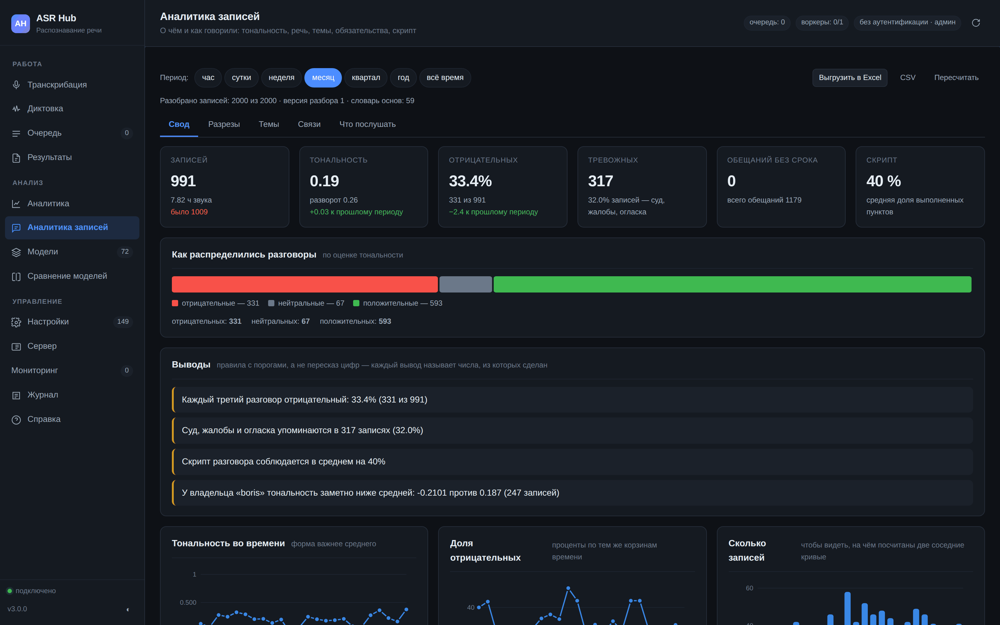

Раздел «Аналитика» отвечает на вопросы о сервере: сколько заданий, с какой скоростью, на каких моделях, что падало. Про сами разговоры он не говорит ничего — а ради них сервер и стоит.

Здесь — про содержание записей: какими были разговоры, чем отличаются друг от друга и что из этого следует. Тональность и её ход по разговору, кто сколько говорил и как быстро, перебивания и паузы, о чём шла речь, какие звучали суммы и сроки, что было обещано, соблюдён ли скрипт.

Всё считается **на месте**: чистые строковые операции по расшифровке, без обращений наружу и без обучаемых моделей. Сервер часто стоит в закрытом контуре, и разбор обязан работать там же, где работает распознавание. Часовой разговор на десять тысяч слов разбирается за десятки миллисекунд — меньше тысячной доли того, что заняло само распознавание.

## Как это устроено

Разбор идёт сразу после распознавания, в том же потоке, и складывается в базу. Считать его заново на каждый показ раздела было бы расточительно, а на архиве в сто тысяч записей — просто невозможно.

```
запись → распознавание → разбор содержания → база
                                              ↓
                     свод колонками (два десятка чисел) → разрезы по корпусу
                     подробности одним полем (JSON)     → карточка записи
                     основы слов                        → темы и вес слов
```

Разделение на три части — не формальность. Свод по месяцу на оживлённом сервере — это сотня тысяч строк; поднимать килобайты подробностей ради средней тональности нельзя, поэтому в отдельных колонках лежит ровно то, по чему считаются разрезы, а считает их сама база.

**Версия разбора.** У разбора есть номер версии; он меняется, когда меняются словари или правила. По нему видно, какие записи посчитаны старым набором, и такие уходят на пересчёт. Без версии смена словаря означала бы, что старые числа сравниваются с новыми, и никто об этом не знает.

**Накопленный архив** разбирается фоном порциями, с паузами между заходами. Полоса в верхней части раздела показывает, сколько уже разобрано; пока она не дошла до конца, показатели считаются по разобранной части и ещё сдвинутся — раздел говорит об этом прямо, а не показывает часть архива как целое.

## Что показывает свод

| Показатель | Что означает |
|---|---|
| Тональность | средняя оценка разговора от −1 до +1 |
| Разворот | чем разговор кончился по сравнению с тем, чем начался |
| Доля отрицательных | сколько разговоров прошло тяжело |
| Тревожных | в скольких записях звучали суд, жалоба, огласка |
| Обещаний без срока | сколько обещаний дано без названного срока |
| Скрипт | средняя доля выполненных пунктов скрипта разговора |
| Темп речи | слов в минуту по звучащей части записи |
| Доля тишины | сколько времени записи никто не говорил |
| Перебивания | сколько раз реплика началась раньше конца предыдущей |
| Слова-паразиты | доля «э-э», «как бы», «короче» от всех слов |
| Доля речи оператора | какую часть времени речи занимает оператор |
| Самый долгий монолог оператора | непрерывная речь оператора, секунд |
| Самый долгий рассказ клиента | то же для клиента — дали ли ему высказаться |
| Смен говорящего | сколько раз слово переходило от стороны к стороне |
| Пауза оператора перед ответом | сколько он ждёт, когда клиент договорил |
| Наложение речи | сколько секунд обе стороны говорили одновременно |
| Заметная тишина | сумма пауз от трёх секунд |
| Темп оператора к темпу клиента | около единицы — подстраивается под собеседника |

Рядом с каждым — то же число за предыдущий такой же период и изменение. Одно значение показателя не говорит ничего: «скрипт соблюдён на 40 %» — это плохо или обычно? Ответ даёт только сравнение с прошлым месяцем.

### Стороны разговора

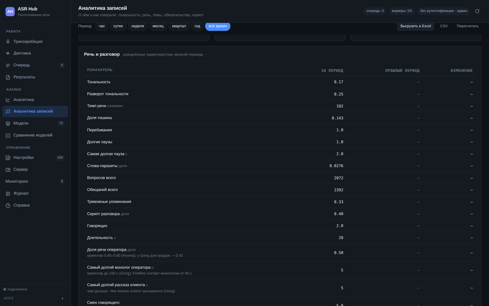

Половина показателей мировой практики существует только «между сторонами»: доля речи оператора, его самый долгий монолог против самого долгого рассказа клиента, пауза перед ответом, соотношение темпов. Считать их можно, лишь зная, кто оператор, — это решает та же проверка, что и скрипт: настройка `content_agent_speaker`, а без неё — тот, кто заговорил первым. Клиентом считается самый говорливый из остальных: в звонке сторон две, а третий говорящий — обычно ошибка разделения. Без оператора эти показатели пустые, а не выдуманные: «доля речи оператора» по случайному говорящему была бы хуже отсутствия числа.

Рядом с каждым показателем в своде — ориентир из опубликованной практики: Gong советует долю речи продавца 43 %, монолог не дольше 150 секунд, паузу перед ответом 0,6–1,0 с и не меньше пяти смен говорящего за разговор; Avoma — долю речи 40–60 %; Fireflies считает монологом всё от 90 секунд. Все они — про английские продажи, а не про русскую поддержку, поэтому это подсказка рядом с числом, а не порог: порогом должна стать своя обычная величина, и следующий этап её и посчитает.

Пауза перед ответом считается только по ответам: перебивание (реплика началась раньше конца предыдущей) и молчание от двух секунд в неё не входят — то и другое считается отдельно. Заметная тишина — сумма пауз от трёх секунд; порог — тот же, что у NICE и Amazon Contact Lens (у Genesys две секунды, у Google пять).

**Смешанная тональность.** Разговор с четырьмя резкими и четырьмя тёплыми репликами по средней неотличим от ровного — и раньше значился нейтральным, хотя слушать нужно именно его. Теперь у записи четыре класса: отрицательная, нейтральная, положительная и смешанная — когда окрашенных реплик с обеих сторон заметно (хотя бы по две, и меньшая сторона не слабее четверти большей), а средняя около нуля. Такие записи собраны в отбор «Противоречивые разговоры».

### Сигналы: раздражение, повторные обращения, нецензурная лексика

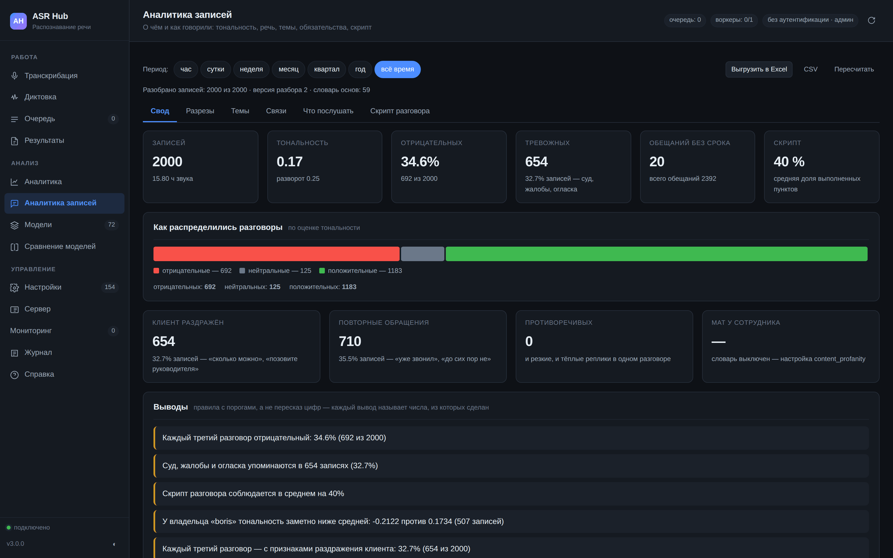

Три признака, которые считаются по репликам клиента, когда оператор определён, и по всем репликам — когда нет.

- **Клиент раздражён.** «Доставка задерживается» и «сколько можно!» дают одинаковую отрицательную оценку, а слушать нужно второе: клиент не обсуждает плохое, а расстроен. NICE считает это отдельным признаком — и здесь тоже. Ищутся обороты («сколько можно», «позовите руководителя», «вы издеваетесь», «до каких пор») и несколько однозначных слов («безобразие», «возмутительно», «кошмар»). Счёт — по репликам: три «сколько можно» в одной реплике — одна вспышка.
- **Повторное обращение.** «Уже звонил», «до сих пор не», «в третий раз», «никто не перезвонил» — клиент говорит, что обращался и вопрос не решён. Это обратная сторона решения с первого раза (FCR), которое лидеры считают моделью; здесь — оборотами, и одиночные «опять» и «снова» намеренно не в счёт: «снова здравствуйте» — не жалоба.
- **Нецензурная лексика.** Считается по корням слов с границами (иначе «рубля» ловилось бы как мат, а «Херсон» — как другое слово) и списком исключений по началу слова («херувим», «сучковатый»). **Выключено по умолчанию**, настройка `content_profanity`: ложные срабатывания на созвучных словах неизбежны, а флаг «мат у сотрудника» — обвинение, которое должно быть включено осознанно. Пока словарь выключен, в своде стоит «словарь выключен», а не ноль. После включения нужен пересчёт архива. Отбор «Нецензурная лексика у сотрудника» первую неделю стоит просматривать целиком: там видно, что словарь принял за мат зря.

### Тональность: как считается и чего не умеет

Слово из словаря даёт свой вес; стоящий перед ним усилитель умножает («очень плохо» весит больше, чем «плохо»), а отрицание в пределах трёх слов меняет знак («не понравилось»). Оценка — средний вес сработавших слов, плавно сжатый к отрезку от −1 до +1.

Делитель — число оценочных слов, а не всех: иначе длинная спокойная реплика с одним резким словом выглядела бы нейтральной ровно потому, что она длинная.

Отрицание считается по предложениям: «Никаких претензий. Спасибо, помогли!» — это благодарность, а не жалоба. Разбор целиком был бы неверен — окно отрицания смотрит на три слова назад и точки не видит, а оценка записи считается по склеенному тексту всего разговора, так что «никаких» из реплики клиента переворачивало бы похвалу в следующей реплике оператора.

⚠️ **Чего этот способ не умеет.** Он не понимает иронию («ну спасибо, удружили»), не различает «проблема решена» и «проблема есть», не знает вашей предметной области. Внутри одного предложения отрицание в конце тоже сбивает его: «замечаний нет, всё удобно» он оценит близко к нулю, а не в плюс. Поэтому в интерфейсе рядом с оценкой всегда стоит сама фраза: число без фразы было бы враньём с точностью до знака, а с фразой человек за секунду видит, верно ли машина поняла.

Оценка не упирается в границы: две разные по силе реплики различаются числом. Это не косметика — пока оценка обрезалась по ±1, список «самых тяжёлых разговоров» состоял из сотен записей с одинаковой оценкой −1,00, то есть выбранных как попало.

### Выводы


Под сводом — готовые выводы. Это **не модель и не «искусственный интеллект»**: набор проверок с порогами вида «доля отрицательных выросла в полтора раза». Каждая знает своё сравнение и называет числа, из которых сделана:

> **Требует внимания.** У владельца «boris» тональность заметно ниже средней: −0,21 против 0,19 (247 записей)

Числа в выводе стоят не для красоты. Вывод без чисел проверить нельзя, а непроверяемым выводам в отчёте не место — по такому вызывают человека объясняться, и объясняться будет не с чем. По той же причине формулировка выводится из самого числа: «каждый третий» при 33 % и «почти каждый» при 96 %, а не одна зашитая фраза на все случаи — вывод, спорящий с собственным числом, проверить тоже нельзя.

Выводы не делаются меньше чем по десяти записям, а сравнение с прошлым периодом — меньше чем по двадцати **оценённым** в каждом из двух окон. Иначе новый сервер встречал бы человека набором тревог вида «каждый разговор отрицательный: 100 % (1 из 1)», а окно, где разбор ещё не дошёл, объявлялось бы нулём и давало «рост с 0 % до 32 %» там, где прошлый период никто не мерил.

Группы сравниваются с общим средним, а не между собой: «худший оператор» есть всегда, даже когда все работают одинаково хорошо, и разрез, который каждый месяц кого-то назначает худшим, — это разрез, которому нельзя верить.

## Разрезы

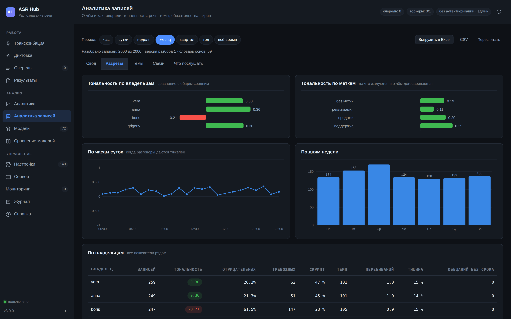

Те же показатели, посчитанные по группам: по владельцу, оператору, метке, модели, источнику, дню недели и часу. Всё считает база одним запросом с группировкой — не выборкой в память, поэтому разрез за месяц на архиве в сотню тысяч записей отвечает за четверть секунды и считает **все** записи, а не первые сколько-то.

Группы меньше пяти записей не показываются: оператор с двумя разговорами всегда либо лучший, либо худший, и оба раза это ничего не значит. Сколько групп скрыто, раздел сообщает.

**Метка** — единственный разрез, который доскладывается в памяти: у задания меток может быть несколько («продажи,vip»), а разбирать строку база не умеет. Средние при этом взвешиваются по числу записей — простое среднее от средних завысило бы вклад сочетания, встретившегося дважды.

**Оператор** определяется сам: берётся тот, кто заговорил первым. Правило грубое, но верное чаще любого другого — разговор начинает принимающая сторона. Жёстко задать метку в настройках нельзя было бы при всём желании: разделение по говорящим нумерует их по порядку появления в каждой записи отдельно, и «SPEAKER_00» — это разные люди в двух соседних разговорах.

**Часы и дни недели** считаются по местному времени сервера, а не по UTC: вопрос «в какие часы разговоры тяжелее» задаёт человек, который работает по своим часам.

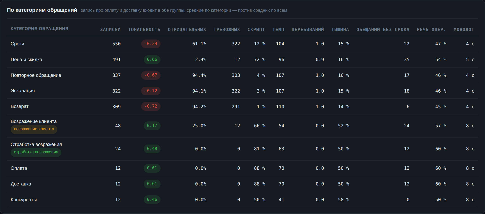

Разрез **по категориям обращений** считается через таблицу совпадений: запись про оплату и доставку входит в обе группы, поэтому суммы по разрезу больше числа записей — так же, как у меток. Средние по категории читаются против средних по всем: «возврат» с тональностью −0,72 при средней −0,2 — это категория, которую слушают первой. Вид категории подписан фишкой, если это не категория обращения; разрез участвует в выводах о группах против среднего и в выгрузке отдельным листом.

## Темы

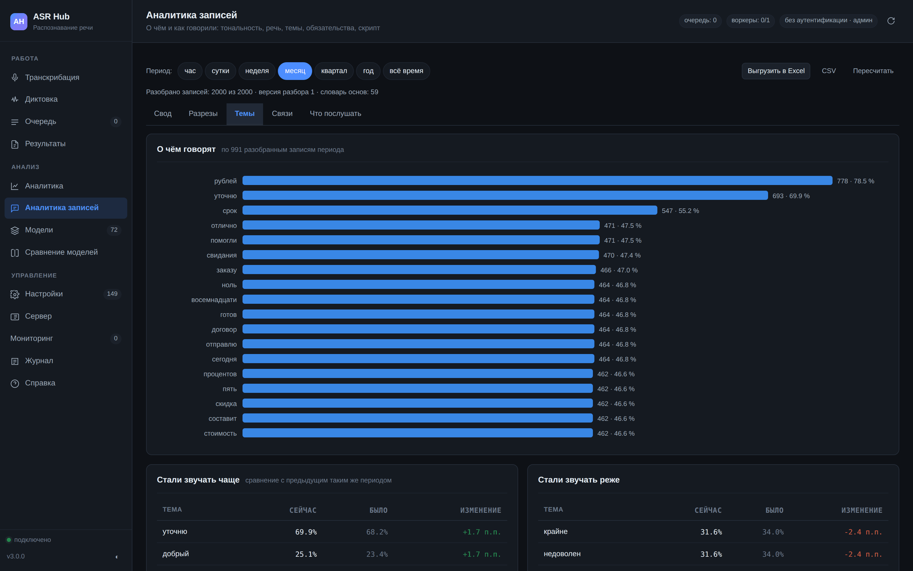

О чём говорят чаще всего. Внутри одной записи «часто» — плохая мера: в любом разговоре чаще всего встречается «договор», если разговор про договор, и это не новость. Поэтому вес слова считается по **TF-IDF**: часто здесь и редко в остальных записях.

Знаменатель — в скольких записях корпуса встречалась основа. Он считается по отдельной таблице основ, а не перебором расшифровок: слова там уже разложены, и на архиве это разница между десятыми долями секунды и минутами.

Показывается не основа, а живая форма слова: «поставки», а не «поставк». Форма хранится отдельным словариком на весь сервер — восстановить её по основе нельзя, из «поставк» одинаково выводятся «поставка» и «поставки».

**Что изменилось** — сравнение долей с предыдущим таким же периодом, а не количеств: если записей за неделю стало вдвое больше, чаще станут встречаться все темы разом, и список «что изменилось» превратится в список «о чём вообще говорят».

Щелчок по теме уводит в «Результаты» с этим словом в поиске — то есть к самим разговорам, а не к ещё одной цифре про них.

**Новые слова периода.** Отдельной строкой — слова, которых в прошлом таком же периоде не было вовсе и которые встретились хотя бы в трёх записях: новая акция, новый сбой, новая модель называются словом, которого раньше не звучало. Из одной записи — это ошибка распознавания, а не новость. Это сырьё для категорий обращений следующего этапа — то, что у Genesys делает Topic Miner. Щелчок по слову открывает записи с ним.

## Связи

Коэффициент корреляции Пирсона между парами признаков: темп речи и оценка, перебивания и оценка, длительность и оценка, соблюдение скрипта и число обещаний.

Это самое опасное место раздела. Коэффициент посчитается для любых двух колонок, даже когда за ним ничего не стоит, поэтому:

- **пары перечислены руками**, каждая со своей формулировкой. Автоматический перебор всех пар из дюжины признаков даёт шестьдесят шесть коэффициентов, три-четыре из которых пройдут любой порог просто по случайности, и раздел начнёт сообщать открытия на пустом месте;
- **слабые связи не показываются**: меньше 0,2 по величине или меньше пятидесяти записей — не показываем. Не потому, что связи нет, а потому, что отличить её от случайности на таких числах нельзя, а показанная цифра будет прочитана как факт;
- **знак — это направление, а не оценка.** «Чем длиннее разговор, тем меньше перебиваний» — тоже минус, и ничего плохого в нём нет.

> **Связь — не причина.** Совпадение двух величин говорит, что их стоит посмотреть вместе, а не что одна вызывает другую. Раздел пишет это под таблицей каждый раз.

Считается по выборке до двадцати тысяч свежих записей: коэффициент по двадцати тысячам отличается от коэффициента по ста тысячам в третьем знаке, а при пороге в две десятых это не имеет значения.

## Что послушать

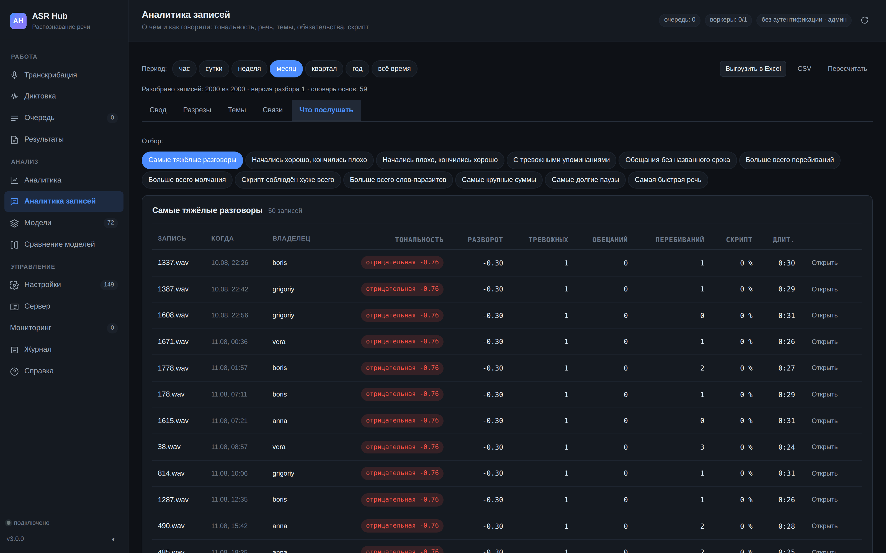

Двенадцать готовых отборов — каждый отвечает на вопрос, с которым в раздел и приходят:

| Отбор | Кому нужен |
|---|---|
| Самые тяжёлые разговоры | разобрать, что пошло не так |
| Начались хорошо, кончились плохо | найти, где именно потеряли клиента |
| Начались плохо, кончились хорошо | посмотреть, как удачно отработали обращение |
| С тревожными упоминаниями | суд, жалоба, огласка — послушать целиком |
| Обещания без названного срока | то, за чем никто не следит |
| Больше всего перебиваний | разговоры, которые шли внахлёст |
| Больше всего молчания | долгие поиски в системе или запись длиннее разговора |
| Скрипт соблюдён хуже всего | к разговору с оператором |
| Больше всего слов-паразитов | к обучению |
| Самые крупные суммы | к контролю |
| Самые долгие паузы | где клиента оставили ждать |
| Самая быстрая речь | на таком темпе клиенты переспрашивают |
| Самые долгие монологи оператора | к обучению: клиенту не дали слова |
| Самый долгий рассказ клиента | где клиенту дали высказаться |
| Противоречивые разговоры | и резко, и тепло — средняя по ним ничего не говорит |
| Больше всего заметной тишины | долгие поиски в системе, удержание без предупреждения |
| Самые короткие паузы перед ответом | отвечал, не дослушав |
| Клиент раздражён | «сколько можно», «позовите руководителя» |
| Повторные обращения | «уже звонил», «до сих пор не» — вопрос не решён |
| Нецензурная лексика у сотрудника | только при включённом словаре |
| Нецензурная лексика в разговоре | то же, с любой стороны |

Двенадцать отборов стали двадцатью одним; из любого списка — сразу в карточку записи.

## Карточка записи

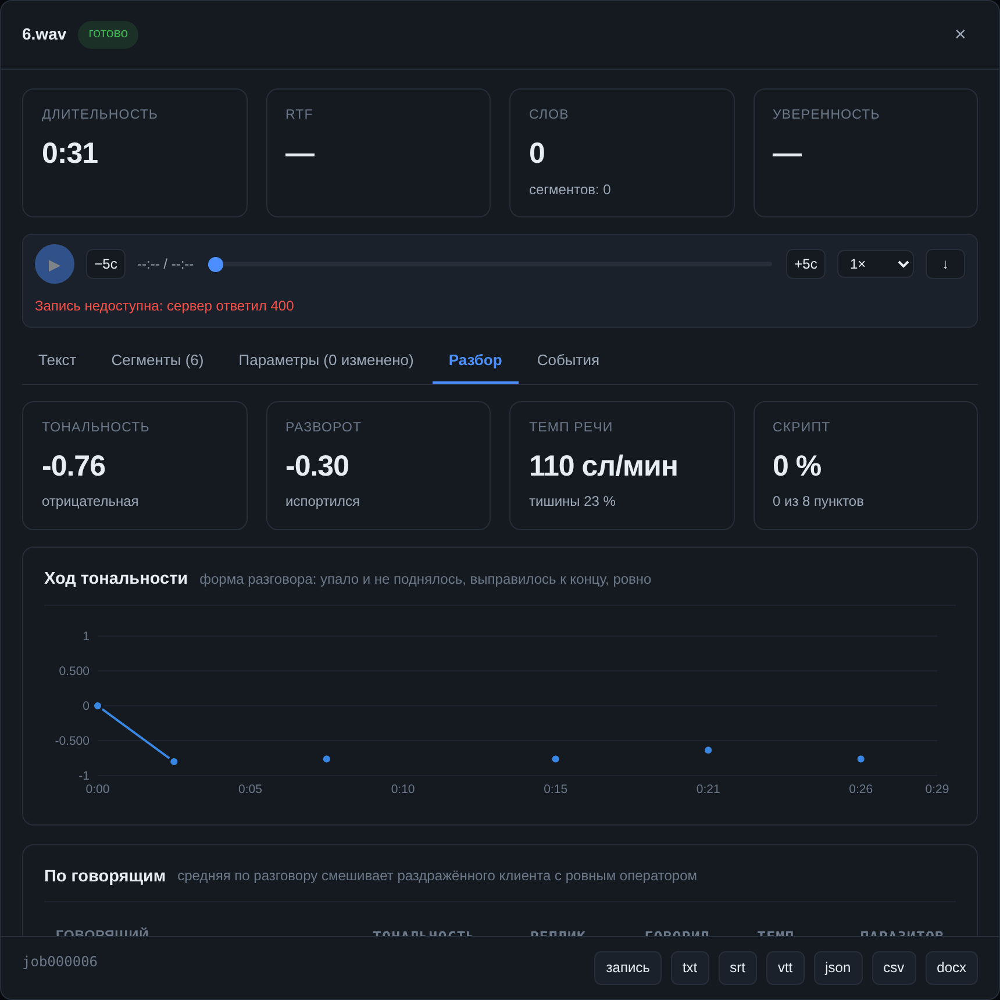

В карточке задания появилась вкладка «Разбор». Она отвечает на вопрос, ради которого запись и открывают повторно: что здесь было. Читать часовую расшифровку ради этого — не ответ, а работа.

- **Ход тональности** — форма разговора свёрнута до десятка точек: «упало и не поднялось», «выправилось к концу», «ровно». По списку из сотен реплик этого не видно.
- **По говорящим** — оценка каждого отдельно, доля времени, темп, слова-паразиты. Средняя по разговору смешивает раздражённого клиента с ровным оператором и получает «нейтрально», то есть теряет ровно то, что хотели узнать.
- **О чём говорили** — ключевые слова и устойчивые сочетания. «Срок» и «поставка» по отдельности говорят меньше, чем «срок поставки».
- **Что прозвучало** — суммы, проценты, сроки, даты, телефоны, почта, номера договоров и заказов. Их выписывают из записи руками, и это самая частая причина слушать её второй раз.
- **Тревожные упоминания, обещания, вопросы** — с временем и репликой.
- **Самые тяжёлые и самые благополучные реплики** — по пять с каждого края.

**Всё кликабельно по времени.** Щелчок по любой строке разбора переводит проигрыватель на её секунду: без этого раздел остаётся справкой, а с ним становится оглавлением разговора.

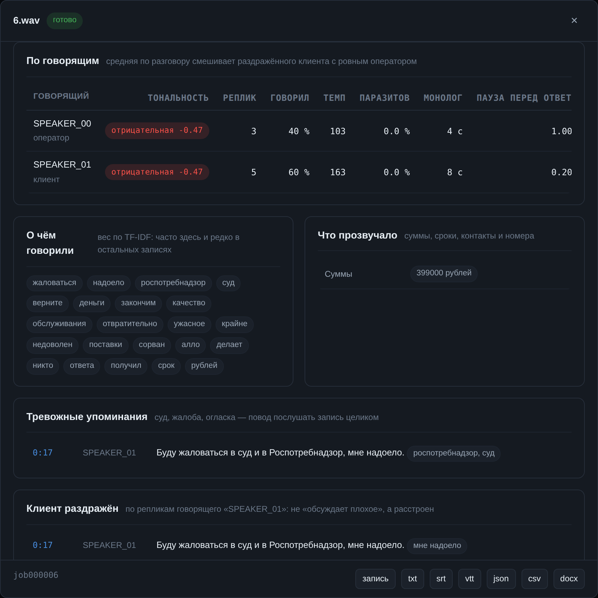

В таблице «По говорящим» каждый подписан ролью — оператор или клиент, — и у каждого есть самый долгий монолог и пауза перед ответом; в блоке «Разговор» — смены говорящего, наложение речи в секундах, заметная тишина и отношение темпа оператора к темпу клиента. Ниже — реплики с признаками раздражения, повторного обращения и, если словарь включён, нецензурной лексики: каждая с временем, говорящим и тем, что именно сработало.

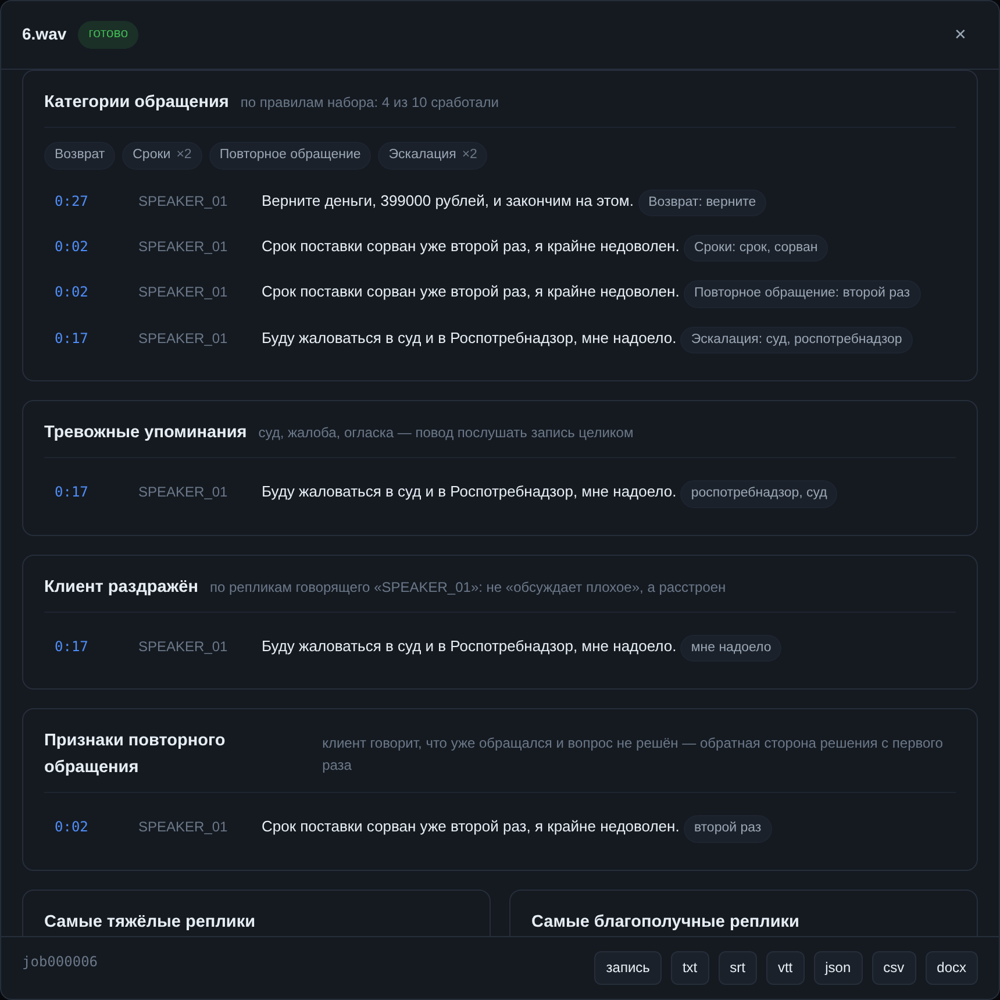

Блок «Категории обращения» — фишки сработавших категорий с числом совпадений и по одной-две реплики на категорию: одна реплика — одна строка, сколько бы примет в ней ни совпало («Сроки: срок, сорван»). Нарушение оператора подсвечено красным, возражение — жёлтым, отработка — зелёным.

## Категории обращений

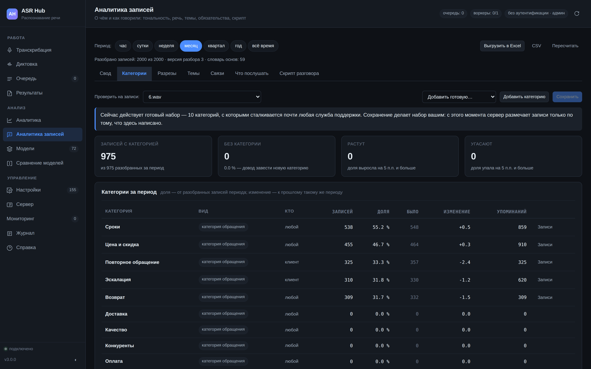

Свод отвечает, *какими* были разговоры; категории — *о чём* они были. «Оплата», «доставка», «возврат», «сроки» — доля записей по каждой, изменение к прошлому периоду, что растёт и что угасает, и сколько записей не попало ни в одну категорию вовсе. Последнее число — главный довод завести новую категорию: когда без категории половина архива, набор описывает не то, о чём звонят.

Категория — это **правило** над словами расшифровки с двумя уточнениями: чьи реплики смотреть и в какой части записи. Так категория устроена у Amazon Contact Lens, Genesys и NICE, и здесь она делает ту же работу — без модели и без разметки, по словам, и потому в закрытом контуре.

### Правила

Правило пишется строкой, как у Genesys: слова и фразы с операторами, операторы — заглавными.

| Запись | Что значит |
|---|---|
| `оплата ИЛИ платёж ИЛИ "не прошла оплата"` | любое из трёх |
| `возврат И НЕ (брак ИЛИ повреждение)` | про возврат, но не про брак |
| `жалоба НЕ суд` | то же, что `жалоба И НЕ суд` |
| `дорого РЯДОМ(5) конкурент` | оба слова не дальше пяти слов друг от друга; без числа — восемь, как у NICE |
| `уточнить` | по основе: найдёт «уточню» и «уточнили» |
| `"нет"` | в кавычках — точная форма: «нету» не найдёт |

Старшинство от сильного к слабому: `НЕ`, `РЯДОМ`, `И`, `ИЛИ`; скобки — до трёх уровней, операндов — до двадцати. Пределы те же, что у Genesys, и не из скромности: правило длиннее не прочитать, а значит, и не проверить. Строчное «и» — обычное слово внутри фразы («хлеб и соль»); английские `AND`, `OR`, `NOT`, `NEAR` тоже понимаются — их пишут те, кто переносит правила из Genesys.

У каждой категории три уточнения: **вид** (категория обращения, нарушение оператора, возражение клиента, отработка возражения — считаются одинаково, показываются и штрафуются по-разному), **кто сказал** (любой говорящий, только оператор, только клиент) и **где** (в любом месте, в начале, в конце — с окном в секундах, как у пунктов скрипта). Оператор и клиент определяются так же, как для скрипта: оператор — тот, кто заговорил первым, клиент — самый говорливый из остальных. Когда говорящие не разделены, «только оператор» и «только клиент» ищут по всей записи и помечают это в карточке: нарушение, найденное в реплике неизвестно кого, — повод послушать, а не обвинение.

Скрипт разговора — частный случай категории: список примет пункта «здравствуйте, добрый день» — это «здравствуйте ИЛИ добрый день», и проверяет его тот же движок. У пункта скрипта появилось поле `rule`: «Представился» можно записать как `"меня зовут" ИЛИ "на связи" НЕ "вы позвонили в"`.

### Счёт и динамика

Доля считается от разобранных записей периода — того же знаменателя, что у тем. «Было» — записей в прошлом таком же периоде, «изменение» — разница долей в процентных пунктах: если записей за неделю стало вдвое больше, чаще станут встречаться все категории разом, и сравнивать надо доли, а не числа. Категория растёт, когда доля выросла на пять пунктов и больше при пяти записях как минимум; угасает — при том же падении. Категории набора, не встретившиеся ни разу, остаются в таблице с нулём: «про возврат за неделю не говорили» — тоже ответ.

Кнопка «Записи» в строке ведёт в «Результаты» с отбором по этой категории — там весь список, поиск, листалка и массовые действия. Тот же отбор доступен ключом `category:<имя>` в поле «содержание» списка заданий.

Выводы называют категории, доля которых заметно изменилась, и долю записей без категории, когда она больше половины; сводка по расписанию — верхние пять с изменением и число без категории; выгрузка получает лист «Категории» с правилами.

### Что тянет вниз: драйверы негатива

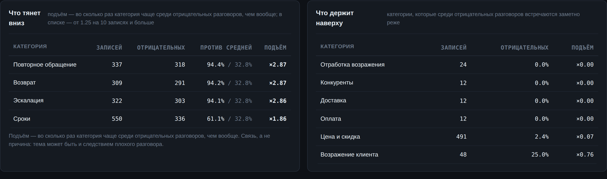

Категория сама по себе — тема; категория, которая в отрицательных разговорах встречается втрое чаще, чем вообще, — причина посмотреть. **Подъём** (lift) — частота категории среди отрицательных разговоров, делённая на её частоту вообще: ×2,87 у «повторного обращения» значит, что среди отрицательных разговоров эта тема втрое чаще, чем в среднем. В список попадают категории с подъёмом от 1,25 на десяти оценённых записях и больше; рядом — «что держит наверху»: категории, которые среди отрицательных заметно реже. У Verint это отчёт Cross Correlation, и здесь он делает то же самое.

⚠️ Подъём — связь, а не причина. «Эскалация» чаще в отрицательных разговорах не потому, что портит их, а потому, что разговор к этому моменту уже испорчен. Раздел говорит это прямо под таблицей, и вывод «разговоры про X отрицательные чаще других» называет оба числа — долю отрицательных в категории и среднюю.

### Возражения без отработки

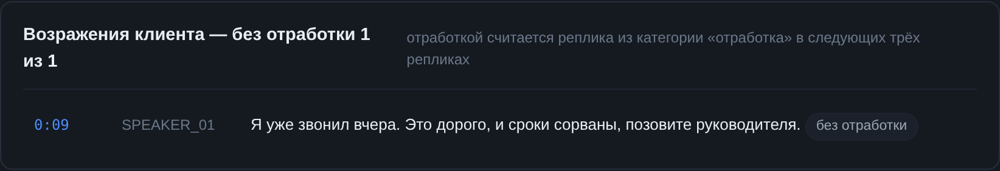

Две категории готового набора образуют пару: **возражение клиента** («дорого», «подумаю», «не нужно», «у других дешевле») и **отработка возражения** («понимаю», «могу предложить», «есть вариант», «что именно смущает»). Возражение считается отработанным, когда в следующих трёх репликах есть реплика из категории отработки — три, потому что это ответ оператора, уточнение клиента и второй ответ, а дальше разговор уже о другом. Это отчёт Т-Банка «где менеджер не отработал возражение» — по словам, без модели.

Без категорий отработки в наборе неотработанность **не считается**: иначе каждое возражение выглядело бы «без ответа», и число ничего бы не значило; в карточке и своде тогда стоит «считать нечем», а не ноль. Свод показывает возражения и долю без отработки, отбор «Возражения без отработки» есть на вкладке «Что послушать» и в «Результатах», метрика `asrhub_content_objections_unhandled_share` — в мониторинге, строка — в сводке по расписанию. Свои пары задаются теми же видами `objection` и `handling` — хоть по одной паре на каждый тип возражения.

### Трекеры

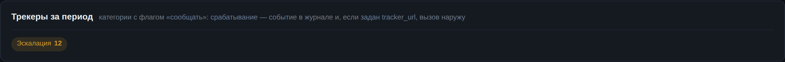

Флаг «сообщать» у категории делает её трекером: срабатывание на свежей записи — сразу после распознавания — пишется в журнал событий (вид `tracker`, с категорией, числом совпадений и тремя репликами) и, если задан адрес `tracker_url`, уходит на него POST-запросом с телом JSON. Пересчёт архива трекеры не будит: трекер отвечает на «сейчас прозвучало», а не на «когда-то было». Адрес проверяется той же проверкой, что у обратного вызова задания: внутренняя сеть закрыта, пока не включён `webhook_allow_internal`; отправка идёт отдельным потоком и не задерживает воркер.

Срабатывания за период считаются по журналу и показаны на вкладке «Категории», в сводке по расписанию и метрикой `asrhub_content_tracker_hits{category}`. Трекер — это «узнать сегодня»: «просит руководителя», «упомянул суд», «конкурент назван по имени»; для «сколько было за месяц» есть счёт по категориям.

### Готовый набор и редактор

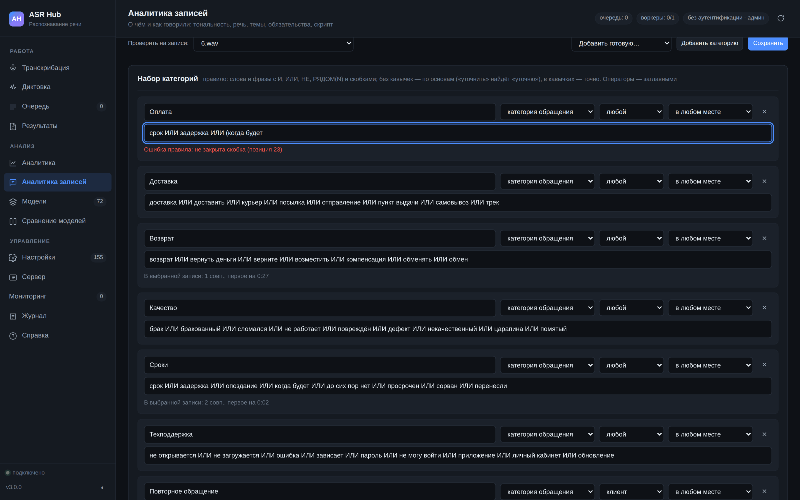

Пока свой набор не сохранён, действует готовый — десять категорий обращений, с которыми сталкивается почти любая служба поддержки или продаж: оплата, доставка, возврат, качество, сроки, техподдержка, повторное обращение, эскалация, конкуренты, цена и скидка, — пара «возражение клиента» — «отработка возражения» и стоп-слова оператора со штрафом. Правила в нём намеренно простые: у каждого своё дело и свои слова, и набор — заготовка, которую правят, а не истина. Кнопка «Добавить готовую…» кладёт любую из них в свой набор.

Редактор устроен как у скрипта: название, вид, кто, где, окно в секундах и строка правила. Ошибка правила показывается под самой строкой, с позицией: «не закрыта скобка (позиция 23)». Набор с ошибкой не сохранится — сервер отвергнет настройку с тем же сообщением, потому что иначе ошибка всплыла бы через сутки в фоновом разборе, молча, у категории, которая с этого момента не совпадает ни с чем.

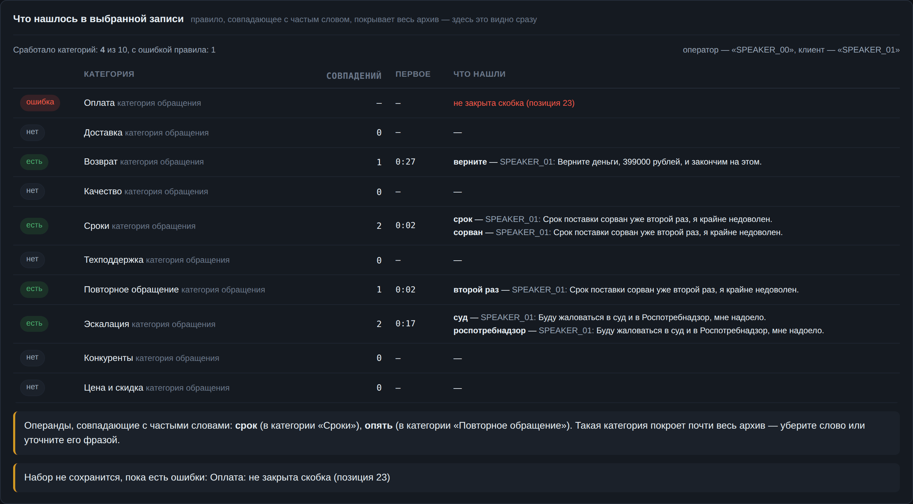

Черновик проверяется на выбранной записи, ничего не сохраняя: что совпало, в какой реплике, на какой секунде. Отдельно — предупреждение об операндах, совпадающих с частыми словами вашего же архива: «оплата ИЛИ это» покроет весь архив из-за «это», и видно это только здесь. На снимке проверка помечает даже «срок»: в этом учебном корпусе слово стоит больше чем в половине записей, и категория «Сроки» описывает не тему, а корпус.

После сохранения предлагается пересчёт архива — без него старые записи останутся размечены прежним набором, и счёт по категориям будет смешивать два набора. Совпадения категорий, которых в наборе уже нет, до пересчёта показываются с пометкой «нет в наборе».

### Тот же набор настройкой

Всё, что делает редактор, — запись настройки `content_categories`:

```json
[
  {"id": "payment", "label": "Оплата", "kind": "topic", "who": "any", "where": "any",
   "rule": "оплата ИЛИ платёж ИЛИ \"не прошла оплата\""},
  {"id": "stop_words", "label": "Стоп-слова", "kind": "violation", "who": "agent",
   "rule": "\"не знаю\" ИЛИ \"вы должны\" ИЛИ \"успокойтесь\""},
  {"id": "recording", "label": "Предупредил о записи", "kind": "topic", "who": "agent",
   "where": "start", "within_s": 30, "rule": "записывается ИЛИ ведётся запись"}
]
```

| Поле | Что задаёт |
|---|---|
| `id` | имя категории; по нему лежат совпадения в базе и строится отбор `category:<имя>` |
| `label` | как категория называется на вкладке и в карточке |
| `rule` | правило строкой |
| `kind` | `topic` — категория обращения, `violation` — нарушение оператора, `objection` — возражение клиента, `handling` — отработка возражения |
| `who` | `any`, `agent`, `customer` — чьи реплики смотреть |
| `where` | `any`, `start`, `end` |
| `within_s` | окно в секундах для `start` и `end`; без него — пятая часть реплик |
| `notify` | `true` — трекер: событие в журнале и вызов на `tracker_url` при каждом срабатывании на свежей записи |
| `penalty` | штраф к баллу оператора в баллах из ста — за категорию, а не за совпадение; ноль по умолчанию |

Совпадения лежат в отдельной таблице `content_hits` — по строке на пару «запись — категория» с числом совпадений, временем первого и видом категории на момент разбора: правила меняются, а нарушение, найденное месяц назад, в отчёте за тот месяц должно остаться нарушением.

## Оценка оператора: балл, штрафы, эмпатия

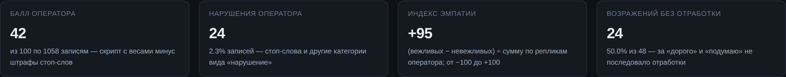

Три числа собирают в одно то, что раньше лежало по разным вкладкам: **балл оператора** от 0 до 100, **нарушения** (стоп-слова) и **индекс эмпатии** от −100 до +100. Все три — по репликам оператора, определённого так же, как для скрипта; все три считаются правилами и словарями, а не моделью, и об этом сказано в каждой подписи.

### Балл 0–100

Балл считается, как у Verint Quality Bots и Google Quality AI: сумма весов выполненных пунктов скрипта, делённая на сумму всех, умноженная на сто, минус штрафы сработавших категорий. У пункта скрипта появился **вес** (единица по умолчанию — и тогда балл равен прежней доле соблюдения); у категории — **штраф** в баллах из ста. Штраф берётся за категорию, а не за каждое совпадение: пять «не знаю» в одном разговоре — одно нарушение, а не пять, и сколько их было, видно по счёту. Ниже нуля балл не уходит, выше ста не поднимается; без пунктов скрипта балла нет вовсе — штрафовать не от чего.

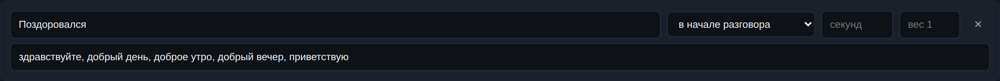


Пример: скрипт из трёх пунктов с весами 3, 1 и 4; выполнены первые два — это 4 из 8, то есть 50; сработали стоп-слова со штрафом 15 — балл 35. Без весов те же два пункта из трёх дали бы 67: вес — это способ сказать, что приветствие и предложение акции стоят по-разному.

### Стоп-слова оператора

В готовом наборе категорий появилась категория **«Стоп-слова оператора»** — вида «нарушение», только у оператора, со штрафом 10: «не знаю», «вы должны», «на вашем месте», «вы не правы», «не могу гарантировать», «оставайтесь на линии», «успокойтесь», «это не ко мне», «ничем не могу помочь», «сами виноваты», «не перебивайте». Список — из методик оценки контакт-центров (Mango Office, Roistat, UIS); он правится как любая категория, и своих нарушений можно завести сколько угодно — с разными штрафами. Совпадение — по точным формам в кавычках: «не знаю» — нарушение, «не знает» в пересказе — нет.

Каждое срабатывание — с временем и репликой в карточке; в своде — число записей с нарушениями и их доля; отбор «С нарушениями оператора» — на вкладке «Что послушать» и в «Результатах»; разрез по операторам показывает, у кого их больше; метрика `asrhub_content_violation_records` — в мониторинге.

### Индекс эмпатии

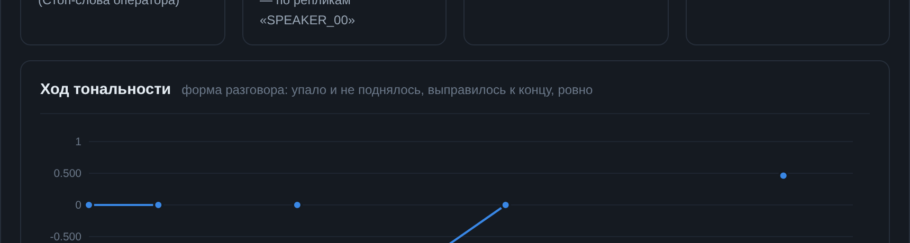

Индекс считается по формуле Genesys: (вежливых оборотов − невежливых) ÷ их сумму × 100, по репликам оператора. Вежливые — те же группы, что в разборе вежливости записи: приветствие, прощание, благодарность, просьба, извинение. Невежливые — словарь оборотов, которые обрывают клиента: «подождите», «слушайте», «успокойтесь», «я вам уже сказал», «вы меня не слушаете», «вы должны», «сами виноваты», «это не моя проблема». Считаются точные формы, как у слов-паразитов: «подождём» — не «подождите». Когда ни одного оборота нет, индекса нет — ноль читался бы как «ровно», хотя человек просто ничего такого не сказал. Без оператора индекс считается по всем репликам, и карточка это подписывает.

Невежливые реплики показаны в карточке отдельным блоком с временем; в своде и разрезах — средний индекс; отбор «Невежливый оператор» — записи с отрицательным индексом; порог в мониторинге — ноль, потому что это граница по смыслу формулы.

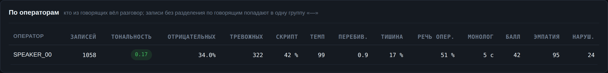

Разрез по операторам получил три столбца — балл, эмпатия, нарушения; это заготовка карточки оператора третьего этапа. Выводы называют средний балл ниже 60, долю разговоров с нарушениями от десяти процентов и отрицательный индекс эмпатии; сводка по расписанию — балл и число записей с нарушениями; выгрузка — те же поля в своде и в списках «что послушать».

⚠️ Балл — это скрипт и стоп-слова, а не качество разговора. Оператор, выполнивший все восемь пунктов и ни разу не сказавший «не знаю», может оставить клиента с нерешённым вопросом; для этого рядом стоят тональность, фрустрация и повторные обращения. Балл отвечает на вопрос «соблюдал ли», а не «помог ли».

## Своя норма и контрольные карты

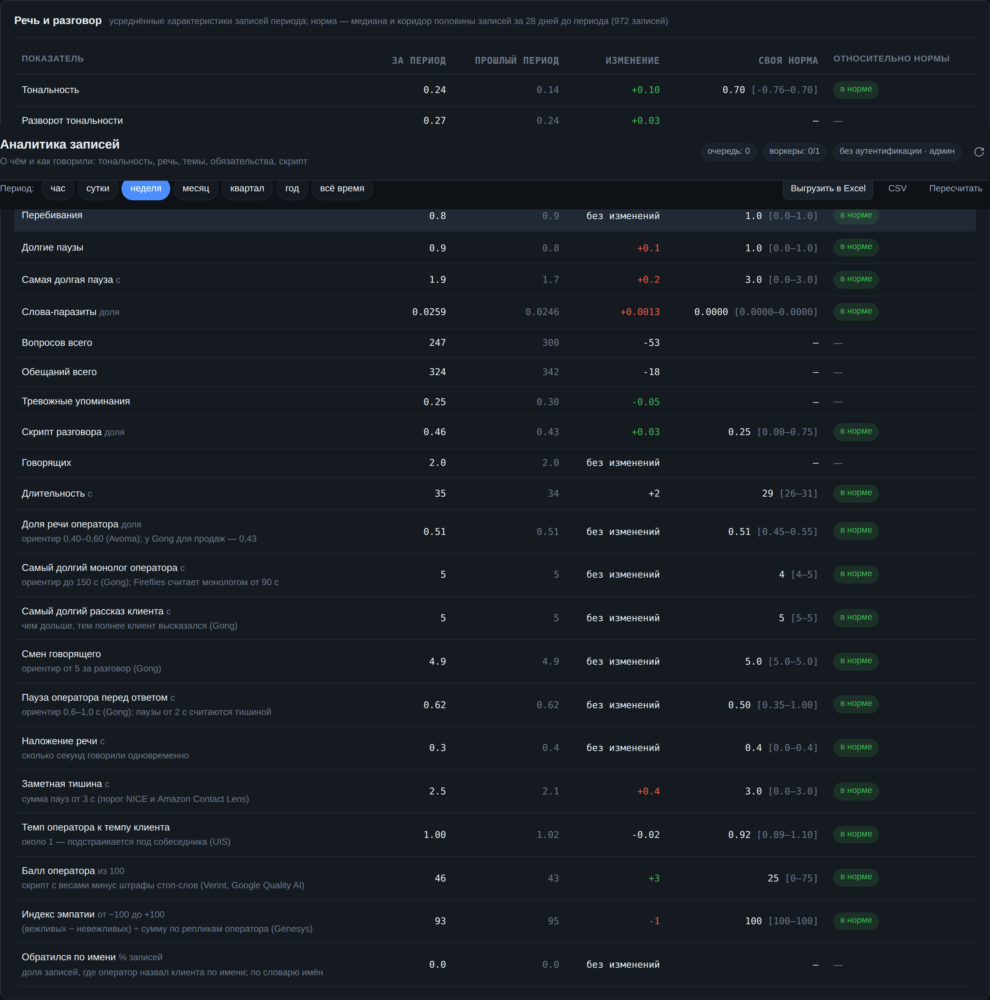

Ориентиры в подсказках — «доля речи 40–60 %», «монолог до 150 с» — взяты из чужих методик, и все они про английские продажи. Норма здесь — то, как обычно бывает на этом сервере: для каждого показателя таблица «Речь и разговор» показывает **медиану и коридор половины записей** (межквартильный размах) по четырём неделям до периода и где относительно них медиана периода — в норме, выше, ниже или выброс (дальше полутора размахов от квартилей, правило Тьюки). Норма считается от тридцати записей в базе; меньше — «мало данных», а не уверенное число по десяти разговорам.

Сравнивается медиана периода, а не среднее: среднее по многим записям почти всегда внутри коридора, даже когда распределение уехало. Выброс в плохую сторону — вывод «требует внимания» с обеими величинами; у показателя без направления (темп, длительность) — «к сведению»: отклонение от своей нормы стоит знать, даже когда неясно, хорошо это или плохо. Норма доступна и по одному оператору — `GET /api/content/norms?by=owner&agent=…` — и уходит в выгрузку листом «Нормы».

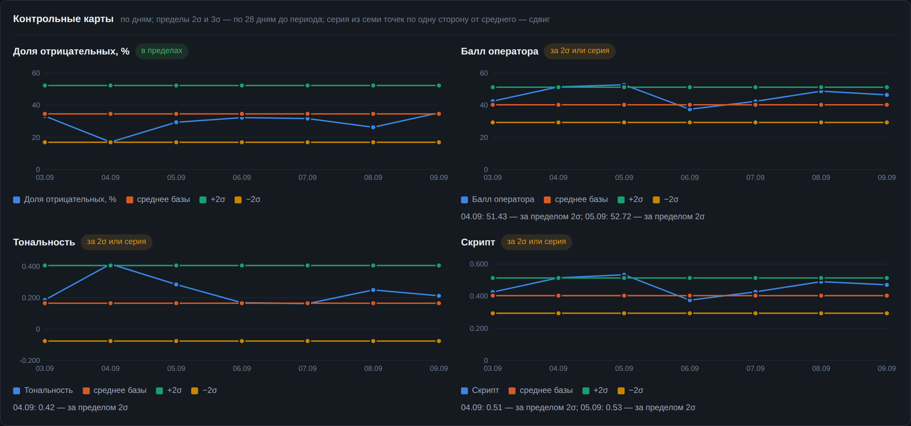

**Контрольные карты** — доля отрицательных, балл оператора, тональность и скрипт по дням с пределами μ ± 2σ и μ ± 3σ, посчитанными по двадцати восьми дням до периода. Точка за 3σ — критично, за 2σ — предупреждение, семь дней подряд по одну сторону от среднего — сдвиг процесса, который ни один день по отдельности не выдаёт (правило серии из методик Western Electric и Нельсона). Дни без записей серию прерывают: молчание — не сдвиг. Те же карты для уверенности модели и подозрительных сегментов — в разделе «Аналитика».

## Операторы: карточка, коучинг, эталоны

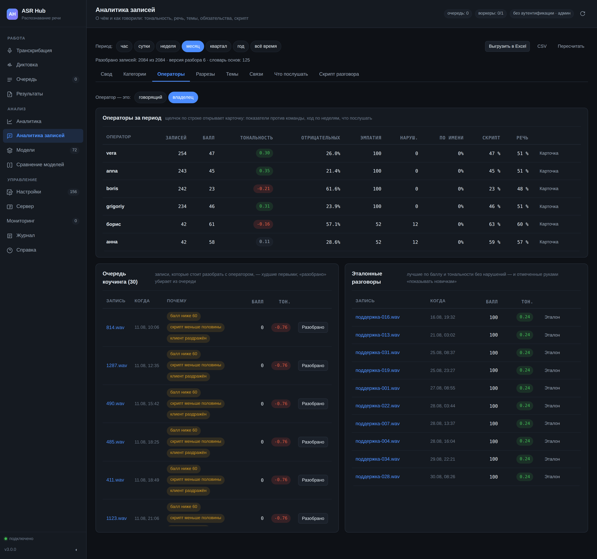

Вкладка «Операторы» собирает всё, что раздел знает о каждом сотруднике, в одном месте: список с баллом, тональностью, эмпатией, нарушениями и обращением по имени; карточка против команды; очередь коучинга и эталонные разговоры.

**Кто такой оператор.** Переключатель «говорящий / владелец» выбирает, что считать оператором: метку говорящего в разборе — «кто заговорил первым», работает без всякой настройки, но «SPEAKER_00» в двух соседних записях может быть разными людьми, — или владельца задания, то есть ключ доступа, под которым записи загружены. Второе точнее там, где у каждого сотрудника свой ключ или своя папка, и именно так стоит строить учёт, если карточки операторов нужны всерьёз.

### Карточка оператора

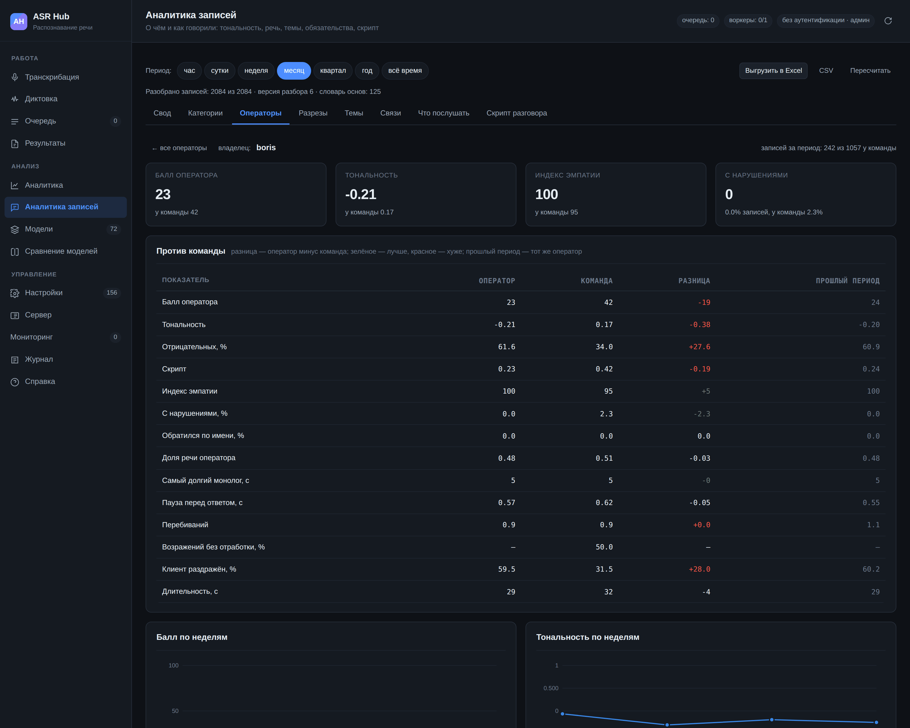

Щелчок по строке открывает карточку. Наверху — балл, тональность, эмпатия и нарушения против команды и против прошлого периода того же оператора. Таблица «Против команды» — четырнадцать показателей с разницей и вердиктом: зелёное — лучше команды, красное — хуже, без цвета — показатель, у которого нет «лучше» (длительность, доля речи, пауза перед ответом). Ниже — балл и тональность по неделям, нарушения по категориям, пять лучших и пять худших записей и очередь коучинга этого оператора. Каждая запись открывается щелчком.

### Очередь коучинга

Очередь — записи, которые стоит разобрать с оператором, худшие первыми, каждая с причиной: нарушение оператора, балл ниже 60, скрипт меньше половины, монолог дольше 2,5 минут, невежливых оборотов больше вежливых, возражение без отработки, раздражённый клиент, нецензурная лексика у сотрудника. Кнопка «Разобрано» ставит отметку, и запись уходит из очереди; «Вернуть» возвращает. Отметки лежат в отдельной таблице `content_marks` и переживают любой пересчёт разбора: разбор пересчитывается и перезаписывается, а отметка руководителя — нет. Каждая отметка — событие `mark` в журнале задания, с тем, кто её поставил.

### Эталонные разговоры

Лучшие разговоры периода — по баллу и тональности, без единого нарушения — и всё, что отмечено кнопкой «Эталон» руками, независимо от периода. Отмеченные стоят первыми и подписаны «эталон»: это подборка для новичков, как у Imot.io, — не «средний хороший звонок», а тот, который руководитель выбрал сам.

### Обращение по имени

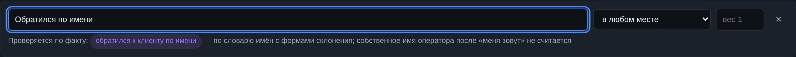

Назвал ли оператор клиента по имени и сколько раз — считается по словарю из двухсот с лишним самых частых русских имён с уменьшительными; у каждого выписаны падежные формы и звательные «Наташ», «Вань». Именно формы, а не основы: стеммер режет имена непредсказуемо, и «Анна», «Оля», «Елена» давали бы двухбуквенные основы, под которые попадает половина словаря. Собственное имя оператора — то, что стоит после «меня зовут», «моё имя», «вас беспокоит», «на связи», — не считается, где бы оно ни встретилось дальше. Имена, совпадающие с обычными словами, из словаря вынесены сознательно: «Вера», «Роман», «Лев», «Слава», «Мила», «Тома», «Рая», «Света» — в расшифровке без заглавных букв «вера в лучшее» и «Вера Петровна» неразличимы, и лучше не засчитать Веру, чем засчитывать веру. Точно так же вычтены формы «ИНН», «лиды», «марка», «кеш».

В скрипте это пункт нового вида — проверяемый не по словам, а по факту: кнопка «Пункт „Обратился по имени“» в редакторе добавляет его, и в настройке он выглядит как `{"id": "customer_name", "label": "Обратился по имени", "check": "customer_name"}`. В своде и разрезах — доля записей с обращением по имени среди тех, где оператор определён; без оператора счёта нет.

## Скрипт разговора

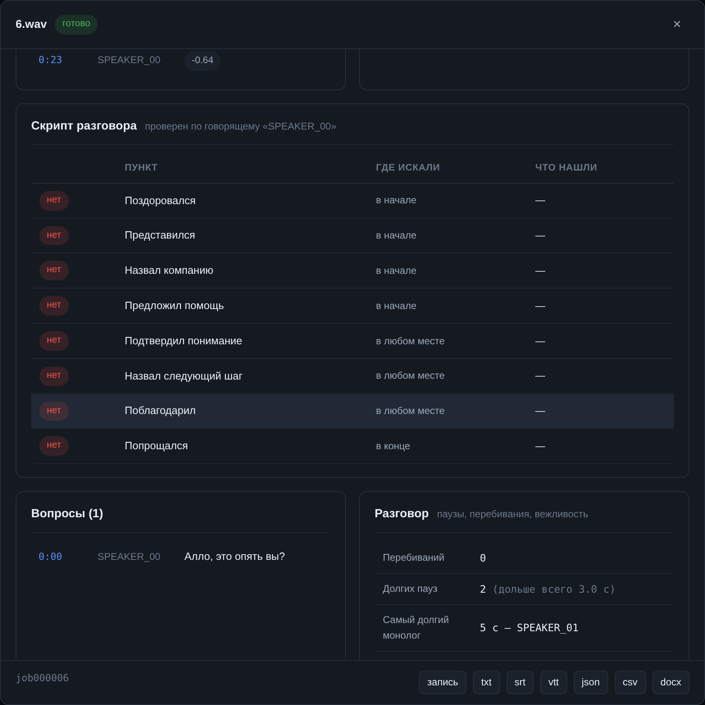

Проверяется, прозвучали ли в разговоре обязательные пункты и в нужном ли месте: приветствие и представление — в начале, прощание — в конце, остальное — в любом месте. Началом и концом считается по пятой части реплик с каждого края.

Набор по умолчанию — восемь пунктов: поздоровался, представился, назвал компанию, предложил помощь, подтвердил понимание, назвал следующий шаг, поблагодарил, попрощался. Он показан целиком на вкладке «Скрипт разговора» и действует, пока вы не сохранили свой.

### Редактор

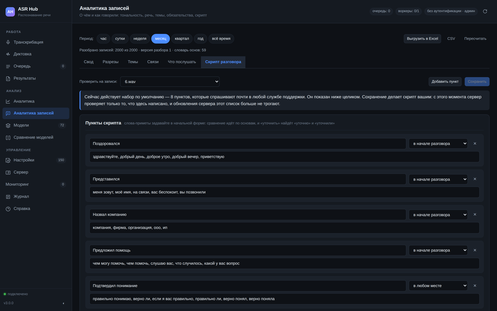

Скрипт — единственная настройка раздела, которую правят руками и не по одному разу: у каждого он свой и подбирается итерациями. В общем списке настроек он лежал как поле `json`, куда надо вписать массив объектов, — то есть настройка, которую меняют чаще всех, была сделана хуже всех. Отдельная вкладка даёт то же самое строками: название пункта, слова-приметы через запятую, где искать.

Слова-приметы задаются в начальной форме — сравнение идёт по основам, так что «уточнить» найдёт и «уточню», и «уточнили».

У пунктов «в начале» и «в конце» есть окно в секундах. Без него началом считается пятая часть реплик — в часовом разговоре это двенадцать минут, и приветствие на десятой засчитывалось. «Разговор записывается» обязано прозвучать в первые 30 секунд — так это формулируют NICE и Verint, и так спрашивают проверяющие; поле «секунд» рядом с «в начале разговора» — это и есть такое окно. В столбце «где искали» оно подписано: «в первые 30 с».

Сохранение делает скрипт вашим: с этого момента сервер проверяет только то, что написано на вкладке, и обновления сервера этот список больше не трогают. Кнопка «Вернуть набор по умолчанию» отдаёт список обратно под наше сопровождение. После сохранения предлагается пересчёт архива — без него соблюдение скрипта в отчётах останется посчитанным по прежним пунктам, и сравнивать эти числа с новыми нельзя.

### Проверка на настоящей записи

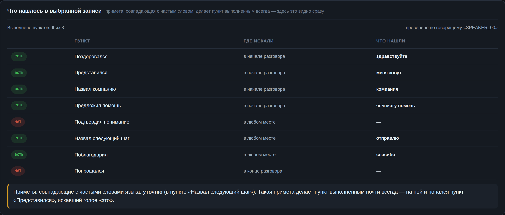

Ради этой части редактор и сделан отдельно от списка настроек. Понять по списку слов, годится ли примета, нельзя: «это» и «то есть» выглядят безобидно и делают пункт выполненным всегда. Видно это только на живой записи — в столбце «что нашли».

Проверка идёт по выбранной записи и ничего не сохраняет: скрипт уходит в теле запроса как черновик. Пересчёт после каждой буквы не запускается — проверка ждёт полсекунды после последней правки.

Внизу — предупреждение о приметах, совпадающих с частыми словами языка. Оно считается по вашему же архиву: примета, которая встречается больше чем в половине разобранных записей, или служебное слово в чистом виде помечаются отдельно.

⚠️ **Примета не должна совпадать с частым словом.** Пункт «Представился» в первой версии искал среди прочего голое «это» — и «алло, это опять вы?» засчитывалось как представление оператора. «Уточню» в пункте «Подтвердил понимание» пришлось перенести в «Назвал следующий шаг» по той же причине: основа общая с «уточнить», и пункт срабатывал на реплике клиента «хотел уточнить по заказу». Обе ошибки нашлись именно этой проверкой, а не чтением списка.

### Тот же скрипт настройкой

Всё, что делает редактор, — это запись настройки `content_script`. Её можно задать и напрямую, например из скрипта развёртывания:

```json
[
  {"id": "greeting", "label": "Поздоровался",
   "any": ["здравствуйте", "добрый день"], "where": "start"},
  {"id": "offer", "label": "Предложил акцию",
   "any": ["акция", "специальное предложение"], "where": "any"}
]
```

| Поле | Что задаёт |
|---|---|
| `id` | ключ пункта; по нему разбор узнаёт пункт при пересчёте |
| `label` | как пункт называется в отчёте и в карточке |
| `any` | слова-приметы в начальной форме; достаточно одной |
| `rule` | правило вместо списка примет — с операторами `И`, `ИЛИ`, `НЕ`, `РЯДОМ`, как у категорий; когда задано, `any` не смотрится |
| `weight` | вес пункта в балле оператора; единица по умолчанию |
| `check` | проверка по факту вместо слов: `customer_name` — обратился к клиенту по имени; `any` и `rule` при этом не смотрятся |
| `where` | `start` — в начале, `end` — в конце, `any` — в любом месте |
| `within_s` | необязательное окно в секундах от начала или до конца записи вместо пятой части реплик |

## Отбор по содержанию в «Результатах»

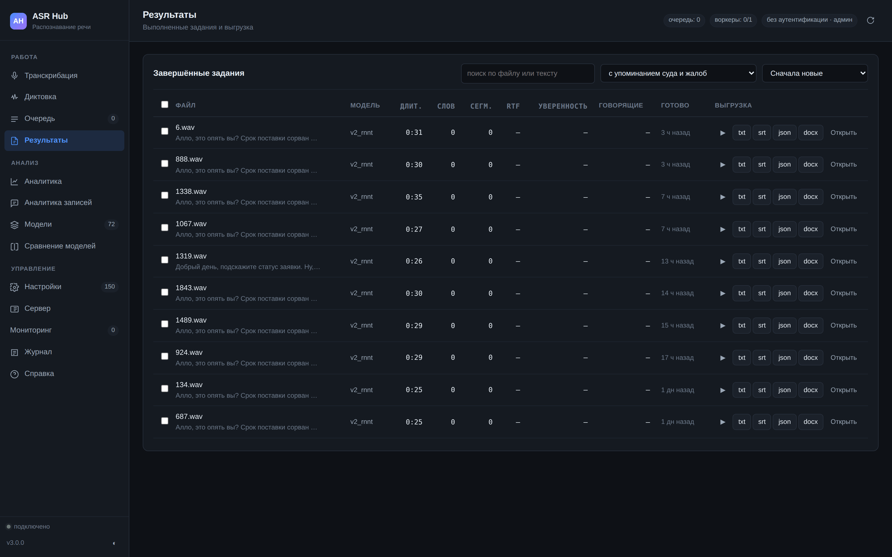

Вкладка «Что послушать» показывает верхние пятьдесят записей отбора — этого хватает, чтобы посмотреть, и не хватает, чтобы работать со списком. Те же отборы есть в разделе «Результаты» отдельным полем: там весь список, поиск по тексту, сортировка, листалка и массовые действия.

Ключи отборов одни и те же, поэтому кнопка «Все такие записи» на вкладке «Что послушать» открывает «Результаты» с уже выбранным отбором, а не сбрасывает его на «любое содержание».

Отбор работает и в счётчике: «показано 30, всего 4000» раньше считало всё подряд, потому что счётчик заданий не знал ни про поиск, ни про модель, ни про содержание.

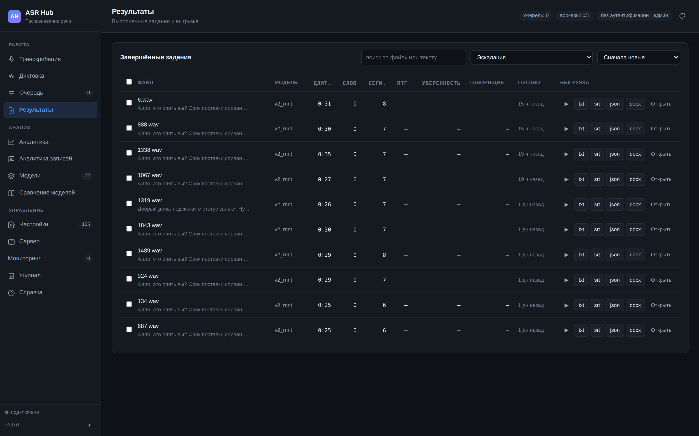

Категории обращений дописываются в тот же список отдельной группой — их набор живёт в настройках, и зашитый в разметку перечень устарел бы с первой правкой. В запросе это `content=category:<имя>`; имя категории уходит в базу параметром, а не подстановкой в выражение.

## Настройки

| Параметр | По умолчанию | Что делает |
|---|---|---|
| `content_analysis` | `true` | считать ли разбор по готовым записям |
| `content_backfill` | `true` | разбирать ли накопленный архив в фоне |
| `content_backfill_batch` | `50` | записей за один заход фонового разбора |
| `content_agent_speaker` | пусто | метка оператора; пусто — определять самостоятельно |
| `content_script` | пусто | свой скрипт разговора; пусто — набор по умолчанию |
| `content_categories` | пусто | свой набор категорий обращений; пусто — готовый набор из тринадцати (десять тем, пара «возражение — отработка», стоп-слова); правила проверяются при сохранении |
| `tracker_url` | пусто | куда сообщать о срабатывании трекеров; пусто — только журнал и сводка |
| `content_profanity` | `false` | считать ли нецензурную лексику; после включения — пересчёт |
| `quality_expected_speakers` | `0` | сколько говорящих ожидается в записи; `2` для звонков, `0` — не проверять |
| `consent_tag` | пусто | метка «согласие получено»; см. «Персональные данные» |
| `consent_days` | `30` | через сколько дней без метки — замечание |

Полные описания с рекомендациями и примерами — в «Справочнике параметров», группа «Аналитика записей».

## Пересчёт

Кнопка «Пересчитать» помечает весь архив к пересчёту; сам пересчёт идёт фоном порциями. Держать HTTP-запрос полчаса, пока считается сто тысяч записей, нельзя — он оборвётся по тайм-ауту, оставив работу наполовину сделанной, а повторить его будет нечем.

Пересчитывать нужно после смены словарей, скрипта разговора или обновления сервера, поднявшего версию разбора. Отдельную запись можно пересчитать из её карточки — кнопка внизу вкладки «Разбор».

Пересчёт всего архива доступен ключу с ролью администратора: он занимает служебный поток на часы и меняет числа во всех отчётах сервера, включая чужие.

## Выгрузка

Кнопки «Выгрузить в Excel» и «CSV» отдают тот же отчёт файлом: по листу на раздел — свод, выводы, все разрезы (включая категории), динамика, темы, категории, нормы, драйверы негатива, связи, что послушать, состояние разбора.

CSV собирается с разделителем «точка с запятой» и меткой порядка байтов: Excel с русскими настройками открывает такой файл двойным щелчком и раскладывает по столбцам, а «правильный» CSV с запятыми показывает одной колонкой кракозябр.

Заголовки в файле русские: он уходит руководителю, а не разработчику, и «filler_rate» для него столбец, который сначала надо расшифровать.

## Программный интерфейс

Все разделы доступны по отдельности — интерфейс так их и забирает, а не тянет весь отчёт на каждое открытие.

```bash
СЕРВЕР=http://сервер:8080
КЛЮЧ=ah_ваш_ключ

# состояние разбора: сколько посчитано, сколько ждёт
curl -H "X-API-Key: $КЛЮЧ" "$СЕРВЕР/api/content/status"

# свод за период и предыдущий такой же
curl -H "X-API-Key: $КЛЮЧ" "$СЕРВЕР/api/content/summary?period=month"

# разрез по любому признаку
curl -H "X-API-Key: $КЛЮЧ" "$СЕРВЕР/api/content/breakdown/owner?period=month"

# разбор одной записи
curl -H "X-API-Key: $КЛЮЧ" "$СЕРВЕР/api/content/jobs/job_ab12"

# категории обращений: счёт за период, изменение к прошлому, без категории
curl -H "X-API-Key: $КЛЮЧ" "$СЕРВЕР/api/content/categories?period=month"

# проверить черновик набора на записи, ничего не сохраняя
curl -X POST -H "X-API-Key: $КЛЮЧ" -H 'Content-Type: application/json' \
     -d '{"job_id": "job_ab12", "categories": [{"label": "Оплата", "rule": "оплата ИЛИ платёж"}]}' \
     "$СЕРВЕР/api/content/categories/check"

# все записи категории — обычный список заданий
curl -H "X-API-Key: $КЛЮЧ" "$СЕРВЕР/api/jobs?content=category:payment&status=completed"

# карточка оператора по владельцу задания и отметка «разобрано»
curl -H "X-API-Key: $КЛЮЧ" "$СЕРВЕР/api/content/agents/ivanov?period=month&by=owner"
curl -X PUT -H "X-API-Key: $КЛЮЧ" -H 'Content-Type: application/json' \
     -d '{"kind": "coaching", "status": "done", "note": "разобрали на планёрке"}' \
     "$СЕРВЕР/api/content/marks/job_ab12"

# пересчёт архива (нужен ключ администратора)
curl -X POST -H "X-API-Key: $КЛЮЧ" "$СЕРВЕР/api/content/recompute"
```

| Маршрут | Что отдаёт |
|---|---|
| `GET /api/content` | весь отчёт целиком — для выгрузки и сводки |
| `GET /api/content/status` | состояние разбора |
| `GET /api/content/summary` | свод и предыдущий период |
| `GET /api/content/timeline` | показатели по времени |
| `GET /api/content/breakdown/{разрез}` | разрез по признаку |
| `GET /api/content/topics` | темы корпуса и что изменилось |
| `GET /api/content/correlations` | связи между признаками |
| `GET /api/content/findings` | готовые выводы |
| `GET /api/content/records` | записи по отбору |
| `GET /api/content/kinds` | перечень отборов и разрезов |
| `GET /api/content/jobs/{id}` | разбор одной записи |
| `POST /api/content/jobs/{id}/recompute` | пересчитать одну запись |
| `POST /api/content/script/check` | прогнать скрипт по записи, ничего не сохраняя |
| `GET /api/content/categories` | категории обращений: счёт, доли, динамика, без категории, трекеры |
| `POST /api/content/categories/check` | прогнать набор категорий по записи с ошибками правил и примерами |
| `GET /api/content/drivers` | драйверы негатива: подъём категории среди отрицательных разговоров |
| `GET /api/content/agents` | операторы с баллом, эмпатией, нарушениями — по говорящему (`by=speaker`) или владельцу (`by=owner`) |
| `GET /api/content/agents/{ключ}` | карточка оператора: против команды, по неделям, нарушения, лучшие и худшие, очередь |
| `GET /api/content/coaching` | очередь коучинга с причинами; `done=true` — вместе с разобранными |
| `GET /api/content/references` | эталонные разговоры: отмеченные и лучшие за период |
| `PUT /api/content/marks/{id}` | отметка на записи: `coaching` (`done`/`open`) или `reference` (`yes`); пустой статус снимает |
| `GET /api/content/norms` | своя норма каждого показателя по четырём неделям до периода и статус периода |
| `GET /api/content/control` | контрольные карты по дням с пределами 2σ и 3σ |
| `GET /api/analytics/drift` | дрейф уверенности по моделям — в разделе «Аналитика» |
| `GET /api/analytics/control` | контрольные карты уверенности и подозрительных сегментов |
| `GET /api/analytics/suspicious` | подозрительные расшифровки — в разделе «Аналитика» |
| `POST /api/maintenance/erase` | удалить всё по запросу (телефон, файл, фамилия); по умолчанию пробный запуск |
| `GET /api/maintenance/consent` | записи без метки согласия старше срока |
| `POST /api/content/recompute` | пересчитать архив |
| `GET /api/content/export` | выгрузка в xlsx или csv |

Разрез по владельцу тот же, что у аналитики сервера: обычный ключ видит только свои записи, ключ в группе — записи своего подразделения, администратор — всё.

Полный отчёт (`GET /api/content`) на архиве в сто тысяч записей считается около восьми секунд: каждый разрез — свой запрос к базе. Было шестнадцать с половиной, пока тренд тем считал `COUNT(DISTINCT job_id)` там, где первичный ключ и так гарантирует уникальность внутри группы, а покрывающий индекс не включал колонку, по которой шла группировка. Обе правки видны в замере, а не только в плане запроса.

Для страницы восемь секунд — всё равно много, для выгрузки раз в месяц — нормально; поэтому интерфейс берёт разделы по отдельности, а целиком отчёт собирается только для выгрузки и для сводки по расписанию.

## Метрики, тревоги и сводка

Раздел смотрят, когда за ним пришли. Чтобы он сообщал о себе сам, показатели содержания отдаются мониторингу и попадают в сводку по расписанию.

**Метрики Prometheus** — шестнадцать в группе «Содержание записей», все считаются за сутки, а не за всё время: система мониторинга строит ряд сама, а величина по всему архиву менялась бы на третьем знаке в год, и ни одно правило по ней не сработало бы никогда.

| Метрика | О чём |
|---|---|
| `asrhub_content_records` | разобрано записей за сутки — знаменатель для остальных |
| `asrhub_content_sentiment_avg` | средняя тональность |
| `asrhub_content_negative_share` | доля отрицательных разговоров, % |
| `asrhub_content_alert_records` | записей с упоминанием суда, жалоб, огласки |
| `asrhub_content_commitments_open` | обещаний без названного срока |
| `asrhub_content_compliance_avg` | доля выполненных пунктов скрипта |
| `asrhub_content_interruptions_avg` | перебиваний на запись |
| `asrhub_content_silence_share` | доля тишины |
| `asrhub_content_filler_rate` | доля слов-паразитов |
| `asrhub_content_wpm_avg` | темп речи, слов в минуту |
| `asrhub_content_talk_share_avg` | доля времени речи оператора |
| `asrhub_content_monologue_avg` | самый долгий монолог оператора, секунд |
| `asrhub_content_reply_delay_avg` | пауза оператора перед ответом, секунд |
| `asrhub_content_dead_air_avg` | заметная тишина (паузы от 3 с), секунд на запись |
| `asrhub_content_analyzed` / `asrhub_content_pending` | состояние разбора архива |

Семь из них имеют пороги, и правила оповещения для них выдаёт сам сервер — `GET /api/monitoring/config/prometheus`. Пороги ориентировочные: доля отрицательных у службы поддержки и у отдела продаж нормой будет разной, поэтому сначала посмотрите свою обычную величину за месяц, а потом ставьте порог от неё.

Правила на содержание разумно писать с условием на число записей — доля, посчитанная по трём разговорам, это не показатель:

```
asrhub_content_negative_share > 30 and asrhub_content_records > 50
```

Полное описание каждой метрики с рекомендациями и порогами — в главе «Мониторинг», группа «Содержание записей».

**Сводка по расписанию** (`digest_url`) получает второй блок — «О чём говорили»: доля отрицательных, тревожные упоминания, обещания без срока, соблюдение скрипта, записи с раздражением клиента и повторные обращения, нецензурная лексика у сотрудника (если словарь включён) и до трёх готовых выводов. Отдельными строками в первой части — подозрительные расшифровки и записи без метки согласия. Блок появляется, только если за период есть разобранные записи. Подробности — в главе «Эксплуатация».

Если сбой случится в разборе содержания, выгрузка метрик от этого не пострадает: Prometheus считает пустой ответ падением цели, и из-за необязательной части сервер выглядел бы недоступным.

Категории обращений отдаются по метке на категорию — `asrhub_content_category_share{category="delivery",kind="topic"}` (доля записей за сутки), срабатывания трекеров — `asrhub_content_tracker_hits{category}`, возражения без отработки — `asrhub_content_objections_unhandled_share`, оценка оператора — `asrhub_content_agent_score_avg` (порог 60/40), `asrhub_content_empathy_avg` (порог 0/−30) и `asrhub_content_violation_records`. Ряд по категории — это ход темы во времени: всплеск «доставки» в понедельник виден раньше, чем отчёт за неделю.

## Смысловой слой: языковая модель

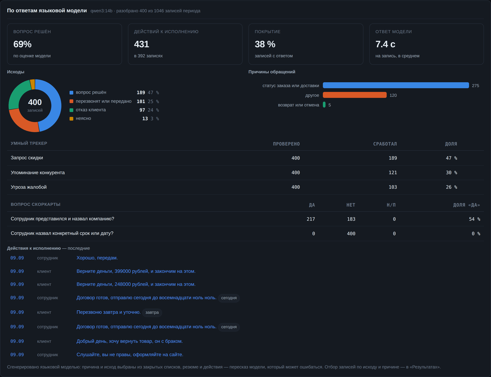

Всё, что выше, считается правилами и словарями: быстро, предсказуемо и без понимания. Резюме разговора, причину обращения, исход, договорённости и «сработал ли трекер по смыслу» правилами не получить — у Amazon, Google, AssemblyAI, Deepgram, Naumen и Yandex это делает языковая модель, и облачные API тарифицируют такие вызовы по токенам. Здесь то же самое делает **локальная модель рядом с распознаванием**: ничего не покидает сервер.

Слой необязательный. Выключен (`llm_backend: off`, по умолчанию) — весь остальной раздел работает как прежде.

### Как подключить

| Способ | Когда выбирать | Что задать |
|---|---|---|
| **Ollama** | одна машина с распознаванием — самый простой путь | `llm_backend: ollama`, `llm_url: http://127.0.0.1:11434`, `llm_model` |
| **OpenAI-совместимый сервер** | vLLM, LM Studio, llama.cpp — своя сборка или отдельная машина | `llm_backend: openai`, `llm_url`, `llm_model`, при необходимости `llm_api_key` |
| **Заглушка** | показать интерфейс и прогнать проверки там, где модели нет | `llm_backend: stub` |

Первый способ не требует терминала вовсе: **«Настройки» → «Языковая модель»** начинается с врезки «Модель на сервере», которая ставит Ollama, скачивает модель и записывает все три настройки сама. Ручной путь остаётся — он же и запасной:

```bash
# на сервере с RTX 5090
curl -fsSL https://ollama.com/install.sh | sh
ollama pull qwen3:30b            # около 19 ГБ в четырёхбитном сжатии
# в настройках ASR Hub: llm_backend = ollama, llm_model = qwen3:30b
curl -X POST -H "X-API-Key: $КЛЮЧ" "$СЕРВЕР/api/llm/test"
```

`POST /api/llm/test` — короткий вызов мимо кеша: отвечает ли сервер, знает ли он модель и за сколько. Его стоит сделать до включения разбора: «модель не скачана» видно сразу, а не через сутки пустых карточек.

### Установка модели одной кнопкой

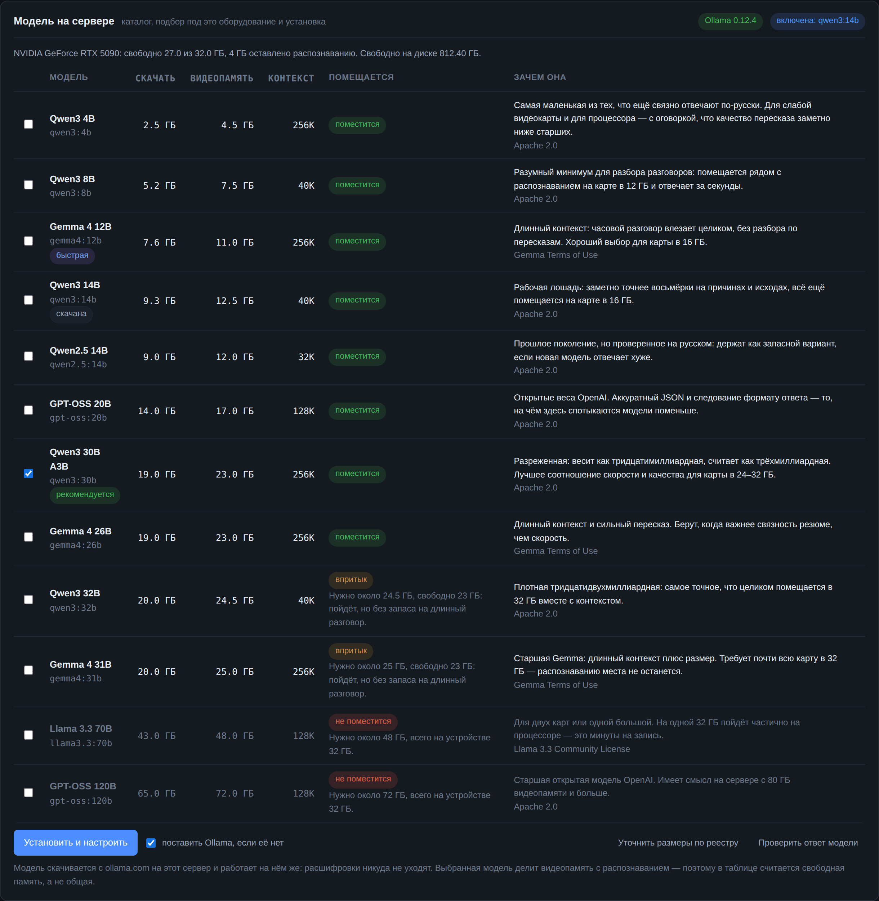

Врезка в разделе настроек показывает три вещи: обнаруженное оборудование, каталог моделей с пометками «поместится / впритык / нужна свободная память / не поместится» и ход установки по шагам. Отмеченное ставится кнопкой; по умолчанию отмечена рекомендованная модель — **самая крупная из тех, что помещаются в свободную видеопамять**.

Что происходит по нажатию:

| Шаг | Что делается | Когда пропускается |
|---|---|---|
| Проверка | размеры уточняются по реестру Ollama, считается место на диске и свободная видеопамять | никогда |
| Установка Ollama | официальный установщик скачивается и запускается (Linux; нужны права root или `sudo` без пароля) | Ollama уже установлена |
| Запуск службы | `systemctl enable --now ollama`, а без systemd — `ollama serve` отдельным процессом; ждём ответа до минуты | служба уже отвечает |
| Скачивание | `POST /api/pull` с потоком прогресса: видно гигабайты и проценты по каждой модели | модель уже скачана |
| Прогрев | один короткий вызов: веса поднимаются в память, замеряется первый ответ | никогда |
| Настройка | `llm_backend`, `llm_url`, `llm_model` записываются и сохраняются в файл конфигурации | никогда |

Установка идёт в фоне: закрытая вкладка её не отменяет, а ход спрашивается у сервера (`GET /api/llm/setup/status`) — шаги, проценты по каждой модели и журнал. Кнопка «Отменить» останавливает на ближайшем шаге; скачанное не пропадает — Ollama продолжит с места обрыва.

**Подбор считается по свободной памяти, а не по общей.** Распознавание уже держит на карте свои веса, поэтому из свободной видеопамяти вычитается запас (`llm_min_free_vram_gb`, а если он не задан — 6 ГБ), и остаток — это бюджет модели. Модель, которая не поместилась, из таблицы не убирается: рядом с ней написано, сколько ей нужно и сколько есть. Без видеокарты подбор идёт по оперативной памяти и с прямой оговоркой, что ответы будут минутами, а не секундами.

Каталог на сентябрь 2026 года — двенадцать моделей библиотеки Ollama, которые заявляют многоязычность и годятся для разбора русских разговоров:

| Модель | Скачать | Видеопамять | Контекст | Зачем |
|---|---|---|---|---|
| `qwen3:4b` | 2.5 ГБ | ~4.5 ГБ | 256K | минимум для слабой карты и процессора |
| `qwen3:8b` | 5.2 ГБ | ~7.5 ГБ | 40K | разумный минимум для разбора; карта 12 ГБ |
| `gemma4:12b` | 7.6 ГБ | ~11 ГБ | 256K | длинный контекст: часовой разговор целиком |
| `qwen3:14b` | 9.3 ГБ | ~12.5 ГБ | 40K | рабочая лошадь для карты 16 ГБ |
| `qwen2.5:14b` | 9 ГБ | ~12 ГБ | 32K | прошлое поколение, проверенное на русском |
| `gpt-oss:20b` | 14 ГБ | ~17 ГБ | 128K | аккуратный JSON и следование формату |
| `qwen3:30b` | 19 ГБ | ~23 ГБ | 256K | разреженная: качество тридцатки, скорость тройки |
| `gemma4:26b` | 19 ГБ | ~23 ГБ | 256K | сильный пересказ, длинный контекст |
| `qwen3:32b` | 20 ГБ | ~24.5 ГБ | 40K | самое точное, что влезает в 32 ГБ |
| `gemma4:31b` | 20 ГБ | ~25 ГБ | 256K | старшая Gemma; распознаванию места не останется |
| `llama3.3:70b` | 43 ГБ | ~48 ГБ | 128K | для двух карт или одной большой |
| `gpt-oss:120b` | 65 ГБ | ~72 ГБ | 128K | сервер от 80 ГБ видеопамяти |

Числа в таблице — подсказка; перед скачиванием размер спрашивается у реестра Ollama, потому что таблица в коде стареет, а реестр — нет. Кнопка «Уточнить размеры по реестру» делает то же самое на месте, и она же покажет, если тега больше нет. Столбец «видеопамять» — это веса плюс место под контекст разговора, а не только веса: часовой разговор — десятки тысяч токенов, и память под них берётся из той же карты.

Выбирать всё равно стоит по замерам на своих записях, а не по чужим таблицам: разница между четырнадцатью и тридцатью миллиардами параметров на коротком разговоре о доставке меньше, чем кажется, а разница в скорости — втрое.

### Что модель делает

| Задача | Что спрашивается | Вызовов |
|---|---|---|
| `summary` | резюме в три-пять предложений и «решён ли вопрос» | вместе |
| `outcome` | причина обращения и исход — **из закрытых списков** (`llm_reasons`, `llm_outcomes`), с цитатой | вместе |
| `actions` | действия к исполнению: что, кто, срок, цитата | вместе |
| `trackers` | умные трекеры (`llm_trackers`): сработал ли по смыслу, с цитатой | отдельный |
| `scorecard` | вопросы скоркарты (`llm_scorecard`) — да, нет, н/п, с цитатой | отдельный |

Первые три — один вызов на запись: модель читает разговор один раз, а три вопроса к нему дешевле трёх чтений. Трекеры и скоркарта — по вызову каждый, и только если списки заданы; вопросы скоркарты, если своих нет, берутся из пунктов скрипта разговора.

Закрытые списки — главное отличие от «спросим модель, что тут было». Модель **выбирает пункт**, а не сочиняет формулировку: иначе один и тот же исход в трёх записях называется тремя разными словами, и посчитать доли нельзя. Ответ мимо списка не пропадает: он заменяется запасным пунктом («другое», «неясно») и помечается замечанием «исход вне списка» — замечание видно в карточке, а в своде за период есть счётчик «N ответов мимо списка». Если модель ответила своими словами, но по существу, берётся самый точный пункт списка, а не первый подходящий: при списке «оплата; оплата картой» ответ «оплата картой в приложении» — это второй пункт.

Запись длиннее `llm_context_chars` (по умолчанию двенадцать тысяч знаков — около двадцати минут разговора) режется по репликам, каждый кусок пересказывается отдельным вызовом, и разбор идёт по пересказам; в карточке это видно строкой «по пересказам N частей».

### Что делает сервер, чтобы это было безопасно

- **Отдельный поток.** Модель отвечает секунды, а не миллисекунды: разбор идёт в фоне и не задерживает выдачу расшифровки.
- **Уступает распознаванию.** Пока в очереди ждут задания, модель не вызывается (`llm_yield_to_queue`): расшифровка — то, ради чего сервер стоит.
- **Порог видеопамяти.** Если свободной памяти меньше `llm_min_free_vram_gb`, вызов откладывается — иначе модель и распознавание вытесняют друг друга и падают оба.
- **Одновременность и тайм-аут.** `llm_max_concurrent` (на одной карте — один) и `llm_timeout_s` на вызов: зависший сервер модели не вешает поток навсегда.
- **Кеш по отпечатку подсказки.** Та же запись с теми же подсказками второй раз модель не спрашивает — ни при повторе, ни при клоне из кеша распознавания.
- **Сбой не зацикливается и не стирает сделанного.** Ошибка кладётся в таблицу ответов, и запись не возвращается в очередь бесконечно. Но поверх удачного разбора она не пишется: «Заново» при лежащем сервере вернёт ошибку в ответе, а прежнее резюме, причина, исход и действия останутся на месте. Такая запись ждёт полчаса, прежде чем фоновый разбор возьмётся за неё снова.

### Где это видно

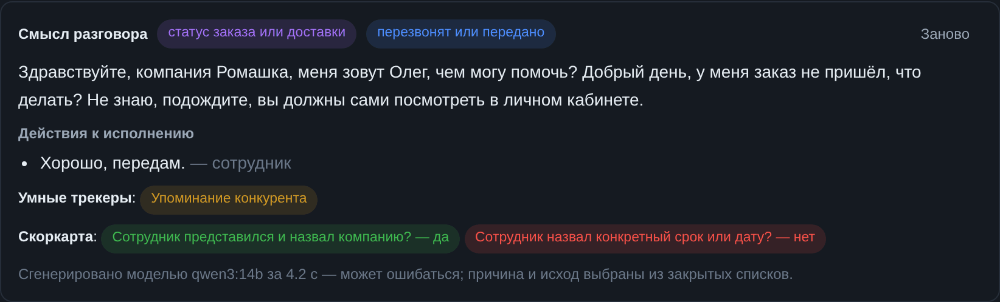

В карточке записи, на вкладке «Разбор», — блок **«Смысл разговора»**: причина и исход отметками, резюме, строка «по цитатам» с теми местами разговора, по которым модель их выбрала, действия к исполнению, сработавшие умные трекеры и ответы скоркарты (цитата — в подсказке), а ниже — замечания разбора, если они были. Кнопка «Разобрать моделью» появляется там, где ответа ещё нет; «Заново» — когда нужно переспросить. В своде раздела — карточка **«По ответам языковой модели»**: доля решённых вопросов, распределение исходов и причин, срабатывания трекеров, ответы скоркарты и последние действия к исполнению со ссылками на записи. В «Результатах» — отборы «вопрос не решён (по оценке модели)», «есть действия к исполнению» и по любому исходу или причине (`content=outcome:…`, `content=reason:…`).

Разбор новых записей идёт сам (`llm_auto`); архив — по кнопке или `POST /api/llm/backfill`, по одной записи, уступая распознаванию. Смена подсказок сервера повышает их версию: старые ответы остаются, помечаются устаревшими и пересчитываются при следующем разборе архива.

⚠️ **Чего этот слой не гарантирует.** Модель может ошибаться и выдумывать — резюме и действия это пересказ, а не протокол; причина и исход ограничены списком, но выбор внутри списка тоже бывает неверным. Всё, что она сказала, подписано «сгенерировано моделью» и снабжено цитатами — чтобы можно было проверить, а не поверить. На загруженном сервере распознавание идёт первым, поэтому в час пик разбор отстаёт: это видно по покрытию в состоянии слоя.

## Персональные данные

Запись разговора — персональные данные, и два требования 152-ФЗ у раздела есть в виде инструментов, а не обещаний.

**Удаление по требованию.** При отзыве согласия записи уничтожаются в срок до тридцати дней, и искать их по одной в архиве на сто тысяч — занятие на день. `POST /api/maintenance/erase` с телом `{"query": "…"}` находит всё, где встречается запрос — номер телефона, имя файла, фамилия, — тем же поиском, что в «Результатах», и по умолчанию **ничего не удаляет**: отвечает списком найденного. Удаление — только с `"dry_run": false` и только ключом администратора; запрос короче четырёх символов отвергается. В журнал событий запрос попадает усечённым («555…»): номер телефона в журнале — ещё одно место, откуда его пришлось бы удалять.

```bash
# что найдётся
curl -X POST -H "X-API-Key: $КЛЮЧ" -H 'Content-Type: application/json' \
     -d '{"query": "+7 999 555-12-34"}' "$СЕРВЕР/api/maintenance/erase"
# удалить найденное
curl -X POST -H "X-API-Key: $КЛЮЧ" -H 'Content-Type: application/json' \
     -d '{"query": "+7 999 555-12-34", "dry_run": false}' "$СЕРВЕР/api/maintenance/erase"
```

**Обезличенная выгрузка и обезличенный ключ.** Расшифровка нужна аналитику, подрядчику или обучающему набору — а продиктованный оператору номер карты нужен только платёжной системе. Настройка `export_mask_pii` заменяет в скачиваемых расшифровках (txt, srt, vtt, json, csv, docx, md, ass) персональные данные пометками: `[телефон]`, `[почта]`, `[карта]`, `[паспорт]`, `[СНИЛС]`, `[ИНН]`, `[дата рождения]`. Всё по форме и контрольным суммам: карта — по Луну, СНИЛС и ИНН — по своим алгоритмам, так что случайное десятизначное число за ИНН не сойдёт; паспорт и дата рождения берутся только рядом с называющими словами («паспорт 45 12 345678», «дата рождения 12.05.1980»), потому что голые цифры и даты в разговоре означают что угодно. Флаг `mask_pii` у ключа доступа делает то же самое со всеми ответами API этому ключу — текстом, сегментами, словами, эталоном, именем файла, найденными телефонами и адресами в разборе — и с его выгрузками; интерфейс и остальные ключи видят полный текст. Чего маскирование не делает: имена, адреса и числа, произнесённые словами. Это защита выгрузки, а не гарантия обезличивания.

**Отметка согласия.** Настройка `consent_tag` называет метку задания, которой отмечают записи с оформленным согласием; `GET /api/maintenance/consent` перечисляет завершённые записи старше `consent_days` без этой метки, а сводка по расписанию называет их число. Сервер не знает, есть ли согласие, — он знает лишь, поставили ли метку: это подсказка, а не юридическая гарантия. Метка ставится при загрузке (поле `tags`) или массовым действием в «Результатах».

## Чего раздел не делает

Честный перечень границ важнее списка возможностей — по нему видно, каким выводам верить.

- **Не понимает смысл.** Оценка тональности — это словарь и правила, а не понимание. Ирония, сарказм и профессиональный жаргон ему не даются.
- **Не знает вашей предметной области.** «Отказ» в разговоре о технике и «отказ» в разговоре о договоре — для словаря одно и то же слово.
- **Зависит от качества расшифровки.** Разбор считается по тексту, который дало распознавание; на записи с сильным шумом он разбирает шум. Разрез «по моделям» затем и нужен: если у одной модели показатели содержания резко другие, дело, скорее всего, в расшифровке, а не в разговорах.
- **Не заменяет прослушивание.** Раздел отвечает на вопрос «какие записи стоит послушать», а не «что в них сказано».
- **Отработка возражения — тоже слова.** «Понимаю» в трёх репликах после «дорого» засчитывается отработкой, даже если дальше оператор сдался; и наоборот, ответ по существу без слов из категории отработки будет «без отработки». Число говорит, где послушать, а не выносит оценку.
- **Категория — это слова, а не смысл.** «Дорого» в правиле найдёт и «это дорого», и «дорогой Иван Петрович»; правило `РЯДОМ` и точные формы в кавычках сужают поиск, но не отменяют проверку на записи. Смысловые категории — «клиент просит скидку, не называя слова» — дело умных трекеров языковой модели (раздел «Смысловой слой»), и там свои ограничения: модель отвечает по смыслу, но может ошибаться, и каждое срабатывание подкреплено цитатой именно поэтому.
- **Не различает раздражение и цитату.** «Клиент раздражён» и «повторное обращение» — обороты, а не понимание: «мне сказали “сколько можно”» засчитается так же, как само «сколько можно». Поэтому у каждого срабатывания в карточке стоит реплика.
- **Не считает того, чего нет в записи.** Разделение по говорящим должно быть включено, иначе перебивания, монологи, разрез по операторам и ход тональности по ним вырождаются: считать их не по чему. Раздел не молчит об этом: если говорящий не разделён больше чем в пятой части записей периода, среди выводов появляется строка с точной долей. Без неё человек смотрит на «перебиваний 0.0» и читает это как «перебиваний не было».
- **Считает вопросы и обещания с погрешностью.** Вопрос виден по знаку или по вопросительному слову в начале; обещание — по глаголу и названному сроку. Обороты вроде «как я уже сказал» и «через курьера» из счёта исключены поимённо, но список исключений конечен, а язык — нет.
- **Показывает прочерк там, где мерить было нечего.** Доля отрицательных по окну, где ни одна запись не получила оценки, — это не ноль процентов, а неизвестно; раздел так и пишет.
