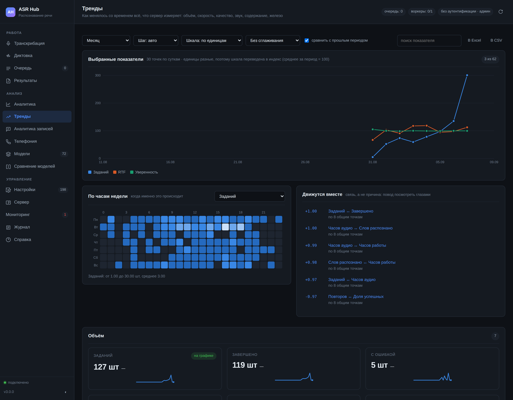

# Тренды



Раздел «Аналитика» отвечает на вопрос «сколько». Раздел «Тренды» отвечает на вопрос **«куда идёт»** — и это разные вопросы. Средний RTF за месяц равен 0,15 и выглядит нормально; тот же RTF, выросший за месяц с 0,09 до 0,21, означает, что через две недели сервер перестанет справляться. Первое видно в сводке, второе — только в ряду.

Раздел строит ряды по времени для **всего, что сервер измеряет**: шестьдесят два показателя в девяти группах — от числа заданий до температуры видеокарты, от доли отрицательных разговоров до задержки ответа оператора.

## Что здесь есть

**Главный график.** Выбранные показатели на общих корзинах времени, с точками, подсказкой по наведению и рядом прошлого периода для сравнения.

**Мелкие графики по группам.** Полсотни рядов рядом: карточка на показатель со спарклайном, последним значением и изменением к прошлому периоду. Клик по карточке добавляет ряд на главный график.

**Часы недели.** Семь строк на двадцать четыре столбца. Средние по периоду прячут то, что видно только здесь: очередь растёт не «вообще», а в понедельник с девяти до одиннадцати; плохой звук приходит не «иногда», а вечером с одной площадки.

**Движутся вместе.** Пары рядов с наибольшей связью — как повод посмотреть, а не как вывод. Раздел не обещает причину и говорит об этом прямо.

**Таблица за период.** Все показатели со средним, крайними значениями, последним, изменением и вердиктом.

**Выгрузка.** Книга Excel или архив CSV: строка на корзину времени плюс лист свода.

## Как считается

Ряды строятся **одним запросом на источник**, а не запросом на показатель: шестьдесят два показателя из шести таблиц — это шесть запросов, а не шестьдесят два. База группирует по корзине выражением `CAST((ts - начало) / шаг AS INTEGER)` и отдаёт сырые суммы; сами показатели считаются из них уже в питоне.

Это важно для долей. Доля успешных заданий за сутки — это не среднее долей по часам, а сумма успешных, делённая на сумму всех. Разница между этими двумя числами тем больше, чем неравномернее нагрузка, и второе всегда неправильное.

**Шаг корзины** подбирается так, чтобы точек было от двадцати до двухсот пятидесяти. Меньше — ряд не читается; больше — шум вместо линии, и ширины экрана всё равно не хватит. Шаг можно задать вручную; слишком мелкий для периода укрупняется сам — год по часам это почти девять тысяч точек.

**Пустая корзина — это пусто, а не ноль.** Ночь без заданий не должна рисовать обвал доли успешных до нуля: считать было нечего, и ряд об этом честно молчит. То же с долями внутри корзины: ноль обязательств со сроком из ноля обязательств — не «ноль процентов», а «неизвестно».

**Наклон** считается методом наименьших квадратов по самим корзинам, а не по первой и последней точке: последняя точка бывает случайной, наклон — нет.

**Процентилей здесь нет, и это решение, а не упущение.** Девяносто пятый процентиль внутри часовой корзины считается по десятку значений и скачет от корзины к корзине сильнее, чем меняется то, что он измеряет. Ряд из таких процентилей выглядит содержательно и не значит ничего.

## Шкала

Разные единицы на одной оси врут о соотношении величин: ряд заданий в тысячах прижимает RTF со значением 0,15 к нулю, и видно только заданий. Двух осей у графика нет намеренно — они врут ещё убедительнее, потому что позволяют подобрать масштаб под любой желаемый вывод.

Поэтому при смешанном наборе единиц шкала переводится **в индекс: среднее за период равно 100**. Опора — именно среднее, а не первая точка: корзина с одним заданием давала бы базу «1», и ряд уходил бы к шести тысячам, прижимая всё остальное к нулю — то есть ровно к той картинке, ради ухода от которой индекс и вводится.

Доступны три шкалы: по единицам (когда все ряды в одних единицах), индекс и отклонения от среднего в сигмах. Сглаживание по трём или семи корзинам применяется **в интерфейсе**, а не на сервере: это способ смотреть, а не то, что измерено — выгрузка совпадает с посчитанным.

## Разрез по владельцу

Тот же, что у остальной аналитики: обычный ключ видит свои записи, ключ в группе — записи группы, администратор — всё.

Показатели железа — загрузка процессора, память, диск, видеокарта — отдаются **только администратору**. Ключу подразделения нечего делать с температурой карты, а знать её — уже разведка: по загрузке и памяти видно, что и когда считает сервер целиком.

## Группы показателей

| Группа | О чём | Примеры |
|---|---|---|
| Объём | сколько пришло и сколько сделано | заданий, часов аудио, слов, из кеша |
| Скорость и очередь | успевает ли сервер | RTF, ожидание в очереди, повторы, доля успешных |
| Качество распознавания | можно ли верить расшифровкам | уверенность, WER по эталонам, подозрительные |
| Звук на входе | что приходит на распознавание | SNR, клиппинг, громкость, доля плохого звука |
| Содержание разговоров | о чём и как говорили | тональность, отрицательные, обещания, возражения |
| Работа оператора | как вёл разговор | балл, эмпатия, скрипт, темп, доля речи, монолог |
| Смысловой слой | что сказала языковая модель | разобрано, вопрос решён, ответы мимо списка, сбои |
| Здоровье распознавания | согласны ли две модели | расхождение моделей, контрольные прогоны |
| Железо | на чём всё это считается | процессор, память, диск, видеокарта, температура |

У каждого показателя есть пояснение: что именно он значит и как его читать. Линия без объяснения — повод для уверенного неверного вывода, а не источник знания.

## Программный интерфейс

```
GET  /api/trends/catalog                    что можно построить
GET  /api/trends?period=month&bucket=auto   ряды и свод
GET  /api/trends/heatmap?metric=jobs        показатель по часам недели
GET  /api/trends/correlations?limit=12      пары, движущиеся вместе
GET  /api/trends/export?fmt=xlsx            выгрузка таблицей
```

Параметр `metrics` — список идентификаторов через запятую; без него отдаются все. `compare=true` добавляет к каждому ряду такой же ряд предыдущего периода: «выросло» без «по сравнению с чем» — не утверждение.

Связи считаются только там, где у обоих рядов есть хотя бы **восемь общих непустых корзин**: совпадение двух точек выглядит как закон природы, а им не является.
