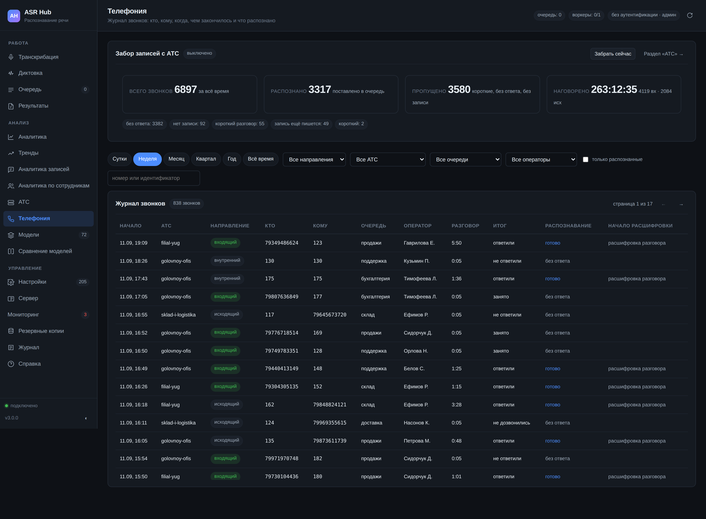
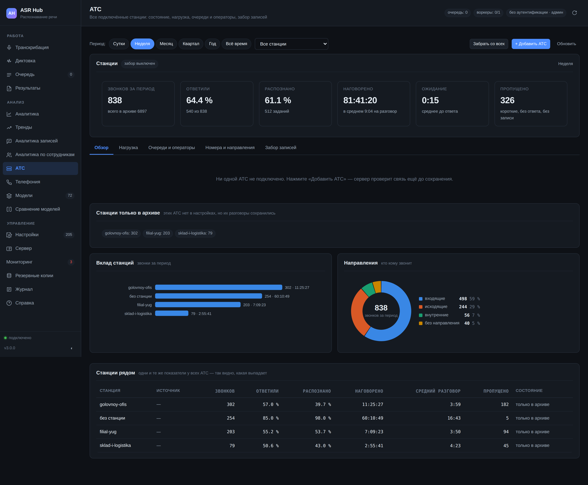

# Телефония: разговоры с АТС Asterisk



Речевая аналитика начинается не с распознавания, а с вопроса «где взять записи». Пока их носят руками, разбор охватывает те разговоры, о которых кто-то вспомнил, — то есть в основном скандальные, и выводы получаются про скандалы, а не про работу.

Здесь сервер забирает записи с Asterisk сам: каждую, со всеми полями звонка — кто звонил, кому, через какую очередь, сколько длился разговор, ответили ли. Дальше это обычное задание: очередь, распознавание, разбор содержания, смысловой слой, отчёты — но уже с разрезами по направлению, очереди и оператору.

## Несколько АТС

Станций может быть сколько угодно, и это не «две настройки вместо одной»: у каждой свой источник, свой каталог записей, свои длины внутренних номеров, свой владелец звонков и свои метки заданий. Головной офис и филиал редко настроены одинаково.

У каждой станции своя позиция чтения журнала. Общая означала бы, что вторая станция дочитывает за первой: та сдвинула позицию на три строки, вторая начинает читать свой журнал с четвёртой — и первые три её звонка не попадают в архив никогда, молча.

Идентификатор станции вычисляется из имени один раз при заведении и дальше живёт в настройке. Переименовать станцию можно: её архив останется привязан к ней. Если бы идентификатор пересчитывался из имени, переименование «Головного офиса» в «Центральный офис» сделало бы весь прежний архив ничьим — разрезы показали бы ноль звонков у живой станции и гору у станции, которой нет.

Сбой одной станции не отменяет обхода остальных: он попадает в ответ отдельной строкой со своим текстом и подсказкой. Раньше заход был один на всю телефонию, и исключение на первой же станции прекращало обход — записи живых станций ждали следующего круга, а при устойчивом сбое не приезжали никогда.

**Выключить** станцию — не то же самое, что **убрать**. У выключенной сохраняются и поля, и позиция чтения: включив её обратно, сервер продолжит с того места, где остановился. Убранная исчезает из настроек, но её звонки остаются в архиве и в отчётах: разговоры прошлого года — это записи организации, а не свойство железки, которую сняли со стойки.

## Ключ звонка в архиве

У Asterisk `uniqueid` — это «эпоха.счётчик», и счётчик локален станции: он
свой у каждой АТС и сбрасывается при её перезапуске. Две станции в одну
секунду дают одинаковый идентификатор.

Поэтому ключ звонка в архиве собирается как `станция:идентификатор`, а
идентификатор, который дала станция, живёт рядом отдельным полем
(`pbx_uid`). Именно он показывается в журнале, по нему ищется файл записи
и по нему звонок узнают на самой АТС. Поиск в журнале принимает оба.

Архив, собранный до обновления, ничего не теряет: при обновлении схемы
прежние ключи переносятся в поле идентификатора станции как есть.

## Проверка связи до сохранения

Кнопка «Проверить подключение» в форме станции работает **до** того, как станция сохранена. Проверка после сохранения означала бы «сначала заведите в настройках станцию неизвестно куда, а потом выясняйте, доедет ли до неё сервер»; закрытая на полпути вкладка оставляла бы в настройках полупустую АТС, которая молча пытается ходить непонятно куда.

Проверка отвечает по-разному на разные беды: «порт закрыт», «пароль не тот», «файла нет», «файл есть, но в нём ноль строк» — каждое из этих состояний чинится по-своему, и «не работает» здесь не диагноз.

Для журнала CDR проверка ещё и показывает, как сервер прочитает последние строки: идентификатор, кто, кому, направление, длительность, итог. Если направление определилось неверно — видно сразу, и поправить нужно длины внутренних номеров и контексты, а не гадать потом по отчёту.

## Несколько длин внутреннего номера

В организации, которая росла или объединялась, рядом живут трёхзначные добавочные старого офиса, четырёхзначные нового и шестизначные, совпадающие с табельными. Одна длина заставляла выбирать, чьи звонки считать правильно: при длине 3 четырёхзначные номера становились «внешними», и все разговоры между отделами уезжали в статистику как входящие с улицы.

Поэтому длина задаётся списком: `3, 4, 6`. Принимается и число, и список, и строка — настройку правят руками, и требовать ровно одного написания незачем.

## Несколько контекстов

Правила «контекст диалплана = направление» задаются списком, и **порядок в нём важен**: первое подходящее правило выигрывает, как в диалплане.

```
from-internal-out=исходящий, from-internal=внутренний
```

Контексты у Asterisk вложены по смыслу: `from-internal` попадает внутрь `from-internal-custom`, а `from-trunk-vip` — частный случай `from-trunk`. Если правила перемешать, звонок VIP-линии будет то одним направлением, то другим — в зависимости от того, как в этот раз легли ключи. Поэтому частные правила пишите выше общих.

## Три способа подключиться

| Источник | Что нужно | Когда выбирать |
|---|---|---|
| **Журнал CDR** (`Master.csv`) | доступ на чтение к файлу | сервер на той же машине или каталог смонтирован |
| **AMI** (события `Cdr`) | учётная запись в `manager.conf` | машины разные, монтировать нечего |
| **Каталог записей** | доступ на чтение к папке | до АТС не дотянуться вовсе |

**Журнал CDR — путь по умолчанию.** Asterisk пишет строку на каждый завершённый разговор в обычный текстовый файл. Не нужно заводить учётную запись на станции, а значит, не появляется ещё одного пути внутрь неё. Файл читается с запомненной позиции: заход стоит столько, сколько появилось новых строк, а не сколько их всего. Если журнал повернули по расписанию и он стал короче — чтение начинается с начала, иначе новые звонки пропали бы совсем.

**AMI** — сетевой интерфейс станции. Соединение держится между заходами: вход на каждый заход это строка в журнале безопасности АТС раз в минуту и повод для подозрений у того, кто этот журнал читает.

**Каталог записей** — когда АТС недоступна. Звонком считается файл; полей у такого звонка ровно столько, сколько удалось прочитать в имени, и раздел показывает это как есть.

## Права: только чтение, и это не формальность

Клиент AMI умеет ровно четыре действия: `Login`, `Logoff`, `Ping`, `CoreSettings`. Всё, что меняет состояние станции — `Originate`, `Redirect`, `Command`, `Hangup`, — **не разрешено на уровне клиента** и не отправится, даже если попросить. Скомпрометированный сервер распознавания не должен уметь звонить от имени организации.

Учётную запись заводите отдельную:

```ini
[asrhub]
secret = длинный-случайный-пароль
read = cdr,call
write =
deny = 0.0.0.0/0.0.0.0
permit = 10.0.0.7/255.255.255.255      ; только адрес сервера ASR
```

Пароль AMI хранится как секрет: в ответах интерфейса и в журналах он замаскирован наравне с токенами и адресами обратного вызова.

Если станция на той же машине, AMI не нужно открывать наружу вовсе — оставьте `bindaddr=127.0.0.1` в `manager.conf`.

## Как находится файл записи

Порядок поиска — от точного к приблизительному:

1. **По шаблону имени**, если он задан. Подстановки: `${UNIQUEID}`, `${SRC}`, `${DST}`, `${CLID}`, `${ACCOUNTCODE}`, `${USERFIELD}`, `${DIRECTION}`, `${QUEUE}`, `${AGENT}`, а также `${YEAR}`, `${MONTH}`, `${DAY}`, `${HOUR}`, `${DATE}`, `${TIME}`. Работает и написание в фигурных скобках без доллара.
2. **По идентификатору звонка** — файл, в имени которого встречается `${UNIQUEID}`. Работает почти всегда: MixMonitor обычно зовут именно так.
3. **По паре номеров и времени** — ближайший по времени файл, в имени которого есть оба номера.

Шаблон обычно не нужен: оставьте поле пустым, и поиск по идентификатору справится. Шаблон полезен там, где в имени только номера и дата.

**Номер звонящего в путь не пускается как есть.** Caller ID задаёт тот, кто звонит, и он попадает в путь, который сервер потом открывает на чтение: одного `../` в номере хватило бы, чтобы шаблон вида `${SRC}.wav` увёл поиск из каталога записей куда угодно, а расшифровка показала бы содержимое чужого файла в интерфейсе. Поэтому разделители и `..` из значений вычищаются, а найденный путь дополнительно проверяется на то, что он остался внутри каталога записей — уже после разрешения символических ссылок.

## Что не попадает в распознавание

**Слишком короткие.** Разговор в шесть секунд — это «ошиблись номером». Распознавать его незачем, а в статистике такие портят средние: сотня трёхсекундных звонков уводит среднюю длительность вниз и делает вид, что операторы стали быстрее. Порог — настройка, по умолчанию десять секунд.

**Неотвеченные.** `NO ANSWER`, `BUSY`, `FAILED` записи обычно не имеют вовсе, а если имеют — там только гудки.

**Свежие.** MixMonitor закрывает файл уже после того, как станция отчиталась о звонке, а иногда ещё и перекодирует его: запись, взятая через секунду после события, бывает обрезанной. Свежие звонки выдерживаются заданное число секунд, и файл дополнительно проверяется на то, что перестал расти.

**Без записи.** Файла может не быть законно — запись не велась. Такой звонок помечается в журнале, чтобы не искать его файл на каждом заходе до скончания века.

Всё пропущенное **остаётся в журнале раздела и в счётчиках**: пропуск касается распознавания, а не учёта. По причинам пропуска сразу видно, что именно сломано: «нет записи ×48» и «короткий ×48» — это две разные поломки.

## Одно задание на один звонок

Идентификатор звонка — первичный ключ таблицы: повторный проход по журналу ничего не добавит, даже если позиция чтения потерялась. Это главный предохранитель раздела: импортёр, заводящий дубли, за сутки превращает архив в кашу, а очередь — в стену.

## Направление, очередь, оператор

**Направление** берётся сначала из контекста диалплана: в `extensions.conf` он и заведён, чтобы отличать «звонят нам» от «звоним мы». Соответствие контекстов задаётся настройкой (`from-trunk → входящий`, `from-internal → исходящий`). Чего в ней нет — определяется по длине номера: внутренний короткий, городской длинный. Это догадка, и раздел называет её догадкой.

Направление нужнее, чем кажется: без него «средняя оценка оператора» смешивает приём заявок с холодным обзвоном, а это две разные работы с разными нормами.

**Очередь** берётся из данных приложения `Queue`, **оператор** — из внутреннего номера соответственно направлению.

**Владелец записи** определяется по номеру оператора через сопоставление «номер → владелец». Разрез по владельцу — единственное, что отделяет отдел от отдела в отчётах: без него руководитель продаж видит разговоры техподдержки. Чего в сопоставлении нет, достаётся владельцу по умолчанию.

## Приоритет

Записи со станции приезжают потоком и легко вытесняют то, что человек загрузил руками и ждёт прямо сейчас. Поэтому приоритет заданий телефонии по умолчанию **ниже** ручной загрузки: 40 против 50. Поток звонков не должен заставлять человека ждать.

## Первый запуск

1. Настройки → «Телефония»: выберите источник и укажите путь к журналу и каталогу записей.
2. Нажмите **«Проверить связь»**. Проверка отвечает по-разному на «порт закрыт», «пароль не тот», «файла нет» и «файл есть, но в нём ноль строк» — каждое из этих состояний чинится по-своему. Для журнала CDR она ещё и показывает разобранные строки-образцы: видно, что поля разошлись, до того как в базу попадут звонки с чужими числами.
3. Нажмите **«Забрать сейчас»** — один заход по требованию, чтобы не ждать интервала опроса.
4. Убедитесь, что в журнале появились звонки с верными номерами и направлениями.
5. Включите **«Забирать записи с АТС»**.

Первый заход на живой АТС видит весь накопленный журнал, поэтому берёт не больше пятидесяти звонков: без предела он поставил бы в очередь десятки тысяч заданий разом и занял бы сервер на сутки. Архив разберётся за несколько часов, по пятьдесят звонков на заход.

## Программный интерфейс

```
GET  /api/telephony/status       состояние забора и счётчики звонков
POST /api/telephony/test         проверка связи с источником (администратор)
POST /api/telephony/scan         заход прямо сейчас (администратор)
GET  /api/telephony/calls        журнал с отбором
GET  /api/telephony/dimensions   очереди и операторы для отбора
```

Отбор журнала: `period`, `direction`, `queue`, `agent`, `search` (номер или идентификатор), `only_queued`, `limit`, `offset`.

Обычному ключу состояние отдаётся без адресов, путей и текста ошибки источника: по ним строится вход в телефонию организации, а не понимание своей работы.

## Разбор строки журнала

Строка `Master.csv` разбирается настоящим разбором CSV, а не делением по запятой: в имени звонящего запятые встречаются («Иванов, отдел продаж»), и деление по запятой сдвигало бы все поля правее — вместе с номером, длительностью и идентификатором звонка. Понимаются оба способа экранирования кавычки — удвоением, как пишет сам Asterisk, и обратной косой, как пишет часть надстроек над ним; какой из них применён, определяется по тому, похоже ли значение в поле идентификатора на идентификатор.

## Раздел «АТС»



Раздел «Телефония» отвечает на вопрос «что было в этом разговоре» — там журнал звонков. Раздел «АТС» отвечает на другой: «как живут станции». Смешать их значит получить страницу, на которой ни настройку не найти, ни звонок.

Пять вкладок:

- **Обзор** — карточка каждой станции: состояние, счётчики, линия последних суток и все действия рядом (проверить, забрать, изменить, выключить, убрать, открыть журнал). Действия именно на карточке: когда станция молчит, человек смотрит на неё, и «проверить связь» должно быть под рукой в этот момент. Ниже — вклад станций, направления и таблица «станции рядом» с одними и теми же показателями у всех: так видно, какая выпадает.
- **Нагрузка** — звонки во времени с разбивкой по направлениям, тепловая карта «день недели × час», распределение длительностей, суммы по часам и дням недели. Средняя длительность в три минуты бывает и у равномерных разговоров, и у сотни тридцатисекундных плюс десятка получасовых — это разные организации с разными проблемами, и гистограмма их различает.
- **Очереди и операторы** — кто принимает звонки, сколько разговаривает и как долго в среднем.
- **Номера и направления** — кто звонит чаще всего, кому, через какие контексты и чем заканчивается. Незнакомый контекст в списке — повод дописать правило.
- **Забор записей** — почему звонок не распознан (причина важнее счётчика: «нет записи ×48» и «короткий ×48» — две разные поломки), что доехало, и когда последний раз ходили на каждую станцию.

Шаг линии нагрузки подбирается под период: сутки по часам, год по неделям. Иначе «за год» — это 8760 точек ради картинки шириной в 900.

## Разрез по станциям в остальных разделах

Звонок помнит станцию, с которой приехал, и это поле работает везде: отбор в журнале звонков, разрез в аналитике записей, разрез в аналитике по сотрудникам. Станции, которых больше нет в настройках, но чьи звонки остались в архиве, показываются отдельно — с пометкой «только в архиве».
