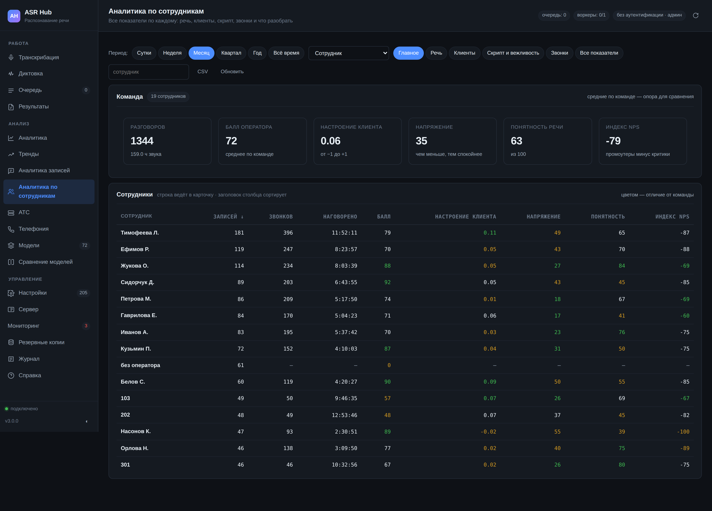

# Аналитика по сотрудникам

Показатели отдела отвечают на вопрос «как у нас дела». Разговор с конкретным человеком требует другого: чтобы всё, что сервер знает о нём, лежало на одном экране и сравнивалось с тем, как это выглядит у соседей.

Раздел «Аналитика по сотрудникам» именно это и делает. Сверху — средние по команде, дальше таблица людей со всеми показателями, под ней — карточка выбранного: сравнение с командой, ход по неделям, нарушения, что разобрать и что послушать как образец.

## Кто такой сотрудник

Сервер не знает людей — он знает признаки, по которым записи группируются. Их пять, и выбор важнее, чем кажется.

| Разрез | Что это | Когда брать |
|---|---|---|
| **Сотрудник** | имя из журнала АТС (поле оператора в CDR или очереди) | почти всегда: это настоящее имя настоящего человека |
| **Оператор** | метка говорящего в записи (`SPEAKER_00`) | когда записи приходят не с АТС и разделение по ролям делает сам разбор |
| **Владелец** | ключ доступа, под которым задание загружено | когда у каждого сотрудника свой ключ |
| **Очередь**, **АТС** | не люди, а участки | когда сравнить надо отделы или филиалы |

Метка говорящего — это «кто заговорил первым», а не человек: во всех записях она одна и та же, и разрез по ней складывает всех операторов в одну строку. Поэтому по умолчанию стоит разрез по журналу АТС.

## Что показывает таблица

Двадцать показателей в одной таблице не читаются — на экране помещается половина, и человек листает вбок вместо того, чтобы сравнивать. Поэтому столбцы собраны в наборы под вопрос, с которым пришли:

- **Главное** — записи, звонки, наговоренное время, балл, настроение клиента, напряжение, понятность, индекс NPS;
- **Речь** — понятность, точность, ритмичность, слова-паразиты, уменьшительно-ласкательные, усталость;
- **Клиенты** — тональность, настроение, напряжение, усилие клиента, индекс NPS;
- **Скрипт и вежливость** — балл, скрипт, вежливость, персонализация, эмпатия, доля записей с нарушениями;
- **Звонки** — записи, звонки, наговоренное время;
- **Все показатели** — весь перечень; таблица уедет вбок, и это осознанный выбор.

Цвет числа — отличие от команды: зелёное лучше среднего по команде больше чем на десятую часть, жёлтое — хуже. Направление у каждого показателя своё: у напряжения и усталости «больше» значит «хуже», и цвет это учитывает.

**«Мало данных»** рядом с именем — меньше пяти разобранных разговоров за период. Средний балл 92 по трём разговорам значит «мало данных», а не «лучший сотрудник», и увидеть это нужно раньше, чем начать разговор.

## Карточка

Открывается по щелчку на строке — **под** таблицей, а не вместо неё: сравнение с соседями составляет половину смысла разговора о человеке.

**Против команды** — столбцы отклонения по шести показателям, приведённым к одной шкале 0–100, где больше всегда лучше. Складывать на одну картинку показатели с разными направлениями — способ получить красивую фигуру без смысла, поэтому напряжения и усталости здесь нет: они в таблице ниже.

**Ход по неделям** — балл, понятность и напряжение по неделям периода. Срез отвечает «как сейчас», ход — «всегда так или стало так на этой неделе»; второе полезнее.

**Таблица сравнения** — двадцать семь показателей в четырёх колонках: у сотрудника, по команде, в прошлом периоде и разница. Разница красится по тому, куда лучше для этого показателя.

**Разобрать с сотрудником** — очередь коучинга по этому человеку с причиной: нарушение, балл ниже 60, скрипт меньше половины, монолог дольше двух с половиной минут, невежливые обороты, возражение без отработки, раздражённый клиент. **Лучшие разговоры** — то же самое с другой стороны: что послушать как образец.

## Выгрузка

Кнопка «CSV» собирает таблицу в том виде, в каком она на экране, — с выбранным набором столбцов и порядком сортировки. Разделитель — точка с запятой, дробная часть через запятую, в начале файла отметка кодировки: Excel с русской локалью открывает такой файл таблицей, а не одной колонкой.

## Чего раздел не делает

**Не считает выработку.** Ни оплаченных часов, ни выполненных заявок, ни продаж: сервер видит только разговоры, и делать вид, что по ним считается результат работы, нечестно.

**Не выставляет оценку человеку.** Балл оператора — это доля выполненных пунктов скрипта минус штрафы; понятность — свойство речи; напряжение — свойство разговора. Ни одно из этих чисел не является оценкой сотрудника, и складывать их в одну «оценку» сервер не будет.

**Не сравнивает несравнимое.** Средний разговор в поддержке и в продажах отличается вдвое, и сравнивать людей из разных очередей по длительности бессмысленно. Отбор по очереди — в разрезе «Очередь».
