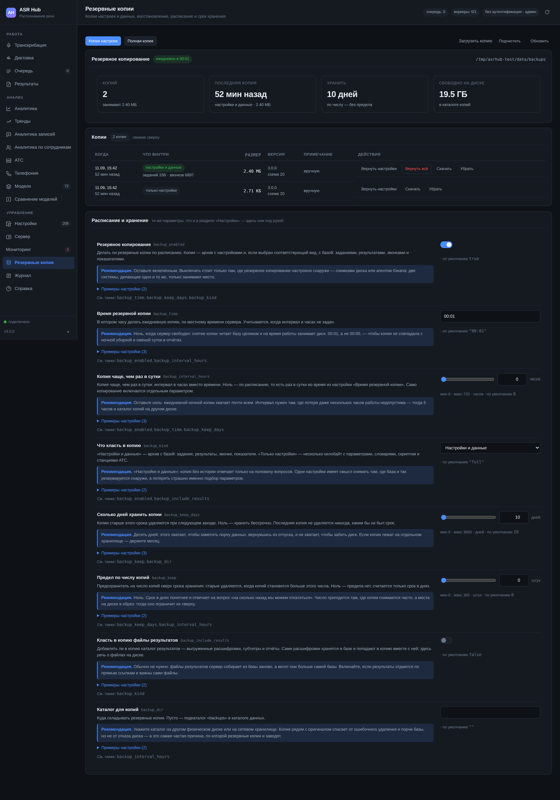

# Резервные копии и восстановление



Резервная копия нужна не тогда, когда ломается диск. Она нужна в тот день, когда кто-то поменял настройку и всё стало хуже, а как было — уже не вспомнить; когда обновление прошло не так; когда на новый сервер надо перенести то, что настраивали полгода.

Поэтому копий здесь две разновидности, и они отвечают на разные вопросы.

## Две копии

**Только настройки** — несколько килобайт: все параметры сервера, словари, категории, скрипт разговора, станции АТС, пороги мониторинга. Снимается мгновенно, переносится куда угодно, открывается любым архиватором. В ней вся работа, вложенная в подбор моделей, порогов и правил, — то, что восстановить по памяти невозможно, а потерять при переустановке проще всего.

**Настройки и данные** — то же самое плюс база: задания, расшифровки, результаты разбора, звонки, показатели, учётные записи. Весит столько же, сколько база.

Копия — это архив `.asrhub.tar.gz` с описью внутри. Опись (`manifest.json`) отвечает, откуда копия, какого она вида, какая в ней версия схемы базы и что лежит внутри. Без описи восстановление превращается в угадывание, а восстановление не из той копии — самая дорогая ошибка из возможных.

База копируется командой SQLite `.backup`, а не `cp`: в режиме WAL рядом с базой лежат файлы `-wal` и `-shm`, и обычная копия получается несогласованной — то есть выглядит как копия и ею не является.

## Расписание

По умолчанию: **каждый день в 00:01, хранить 10 дней**.

| Параметр | Значение | Что делает |
|---|---|---|
| `backup_enabled` | `true` | делать ли копии по расписанию |
| `backup_time` | `00:01` | в котором часу, по местному времени сервера |
| `backup_interval_hours` | `0` | копия чаще, чем раз в сутки; ноль — по расписанию |
| `backup_kind` | `full` | что класть: `full` или `settings` |
| `backup_keep_days` | `10` | сколько дней хранить; ноль — бессрочно |
| `backup_keep` | `0` | предохранитель на число копий; ноль — без предела |
| `backup_include_results` | `false` | класть ли файлы результатов |
| `backup_dir` | пусто | каталог копий; пусто — `backups` в каталоге данных |

Расписание проверяется по местному времени и по тому, была ли копия сегодня, а не по «прошло ли 24 часа». Сервер, постоявший выключенным полчаса, при счёте часов сдвигал бы копию каждый день, пока она не уезжала в разгар рабочего дня.

00:01, а не 00:00, — чтобы копия не совпадала с ночной уборкой и сменой суток в отчётах.

**Последняя копия не удаляется никогда**, каким бы ни был срок хранения: каталог, в котором по правилам не должно остаться ни одной копии, — это не «чисто», а «резервных копий нет».

**Каталог копий лучше вынести на другой диск.** Копия рядом с оригиналом спасает от ошибочного удаления и порчи базы, но не от отказа диска — а это самая частая причина, по которой резервные копии и заводят.

## Восстановление

**Настройки** применяются на ходу: значения из копии заменяют текущие, файл настроек переписывается, перезапуск не нужен. Их для того и снимают, чтобы поднять сервер как был.

**Данные** так не умеют: база открыта прямо сейчас. Файл подменяется, и сервер просит перезапуска — об этом сказано прямо в ответе. Прежняя база не удаляется, а остаётся рядом под именем `asrhub.db.before-restore-<дата>`: восстановление не из той копии — обычная ошибка, и она обязана быть обратимой.

Целостность копии проверяется **до** того, как трогать рабочую базу. Восстановление из битого файла, обнаруженное после подмены, оставляет без базы вовсе — с двумя нерабочими файлами вместо одного.

Параметры, которых нет в каталоге этой версии, пропускаются молча: в копии со старого сервера они есть, а смысла у них здесь нет, и падать из-за них — значит сделать копию бесполезной после каждого обновления.

## Перенос на другой сервер

1. На старом: «Копия настроек» → «Скачать».
2. На новом: «Загрузить копию» → выбрать файл.
3. «Вернуть настройки» на загруженной копии.

Присланный архив проверяется до того, как попасть в список: файл без описи в список не попадает, иначе его однажды выберут для восстановления. Имена внутри архива проверяются тоже — путь вида `../../etc` не кладёт файл мимо каталога, а общий размер распаковки ограничен.

## Что внутри копии настроек

Секреты входят в копию как есть: пароли к АТС, ключи доступа, токены. Копия настроек, из которой сервер не поднимается без ручного ввода паролей, решает не ту задачу, ради которой её снимают.

**Из этого следует, что архив надо хранить как пароль.** Скачивание копии и её загрузка — действия администратора; обычный ключ доступа их не получает.

## Через программный интерфейс

```bash
# Список копий и состояние расписания
curl -H "X-API-Key: $KEY" http://localhost:8081/api/backup

# Снять копию прямо сейчас
curl -X POST -H "X-API-Key: $KEY" \
     "http://localhost:8081/api/backup?kind=settings" \
     -H 'content-type: application/json' -d '{"comment":"перед обновлением"}'

# Вернуть настройки из копии
curl -X POST -H "X-API-Key: $KEY" http://localhost:8081/api/backup/restore \
     -H 'content-type: application/json' \
     -d '{"name":"asrhub-20260911-000100-settings-srv.asrhub.tar.gz","what":"settings"}'

# Скачать копию
curl -H "X-API-Key: $KEY" -O -J \
     "http://localhost:8081/api/backup/<имя>/file"
```

## Проверка копии

Копия, которую никто не пробовал восстановить, — это предположение о копии. Раз в квартал стоит поднять сервер из полной копии на любой свободной машине и убедиться, что он поднимается: пять минут работы против дня, в который выясняется, что копии были пустыми.

Проверить содержимое можно и не восстанавливая:

```bash
tar tzf asrhub-20260911-000100-full-srv.asrhub.tar.gz
tar xzf asrhub-20260911-000100-full-srv.asrhub.tar.gz -O manifest.json | python3 -m json.tool
sqlite3 /tmp/проверка/db/asrhub.db "PRAGMA integrity_check;"
```
