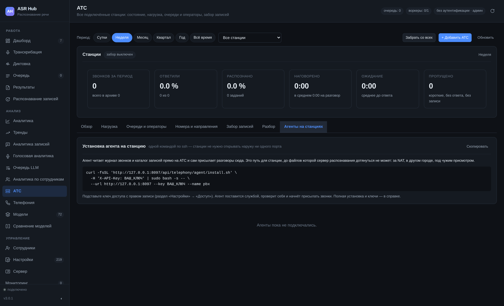

# Агент на станции Asterisk

## Зачем он нужен

Забор «изнутри» — когда сервер распознавания сам читает журнал АТС и её каталог записей — работает ровно в одном случае: файлы станции видны серверу. Общий диск, смонтированный по NFS каталог, одна машина на двоих. В жизни станция чаще стоит отдельно: за NAT, в другом городе, под присмотром подрядчика, который не даст ни SSH, ни доступа к `/var/spool`. Тогда события из AMI ещё как-то доходят, а записей не достать никак — и журнал CDR лежит там же, где сервера нет.

Агент решает это с другой стороны. Он ставится **на саму станцию**, читает её журнал звонков и её же каталог записей и сам отправляет разговор вместе с файлом на сервер ASR Hub. Наружу станции при этом не нужно открывать ни одного порта — достаточно исходящего соединения.

| | Забор «изнутри» | Агент на станции |
|---|---|---|
| Где живёт | на сервере ASR Hub | на самой АТС |
| Что нужно от станции | доступ к файлам (монтирование) или учётная запись AMI | ничего: соединение начинает агент |
| Как приезжает запись | сервер ищет её в каталоге по имени | приезжает вместе со звонком, одним запросом |
| Дописан ли файл | сервер проверяет, что он перестал расти | агент знает это на месте |
| Станция за NAT | не работает | работает |
| Задания «собрать архив» | выполняет сервер | ставятся на сервере, забираются агентом |

Звонки агента лежат в архиве под станцией `agent:<идентификатор>` — отдельно от станций, которые сервер читает сам. Перепутать их нельзя: у них разные идентификаторы звонков и разные каталоги записей.



## Установка одной командой

На станции, от root:

```bash
curl -fsSL 'http://asr-hub:8081/api/telephony/agent/install.sh' \
     -H 'X-API-Key: ah_ВАШ_КЛЮЧ' | sudo bash -s -- \
     --url http://asr-hub:8081 --key ah_ВАШ_КЛЮЧ --name pbx-msk
```

Готовую строку с подставленным адресом сервера показывает раздел **АТС → Агенты на станциях**, там же есть кнопка «Скопировать». Ключ нужен обычный, с правом записи — раздел **Настройки → Доступ**.

Через SSH, не заходя на станцию руками:

```bash
ssh root@pbx-msk "curl -fsSL 'http://asr-hub:8081/api/telephony/agent/install.sh' \
  -H 'X-API-Key: ah_ВАШ_КЛЮЧ' | bash -s -- \
  --url http://asr-hub:8081 --key ah_ВАШ_КЛЮЧ --name pbx-msk"
```

### Что делает установщик

1. Проверяет, что запущен от root, что есть `python3` не ниже 3.6 и `curl` или `wget`. На CentOS 7 и Debian подсказывает, чем доставить недостающее.
2. Проверяет, что сервер ASR Hub отвечает и принимает ключ. Установка без связи бессмысленна: агент всё равно не заработает.
3. Создаёт `/opt/asrhub-agent` и скачивает туда самого агента с сервера (`/api/telephony/agent/asrhub-agent.py`). Отдельный дистрибутив, git и копирование файлов руками не нужны.
4. Пишет `/etc/asrhub-agent.conf` с правами `600` (в нём ключ доступа). Существующий файл не перезаписывает без `--force`, но адрес и ключ в нём обновляет.
5. Запускает самопроверку `--selftest`. Служба включается только после неё: агент, который не видит журнал, лучше не заводить вовсе, чем заводить молча.
6. Создаёт службу systemd `asrhub-agent.service` (режим `--follow`, `Restart=always`, `RestartSec=10`), от пользователя `asterisk`, если он есть, иначе от root. Включены `NoNewPrivileges`, `PrivateTmp`, `ReadWritePaths` только на свои каталоги.
7. Печатает итог: где журнал, как остановить, как удалить.

### Ключи установщика

| Ключ | Что делает |
|---|---|
| `--url` | адрес сервера ASR Hub. Обязателен |
| `--key` | ключ доступа с правом записи. Обязателен |
| `--name` | как станция будет называться в разделе «АТС». По умолчанию — имя хоста |
| `--source` | `auto` (по умолчанию), `csv`, `mysql` или `dir` — откуда брать журнал |
| `--cdr-file` | путь к `Master.csv`, если он не там, где обычно |
| `--recordings` | каталог записей. По умолчанию `/var/spool/asterisk/monitor` |
| `--interval` | пауза между заходами в режиме службы, секунды. По умолчанию 60 |
| `--no-service` | поставить агента, но не заводить службу |
| `--force` | перезаписать существующие настройки |
| `--uninstall` | остановить и удалить службу, файлы и настройки |
| `--yes` | не спрашивать подтверждения (для `--uninstall` в скриптах) |

Удаление:

```bash
sudo bash /opt/asrhub-agent/install.sh --uninstall --yes
```

Звонки, которые агент успел прислать, остаются в архиве сервера: удаляется программа, а не данные.

## Файл настроек

`/etc/asrhub-agent.conf`, обычный INI, права `600`. Параметры командной строки перекрывают файл.

```ini
[agent]
url = http://asr-hub:8081
key = ah_…
name = pbx-msk
source = auto
cdr_file = /var/log/asterisk/cdr-csv/Master.csv
recordings_dir = /var/spool/asterisk/monitor
filename =
interval = 60
min_duration_s = 10
skip_unanswered = true
max_file_mb = 512
insecure = false
```

| Параметр | По умолчанию | Что означает и когда менять |
|---|---|---|
| `url` | — | Адрес сервера ASR Hub. Менять при переезде сервера |
| `key` | — | Ключ доступа. В журнал не попадает никогда: всюду маскируется до вида `ah_1234…` |
| `name` | имя хоста | Имя станции в разделе «АТС». Меняется свободно, идентификатор агента от него не зависит |
| `source` | `auto` | Откуда брать журнал: `csv`, `mysql`, `dir`. При `auto` агент определяет сам — см. ниже |
| `cdr_file` | `/var/log/asterisk/cdr-csv/Master.csv` | Путь к журналу. Для `cdr_custom` укажите свой файл |
| `recordings_dir` | `/var/spool/asterisk/monitor` | Каталог записей. Просматривается рекурсивно |
| `filename` | пусто | Шаблон имени записи. Подстановки: `{uniqueid}`, `{src}`, `{dst}`, `{год}`, `{месяц}`, `{день}`. Пусто — искать по общим правилам |
| `interval` | 60 | Пауза между заходами в режиме службы. Меньше 10 секунд ставить незачем: CDR пишется не чаще |
| `min_duration_s` | из ответа сервера | Не слать разговоры короче. Шестисекундный звонок — это «ошиблись номером» |
| `skip_unanswered` | из ответа сервера | Не слать неотвеченные: записи у них либо нет, либо в ней одни гудки |
| `max_file_mb` | из ответа сервера | Предел размера записи. Файл крупнее уезжает как звонок без записи, а не теряется |
| `insecure` | `false` | Не проверять сертификат сервера. Включать только во внутренней сети и понимая зачем: агент об этом громко предупреждает |

## Режимы работы

```bash
# самопроверка: ничего не отправляет, только смотрит и отчитывается
/opt/asrhub-agent/asrhub-agent.py --selftest

# один заход: новые звонки с прошлого раза
/opt/asrhub-agent/asrhub-agent.py --once

# весь архив станции
/opt/asrhub-agent/asrhub-agent.py --all

# за период (принимает 2026-09-01, «2026-09-01 10:00» и «-7d»)
/opt/asrhub-agent/asrhub-agent.py --since 2026-09-01 --until 2026-09-30

# служба: заходы подряд с паузой interval
/opt/asrhub-agent/asrhub-agent.py --follow

# посмотреть, что бы он сделал, ничего не отправляя
/opt/asrhub-agent/asrhub-agent.py --all --dry-run
```

Дополнительно: `--verbose` и `--quiet` меняют подробность журнала, `--log-file` — куда писать (по умолчанию `/var/log/asrhub-agent.log`, с ротацией по размеру), `--timeout` — тайм-аут запросов, `--retries` — сколько раз повторять.

Коды возврата: `0` — всё хорошо, `1` — были ошибки, `2` — ошибка настройки, `3` — агент уже запущен (второй экземпляр не поднимается: файловая блокировка на `/var/lib/asrhub-agent/agent.lock`).

## Откуда агент берёт звонки

При `source = auto` агент проверяет источники по очереди и берёт первый пригодный.

**Журнал CSV.** `/var/log/asterisk/cdr-csv/Master.csv` и файлы `cdr-custom/*.csv`. Разбирается настоящим разбором CSV: в поле `clid` запятые — обычное дело («Иванов, отдел продаж»), и деление по запятой сдвинуло бы все поля правее. Поддерживаются обе принятые раскладки — на 18 и на 19 колонок; какая именно, определяется по положению поля, похожего на `uniqueid`, и по нему же ловится сдвиг колонок. Позиция чтения запоминается в байтах вместе с inode файла. Если журнал повернули (файл сменился), агент сначала дочитывает хвост повёрнутого файла с запомненного места — его находит по тому же inode, — а потом читает новый с начала; при ротации с `copytruncate` (файл стал короче при том же inode) хвост берётся из свежей копии `Master.csv.*`. До 3.1.14 хвост — звонки между прошлым заходом и ротацией — терялся. Сжатые копии агент не распаковывает. Полный сбор дочитывает все повёрнутые копии.

**MySQL/MariaDB.** Настройки читаются из `/etc/asterisk/cdr_mysql.conf` (секция `[global]`: `hostname`, `dbname`, `table`, `user`, `password`, `port`, `sock`). Запрос выполняется внешней программой `mysql --batch --raw`, чтобы не тянуть на станцию драйвер; пароль передаётся через временный `my.cnf` с правами `600` — аргументы процесса видны в `ps` любому. Если `mysql` не установлен, агент говорит об этом прямо и предлагает поставить клиент или перейти на CSV.

`calldate` в таблице — время **начала** звонка, а строку Asterisk пишет по **окончании**: получасовой разговор, начатый в 10:00, появляется в таблице в 10:30, когда позиция чтения давно ушла дальше за короткими звонками. Поэтому выборка берёт окно запаса в шесть часов назад от позиции, а уже отправленные в этом окне звонки отсеивает по списку отправленных. До 3.1.12 отбор «calldate не раньше позиции» таких звонков не видел никогда — терялись самые длинные разговоры.

**Каталог записей.** Когда журнала нет вовсе: звонком считается файл. Полей у такого звонка ровно столько, сколько удалось прочитать в имени.

## Как находится запись

Порядок — от точного к приблизительному:

1. **По шаблону** `filename`, если он задан. Подстановки те же, что у сервера, включая короткие `${YYYY}`, `${MM}`, `${DD}`, `${HH}` и звёздочку: `out-${DST}-${SRC}-${YEAR}${MONTH}${DAY}-*.wav` находит ближайший по времени к звонку файл.
2. **По идентификатору звонка**: файл, в имени которого стоит `uniqueid` — отдельно, а не частью другого идентификатора (`1757500001.1` не находит `1757500001.12.wav`). Так работает `MixMonitor` с `${UNIQUEID}` в имени — самый надёжный случай.
3. **По номерам и времени**: файл, в имени которого есть оба номера, с меткой времени в пределах окна.

Указатель по идентификаторам строится один раз на заход: обход архива в сотни тысяч файлов стоит секунд, и делать его на каждый звонок нельзя. Промах по свежему звонку пересобирает указатель — иначе запись, закрытая `MixMonitor` уже после обхода, потерялась бы навсегда.

Файл, который ещё пишется (размер меняется между двумя замерами), откладывается до следующего захода.

## Состояние и что будет, если его потерять

`/var/lib/asrhub-agent/state.json`, права `600`, запись атомарная (`tmp` + `os.replace` + `fsync`). В нём: позиции источников, множество уже отправленных идентификаторов (последние 200 000), отложенные звонки со сроком в сутки и счётчики.

Если файл потерялся — станцию переустановили, каталог вычистили, — агент придёт к серверу без своего идентификатора. Сервер в этом случае **узнаёт его по имени хоста и имени станции** и отдаёт прежний идентификатор. Это не косметика: без узнавания агент получил бы новый идентификатор, в архиве появилась бы вторая станция `agent:…` с теми же разговорами, и весь архив поехал бы по сети заново — десятки гигабайт и двойной счёт в отчётах.

## Обмен с сервером

1. `POST /api/telephony/agent/hello` — «я такой-то, вот станция, версия и моё состояние». В ответ: идентификатор агента, предел размера записи, правила отсева (`min_duration_s`, `skip_unanswered`), признак «включён» и задание, если его поставили в разделе «АТС». Самопроверка здоровается с пометкой «только посмотреть» (`"peek": true`): задание ей показывают, но не снимают, и её приветствие не затирает состояние агента в разделе. До 3.1.14 самопроверка — а её запускает и повторный `install.sh` — забирала «Собрать всё», нажатое в разделе, и сбор не происходил.
2. `POST /api/telephony/agent/ask` — список идентификаторов звонков (по 2000 за раз). Сервер отвечает, какие из них ему ещё нужны. Без этого шага повторный сбор архива тащил бы по сети всё заново: на сорока тысячах разговоров это десятки гигабайт впустую.
3. `POST /api/telephony/agent/call` — звонок и его запись одним многочастным запросом: поле `meta` (JSON со сведениями о звонке), поле `file` (сама запись, необязательное). Звонок без записи тоже приезжает — он нужен в журнале и в счётчиках, просто распознавать нечего. Если сервер не принял именно запись — она больше предела (413; так же отвечает и nginx с его `client_max_body_size`) или не того вида (415), — агент шлёт звонок ещё раз без неё, с пометкой «сервер не принял запись: …». До 3.1.14 такой звонок считался ошибкой и пропадал из журнала.
4. `GET /api/telephony/agent/command?agent_id=…` — задание, если его поставили. Выдаётся один раз и тут же снимается, поэтому выполняется сразу.

Ключ передаётся заголовком `X-API-Key` — так же, как его принимает от любого клиента остальной сервер.

Многочастное тело читается кусками прямо с диска: гигабайтная запись не попадает в память станции целиком. Повторы при сбоях — с растущей паузой (1, 2, 4, 8, 16, 30 с) на сетевых ошибках, 5xx, 408 и 429 (с уважением к `Retry-After`); ответы 4xx не повторяются и объясняются человеку.

Если повторы кончились, а отказ временный (очередь сервера полна — 429, сервер перезапускается за прокси — 502 и 503), заход прерывается, а этот звонок и остаток порции уходят в отложенные и приедут следующим заходом. До 3.1.12 такой звонок считался ошибкой, заход шёл дальше, и звонок терялся: позиция журнала к этому времени уже сдвинута.

## Задания с сервера

Достучаться до станции за NAT сервер не может — связь всегда начинает агент. Поэтому задания кладутся рядом с записью агента и ждут его следующего обращения. В разделе **АТС → Агенты на станциях** есть две кнопки:

* **Собрать всё** — агент пройдёт весь архив станции и пришлёт то, чего на сервере нет;
* **Новые** — обычный заход за свежими звонками.

Задание забирается один раз: повторно оно не выполняется, даже если агент перезапустился в процессе.

## Служба

```bash
systemctl status asrhub-agent        # состояние
journalctl -u asrhub-agent -f        # журнал службы
tail -f /var/log/asrhub-agent.log    # собственный журнал агента
systemctl stop asrhub-agent          # остановить
systemctl disable --now asrhub-agent # выключить совсем
```

## Когда что-то не так

**`--selftest` ругается на журнал.** Проверьте путь и права: агент работает от пользователя `asterisk`, а `cdr-csv` иногда лежит с правами только для root. Лечится `chmod o+r` или запуском от root.

**Ответ 401 или 403.** Ключ не тот, у ключа нет права записи или агент выключен на сервере (раздел «АТС», кнопка рядом с агентом). Агент в этом случае продолжает здороваться, чтобы в разделе была видна связь, но записей не шлёт.

**Записи не находятся.** Самая частая причина — `MixMonitor` зовут без `${UNIQUEID}` в имени, и сопоставить звонок с файлом не по чему. Либо добавьте идентификатор в имя записи, либо задайте `filename` — шаблон с подстановками.

**`mysql` не установлен.** Поставьте клиент (`apt install mariadb-client` / `yum install mysql`) или переключитесь на CSV: `source = csv`.

**Часы разошлись.** Агент сверяет своё время с серверным и предупреждает при расхождении больше двух минут. По времени звонка строится вся аналитика, поэтому это не мелочь: включите `chrony` или `systemd-timesyncd`.

**Агент «молчит» в разделе.** Смотрите столбец «Последняя связь»: больше суток — красным. Проверьте, запущена ли служба и доходит ли станция до сервера (`curl -sf $URL/api/health`).

**Под версией агента — «сервер 3.1.x — обновите».** Агент берётся из установки сервера, и его версия совпадает с версией сервера, из которого он скачан. Отставший агент не знает исправлений последних версий: переустановите его той же командой, что показана в разделе.

## Безопасность

* Станции не нужно открывать ни одного порта: соединение всегда исходящее.
* Ключ лежит в файле с правами `600` и никогда не попадает в журнал — всюду маскируется.
* Агент только читает журнал и записи; ничего на станции не меняет и ничего не удаляет.
* Сертификат сервера проверяется; `--insecure` отключает проверку и громко об этом предупреждает.
* Пароль к MySQL передаётся через временный файл с правами `600`, а не аргументом командной строки.
* Установщик передаёт ключ программе `curl` файлом настроек (`-K`) во временном каталоге с правами
  `700`, а не аргументом `-H`: аргументы любой программы видны каждому пользователю станции в `ps`
  и `/proc/*/cmdline`. У GNU `wget` то же делает `--config`; только у `wget` из busybox такой
  возможности нет, и там ключ, к сожалению, идёт аргументом — поставьте `curl`, если на станции
  работают посторонние пользователи.
* Недоступный сервер установщик называет прямо — «сервер недоступен» с командой проверки, — а не
  загадочным «HTTP 000000», как было до версии 3.1.12.
