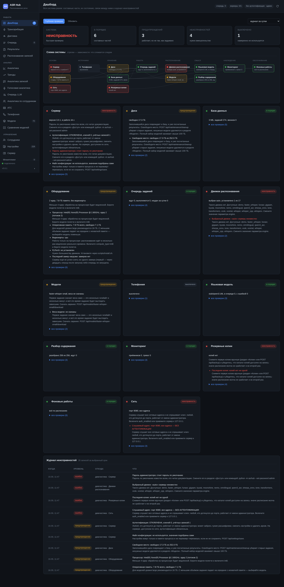

# Дашборд и автодиагностика

## Зачем он есть

Ответ на вопрос «что у нас сломалось» до этого раздела собирался из четырёх мест: неудавшиеся задания — в разделе заданий, тревоги — в мониторинге, сбои станций — в «АТС», ошибки смыслового слоя — у языковой модели. Пока их четыре, не смотрят ни в одно.

Дашборд показывает всю систему разом: четырнадцать составных частей, их состояние, связи между ними и общий журнал неисправностей. Это первый раздел в меню, и открывать его имеет смысл так же, как смотреть на приборную панель: утром, после обновления и всякий раз, когда «что-то не так».

## Схема системы

Наверху — схема: узлы по группам слева направо (основа, источники, хранение, работа, распознавание, смысл, наблюдение, обслуживание) и стрелки зависимостей между ними.

Цвет узла — его состояние:

| Цвет | Состояние | Что означает |
|---|---|---|
| зелёный | в порядке | часть работает как задумано |
| жёлтый | предупреждение | работает, но не так, как задумано: место на диске кончается, копия устарела, замер не приходил |
| красный | неисправность | нужно вмешательство: выбранный движок не установлен, копий нет вовсе, порт слушается без аутентификации |
| серый | выключено | часть намеренно не используется (телефония выключена, языковая модель не подключена) |

Стрелки — поле `depends_on`: что сломается следом. Если красная «База данных», то жёлтая «Очередь заданий» рядом — не отдельная беда, а следствие. Щелчок по узлу перелистывает к его карточке и подсвечивает её.

## Что именно проверяется

Четырнадцать разделов. Звёздочкой отмечены проверки, которые идут только при глубокой проверке.

| Раздел | Проверки | Пороги и что значит плохое |
|---|---|---|
| **Сервер** | версия, проблемы конфигурации, аутентификация, пароль по умолчанию, файл настроек | пароль по умолчанию — неисправность: его знает каждый, кто читал документацию. Выключенная аутентификация на сетевом адресе — тоже |
| **Диск** | свободно, предел приёма, размер каталогов\* | меньше 5 ГБ — неисправность, меньше 20 ГБ — предупреждение; отдельно неисправность, если свободного меньше `disk_min_free_gb` (сервер уже отказывает в приёме) |
| **База данных** | размер, версия схемы, режим журнала, размер `-wal`, целостность\*, последняя копия | схема в базе, разошедшаяся с кодом, — неисправность; `-wal` больше 256 МБ — предупреждение (никто не закрывает соединения) |
| **Оборудование** | процессор, память, видеокарты, **устройство**, **драйвер**, `ffmpeg`, PyTorch, свежесть замеров, загрузка карт | память ≥ 16 ГБ — норма, ≥ 6 — предупреждение, меньше — неисправность; ядер меньше четырёх — предупреждение; карта горячее 85 °C — предупреждение; замер старше пяти минут — поток замеров встал; настроенное устройство недоступно процессу — неисправность; модуль ядра и библиотеки NVIDIA разошлись — неисправность |
| **Очередь заданий** | пауза, глубина, экземпляры над общей базой, неудачи за сутки, среднее ожидание | любая неудача — предупреждение; пять и больше при доле выше 30 % — неисправность; среднее ожидание больше 10 минут — предупреждение |
| **Движки распознавания** | какой выбран, какие установлены | выбранный движок не установлен — неисправность с готовой командой `scripts/models.sh install-engine` |
| **Модели** | модель по умолчанию, скачаны ли веса, сколько занимают\* | веса не скачаны — предупреждение: первое задание скачает их само, но будет выглядеть зависшим |
| **Телефония** | включена ли, по станции на каждую, агенты | станция без последнего захода, агент, молчащий больше суток, — предупреждения. При глубокой проверке сюда же попадает краткий итог «Разбора» (см. главу о телефонии) |
| **Языковая модель** | как подключена, доступен ли сервер\*, последняя ошибка, очередь, поток | очередь растёт, а поток не работает — предупреждение; сервер модели не отвечает — неисправность |
| **Разбор содержания** | включён ли, покрытие архива, категории, последняя ошибка, поток | покрытие сильно ниже архива — предупреждение: разбор отстаёт |
| **Мониторинг** | экспорт, приёмники, тревоги, сбор\* | горящая тревога — неисправность; приёмник, куда не уходит, — предупреждение; «экспорт выключен» (`metrics_enabled: false`) значит, что опросом метрики не отдаются ни на `/api/monitoring/metrics`, ни на `/api/metrics` |
| **Резервные копии** | включены ли, последняя, объём, срок хранения | копий нет вовсе — неисправность, но не на свежей установке: пока база моложе двойного интервала (или 48 часов), это сведения «первая снимется по расписанию»; последняя старше двойного интервала — предупреждение |
| **Фоновые работы** | копия, сводка, очередь проверки, контрольные прогоны, справочник, уборка | работа, отставшая вдвое от своего срока, — предупреждение |
| **Сеть** | слушаемый адрес, CORS, адрес уведомления\*, адрес сводки\* | `0.0.0.0` с выключенной аутентификацией — неисправность |

Каждая проверка отвечает четырьмя вещами: состоянием, тем, что видно («свободно 17.7 ГБ»), подсказкой, что делать, и метриками для интерфейса. В карточке раздела сначала показывается плохое, а всё остальное прячется под «все проверки».

### Видеокарты, «Устройство» и «Драйвер» — три разные проверки

В разделе «Оборудование» их две, и разница между ними не косметическая.

**Видеокарты** читают `nvidia-smi`: что за карта, сколько памяти, какая загрузка. Это про железо в машине.

**Устройство** спрашивает карту **от имени самого процесса службы** — то есть отвечает на вопрос, сможет ли задание на ней работать. Проверка идёт по настройке `device`, а не по тому, что нашлось в машине.

Эти два ответа расходятся в трёх случаях, и каждый из них снаружи выглядит как исправная система:

* `CUDA_VISIBLE_DEVICES` в окружении службы указывает на карту, которой нет (или `device: cuda:3` при единственной карте);
* карта отвалилась на ходу — ошибка CUDA липкая, и процесс уже не поправится сам, хотя `nvidia-smi` показывает норму;
* драйвер обновлён без перезагрузки: библиотеки новые, модуль ядра прежний.

Во всех трёх «Видеокарты» зелёные, а каждое задание падает. Ради этого расхождения проверка и написана.

**Драйвер видеокарты** отвечает на третий вопрос — *почему* карты нет. Это не то же самое, что «нет»: от ответа зависит, что делать, а действия три разных, и ошибка стоит чужого простоя.

| Что показано | Что случилось | Что делать |
|---|---|---|
| модуль и библиотеки сходятся | дело не в драйвере | смотреть `CUDA_VISIBLE_DEVICES`, Xid, номер карты |
| модуль в памяти старее, чем на диске | драйвер обновлён без перезагрузки | `sudo reboot` |
| модуль собран под другое ядро | ядро обновилось, DKMS не пересобрал | `linux-headers-$(uname -r)` и `linux-headers-generic`, затем `dkms autoinstall -k "$(uname -r)"` и перезагрузка |
| модуля нет ни под одним ядром | DKMS не собрал вовсе | `dkms status`; если новой версии там нет — приехали только библиотеки, чинить пакеты |

Третья строка — не теоретическая. `modinfo nvidia` смотрит только на работающее ядро и про модуль, собранный под соседнее, честно молчит; без обхода `/lib/modules/*` панель отправляла бы пересобирать то, что уже собрано.

Проверки нет вовсе на машине без драйвера NVIDIA: там сравнивать нечего, и строка «неизвестно» — это шум, а не сведения.

Приговор о драйвере — это два запуска `nvidia-smi`, `dkms status` и `modinfo`. При обычном опросе панели (раз в десять секунд из каждой открытой вкладки) он берётся не старше минуты; глубокая проверка спрашивает заново всегда.

Ядра и память в разделе «Оборудование» — те, что доступны серверу: в контейнере с квотой (`--cpus`, `--memory`, cgroup) считаются квота и предел контейнера, а не ядра и память всей машины. Свободное место, доступная память и свободная видеопамять меряются заново при каждом запросе (видеопамять — не чаще раза в 15 секунд), а не один раз при запуске.

Панель говорит здесь ровно то же, что скрипты установки и обновления. Расходиться им в такой мелочи нельзя: человек читает их по очереди.

При `device: auto` неисправности не бывает: сервер сам уходит на процессор, когда карты нет. Но проверка всё равно говорит, чем это кончилось — `auto → cpu`: молчаливый уход на процессор выглядит как «сервер без причины стал медленным».

## Быстрая проверка и глубокая

Обычный заход — это чтение настроек, памяти и базы: доли секунды, поэтому панель опрашивает его сама каждые десять секунд.

Кнопка **«Глубокая проверка»** добавляет то, что стоит секунд: `PRAGMA quick_check` по базе, разбор забора по каждой станции, пробу сервера языковой модели, обход каталогов данных и попытку достучаться до внешних адресов. Проба адресов делает именно соединение, а не запрос: GET по входящему адресу чата отправил бы пустое уведомление каждому, кто нажал кнопку.

Раздел, чья проверка сама споткнулась, показывается красным с текстом ошибки и не мешает остальным. «Диагностика упала» — худший из возможных ответов там, где и так что-то сломано.

## Журнал неисправностей

Внизу раздела — общий список за сутки, неделю или месяц. В него сходятся пять источников:

1. то, что не так прямо сейчас (текущие проверки в состоянии «предупреждение» и «неисправность»);
2. неудавшиеся задания за период — с именем файла и причиной;
3. события базы «плохих» видов: отказы, тревоги, повторы, сбои обновления справочника;
4. последняя ошибка каждой станции;
5. ошибки смыслового слоя.

Ключ без прав администратора видит только свои задания и события своих заданий — ровно так же, как в списке заданий.

Появление и исчезновение проблемы записываются в ленту событий: «Неисправность: …» и «Устранено: … (длилось 3.5 ч)». Записывается именно изменение, а не состояние: иначе опрос панели раз в десять секунд забил бы ленту одной и той же строкой. Отпечаток текущего набора проблем хранится в служебной таблице и не разрастается — ушедшая проблема удаляется из него в том же заходе, в котором о ней пишется «Устранено».

## Что видит не администратор

Полный свод отдаётся только администратору. Остальным раскладка каталогов, адреса и имена файлов не показываются: путь к базе и адрес приёмника метрик — это разведка перед атакой, а не справочная информация. Метрики с известными именами (`path`, `url`, `dir`, `host`, `config_file` и прочие) выбрасываются, а в оставшихся строках маскируется всё, что похоже на адрес или начинается с каталога данных.

Запись в ленту событий идёт только от администратора: иначе опрос панели обычным ключом писал бы в базу на каждый запрос.

## Как этим пользоваться

**Утренний осмотр.** Открыть дашборд, посмотреть на четыре числа наверху. Зелёное — закрыть. Жёлтое — прочитать карточку: обычно это место на диске или устаревшая копия.

**После обновления.** Нажать «Глубокую проверку». Она пройдёт по целостности базы, версии схемы, движкам и станциям — то есть по всему, что обновление могло сдвинуть.

**По жалобе «сервер тормозит».** Смотреть «Очередь заданий» (глубина и среднее ожидание), «Оборудование» (загрузка карты, температура) и «Языковая модель» (не ушла ли видеокарта под разбор). Схема покажет, что от чего зависит, а журнал — что случилось за последние сутки.

**Программно.** `GET /api/system/selfcheck?deep=1` отдаёт весь свод одним объектом — годится для внешнего мониторинга; `GET /api/system/problems?since=…` — журнал неисправностей.
