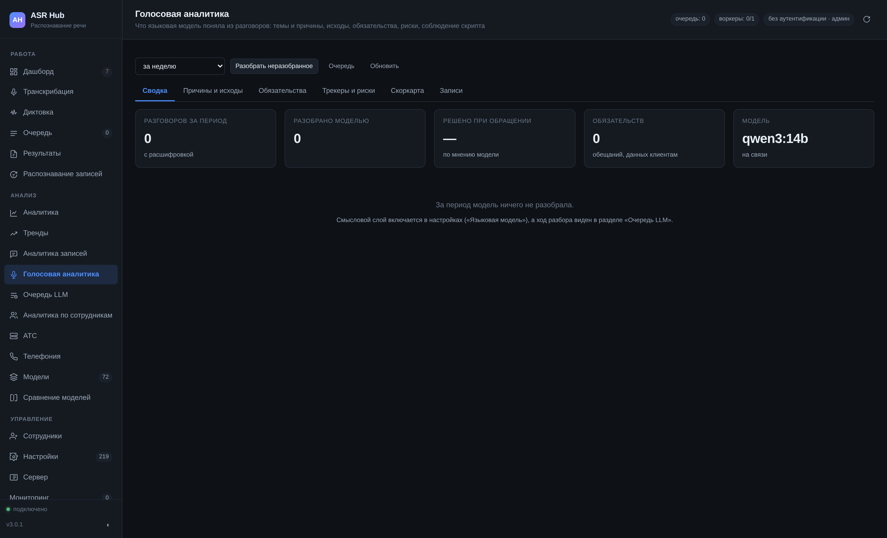
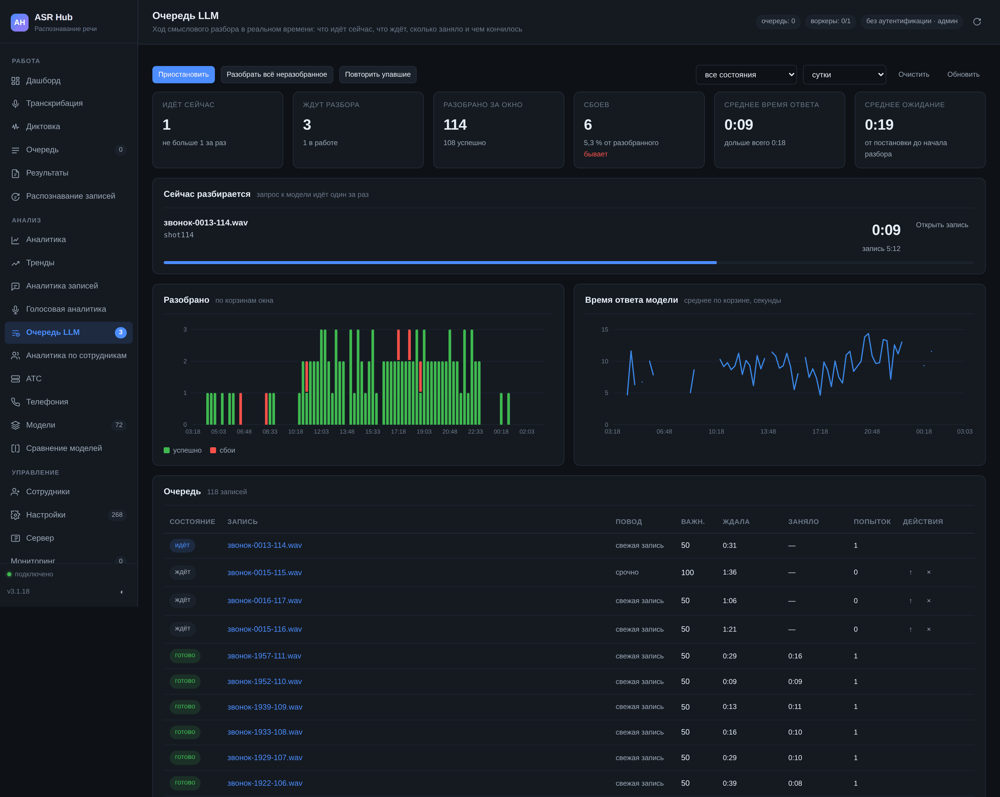

# Голосовая аналитика и очередь к модели

## Чем это отличается от «Аналитики записей»

Два раздела смотрят на одни и те же разговоры, но разными глазами.

**Аналитика записей** считает признаки из самого текста и звука: тональность, темп, паузы, перебивания, слова-паразиты, срабатывания словарей, соблюдение скрипта. Всё это считается правилами — быстро, дёшево, одинаково на любом объёме и без единого обращения к чему-либо внешнему.

**Голосовая аналитика** показывает то, что поняла языковая модель: о чём был разговор, чем он кончился, что пообещали клиенту, где риск. Правилами это не считается: «клиент остался недоволен, хотя ни разу не повысил голос» — вывод, а не признак.

Смысловой слой необязателен и по умолчанию выключен. Включается в настройках («Языковая модель» → «Как подключена»), работает через локальную Ollama или любой OpenAI-совместимый сервер.



## Шесть вкладок

### Сводка

Пять чисел наверху: сколько разговоров за период, сколько из них модель разобрала (и какая это доля — если она мала, разбор отстаёт), доля решённых при обращении, число обязательств и состояние модели.

Ниже — две картинки: причины обращений столбиками и исходы кольцом. Это ответ на вопрос «о чём вообще были разговоры» одним взглядом.

### Причины и исходы

Главная таблица раздела — перекрёстная: причина × исход, сколько разговоров в каждой клетке. Сама по себе причина не говорит ничего: «доставка — 320 обращений» это просто объём. А «доставка → не решено, 40 %» — это уже задача на неделю. Клетки считаются по всем разобранным записям периода, а не по списку на вкладке «Записи»: тот ограничен последними тремястами, и таблица по нему врала бы на любом большом архиве.

Под ней — цитаты, по которым модель решила. Это проверка на доверие: видно, за что именно зацепилась модель, и если цитата не подтверждает вывод, ответу этой модели верить нельзя. Смотреть цитаты стоит хотя бы по десятку записей после каждой смены модели или промпта.

### Обязательства

Всё, что пообещали клиентам: «перезвоню завтра», «отправим счёт до вечера», «уточню и напишу». По каждому — когда, что обещано, срок и запись, из которой это взято. На вкладке — двести последних обязательств, свежие сверху.

Ценность в том, что до этого списка обещания жили только в голове оператора. Выгрузить его руководителю группы в понедельник — самая простая и самая заметная польза от смыслового слоя.

### Трекеры и риски

Умные трекеры — это вопросы, которые модель задаёт каждому разговору: упоминали ли конкурента, говорили ли о возврате денег, звучала ли угроза жалобы. Настраиваются в параметре «Умные трекеры». На вкладке — сколько разговоров задело каждый и список этих разговоров.

### Скоркарта

Вопросы вида «представился ли оператор», «предложил ли альтернативу», «попрощался ли по скрипту» — с долей выполнения по каждому. Полоса красная ниже 50 %, жёлтая до 80 %, зелёная выше. Сортировка от худшего: сверху то, чем стоит заняться.

### Записи

Простой список разобранного: когда, какая запись, резюме, причина, исход, решено или нет. Отсюда открывается карточка записи с полной расшифровкой. В списке — последние 300 записей периода; сколько их всего, раздел пишет над таблицей. Разбор более ранней записи виден в её карточке (раздел «Записи», `GET /api/content/jobs/{id}/llm`); ограничение то же и в ответе `GET /api/content/llm` — поля `rows` и `rows_total`.

## Очередь запросов к модели

Отдельный раздел меню — «Очередь LLM».

### Зачем она в базе

Раньше очередь смыслового разбора жила в памяти процесса. Это стоило трёх вещей:

* **перезапуск терял её целиком.** Тысяча записей, поставленных на разбор, исчезала, и узнавали об этом через неделю по дырам в аналитике;
* **её не было видно.** «В очереди: 812» — всё, что мог показать интерфейс. На вопрос «что именно сейчас занимает видеокарту» ответа не было;
* **ею нельзя было управлять.** У очереди в памяти из управления есть только «положить».

Теперь это таблица в базе. Перезапуск её не теряет: записи, застигнутые остановкой в состоянии «идёт», при следующем старте возвращаются в очередь — иначе они остались бы идущими навсегда и не разобрались бы уже никогда.

### Состояния

| Состояние | Что означает |
|---|---|
| ждёт | стоит в очереди, до неё не дошли |
| идёт | модель отвечает прямо сейчас |
| готово | разобрано, ответ в базе |
| ошибка | разбор сорвался; причина видна в строке |
| отменён | сняли из очереди руками |

Сбой сбою рознь. Если сервер модели не принимает соединение, перезапускается, за прокси отвечает 502, 503 или 504, занят (429) или не хватает свободной видеопамяти, — запись возвращается в очередь, **не тратя попытку**: это сбой сервера, а не записи, и до 3.1.14 минутный перезапуск Ollama уводил головные записи в «ошибку» за полминуты. Тайм-аут попыткой считается: запись, на которой модель не укладывается в срок, иначе повторялась бы вечно. Запись, пришедшая заново из «ошибки» или «готово» (повтор, повторное распознавание), получает новые попытки, а не «последнюю из прежних трёх».

### Важности

Из очереди первой берётся запись с большей важностью, при равной — та, что ждёт дольше. Порядок задуман так:

* **70** — разбор по просьбе: кнопка в карточке, отбор в «Результатах». Человек ждёт ответа сейчас;
* **50** — свежие записи: только что распознанные;
* **30** — архив: фоновый разбор того, что лежит давно. Архив ждал месяцами и подождёт ещё час. С той же важностью ставятся массовые отборы — «Разобрать всё неразобранное», «Разобрать за период» и «Повторить упавшие» (до 3.1.14 повтор упавших шёл с важностью 60 — впереди свежих звонков).

Все три — параметры, их можно поменять, но ломать этот порядок стоит, только если архив нужнее сегодняшних разговоров.

### Один запрос за раз

Запрос к модели всегда идёт ровно один. Одна видеокарта, и делить её между двумя разборами — значит замедлить оба. Держат это две вещи: параметр «Одновременных вызовов» (по умолчанию 1) и сам порядок работы с очередью — строку берёт запрос, который её же и помечает выполняющейся, так что второму потоку она не достанется.

Тот же ограничитель распространяется на шлюз в сеть (см. ниже): запрос снаружи не отбирает видеокарту у разбора записей.

### Что показывает раздел




Шесть чисел: идёт ли что-то сейчас, сколько ждёт, сколько разобрано за окно, сколько сбоев и какая это доля, среднее время ответа и среднее ожидание в очереди.

Карточка «Сейчас разбирается» — имя записи, её длительность и секундомер. Секундомер тикает сам, без обращений к серверу, а полоса под ним показывает долю от среднего времени ответа: если она упёрлась в конец и стоит — модель задумалась дольше обычного или встала. Разбор, который идёт втрое дольше среднего, красит полосу в жёлтый (до 3.1.18 она не желтела никогда: признак ставился не на тот элемент).

Два графика: сколько разобрано по корзинам (успешно и сбои в одном столбце) и среднее время ответа. По второму видно то, чего иначе не заметить: модель, которая начала отвечать вдвое медленнее, ещё не сломана, но уже мешает.

Таблица очереди: состояние, запись, повод, важность, сколько ждала, сколько заняло, сколько попыток. У ждущих — кнопки «поднять» и «убрать», у упавших — «повторить».

### Управление

| Кнопка | Когда нужна |
|---|---|
| **Приостановить** | видеокарта понадобилась целиком под распознавание срочной партии; модель ведёт себя странно и лучше остановить разбор, чем получить сотню испорченных ответов |
| **Разобрать всё неразобранное** | после включения слоя или после смены модели: ставит в очередь все записи без ответа |
| **Повторить упавшие** | сервер модели полежал час — записи не должны остаться брошенными |
| **Очистить** | убрать из очереди всё, кроме идущего. Разобранное остаётся на месте |
| **↑ у строки** | эту запись разобрать следующей |
| **× у строки** | убрать из очереди. Идущую не трогаем: ответ уже оплачен временем видеокарты |

Пауза — это «подожди», а не «забудь»: записи копятся, и как только паузу снимут, очередь пойдёт с того места, где встала. Пауза записывается в `config.yaml` и переживает перезапуск: её ставят, когда видеокарта нужна для другого, и обновление сервера не должно молча снимать её посреди дня. Параметры очереди внизу раздела тоже сохраняются сразу. Для постоянного «не разбирать» есть настройки поводов: «Разбирать новые записи» и «Разбирать архив».

### Настройки очереди

Они вынесены в свою группу («Настройки» → «Очередь запросов к модели») и продублированы внизу раздела, чтобы не ходить за ними.

| Параметр | По умолчанию | Что делает |
|---|---|---|
| Очередь приостановлена | нет | Пока включено, сервер не обращается к модели вовсе |
| Порция из архива | 5 | Сколько записей архива ставить в очередь за подход. Все разом забили бы очередь десятками тысяч строк, и свежий звонок ждал бы их всех |
| Пауза простоя | 15 с | Сколько ждать, прежде чем снова заглянуть в очередь. Та же пауза держит поток от того, чтобы долбить лежащий сервер модели каждой записью |
| Не подходить после сбоя | 1800 с | Сколько не возвращаться к записи, разбор которой сорвался. Без этого одна проблемная запись занимала бы собой весь разбор архива |
| Хранить историю очереди | 14 дн | По истории строится график и разбираются сбои. Сами ответы модели хранятся отдельно и этой настройкой не трогаются |
| Важность свежих записей | 50 | См. «Важности» выше |
| Важность разбора по просьбе | 70 | |
| Важность разбора архива | 30 | |

Рядом полезно держать в уме ещё три параметра из соседней группы: «Одновременных вызовов» (1), «Уступать распознаванию» (да — пока в очереди ждут задания, разбор спит: расшифровка важнее пересказа) и «Разбирать архив».

## Доступ к модели из сети

Иногда модель, поднятая ради разбора разговоров, нужна и другим программам в сети — а держать вторую копию на той же видеокарте бессмысленно.

ASR Hub умеет отдавать её наружу **через себя**: маршруты `/api/llm/v1/*` говорят на языке OpenAI, а пускают по обычному ключу доступа ASR Hub. Сама Ollama при этом остаётся на `127.0.0.1` и наружу не смотрит.

Включается параметром **«Доступ к модели из сети»** (`llm_network_enabled`, по умолчанию выключен). Пока он выключен, маршруты отвечают отказом с объяснением — открывать модель наружу должно быть осознанным действием.

Что доступно:

* `POST /api/llm/v1/chat/completions` — в формате OpenAI, включая потоковую выдачу (`stream: true`);
* `GET /api/llm/v1/models` — список моделей;
* `POST /api/llm/v1/embeddings` — если сервер модели это умеет.

Ключ передаётся так, как его шлют клиенты OpenAI, — заголовком `Authorization: Bearer …`; `X-API-Key` тоже принимается.

Пример настройки стороннего клиента:

```python
from openai import OpenAI

client = OpenAI(base_url="http://asr-hub:8081/api/llm/v1", api_key="ah_ВАШ_КЛЮЧ")
ответ = client.chat.completions.create(
    model="qwen3:14b",
    messages=[{"role": "user", "content": "Сформулируй тему письма одной строкой."}],
)
print(ответ.choices[0].message.content)
```

Запрос из сети занимает тот же единственный слот, что и внутренний разбор: сеть не отбирает видеокарту у разбора записей, а ждёт своей очереди. Если слот не освободился за тайм-аут, клиент получает 503 — клиенты OpenAI такой ответ повторяют сами.

У потокового ответа за слотом следят два сторожа. Слот занимается до ответа (иначе не ответить честным 503 «модель занята»), а освобождается в конце потока; клиент, отключившийся до первого куска, раньше не давал потоку начаться вовсе — и слот не освобождался никогда, а вместе с ним вставала очередь разбора. Теперь не начавшийся за минуту поток слот отпускает. Второй сторож — предельный срок потока (десять минут или пять тайм-аутов модели, что больше): клиент, который перестал читать ответ, держал единственный слот сколько угодно. По этому сроку ответ обрывается куском с ошибкой `llm_slot_timeout` — клиент видит, что текст неполный, а не принимает обрыв за конец.

## Рассуждающие модели

Новые модели — Qwen 3.x, gpt-oss, DeepSeek — умеют думать вслух, прежде чем
ответить, и делают это по умолчанию. Для разбора разговоров это почти всегда
лишнее: задачи здесь — пересказать и выбрать из списка, а не решить
головоломку, и рассуждение только удлиняет каждый вызов в разы.

Хуже того: у Ollama рассуждение идёт **в тот же предел**, что и ответ. Модель
с пределом в 1200 токенов, подумавшая на 1300, не успевает сказать ни слова —
и сервер модели честно возвращает пустой ответ, а всё, что модель «сказала»,
лежит в отдельном поле рассуждения. До версии 3.1.10 это поле не читалось, и
в очереди появлялось «Ollama вернул пустой ответ» — почти на каждой записи.

Теперь так:

* **Рассуждение по умолчанию выключено** (настройка «Рассуждение модели»).
  Модели, которые рассуждать не умеют, поля не получают вовсе: если Ollama
  отвечает на него отказом, сервер запоминает это и дальше спрашивает без
  него.
* **gpt-oss выключить рассуждение не даёт** — для неё «выключено» означает
  «коротко», и под рассуждение к пределу прибавляется запас в две тысячи
  токенов.
* **При включённом рассуждении запас прибавляется сам**: две тысячи токенов
  на «коротко», четыре — на «обычно», восемь — на «подробно».
* **Пустой ответ не принимается с первого раза.** Сервер смотрит, почему он
  пустой, и спрашивает ещё раз — ровно один:

| Что в ответе | Как спрашивает второй раз |
|---|---|
| Всё ушло в рассуждение | С выключенным рассуждением и вдвое большим пределом |
| Оборвалось на пределе, не начавшись | С пределом вдвое больше |
| Модель закончила, не сказав ни слова | Без формата JSON — он спорит с шаблоном модели |
| Ничего из этого | Не спрашивает: повторять то же незачем |

Если и второй ответ пустой, в очереди появляется не «пустой ответ», а причина
с числами: сколько токенов ушло на рассуждение, какое окно, какой предел — и
какую настройку трогать.

### Окно контекста

Сколько токенов модель видит разом: подсказка, расшифровка и ответ вместе.
Без явного окна Ollama берёт своё по умолчанию, и оно бывает меньше куска
расшифровки — двенадцать тысяч знаков это до пяти тысяч токенов одного только
текста. Лишнее Ollama отрезает молча и с начала, вместе с указаниями, что
делать, и модель отвечает на обрывок.

Сервер подбирает окно сам по «Пределу текста на один вызов», «Пределу ответа
модели» и глубине рассуждения: при настройках по умолчанию это 8192.
Задать его руками можно настройкой «Окно контекста модели».

Окно постоянное, а не подбирается под каждую запись, и это важно. Ollama
держит модель с тем окном, с каким её подняли; запрос с другим заставляет
выгрузить веса и загрузить заново — десятки секунд на каждом вызове. Шлюз к
модели для чужих программ посылает то же окно, так что разбор и шлюз не гоняют
модель туда-сюда. Длинный запрос через шлюз окно удваивает — перезагрузка раз
в долгий запрос дешевле молча обрезанной подсказки.

### Шлюз и рассуждение

Чужим программам настройка сервера не навязывается: она про разбор записей.
Клиент шлюза просит глубину рассуждения на языке OpenAI — полем
`reasoning_effort` (`none`, `low`, `medium`, `high`), — и шлюз переводит его в
язык Ollama. Рассуждение возвращается полем `reasoning_content`, как у
DeepSeek и vLLM, а в потоке идёт своими кусками раньше ответа — без этого
клиент рассуждающей модели минуту смотрел на пустой поток и решал, что
соединение умерло.

Пустой ответ с рассуждением шлюз ошибкой не считает: так отвечает и сам
OpenAI, когда рассуждение съело предел, — пустой `content` и
`finish_reason: "length"`.

## Когда что-то не так

**Раздел пуст, хотя записи есть.** Смысловой слой выключен или модель не подключена. Проверьте «Языковая модель» в настройках и число «Разобрано моделью» наверху раздела.

**Очередь стоит, ничего не идёт.** Три причины по порядку: очередь приостановлена (кнопка в разделе), модель выключена, или разбор уступает распознаванию — пока в очереди заданий кто-то ждёт, модель не зовут. Карточка «Сейчас» говорит об этом прямо.

**Разбор отстаёт.** Доля разобранного заметно ниже числа разговоров — поднимите «Порцию из архива» и убедитесь, что включён «Разбор архива». На сервере, где распознавание идёт круглосуточно, помогает выключить «Уступать распознаванию» на ночь.

**«Ollama вернул пустой ответ» в очереди.** Почти всегда это рассуждающая модель, потратившая весь предел на рассуждение (см. «Рассуждающие модели» выше). С версии 3.1.10 сервер выключает рассуждение сам и при пустом ответе спрашивает ещё раз, а в очереди пишет не «пустой ответ», а причину с числами. Записи, упавшие раньше, вернёт в очередь кнопка «Повторить упавшие» в разделе «Очередь LLM».

**«Модель ответила повреждённым JSON».** Модель дописала после ответа пояснение с фигурными скобками. С версии 3.1.14 разбор берёт первый целый объект JSON и пояснение не трогает; записи, упавшие раньше, вернёт «Повторить упавшие».

**Проба говорит «модель не скачана», хотя похожая есть.** Совпадением считается только та же модель с тем же тегом (`qwen3` и `qwen3:latest` — одна). До 3.1.14 проба признавала любую модель того же семейства: задано `qwen3.5:27b`, скачана `qwen3.5:9b` — панель горела зелёным, а каждый вызов получал 404.

**Ответы есть, но бессодержательные.** Слишком маленькая модель или слишком длинные записи (тогда разбор идёт кусками, и склейка теряет смысл). Посмотрите цитаты на вкладке «Причины и исходы» и попробуйте модель покрупнее — раздел «Языковая модель» в настройках подбирает её под вашу видеокарту.

**Время ответа выросло вдвое.** Смотрите второй график. Обычно это чужой процесс на видеокарте или модель, выгруженная из памяти между запросами (параметр «Держать модель в памяти» у Ollama).
