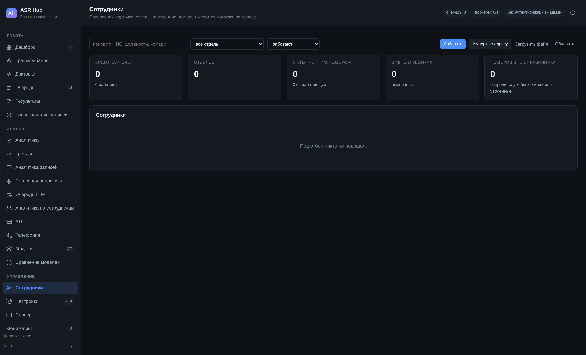

# Справочник сотрудников

## Зачем он нужен

Звонок знает внутренний номер — «457». Отчёт нужен по человеку: «Абдрахманова, отдел проектных продаж». Без справочника в аналитике по операторам стоят номера, отделов нет вовсе, а на вопрос «как работал отдел продаж в сентябре» ответить нечем.

Справочник — это таблица людей с внутренними номерами. По номеру звонок находит человека, по человеку — отдел и должность. Заводить карточки можно руками, но обычно они уже есть в кадровой системе или на внутреннем портале — тогда справочник забирается выгрузкой по адресу и обновляется сам.

Раздел — **«Сотрудники»** в меню «Управление». Не путать с «Аналитикой по сотрудникам»: там показатели работы, здесь — сами карточки.



## Карточка

| Поле | Зачем |
|---|---|
| Фамилия, имя, отчество | как человек называется в отчётах |
| Должность | разрез «менеджеры против руководителей групп» |
| Отдел | главный разрез аналитики: отдел — то, чем управляют |
| Внутренний номер | **ключевое поле**: по нему звонок находит человека |
| Рабочий телефон | городской номер, если он отдельный |
| Мобильный | приводится к виду `+7XXXXXXXXXX` |
| Электропочта | для сводок и выгрузок |
| Поставщики | кто с кем работает; поле из выгрузки заказчика, произвольный текст |
| Работает / Работает до | уволенные не исчезают, а помечаются |
| Примечание | что угодно, написанное руками. Импорт его не затирает |

Наверху раздела — пять чисел: всего карточек, отделов, сколько людей с внутренними номерами, сколько этих номеров встречается в журнале звонков и сколько номеров из журнала в справочнике не нашлось.

## Руками

Кнопка **«Добавить»**, форма, «Сохранить». Карточка заводится с источником «ручной» — и это не косметика: импорт справочника работает внутри своего источника и помечает уволенными только тех, кого он сам когда-то завёл. Карточка, заведённая руками, при первом же обновлении справочника иначе исчезла бы из штата.

Правка — кнопка «Правка» в строке. Удаление — крестик; звонки этого номера остаются в архиве: они привязаны к номеру, а не к карточке.

## Импорт

Три формата, тип определяется по содержимому:

**Excel XML 2003 (SpreadsheetML)** — то, что отдают внутренние порталы и старый Excel. Разбирается по заголовкам, а не по порядку колонок. Учтено всё, обо что обычно спотыкаются: необъявленные пространства имён `ss:`, разметка внутри ячейки (`<span>(ЧЛБ)</span>` — текст берётся целиком), пустые ячейки, атрибут `ss:Index`, который перескакивает через пустые колонки (без его учёта поля съезжают влево, и импорт «успешно» портит справочник), числа и даты. Разбор запрещает `<!DOCTYPE>` — это закрывает и внешние сущности, и «миллиард смешков».

**CSV** — разделитель определяется сам (запятая, точка с запятой, табуляция), кодировки `utf-8`, `utf-8-sig`, `cp1251`. В замечаниях импорта пишется, что именно распознано, — на случай кракозябр.

**JSON** — список объектов с русскими или английскими ключами.

### Какие заголовки понимаются

| Поле | Заголовки |
|---|---|
| Фамилия | фамилия, last_name, lastname, surname, family name |
| Имя | имя, first_name, firstname, given name, name |
| Отчество | отчество, middle_name, patronymic, second_name |
| Должность | должность, position, title, job, job_title, role |
| Отдел | отдел, подразделение, department, dept, division, unit |
| Рабочий | тел. рабочий, телефон рабочий, рабочий, work, work_phone, телефон |
| Внутренний | тел. внутренний, внутренний, внутренний номер, добавочный, extension, ext, internal |
| Мобильный | тел. мобильный, мобильный, сотовый, mobile, cell, cellphone |
| Почта | электропочта, эл. почта, почта, email, e-mail, mail |
| Поставщики | поставщики, поставщик, suppliers, vendors |
| Работает | работает, активен, active, статус, status, enabled |
| Работает до | работает до, active_until, до, увольнение |

Регистр и лишние пробелы не важны. **Неизвестные колонки не теряются**: они складываются в примечание строкой «колонка: значение».

### Что делается со значениями

* **«Работает»**: `да`, `yes`, `+`, `1`, `активен` — работает; `нет`, `no`, `-`, `уволен` — нет. Пустое значение означает «колонку не заполнили», и уволенным такого человека не считают.
* **Телефоны**: вычищаются пробелы, скобки, дефисы и точки. Мобильный приводится к `+7XXXXXXXXXX`, если это российский номер (`8XXXXXXXXXX` и `7XXXXXXXXXX` тоже). Внутренний — только цифры.
* **Почта**: обрезается, приводится к нижнему регистру, проверяется на «похоже на адрес».
* **ФИО**: схлопываются двойные пробелы, `ё` не трогается.

Ошибка в одной строке не роняет импорт: строка пропускается, а замечание с её номером попадает в список, который показывается после загрузки.

### Откуда берётся выгрузка

**По адресу.** Кнопка «Импорт по адресу» берёт адрес из настройки `employees_url`. Скачивание — только `http` и `https`, с тайм-аутом, ограничением размера и запретом переходов на `file://` и `ftp://` (в том числе при перенаправлении).

**Файлом.** Кнопка «Загрузить файл» — тот же разбор, но для разового случая.

### Пример выгрузки

```xml
<?xml version="1.0"?>
<?mso-application progid="Excel.Sheet"?>
<Workbook xmlns:ss="urn:schemas-microsoft-com:office:spreadsheet">
 <Worksheet ss:Name="Vodokomfort employees">
  <Table>
   <Row>
    <Cell><Data ss:Type="String">работает</Data></Cell>
    <Cell><Data ss:Type="String">работает до</Data></Cell>
    <Cell><Data ss:Type="String">фамилия</Data></Cell>
    <Cell><Data ss:Type="String">имя</Data></Cell>
    <Cell><Data ss:Type="String">отчество</Data></Cell>
    <Cell><Data ss:Type="String">должность</Data></Cell>
    <Cell><Data ss:Type="String">отдел</Data></Cell>
    <Cell><Data ss:Type="String">тел. рабочий</Data></Cell>
    <Cell><Data ss:Type="String">тел. внутренний</Data></Cell>
    <Cell><Data ss:Type="String">тел. мобильный</Data></Cell>
    <Cell><Data ss:Type="String">электропочта</Data></Cell>
    <Cell><Data ss:Type="String">поставщики</Data></Cell>
   </Row>
   <Row>
    <Cell><Data ss:Type="String">да</Data></Cell>
    <Cell><Data ss:Type="String"/></Cell>
    <Cell><Data ss:Type="String">Абдрахманова</Data></Cell>
    <Cell><Data ss:Type="String">Лилия</Data></Cell>
    <Cell><Data ss:Type="String">Рифатовна</Data></Cell>
    <Cell><Data ss:Type="String">Менеджер проектных продаж</Data></Cell>
    <Cell><Data ss:Type="String">Отдел проектных продаж <span>(ЧЛБ)</span></Data></Cell>
    <Cell><Data ss:Type="String"/></Cell>
    <Cell><Data ss:Type="String">457</Data></Cell>
    <Cell><Data ss:Type="String">+7-951-772-66-95</Data></Cell>
    <Cell><Data ss:Type="String">l.abdrakhmanova@vodokomfort.ru</Data></Cell>
    <Cell><Data ss:Type="String"/></Cell>
   </Row>
  </Table>
 </Worksheet>
</Workbook>
```

## Обновление по расписанию

| Параметр | По умолчанию | Что делает |
|---|---|---|
| Адрес выгрузки справочника (`employees_url`) | пусто | Откуда забирать. Открытый адрес без авторизации |
| Обновлять по расписанию (`employees_sync_enabled`) | нет | Включает автоматическое обновление |
| Как часто (`employees_sync_hours`) | 24 ч | Раз в сутки достаточно: кадровые изменения не идут потоком |
| Помечать пропавших уволенными (`employees_deactivate_missing`) | да | См. ниже |
| Связывать звонки по внутреннему номеру (`employees_match_ext`) | да | Выключать имеет смысл только там, где номера в справочнике и на станции заведомо разные |

Обновление идёт в потоке фоновых работ и его не роняет: сбой попадает в журнал и в ленту событий, а следующая попытка будет по расписанию. Первое обновление происходит не сразу после включения, а через интервал — для «прямо сейчас» есть кнопка.

## Почему пропавшие не удаляются

Человек уволился — его карточка помечается неработающей, но остаётся. Удалить её нельзя: по ней есть звонки, и удаление превратило бы половину архива в разговоры неизвестно с кем. Это ещё и честнее: человек ушёл, а разговоры остались, и отчёт за прошлый квартал должен по-прежнему сходиться.

## Ключ карточки и смена номера

Карточка узнаётся при повторном импорте по паре «источник + внешний ключ». Внешним ключом становится **внутренний номер**, если он есть и уникален в выгрузке; иначе — «фамилия|имя|отчество» в нижнем регистре.

Номер устойчивее ФИО: фамилия меняется, а номер за рабочим столом — почти никогда. Уникальность обязательна: неуникальный номер — это комната на двоих или дежурная линия, и одна карточка на двоих означала бы, что второй молча перезаписал первого. На такие случаи импорт выдаёт замечание.

Если человеку сменили внутренний номер, ключ меняется: прежняя карточка при включённом «помечать пропавших» станет неработающей, рядом появится новая, а старые звонки останутся на старой. Это правильно: разговоры велись тогда, когда номер был тот.

## Сверка со звонками

Число «Видно в звонках» — главное в разделе. Справочник, где внутренние номера есть у всех, но ни один не встречается в журнале, выглядит здоровым и при этом не работает.

Если совпадений ноль, раздел говорит об этом прямо и показывает номера из журнала, которых в справочнике нет. Причины обычно две: на станции к номеру приписан префикс филиала («812457» против «457»), или в журнале стоит не внутренний номер, а имя канала. Лечится либо правкой выгрузки, либо настройкой правил станции — см. главу о телефонии.

Кнопка «Сверить» (`POST /api/employees/link`) пересчитывает соответствие и показывает, сколько звонков приходится на каждого. Архив при этом не меняется: связь считается на лету по совпадению номера с полем «оператор» в журнале звонков.
