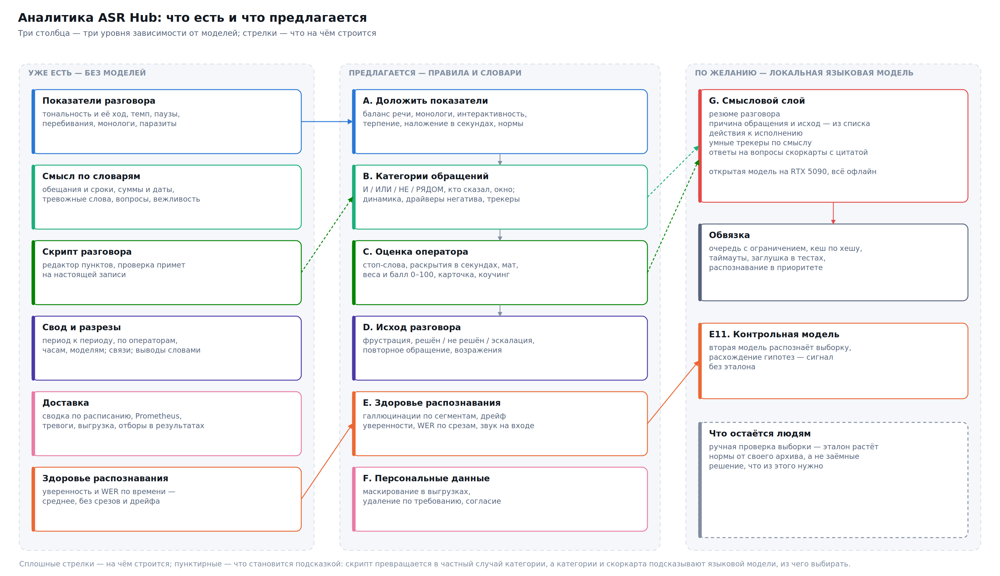

# Мировой опыт аналитики разговоров: что добавить в ASR Hub

Этот документ — не инструкция и не описание сделанного. Это разбор того, что считают и показывают ведущие системы речевой аналитики и мониторинга распознавания, сверка с тем, что уже есть в ASR Hub, и перечень предложений с приоритетами. Решение, что из этого делать, остаётся за владельцем сервера; в конце — вопросы, на которые нужен ответ до начала работ.

## 1. Главное

Показатели разговора, которые ASR Hub считает сейчас — тональность и её ход, темп, паузы, перебивания, монологи, слова-паразиты, обещания, тревожные упоминания, скрипт, — по составу уже соответствуют «характеристикам разговора» Amazon Transcribe Call Analytics и Google CX Insights и превосходят их там, где облачные API ничего не дают без обучаемых моделей (обещания без срока, суммы и сроки, вопросы). Догонять здесь нечего; есть что доложить — четыре показателя, которые у нас уже посчитаны, но не показаны.

Пробелы — в четырёх местах, и все четыре закрываются правилами и словарями, без единой обучаемой модели:

1. **Категории обращений.** У Genesys, NICE, Amazon и у каждого российского вендора человек сам заводит «Проблемы с оплатой», «Доставка», «Возврат» правилами вида «слово И слово РЯДОМ с словом, но НЕ слово, только у клиента, в первые 30 секунд» — и получает по ним счёт, динамику, разрезы и, главное, ответ на вопрос «из-за чего разговоры идут тяжело». У нас есть скрипт (обязательные пункты) и фиксированный словарь тревожных слов; своих категорий нет.
2. **Оценка оператора.** Каждый российский продукт даёт стоп-слова, запрещённые фразы, мат отдельным флагом, обязательные раскрытия («разговор записывается» — в первые 30 секунд) и единый балл оператора с весами пунктов. У нас скрипт даёт долю выполненных пунктов без весов и без штрафов, карточки оператора нет.
3. **Здоровье распознавания.** Индустрия давно смотрит не только на среднюю уверенность: доля сегментов-галлюцинаций по порогам Whisper, распределение уверенности и его дрейф, WER по срезам, выборка на ручную проверку, качество звука на входе как объяснение ошибок. Часть данных для этого сервер уже хранит по каждому сегменту (`compression`, `no_speech`, `temperature`, `confidence`) и нигде не показывает.
4. **Смысловой слой** — резюме разговора, причина обращения, решён ли вопрос, что обещали сделать. У всех облачных API и суверенных вендоров это делает языковая модель, и обойти это правилами нельзя. Но обучать ничего не нужно: открытая модель на вашей RTX 5090 закрывает это в закрытом контуре. Это отдельный, необязательный слой, и о нём — отдельный раздел.

Всего ниже пятьдесят предложений в семи блоках; сорок три из них не требуют ни обучаемых, ни языковых моделей, одно — второй модели распознавания для контрольного прогона, и шесть — языковой модели. Первые два блока дают наибольшую ценность при наименьшей работе, потому что данные для них уже лежат в базе.

## 2. Где смотрели и как проверяли

| Группа | Продукты | Что брали |
|---|---|---|
| Облачные API распознавания с аналитикой | Amazon Transcribe Call Analytics, Google CX Insights (бывш. CCAI Insights), Azure AI Speech + Language, AssemblyAI, Deepgram, Speechmatics | Официальная документация: поля ответа, правила категорий, пороги |
| Речевая аналитика контакт-центров | Genesys Cloud, NICE CXone, Verint, CallMiner, Talkdesk, Observe.AI, Sprinklr, Five9, Uniphore | Help-центры и техдокументация там, где она открыта; маркетинг помечен |
| Аналитика разговоров для продаж | Gong, Avoma, Fireflies, Clari Copilot, Salesloft, Chorus | Help-центры, опубликованные нормы и исследования на собственных данных |
| Российский рынок | Naumen, Imot.io, 3iTech, SaluteSpeech Insights (Сбер), Yandex SpeechSense, МТС Exolve, Mango Office, UIS/CoMagic, Roistat, Т-Банк, CallGear | Продуктовые страницы и документация; отдельно — практика 152-ФЗ |
| Мониторинг качества ASR | jiwer, Open ASR Leaderboard, NVIDIA Riva/NeMo, Deepgram, Speechmatics, Whisper (исходники и обсуждения), pyannote, DNSMOS/NISQA, статьи | Формулы, пороги по умолчанию, измеренная эффективность детекторов |

Сбор шёл четырьмя параллельными проходами; всё, на что опираются предложения ниже, перепроверено по первоисточникам отдельно: формула тональности Genesys, пороги тишины Genesys/NICE/Google, нормы Gong и Fireflies, модели SaluteSpeech Insights, пороги Whisper, схема контроля дрейфа Deepgram. Где документация закрыта (CallMiner, Observe.AI, Chorus, Uniphore, Ростелеком), об этом сказано прямо, и на такие источники предложения не опираются.

## 3. Что считают лидеры

### 3.1. Показатели разговора

Здесь индустрия сходится почти дословно. Различаются только пороги.

| Показатель | Определение | Пороги и нормы | У кого |
|---|---|---|---|
| Баланс речи (talk ratio) | доля времени речи каждой стороны | Gong: норма 43:57 (43 % — продавец); Avoma: 40–60 %; на 326 тыс. звонков Gong выигранные сделки — 57 % речи продавца, проигранные — 62 % | Amazon, Google, Genesys, Gong, Avoma, все российские |
| Самый долгий монолог | непрерывная речь одной стороны | Gong: ≤ 2 мин 30 с; Fireflies: монологом считается ≥ 90 с | Gong, Avoma, Fireflies |
| Самый долгий рассказ клиента | то же для клиента — «дали ли ему высказаться» | максимизировать | Gong, Avoma |
| Интерактивность | сколько раз речь переходила от стороны к стороне | Gong: ≥ 5 | Gong (уникально) |
| Терпение (patience) | пауза после того, как клиент договорил, до ответа | Gong: 0,6–1,0 с | Gong, Avoma |
| Вопросы | число вопросов оператора | Gong: ≥ 18 в час; выигранные сделки — 15–16 вопросов за звонок, проигранные — ~20 | Gong, Avoma, Fireflies |
| Тишина | паузы, когда не говорит никто | Genesys: ≥ 2 с; NICE «заметная тишина»: ≥ 3 с; Amazon Contact Lens: > 3 с; Google: > 5 с; отдаётся и в секундах, и в процентах | все |
| Перебивания / наложение речи | одновременная речь | Genesys: ≥ 2 с, считаются и доля времени, и число эпизодов; Amazon: число и суммарное время по перебивающему | Amazon, Google, Genesys, 3iTech, Roistat, Mango, SaluteSpeech |
| Темп речи | слов в минуту | Fireflies: 140–160 (английский); UIS считает не абсолют, а соотношение темпа сотрудника и клиента | Amazon, Avoma, Fireflies, SaluteSpeech, UIS |
| Громкость | нормированная 0–100 по реплике | Amazon; Т-Банк — «интонация и громкость», реакция без грубых слов | Amazon, Т-Банк, CallMiner |
| Слова-паразиты | закрытый список | Deepgram — 7 слов; Fireflies — «um», «ah» и удвоения | Deepgram, Avoma, Fireflies |

Нормы темпа для русского языка ни один источник не публикует; Википедия говорит лишь, что при словах длиннее на 20–30 % темп «будет ниже» английских 150–190 слов в минуту. Это довод в пользу норм, посчитанных по своему архиву, а не заимствованных.

### 3.2. Тональность и эмоции

- **Genesys** публикует формулу: каждое событие тональности ±1, вес — относительное положение фразы клиента в разговоре (фраза 18 из 20 → 0,90), итог `100 × tanh(0,75 × сумма)`. Позднее в разговоре весит больше. Наша оценка устроена похоже (сжатие через tanh), только без веса по позиции — у нас за это отвечает отдельный «разворот» начала и конца.
- **NICE** различает четыре класса — положительный, отрицательный, нейтральный и **смешанный** (обе окраски есть, ни одна не перевешивает), и отдельно от тональности считает **фрустрацию**: «я очень зол», «позовите руководителя» — это не «обсуждают плохое», а «клиент расстроен». В отчётах тональность меряется отдельно на первых 400 словах (или 30 %) и последних 30 %.
- **SaluteSpeech Insights** отдаёт «изменение эмоциональной окраски — сравнение начала и конца», баланс речи, перебивания, скорость речи обоих и «как они подстраиваются друг под друга», а поверх — две прогнозные модели: CSI (какую оценку поставил бы клиент) и FCR (решён ли вопрос с первого раза).
- Пороги классов: Google — положительная ≥ 0,5, отрицательная ≤ −0,5; Deepgram — ±0,333.

### 3.3. Категории, трекеры, скрипты

- **Amazon**: категория — от 1 до 20 правил четырёх типов: слова в расшифровке (точное совпадение, «семантика не поддерживается»), тональность стороны, перебивания дольше N мс, тишина дольше N мс; каждое правило — с участником, отрицанием и окном времени (абсолютным в мс или относительным в процентах разговора).
- **Genesys**: операторы **И / ИЛИ / РЯДОМ** (в пределах N секунд для голоса или N слов для текста), до 20 операндов, до 3 уровней скобок; фразы ищутся со стеммингом, в кавычках — точно; есть Topic Miner, который сам предлагает темы из расшифровок.
- **NICE**: «есть / нет» фразы с близостью до 8 слов, фильтр участника (только оператор), направления и времени — «в начале разговора» это окно 30 секунд для приветствия.
- **Gong**: трекеры по словам и «умные» — по смыслу («это лучшее, что вы можете предложить?» засчитывается как запрос скидки); оповещения по срабатыванию.
- **Российские вендоры**: Mango Office — 32 готовых словаря, Roistat — 22; стоп-слова, запрещённые фразы, чек-листы у всех.

### 3.4. Оценка оператора

- **Verint Quality Bots**: правило → ответ Да / Нет / Н/П → вес вопроса → метод подсчёта Sum / Average / Percentage, бонусы за превышение и штрафы; каждый вопрос становится отдельным KPI со своим трендом; отчёт Cross Correlation — тепловая карта совместной встречаемости свойств разговоров, то есть «драйверы».
- **Google Quality AI**: балл = набранные ÷ максимум × 100 %, Н/П исключаются; предзаданные вопросы «исход разговора» (решён / частично / эскалирован / переадресован / брошен / неизвестно) и «кто инициировал эскалацию».
- **Roistat**: 22 показателя → средний балл сотрудника по 100-балльной шкале. **Т-Банк**: отчёт «где менеджер не отработал возражение». **Imot.io**: подборка лучших разговоров для обучения новичков. **UIS**: тон, эмпатия, внятность речи, мат сотрудника отдельной метрикой.

### 3.5. Смысловой слой

Резюме, причина обращения, решён ли вопрос, действия к исполнению, намерение — у Amazon, Google, Azure, AssemblyAI, Deepgram, Speechmatics, Naumen, Imot.io, Yandex это делает языковая модель. Правилами это не воспроизводится, и облачные API прямо тарифицируют такие вызовы по токенам. Единственный путь в закрытом контуре — локальная модель.

### 3.6. Российская специфика

- **Стоп-слова оператора** — стандартный набор у всех: «не знаю», «вы должны», «нет», «на вашем месте я бы», «вы не правы», «не могу ничего гарантировать», «оставайтесь на линии»; у коллекторов — отдельные категории «провокация», «некорректное общение», «психологическое давление».
- **Мат** — отдельный флаг именно у сотрудника (UIS, Mango, Imot.io «грубость оператора»).
- **Обращение по имени** и **представление** — обязательные пункты чек-листов.
- **152-ФЗ**: запись — персональные данные; биометрией голос становится только при использовании для идентификации; с 1 сентября 2025 согласие оформляется отдельным документом; при отзыве согласия — уничтожение в срок до 30 дней; штрафы для юрлиц 300–700 тыс. ₽. Практическое следствие: on-premise — не преимущество, а условие входа; маскирование персональных данных в расшифровках и выгрузках — ожидаемая функция.

### 3.7. Здоровье распознавания

- **WER считается по-разному**, и без фиксированного нормализатора числа несопоставимы: у Speechmatics один и тот же вывод даёт 41 % и 8 % WER до и после нормализации. Открытый лидерборд ASR нормализует «как Whisper»: регистр, пунктуация, числа словами, паразиты. Минимум для значимости — ~10 000 слов (час речи) на срез.
- **MER** ограничен единицей, WER — нет; разрыв WER − MER показывает избыток вставок, то есть галлюцинации. Для многоголосых записей — cpWER/tcpWER.
- **Уверенность модели — не точность.** Google: «может быть неточной»; Amazon: «не полагайтесь как на абсолютное значение»; Riva: «на точность и наличие не следует полагаться». Полезен не уровень, а сдвиг распределения: Deepgram — «когда средняя уверенность падает по трафику, проблемы с точностью обычно следуют в течение дней». Проверяют калибровку через ECE и AUC-ROC на размеченной выборке.
- **Галлюцинации Whisper**: пороги по умолчанию `compression_ratio > 2,4`, `avg_logprob < −1,0`, `no_speech_prob > 0,6`; при переборе температур последний результат принимается даже с compression 14. По измерениям, самый сильный одиночный безэталонный детектор — символов в секунду (AUC 68 %), встроенные флаги Whisper, объединённые вместе, дают F1 всего 24 %; известные фразы («Субтитры сделал DimaTorzok», «Продолжение следует», «Thank you for watching») ловятся словарём. Исследование Careless Whisper: ~1 % расшифровок содержат целые выдуманные фразы, 38 % из них — с вредным содержанием; риск выше на записях с большой долей тишины.
- **Дрейф и контроль**: четыре вида дрейфа (акустический, кодека, словаря, аудитории); контрольные карты — предупреждение при 2σ или 10 % относительной деградации, критично при 3σ или p < 0,05; базовая линия — 1 500–2 500 размеченных записей за 4 недели; ежедневная стратифицированная выборка на ручную проверку — 0,5–1 % случайных плюс досэмплирование нижнего квартиля по уверенности.
- **Звук на входе объясняет ошибки**: по данным Deepgram, WER ≈ 3,5 % при SNR 20 дБ, 15 % при 10 дБ, 35 % при 5 дБ; реальный трафик живёт в 2–14 дБ. Меряются SNR, пик dBFS и доля клиппинга, громкость LUFS, доля тишины; без эталона качество речи оценивают DNSMOS и NISQA.
- **Диаризация**: DER/JER на размеченном наборе; без разметки — число найденных говорящих против ожидаемого (в звонке — двое), доля перекрытий, доля аномально коротких реплик.

## 4. Сверка с ASR Hub

Обозначения: **есть** — считается и показано; **частично** — считается, но не показано, или показано без нормы и разреза; **нет**.

| Показатель | У кого в мире | ASR Hub | Примечание |
|---|---|---|---|
| Тональность по записи, по говорящим, ход по разговору, разворот начало/конец, лучшие и худшие реплики | все | **есть** | по составу шире Amazon: у него ход — по четвертям |
| Смешанная тональность как класс | NICE | **нет** | «сильно и плохо, и хорошо» сейчас усредняется в нейтраль |
| Фрустрация отдельно от негатива | NICE, CallMiner, UIS | **частично** | тревожные слова есть, но это «суд и жалоба», а не «я зол» |
| Баланс речи по сторонам | все | **частично** | доля по говорящим в карточке; в своде и разрезах нет; нормы нет |
| Самый долгий монолог | Gong, Avoma, Fireflies | **частично** | считается, показан в карточке; в своде, разрезах и отборах нет |
| Самый долгий рассказ клиента | Gong, Avoma | **нет** | вычисляется тем же кодом |
| Интерактивность (смены говорящего) | Gong | **нет** | тривиально |
| Терпение (пауза перед ответом) | Gong, Avoma | **частично** | `reply_delay_s` по говорящим считается и нигде не показан |
| Перебивания | все | **есть** | число; суммарное время наложения не считается |
| Тишина: паузы ≥ 2 с, самая долгая, доля | все | **есть** | порог 2 с как у Genesys; «заметная тишина ≥ 3 с» отдельно не выделена |
| Темп речи | большинство | **есть** | абсолют; соотношения темпов сторон (UIS) нет |
| Слова-паразиты | Deepgram, Avoma, Fireflies | **есть** | точные формы + фразы — строже Deepgram |
| Вопросы | Gong, Avoma, Fireflies | **есть** | без нормы «в час» |
| Обещания, обещания без срока | — (уникально) | **есть** | у лидеров только через LLM (action items) |
| Суммы, даты, телефоны, номера договоров | AssemblyAI, Deepgram, Google (сущности) | **есть** | без обучаемой модели — только форматные сущности |
| Ключевые слова и устойчивые сочетания | AssemblyAI, Speechmatics | **есть** | TF-IDF по своему корпусу |
| Темы: что стало звучать чаще/реже | Genesys Topic Miner, Verint Themes | **частично** | сдвиг частот есть; кластеризации в темы нет |
| Категории по своим правилам (И/ИЛИ/НЕ/РЯДОМ, участник, окно) | Amazon, Genesys, NICE, Google, все российские | **нет** | главный пробел |
| Категория × тональность («драйверы негатива») | Verint Cross Correlation, NICE виджеты | **нет** | без категорий невозможно |
| Трекеры с уведомлениями | Gong, Amazon (real-time), Clari | **частично** | тревожные слова фиксированы; уведомлений по срабатыванию нет |
| Скрипт: обязательные пункты, окно начала/конца | все | **есть** | редактор с проверкой на записи — сильнее многих |
| Стоп-слова и запрещённые фразы | все российские, NICE, Verint | **нет** | самый частый запрос руководителей |
| Обязательные раскрытия с окном времени («разговор записывается» в первые 30 с) | NICE, Verint | **частично** | скрипт умеет «в начале», но начало — пятая часть реплик, а не секунды |
| Мат отдельным флагом у сотрудника | UIS, Mango, Imot.io | **нет** | словарь отсутствует намеренно; см. предложение |
| Вежливость, эмпатия | Genesys (формула), UIS | **частично** | пять групп вежливости в карточке; индекса и разреза по операторам нет |
| Обращение по имени, представление | российские чек-листы | **частично** | представление есть в скрипте; имени клиента нет |
| Веса пунктов, штрафы, единый балл оператора 0–100 | Verint, Google QA, Roistat | **нет** | сейчас — доля выполненных пунктов |
| Карточка оператора, сравнение с командой, очередь коучинга | все CC-системы, Gong | **частично** | разрез по оператору и отбор «к разговору с оператором» есть; страницы нет |
| Лучшие разговоры для обучения | Imot.io, Clari Gametapes | **частично** | отбор «самые благополучные» есть |
| Исход разговора (решён/не решён/эскалация) | Google QA, NICE Resolution, SaluteSpeech FCR | **нет** | лидеры — моделью; правилами — приближённо |
| Признаки повторного обращения | NICE, CallMiner (FCR) | **нет** | правилами — «уже звонил», «в третий раз» |
| Резюме, причина обращения, действия | все облачные и российские | **нет** | только LLM |
| Маскирование персональных данных | Amazon, Azure, AssemblyAI, Google, Deepgram | **нет** | телефоны и почта уже находятся |
| Сводка по расписанию, метрики Prometheus, тревоги | — | **есть** | у облачных API этого нет вовсе |
| Разрезы по владельцу/оператору/метке/модели/часу/дню | все | **есть** | |
| Связи между признаками с порогами значимости | Verint | **есть** | |
| Готовые выводы словами | NICE, Genesys (частично) | **есть** | |
| **Здоровье распознавания** | | | |
| Уверенность: ход, доля низкой | Deepgram, все | **есть** | средняя; перцентилей и дрейфа нет |
| Флаги галлюцинаций Whisper | сообщество Whisper, статьи | **нет** | данные по сегментам уже в базе |
| Известные фразы-галлюцинации | — | **нет** | словарь на десяток фраз |
| WER/CER на записях с эталоном | все | **есть** | ход по времени; срезов по модели/длительности нет; MER/WIL нет |
| Фиксированный нормализатор для WER | Whisper, Open ASR Leaderboard | **есть** | `metrics.normalize` |
| Калибровка уверенности (ECE, AUC) | NeMo, статьи | **нет** | нужен эталон — он есть у части записей |
| Выборка на ручную проверку | Deepgram | **нет** | |
| Согласие двух моделей на одном звуке | ROVER, практика | **нет** | «Сравнение моделей» — по опубликованным цифрам, не по своему звуку |
| Профиль звука: SNR, клиппинг, громкость | Deepgram, DNSMOS | **частично** | формат, битрейт, темп есть; SNR/клиппинга/LUFS нет |
| Контрольные карты (2σ/3σ) | Deepgram | **частично** | пороги в каталоге фиксированные; «от своей нормы» нет |
| Диаризация без разметки: говорящих против ожидаемого | pyannote.ai | **частично** | доля записей без разделения есть |
| Латентность p50/p95/p99 | Riva, Deepgram | **частично** | очередь — да; время обработки по моделям и стрим — нет |

## 5. Предложения

Трудоёмкость: **Н** — день-два вместе с тестами и документацией; **С** — до недели; **В** — больше недели. Ценность — по тому, насколько часто это встречается у лидеров и о чём спрашивают руководители контакт-центров.

### Блок A. Показатели разговора — до уровня Gong и Genesys

Всё уже считается или считается тем же кодом; работа — вывести, дать норму и разрез.

| № | Что | Как | Где показать | Труд. |
|---|---|---|---|---|
| A1 | **Баланс речи** оператор/клиент как показатель записи и корпуса | из `by_speaker.share`, оператор — `agent_speaker` | свод, разрез по операторам, столбец в отборах, метрика Prometheus | Н |
| A2 | **Самый долгий монолог** и **самый долгий рассказ клиента** | уже в `speech.monologue`; добавить второй, по клиенту | свод («доля записей с монологом дольше N»), отбор «самые долгие монологи», карточка | Н |
| A3 | **Интерактивность** — число смен говорящего на минуту | по последовательности сегментов | карточка, разрез по операторам | Н |
| A4 | **Терпение** — средняя пауза оператора перед ответом | `reply_delay_s` уже считается | карточка, разрез, отбор «отвечал с задержкой» / «перебивал сразу» | Н |
| A5 | **Наложение речи в секундах** и доля, не только число перебиваний | суммировать `overlap_s` | свод, разрез | Н |
| A6 | **Заметная тишина ≥ 3 с** отдельно от пауз ≥ 2 с | второй порог | свод, отбор | Н |
| A7 | **Соотношение темпов** сторон (UIS) — подстраивается ли оператор | `wpm` оператора ÷ `wpm` клиента | карточка, разрез | Н |
| A8 | **Смешанная тональность** как четвёртый класс | если и положительных, и отрицательных реплик заметно больше нуля, а сумма около нуля | метка записи, отбор «противоречивые» | Н |
| A9 | **Нормы от своего архива**: для каждого показателя — межквартильный размах за прошлый квартал как «обычное», и подсветка выхода за него | перцентили по `content` | свод («выше обычного»), карточка (шкала зелёный/жёлтый/красный, как у Avoma), настройки — свои нормы | С |
| A10 | Ориентиры из мировой практики в подсказках интерфейса: 43:57, монолог ≤ 2,5 мин, терпение 0,6–1 с, ≥ 18 вопросов в час — с оговоркой, что это английские продажи, а не русская поддержка | тексты | подсказки | Н |

### Блок B. Категории обращений и драйверы

Главный пробел. Один движок правил закрывает и категории, и трекеры, и стоп-слова блока C.

| № | Что | Как | Где показать | Труд. |
|---|---|---|---|---|
| B1 | **Категории по правилам**: название, правило из слов и фраз с операторами И / ИЛИ / НЕ / РЯДОМ(N слов), фильтр «кто сказал» (оператор / клиент / любой), окно «первые N секунд / последние N секунд / где угодно», сравнение по основам как в скрипте | тот же стеммер и та же проверка «примета не должна совпадать с частым словом», что в редакторе скрипта; хранение — настройка `content_categories`; результат — таблица `content_categories_hits(job_id, category, count, first_s)` | редактор рядом со скриптом, с проверкой на записи; лимиты как у Genesys — до 20 операндов, до 3 уровней скобок | В |
| B2 | **Счёт и динамика по категориям**: сколько записей, доля, изменение к прошлому периоду, растущие и угасающие | группировка по таблице совпадений | вкладка «Категории», свод, сводка по расписанию | С |
| B3 | **Категория × показатели**: тональность, доля отрицательных, тревожные, скрипт, длительность по каждой категории — против среднего по всем | тот же расчёт, что у разрезов | вкладка «Категории», разрез `category` | С |
| B4 | **Драйверы негатива**: какие категории чаще среднего встречаются в отрицательных разговорах, с подъёмом (lift) и минимальным числом записей — как Cross Correlation у Verint | частота категории среди отрицательных ÷ частота вообще; порог по числу записей, как у связей | свод («что тянет вниз»), выводы | С |
| B5 | **Готовые наборы категорий** для старта: оплата, доставка, возврат, качество, сроки, техподдержка, повторное обращение, эскалация, конкуренты, цена/скидка | словари в `lexicons.py`, редактируемые | редактор — «добавить готовую» | С |
| B6 | **Трекеры с уведомлением**: категория с флагом «сообщать» → запись в журнал событий + webhook + строка в сводке | обработчик `on_job_completed` | настройки категории, журнал | С |
| B7 | **Новые слова периода**: основы, которых не было в прошлом периоде и которые встретились в ≥ N записях — сырьё для новых категорий (что у Genesys делает Topic Miner) | сравнение `content_terms` по периодам | вкладка «Темы» | Н |

### Блок C. Оценка оператора

| № | Что | Как | Где показать | Труд. |
|---|---|---|---|---|
| C1 | **Стоп-слова и запрещённые фразы** оператора: готовый список («не знаю», «вы должны», «нет», «на вашем месте», «вы не правы», «не могу гарантировать», «оставайтесь на линии», «успокойтесь», «это не ко мне») плюс свои; каждое срабатывание — с временем и репликой | категория блока B с фильтром «только оператор» и типом «нарушение» | карточка, разрез по операторам, отбор «с нарушениями», метрика | С (при B1) |
| C2 | **Обязательные раскрытия с окном в секундах**: «разговор записывается» — в первые 30 с; представление — в первые 20 с | расширить скрипт: `where` принимает секунды, не только «начало = пятая часть реплик» | редактор скрипта | Н |
| C3 | **Нецензурная лексика** отдельным флагом по каждой стороне | словарь основ с исключениями (омонимы) — как со «судя по всему»; по умолчанию выключен, включается настройкой | карточка, разрез, отбор «мат у сотрудника» | Н |
| C4 | **Индекс эмпатии/вежливости** по формуле Genesys: (вежливых − невежливых) ÷ сумму, −100…+100 | группы `ВЕЖЛИВОСТЬ` уже есть; добавить «невежливые» (перебивание словами «подождите», «я вам уже сказал», «слушайте») | карточка, разрез по операторам, свод | Н |
| C5 | **Обращение по имени**: назвал ли оператор клиента по имени и сколько раз | словарь русских имён (открытые списки, ~2–3 тыс. основ) + форма звательного обращения | пункт скрипта «Обратился по имени» | С |
| C6 | **Веса, штрафы и единый балл 0–100**: у пункта скрипта — вес; у стоп-слова — штраф; балл = (сумма весов выполненных − штрафы) ÷ максимум × 100, как у Verint и Google | поле `weight` в скрипте, `penalty` у категорий-нарушений | карточка, разрез, свод, сводка, Prometheus `asrhub_content_agent_score` | С |
| C7 | **Карточка оператора**: все показатели против команды за период, ход по неделям, лучшие и худшие записи, срабатывания стоп-слов, динамика балла | новая ручка `GET /api/content/agents/{имя}` поверх разрезов | раздел «Аналитика записей» → щелчок по строке разреза | С |
| C8 | **Очередь коучинга**: записи оператора, которые стоит разобрать, с причиной («стоп-слово», «монолог 4 мин», «скрипт 3/8») и отметкой «разобрано» | таблица отметок | карточка оператора | С |
| C9 | **Эталонные разговоры для обучения**: лучшие по баллу и тональности за период, с отметкой «показывать новичкам» | отбор + отметка | вкладка «Что послушать» | Н |

### Блок D. Исход разговора и повторные обращения

Лидеры делают это моделью; правилами получается приближение, но полезное — и честно подписанное.

| № | Что | Как | Труд. |
|---|---|---|---|
| D1 | **Фрустрация клиента** отдельно от негатива: «я зол», «сколько можно», «позовите руководителя», «безобразие», повышенный темп + перебивания — индекс по записи | словарь + два речевых признака | Н |
| D2 | **Исход по репликам конца**: решён («спасибо, помогли», «всё понятно», «вопрос закрыт»), не решён («так и не», «ничего не понял», «буду ждать»), эскалация («руководителя», «жалобу», «в суд») — три класса и «неизвестно» | последние 20 % реплик клиента, словари; подпись «по репликам, не по факту» | С |
| D3 | **Признаки повторного обращения**: «уже звонил», «в третий раз», «опять», «снова», «до сих пор не» — доля таких записей как прокси FCR | словарь | Н |
| D4 | **Возражения и их отработка** (Т-Банк): возражение клиента («дорого», «подумаю», «не нужно») без ответной реплики оператора из группы «отработка» в следующие N реплик | категории двух типов и правило «за возражением не последовало» | С (при B1) |

### Блок E. Здоровье распознавания

Это вторая, отдельная аналитика — про сервер, а не про разговоры; её место — в разделе «Аналитика», рядом с уверенностью и WER.

| № | Что | Как | Труд. |
|---|---|---|---|
| E1 | **Флаги галлюцинаций**: доля сегментов с `compression > 2,4` (и «явных» > 2,2), с `no_speech > 0,6`, с перебором температур; символов и слов в секунду выше 99-го перцентиля; повторяющиеся n-граммы; словарь известных фраз («Субтитры сделал DimaTorzok», «Продолжение следует», «Редактор субтитров», «Спасибо за просмотр») | всё уже в таблице `segments`; словарь — в `lexicons` | С |
| E2 | **Отбор «подозрительные расшифровки»** с причиной, по моделям и источникам; выводы «у модели X доля подозрительных сегментов выросла вдвое» | по E1 | Н (при E1) |
| E3 | **Распределение уверенности**: p10/p50/p90 вместо среднего, доля слов ниже порога, и **дрейф** — тест Колмогорова–Смирнова против базовой линии за прошлый месяц | по `segments.confidence` | С |
| E4 | **WER по срезам**: по модели, длительности, источнику, языку, с MER и WIL и разрывом WER − MER как признаком вставок | `metrics.py` + записи с эталоном | С |
| E5 | **Калибровка уверенности**: на записях с эталоном — диаграмма надёжности и ECE по сегментам, «насколько уверенности можно верить» | сегменты × эталон | С |
| E6 | **Очередь на ручную проверку**: ежедневно 1 % случайных + нижний квартиль по уверенности; страница, где человек слушает, правит текст, и правка становится эталоном — растёт набор для E4–E5 | таблица выборки, ручка сохранения эталона | В |
| E7 | **Профиль звука на входе**: SNR (оценка по тихим и громким окнам), пик dBFS, доля клиппинга, громкость LUFS, доля тишины по VAD — при подготовке аудио, в колонки задания; разрез «SNR-корзина → WER и уверенность», отбор «плохой звук» | `pipeline/audio.py` уже декодирует; расчёт numpy; LUFS — есть `audio_target_lufs`, значит, замер уже рядом | С |
| E8 | **Контрольные карты**: для доли отрицательных, уверенности, WER, RTF — базовая линия 4 недели, предупреждение 2σ или 10 %, критично 3σ; выводы и тревоги «от своей нормы», а не от фиксированного порога | по рядам `timeline`/`quality_trend` | С |
| E9 | **Диаризация без разметки**: число говорящих против ожидаемого (2 для звонков — настройка по источнику), доля реплик короче 1 с, доля наложения — флаг «сомнительная диаризация» | по `segments` | Н |
| E10 | **Латентность по моделям**: p50/p95/p99 времени обработки и RTF по модели и длительности; для потока — время до первой реплики | по `jobs`, стрим — новое поле | С |
| E11 | **Контрольный прогон второй моделью**: по расписанию N записей в сутки распознаются второй моделью, считается расхождение (WER между гипотезами) — «согласие моделей» без эталона; рост расхождения = сигнал | планировщик уже есть (сводка, резервная копия) | В |

### Блок F. Персональные данные

| № | Что | Как | Труд. |
|---|---|---|---|
| F1 | **Маскирование** в выгрузках и по ключу с флагом: телефоны, почта, номера карт (проверка Луна), паспорт, СНИЛС (контрольная сумма), ИНН, даты рождения — «обезличенная выгрузка» | сущности уже находятся; добавить три форматных и настройку `export_mask_pii` | С |
| F2 | **Удаление по требованию**: ручка «удалить всё по номеру телефона/имени файла» с журналом — под 30-дневный срок 152-ФЗ | поиск по FTS + удаление задания | Н |
| F3 | Отметка «согласие получено» у записи (метка) и отчёт «записи без отметки старше N дней» | метки уже есть | Н |

### Блок G. Смысловой слой с локальной языковой моделью

Необязательный слой; включается настройкой и без него всё остальное работает. Обучать ничего не нужно — открытая модель с поддержкой русского на вашей RTX 5090 (32 ГБ) в закрытом контуре: через Ollama или vLLM, модели класса Qwen3 8–14B, T-lite/T-pro (Т-Банк), YandexGPT 5 Lite, GigaChat открытых весов — на момент внедрения выбрать по актуальным замерам на русском. Все вызовы — офлайн, ничего не покидает сервер.

| № | Что | Зачем | Труд. |
|---|---|---|---|
| G1 | **Резюме разговора** в три–пять строк: причина, что сделано, чем закончилось | самая частая функция у всех лидеров; в карточке и в сводке | С |
| G2 | **Причина обращения и исход** по закрытому списку (задаётся человеком) — модель выбирает из списка, а не сочиняет | замена правил D2 там, где они не справляются; категории B1 — как подсказка модели | С |
| G3 | **Действия к исполнению** с ответственным и сроком | точнее «обещаний по глаголам» | С |
| G4 | **Умные трекеры**: срабатывание по смыслу («это лучшее, что вы можете предложить?» → запрос скидки) | как у Gong | С |
| G5 | **Ответы на вопросы скоркарты** («оператор предложил альтернативу?») — Да/Нет/Н/П с цитатой | как у Verint и Talkdesk GenAI | С |
| G6 | Обвязка: очередь вызовов с ограничением, кеш по хешу текста, таймауты, тест-заглушка вместо модели, замер времени на запись, выключение при нехватке видеопамяти | без этого слой опасен для основной очереди | В |

Ограничения, о которых нужно сказать в документации заранее: модель может ошибаться и выдумывать; результат подписывается «сгенерировано»; для записей длиннее контекста — разбиение; на загруженном сервере распознавание в приоритете.

## 6. Пороги и нормы

Принцип — тот же, что в каталоге метрик: сначала своя обычная величина, потом порог. Значения ниже — стартовые, из первоисточников, с оговоркой о языке.

| Показатель | Стартовый порог | Источник | Оговорка |
|---|---|---|---|
| Пауза | ≥ 2 с | Genesys | у нас уже так |
| Заметная тишина | ≥ 3 с | NICE, Amazon Contact Lens | Google берёт 5 с |
| Наложение речи | ≥ 0,25 с — эпизод; ≥ 2 с — «долгое» | у нас 0,25; Genesys 2 с | считать оба |
| Монолог | ≥ 90 с — отметить; > 150 с — плохо | Fireflies, Gong | продажи, английский |
| Терпение | 0,6–1,0 с | Gong | |
| Интерактивность | ≥ 5 смен за разговор | Gong | |
| Баланс речи оператора | 40–60 % | Avoma; Gong 43 % | для поддержки норма иная |
| Вопросы оператора | ≥ 18 в час | Gong | |
| Темп речи | из своего архива (межквартильный размах) | нет источника для русского | не брать 140–160 |
| Тональность: классы | ±0,33 (Deepgram) или ±0,5 (Google) | | у нас порог свой — не менять без проверки на корпусе |
| Галлюцинация Whisper | compression > 2,4; явная > 2,2; `no_speech` > 0,6 и `logprob` < −1 | whisper/transcribe.py, обсуждения | только для Whisper-семейства |
| Дрейф | 2σ / 10 % — предупреждение; 3σ / p < 0,05 — критично; база 4 недели | Deepgram | |
| Ручная проверка | 0,5–1 % случайных + нижний квартиль по уверенности | Deepgram | |
| SNR | < 10 дБ — плохой звук; < 5 дБ — ожидать WER > 30 % | Deepgram, Frontiers | оценка SNR без эталона приблизительна |
| Значимость WER | ≥ 10 000 слов на срез | Speechmatics | |

## 7. Порядок работ

1. **Этап 1 — то, что уже лежит в базе** (A1–A8, A10, C2–C4, D1, D3, E1–E2, E9, B7, F2–F3): ни одной новой таблицы, кроме двух-трёх колонок; неделя вместе с тестами и документацией; сразу заметный результат в своде и карточках.
2. **Этап 2 — движок правил** (B1–B6, C1, C6, D4): категории, стоп-слова, веса и балл. Самый ценный и самый большой кусок; проектировать так, чтобы скрипт разговора стал частным случаем категории.
3. **Этап 3 — оператор и нормы** (C5, C7–C9, A9, E3, E8): карточка оператора, коучинг, нормы от своего архива, контрольные карты.
4. **Этап 4 — здоровье распознавания** (E4–E7, E10–E11, F1): срезы WER, калибровка, ручная проверка, профиль звука, контрольная модель, маскирование.
5. **Этап 5 — языковая модель** (G1–G6): после того как есть категории и скоркарта, которым она будет помогать.

Каждый этап — по заведённому порядку: воспроизвести на данных, написать, покрыть регрессией, проверить мутацией, задокументировать, снять экраны, пересобрать документы.

## 8. Что нужно решить

- Категории и стоп-слова хранить как настройку (JSON, как скрипт) или отдельной таблицей с историей изменений? Таблица — если правила будут править несколько человек.
- Нецензурная лексика: включать словарь по умолчанию или только по настройке? Ложные срабатывания на омонимах неизбежны; по умолчанию — выключено.
- Языковая модель: нужна ли вообще на этом сервере, и если да — делить ли видеокарту с распознаванием или ставить на отдельную машину?
- Ручная проверка расшифровок (E6): кто будет проверять и сколько записей в день реально прослушать? От ответа зависит, стоит ли делать страницу или хватит выгрузки.
- Ожидаемое число говорящих для диаризации (E9): всегда двое или зависит от источника?

## Источники

Облачные API: [Amazon Transcribe — Post-call analytics](https://docs.aws.amazon.com/transcribe/latest/dg/call-analytics-batch.html) · [Amazon — категории](https://docs.aws.amazon.com/transcribe/latest/APIReference/API_CreateCallAnalyticsCategory.html) · [Google CX Insights — тишина](https://docs.cloud.google.com/contact-center/insights/docs/silence-analysis) · [Google — тональность](https://docs.cloud.google.com/contact-center/insights/docs/sentiment-analysis) · [Google — Quality AI](https://docs.cloud.google.com/gemini-enterprise-cx/insights/qai-basics) · [Azure — call center overview](https://learn.microsoft.com/en-us/azure/ai-services/speech-service/call-center-overview) · [AssemblyAI — Speech Understanding](https://www.assemblyai.com/docs/audio-intelligence) · [Deepgram — Sentiment](https://developers.deepgram.com/docs/sentiment-analysis) · [Speechmatics — Sentiment](https://docs.speechmatics.com/speech-to-text/batch/speech-intelligence/sentiment-analysis)

Контакт-центры: [Genesys — тишина и наложение](https://help.genesys.cloud/articles/view-an-interactions-details-tab/) · [Genesys — формула тональности](https://help.genesys.cloud/faqs/how-is-the-customer-sentiment-score-calculated/) · [Genesys — эмпатия](https://help.genesys.cloud/articles/understand-agent-empathy-analysis/) · [Genesys — категории](https://help.genesys.cloud/articles/understand-interaction-categories/) · [NICE — термины и метрики](https://help.nice-incontact.com/content/interactionanalyticspro/keytermsandmetricsforia.htm) · [NICE — фразы оператора](https://help.incontact.com/content/InteractionAnalyticsPro/AchieveYourBusinessGoals/MonitorAgentPhrases.htm) · [Verint — описание QM](https://assets.applytosupply.digitalmarketplace.service.gov.uk/g-cloud-14/documents/92827/870775785303352-service-definition-document-2025-04-16-0912.pdf) · [Talkdesk QM Assist](https://support.talkdesk.com/hc/en-us/articles/4402964008987-Talkdesk-QM-Assist-Overview) · [AWS Contact Lens — метрики](https://docs.aws.amazon.com/connect/latest/adminguide/contact-lens-metrics.html)

Продажи: [Gong — нормы](https://help.gong.io/docs/analyze-team-performance) · [Gong — talk ratio, 326 тыс. звонков](https://www.gong.io/blog/talk-to-listen-conversion-ratio) · [Gong — трекеры](https://help.gong.io/docs/understanding-trackers) · [Avoma — метрики](https://help.avoma.com/conversation-insights-interaction) · [Fireflies — аналитика](https://guide.fireflies.ai/articles/2608597716-understand-fireflies-analytics-and-conversation-intelligence)

Россия: [SaluteSpeech Insights](https://developers.sber.ru/docs/ru/salutespeech/guides/recognition/insights-models) · [Yandex SpeechSense](https://aistudio.yandex.ru/ru/solutions/speechsense) · [Naumen](https://www.naumen.ru/products/conversation-intelligence/) · [Imot.io](https://imot.io/) · [3iTech](https://touchpoint-analytics.ru/) · [Mango Office](https://www.mango-office.ru/products/virtualnaya_ats/vozmozhnosti/speech-analytics/) · [UIS](https://www.uiscom.ru/producty/rechevaya-analitika-s-iskusstvennym-intellektom/) · [Roistat](https://roistat.com/ru/features/speech-analytics) · [Т-Банк](https://www.tbank.ru/software/speech-analytics/) · [Стоп-фразы оператора](https://outsale.org/blog/top-fraz-kotorye-nelzya-govorit-klientu-sovety-dlya-operatora-koll-tsentra/) · [Стоп-слова коллектора](https://vc.ru/marketing/170659-stop-slova-dlya-kollektora-kak-rechevaya-analitika-pomogla-rabotat-s-dolzhnikami-nezhno) · [152-ФЗ и записи](https://imot.io/tpost/152fz-recording)

Здоровье распознавания: [jiwer](https://github.com/jitsi/jiwer) · [Speechmatics — WER и нормализация](https://docs.speechmatics.com/speech-to-text/accuracy-benchmarking) · [Open ASR Leaderboard](https://arxiv.org/html/2510.06961v3) · [AssemblyAI — WER is broken](https://www.assemblyai.com/blog/word-error-rate-is-broken) · [whisper/transcribe.py](https://github.com/openai/whisper/blob/main/whisper/transcribe.py) · [Whisper — обсуждение порогов](https://github.com/openai/whisper/discussions/2420) · [Careless Whisper](https://arxiv.org/abs/2402.08021) · [Детекторы галлюцинаций](https://arxiv.org/html/2606.23060v1) · [NVIDIA — энтропийная уверенность](https://developer.nvidia.com/blog/entropy-based-methods-for-word-level-asr-confidence-estimation/) · [Google STT — confidence](https://docs.cloud.google.com/speech-to-text/docs/basics) · [Riva — производительность](https://docs.nvidia.com/deeplearning/riva/user-guide/docs/asr/asr-performance.html) · [Deepgram — мониторинг качества](https://deepgram.com/learn/transcription-quality-monitoring-production) · [Deepgram — SNR и WER](https://deepgram.com/learn/speech-recognition-accuracy-production-metrics) · [pyannote.metrics](https://pyannote.github.io/pyannote-metrics/reference.html) · [DNSMOS](https://arxiv.org/pdf/2110.01763) · [NISQA](https://github.com/gabrielmittag/NISQA) · [Темп речи — Википедия](https://ru.wikipedia.org/wiki/%D0%A2%D0%B5%D0%BC%D0%BF_%D1%80%D0%B5%D1%87%D0%B8)
